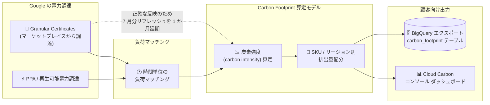

# Carbon Footprint: Granular Certificates 反映に伴う 2026 年 7 月方法論リフレッシュの延期

**リリース日**: 2026-08-14

**サービス**: Carbon Footprint

**機能**: Granular Certificates (粒度の高いエネルギー属性証書) を反映した炭素強度配分計算の方法論リフレッシュ

**ステータス**: Announcement (お知らせ / 半期方法論リフレッシュの 1 か月延期)

📊 [このアップデートのインフォグラフィックを見る](https://takech9203.github.io/google-cloud-news-summary/20260814-carbon-footprint-granular-certificates-methodology.html)

## 概要

Google Cloud は 2026 年 8 月 14 日、Carbon Footprint の半期 (semi-annual) 方法論リフレッシュに関するお知らせを公開した。2026 年版 Google 環境レポート (2026 Environmental Report、p. 22) に記載されているとおり、Google は現在、マーケットプレイスから調達した **Granular Certificates (GC)** を用いて、自社の電力負荷 (load) を **時間単位 (hourly)** でより多く戦略的にマッチングしている。

これらの証書を Cloud 顧客向けの**炭素強度 (carbon intensity) 配分計算に正確に反映させる**ため、本来 2026 年 7 月分として実施される半期方法論リフレッシュを **1 か月延期する**ことが発表された。修正後のデータが利用可能になった時点で、追加のアップデートが提供される予定である。

Carbon Footprint の半期方法論リフレッシュは、これまで 1 月分リフレッシュが 2 月中旬、7 月分リフレッシュが 8 月中旬にリリースされてきた (例: 2025 年 7 月分リフレッシュは 2025 年 8 月中旬にリリースされ、カーボンモデルはバージョン 14 に更新された)。したがって今回の 1 か月延期により、2026 年 7 月分リフレッシュの反映は 2026 年 9 月中旬頃になると見込まれる (リリース時期そのものは公式には明示されていない)。

Carbon Footprint のデータは Scope 1 / Scope 2 (ロケーションベースおよびマーケットベース) / Scope 3 に分けて提供され、顧客は自社の Scope 3 排出量インベントリに組み込んで利用している。方法論リフレッシュの遅延は、ESG レポーティングや温室効果ガス (GHG) インベントリ作成のスケジュールに直接影響するため、サステナビリティ報告を担当するチームにとって把握しておくべき情報である。

**アップデート前の課題**

- Google が調達している Granular Certificates は、Cloud 顧客向けの炭素強度配分計算にまだ正確に組み込まれていなかった
- Carbon Footprint のマーケットベース Scope 2 は年次の再生可能電力比率と年次の排出係数をスケーリング係数として用いる方式であり、時間単位でのマッチング実績を細かく反映する仕組みになっていなかった
- ロケーションベース Scope 2 は仕様上、エネルギー属性証書 (EAC) や電力購入契約 (PPA) といった電力調達の選択を一切考慮しない

**アップデート後の改善**

- マーケットプレイスから調達した Granular Certificates を、Cloud 顧客の炭素強度配分計算に正確に反映させる作業が進められている
- Google の時間単位負荷マッチング (hourly load matching) の実態が、顧客に配分される排出量データにより正確に反映されることが見込まれる
- 精度を優先して意図的にリリースを 1 か月延期する方針が事前に告知されたため、顧客側でレポーティングスケジュールを調整できる

## アーキテクチャ図

この図は、マーケットプレイスから調達した Granular Certificates が時間単位の負荷マッチングを通じて炭素強度算定に取り込まれ、SKU / リージョン別の配分を経て顧客のダッシュボードと BigQuery エクスポートに反映されるまでの流れを示している。点線は、この反映を正確に行うために 2026 年 7 月分の半期方法論リフレッシュが 1 か月延期されたことを表す。

## サービスアップデートの詳細

### 主要機能

1. **Granular Certificates による時間単位の負荷マッチング**
   - Google はマーケットプレイスから調達した Granular Certificates を用いて、自社の電力負荷を時間単位でより多く戦略的にマッチングしている
   - この取り組みの詳細は 2026 年版 Google 環境レポート (p. 22) に記載されている

2. **Cloud 顧客の炭素強度配分計算への反映**
   - 上記の証書を Cloud 顧客向けの炭素強度配分計算に正確に組み込む作業が実施されている
   - Carbon Footprint は SKU 単位の使用量を主要な配分軸として、各 Google Cloud プロダクトの排出量を顧客に配分する仕組みを取っている

3. **2026 年 7 月分 半期方法論リフレッシュの 1 か月延期**
   - 上記の反映作業に伴い、2026 年 7 月分の半期方法論リフレッシュが 1 か月延期される
   - 修正後のデータが利用可能になった時点で、Google から追加のアップデートが提供される

## 技術仕様

### Carbon Footprint の Scope 2 算定方式 (現行方法論)

| 項目 | ロケーションベース Scope 2 | マーケットベース Scope 2 |
|------|---------------------------|-------------------------|
| 排出係数の粒度 | 時間単位 (hourly) | 年次 (annual) |
| 排出係数のデータソース | Electricity Maps (未提供地域は IEA の国別年平均値) | IEA など政府系ソースの年次排出係数 |
| クリーン電力調達 (EAC / PPA) の反映 | 反映しない | 反映する (GHGP マーケットベース手法に準拠) |
| 更新頻度 | 継続的 (時間単位の係数を使用) | スケーリング係数は年 1 回更新 (前年の再生可能電力比率に基づく) |
| 主な用途 | ワークロードの配置・実行タイミング最適化 | 顧客自身の Scope 3 排出量インベントリへの組み込み |

Granular Certificates はエネルギー属性証書の一種であるため、EAC / PPA を考慮しないロケーションベース Scope 2 とは扱いが異なる。今回の告知では「炭素強度配分計算への反映」と記載されており、どの指標がどの程度変化するかは公式には示されていない。

### データ提供のタイミングと関連フィールド

| 項目 | 詳細 |
|------|------|
| データ提供の遅延 | 前月分のデータが利用可能になるまで最大 21 日 (データリリースには約半月のラグがある) |
| BigQuery エクスポート | 翌月 15 日に月次パーティションテーブル `carbon_footprint` へ自動エクスポート |
| モデルバージョン確認 | `carbon_model_version` (Integer) フィールドでモデル更新を判別可能 |
| 半期リフレッシュの通常タイミング | 1 月分は 2 月中旬、7 月分は 8 月中旬 (2025 年 7 月分リフレッシュはカーボンモデル v14 として 2025 年 8 月中旬にリリース) |
| 単位 | ダッシュボードは tCO2e、エクスポートは kgCO2e |

## メリット

### ビジネス面

- **報告データの精度向上**: Google の時間単位クリーン電力マッチングの実態が顧客配分値に反映されることで、Scope 3 として報告する数値の精度が高まる
- **事前告知による計画性**: 延期が事前に公表されたため、四半期・半期の ESG レポーティングスケジュールを前倒しで調整できる
- **企業環境レポートとの整合**: 2026 年版 Google 環境レポートの内容と Carbon Footprint データの整合性が保たれる

### 技術面

- **時間単位マッチングの反映**: 年次スケーリング中心の従来方式に対し、時間単位で調達・マッチングされた証書を計算へ取り込む方向性が示された
- **モデルバージョンによる追跡**: `carbon_model_version` フィールドにより、方法論変更が反映されたデータかどうかをプログラム的に判定できる

## デメリット・制約事項

### 制限事項

- 2026 年 7 月分の半期方法論リフレッシュは 1 か月延期され、当初予定のタイミングでは反映されない
- 修正後データの正確なリリース日は現時点で公表されていない (「データが利用可能になった時点で追加アップデートを提供」とのみ告知)
- 変更後の炭素強度・排出量が増減するのか、どのサービスやリージョンが影響を受けるのかは公式に明示されていない
- Carbon Footprint のレポートは機械レベルのデータと時間単位排出係数を用いた新しい手法であり、第三者による検証・保証 (assurance) を受けていない

### 考慮すべき点

- 半期リフレッシュを前提に ESG レポートや社内 KPI の締めスケジュールを組んでいる場合は、1 か月のずれを織り込む必要がある
- 方法論リフレッシュ後は過去データの見え方が変わる可能性があるため、公表済みの数値と将来の再取得値の差異について説明できる運用を準備しておくとよい
- BigQuery エクスポートを利用している場合、過去分の再取得にはバックフィルの実行が必要になる。データリリースに約半月のラグがあるため、対象月の翌月 15 日を指定してバックフィルする
- Carbon Footprint の対象範囲は covered services に限られるため、全支出が排出量として現れるわけではない

## 料金

Carbon Footprint のデータは請求先アカウントごとに自動的に計算され、有効化のための API や特別なセットアップは不要である。専用の料金ページは公開されていない。BigQuery エクスポートを構成した場合、エクスポート先 BigQuery データセットのストレージおよびクエリに対しては BigQuery の通常料金が適用される。

アクセスには請求先アカウントに対する以下のいずれかの IAM ロール (`billing.accounts.getCarbonInformation` 権限を含む) が必要となる。

| ロール | 説明 |
|--------|------|
| `roles/billing.carbonViewer` | 請求先アカウントの一覧表示と炭素情報の閲覧が可能。詳細な請求データは参照できない |
| `roles/billing.viewer` | 請求情報の閲覧に加え、炭素情報も閲覧可能 |
| `roles/billing.admin` | 炭素情報を含む請求先アカウントの全側面を管理可能 |

## 関連サービス・機能

- **BigQuery / BigQuery Data Transfer Service**: Carbon Footprint データのエクスポート先。翌月 15 日に `carbon_footprint` テーブルへ月次で転送され、バックフィルにより過去データを再取得できる
- **Cloud Billing**: Carbon Footprint は請求先アカウント単位でデータを算定し、アクセス制御も Cloud Billing IAM ロールで行う
- **Active Assist (Unattended Project Recommender)**: 未使用プロジェクトの停止・回収を推奨し、コストと排出量の双方を削減する推奨事項を Carbon Footprint ダッシュボードに表示する
- **Carbon-free energy for Google Cloud regions / Region Picker**: リージョン別の CFE% (時間単位で算出されるカーボンフリーエネルギー比率) を提供し、低炭素リージョンの選定に利用できる。今回の Granular Certificates による時間単位マッチングと同じ「時間単位」の考え方に基づく指標である
- **Looker (Carbon Footprint Looker block)**: エクスポートしたデータを用いたカスタムダッシュボード作成に利用できる

## 参考リンク

- 📊 [インフォグラフィック](https://takech9203.github.io/google-cloud-news-summary/20260814-carbon-footprint-granular-certificates-methodology.html)
- [公式リリースノート (Google Cloud Release Notes: August 14, 2026)](https://docs.cloud.google.com/release-notes#August_14_2026)
- [Carbon Footprint リリースノート](https://docs.cloud.google.com/carbon-footprint/docs/release-notes)
- [Carbon Footprint 方法論ドキュメント](https://docs.cloud.google.com/carbon-footprint/docs/methodology)
- [マーケットベース Scope 2 の算定方法](https://docs.cloud.google.com/carbon-footprint/docs/methodology#market-based-allocation)
- [Carbon Footprint データのエクスポート](https://docs.cloud.google.com/carbon-footprint/docs/export)
- [Carbon Footprint エクスポートのデータスキーマ](https://docs.cloud.google.com/carbon-footprint/docs/data-schema)
- [Carbon Footprint の IAM 権限とロール](https://docs.cloud.google.com/carbon-footprint/docs/iam)
- [Carbon Footprint の対象サービス](https://docs.cloud.google.com/carbon-footprint/docs/covered-services)
- [Google 2026 Environmental Report](https://sustainability.google/reports/google-2026-environmental-report/)
- [Carbon-free energy for Google Cloud regions](https://cloud.google.com/sustainability/region-carbon)

## まとめ

今回の発表は新機能の追加ではなく、Google が調達する Granular Certificates を顧客の炭素強度配分計算に正確に反映させるため、2026 年 7 月分の半期方法論リフレッシュを 1 か月延期するという告知である。時間単位の負荷マッチング実績が顧客向け排出量データに取り込まれる方向性が示された点は、サステナビリティ報告の精度向上という観点で重要な変化といえる。ESG レポーティングで Carbon Footprint データを利用しているチームは、リフレッシュのタイミングが 1 か月後ろにずれることを前提にスケジュールを見直し、Carbon Footprint リリースノートで後続のアナウンスと `carbon_model_version` の更新を継続的に確認することを推奨する。

---

**タグ**: Carbon Footprint, サステナビリティ, Granular Certificates, エネルギー属性証書, Scope 2, マーケットベース排出量, 炭素強度, 方法論アップデート, ESG レポーティング, GHG Protocol, BigQuery エクスポート
