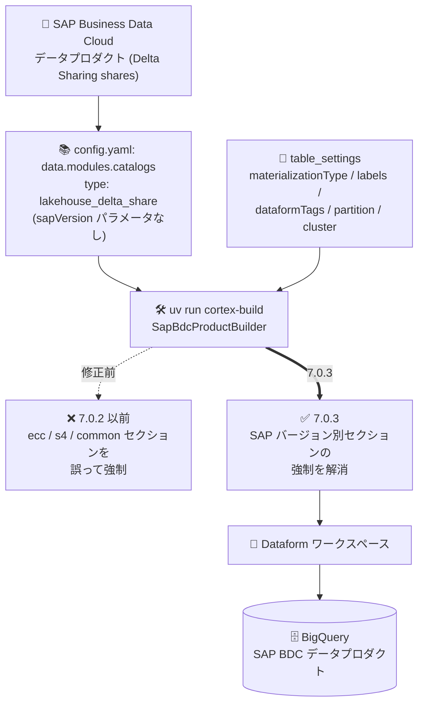

# Cortex Framework: Release 7.0.3 (SAP BDC データプロダクトの table_settings 強制問題を修正)

**リリース日**: 2026-08-14

**サービス**: Cortex Framework

**機能**: Release 7.0.3 (SapBdcProductBuilder の不具合修正)

**ステータス**: Announcement / Fixed

📊 [このアップデートのインフォグラフィックを見る](https://takech9203.github.io/google-cloud-news-summary/20260814-cortex-framework-7-0-3.html)

## 概要

Google Cloud Cortex Framework の Release 7.0.3 が公開されました。2026 年 7 月 30 日に一般提供 (GA) となったバージョン 7 系に対するパッチリリースで、8 月 7 日の Release 7.0.1 (Windows ビルドエラー修正、Dataform クォータ管理の改善)、8 月 11 日の Release 7.0.2 (推移的依存関係のセキュリティ脆弱性解消) に続く 3 番目のパッチです。

本リリースの修正内容は 1 件で、`SapBdcProductBuilder` が `table_settings` において SAP バージョン別セクション (`ecc`、`s4`、`common`) を誤って必須として強制していた問題が解消されました。Cortex Framework v7 の `table_settings.yaml` は、SAP ERP のデータ基盤および SAP 依存のデータプロダクトを対象として、ソースシステムのバージョンごとに設定を分離するための 3 つのルートレベルセクション (`ecc` / `s4` / `common`) をサポートしています。一方、v7 GA で新たにサポートされた SAP Business Data Cloud (BDC) データプロダクトは、Delta Sharing と BigQuery Lakehouse ランタイムカタログによるフェデレーションを介して連携する構成であり、カタログ登録の設定 (`data.modules.catalogs`) には SAP ERP のデータ基盤モジュールが持つ `moduleSettings.sapVersion` に相当するパラメータがありません。

対象となるのは、Cortex Framework v7 で SAP BDC データプロダクトを登録・デプロイしているデータエンジニアリングチームです。SAP ERP (ECC / S/4HANA) のみを利用しており SAP BDC 連携を構成していない環境では、直接の影響はありません。

**アップデート前の課題**

- `SapBdcProductBuilder` が `table_settings` に対して SAP バージョン別セクション (`ecc`、`s4`、`common`) を誤って強制していた
- SAP BDC データプロダクトは SAP ERP のバージョン (ECC / S/4HANA) に依存しない構成であるにもかかわらず、SAP ERP 向けのセクション構造に従った設定記述が求められる状態になっていた

**アップデート後の改善**

- Release 7.0.3 で、`SapBdcProductBuilder` による SAP バージョン別セクションの誤った強制が解消された
- SAP BDC データプロダクトの `table_settings` を、SAP ERP のバージョン区分に縛られずに構成できるようになった

## アーキテクチャ図



SAP BDC データプロダクトのコンパイル (`cortex-build`) を担う `SapBdcProductBuilder` が `table_settings` の SAP バージョン別セクションを強制しなくなり、BDC 連携の構成モデルに沿った設定で Dataform / BigQuery へのデプロイが行えるようになりました。

## サービスアップデートの詳細

### 主要機能

1. **SapBdcProductBuilder による SAP バージョン別セクション強制の修正 (Fixed)**
   - リリースノート原文: "Resolved an issue where SapBdcProductBuilder incorrectly enforced SAP-versioned sections (ecc, s4, common) in table_settings."
   - `table_settings` の SAP バージョン別セクション (`ecc` / `s4` / `common`) は、公式ドキュメントでは「主に SAP のデータ基盤および SAP 依存のデータプロダクトで使用される」と位置付けられている
   - SAP BDC データプロダクトはこの区分に該当しないため、強制されていた挙動が誤りとして修正された
   - 本リリースで公表されている変更はこの修正 1 件のみで、新機能の追加はない

## 技術仕様

### table_settings の SAP バージョン別セクション

`table_settings.yaml` は、データ基盤スタイル (リスト形式) とデータプロダクトスタイル (マップ形式) の 2 つのスキーマスタイルを持ち、いずれも以下の 3 つのルートレベルセクションをサポートします。

| セクション | 適用条件 |
|------|------|
| `ecc` | SAP ECC をソースシステムとしてデプロイする場合にのみ適用される設定 |
| `s4` | SAP S/4HANA をソースシステムとしてデプロイする場合にのみ適用される設定 |
| `common` | SAP バージョンに関係なく適用される設定 (統合済み・共通設定向け) |

これらのセクションは、公式ドキュメントにおいて「主に SAP のデータ基盤および SAP 依存のデータプロダクトで使用される」とされています。

### table_settings の指定方法

各モジュール (データ基盤・データプロダクト) は、`config/config.yaml` の `tableSettings` プロパティで個別の table settings ファイルを指定できます。省略した場合は既定のフォールバックパスが使用されます。

| 種別 | 推奨パス (`config/` 相対) | 既定のフォールバックパス |
|------|------|------|
| データ基盤モジュール | `{namespace_dir}/{system_type}/foundations/{system_sub_type}/table_settings.yaml` | `../src/data_modules/{namespace_dir}/{system_type}/foundations/{system_sub_type}/table_settings.default.yaml` |
| データプロダクトモジュール | `{namespace_dir}/{system_type}/products/{product_name}/table_settings.yaml` | `../src/data_modules/{namespace_dir}/{system_type}/products/{product_name}/table_settings.default.yaml` |

### データプロダクトスタイルの table_settings 例

データプロダクトスタイルでは、ターゲットとなる分析テーブル / ビュー名をキーとするディクショナリで、マテリアライゼーション戦略や BigQuery の最適化設定を指定します。

```yaml
common:
  custom_sales_performance:
    materializationType: table   # incremental (既定) / table / view
    bigQueryLabels:
      - key: data_class
        value: transactional
    dataformTags: [dataproduct, sales]
    enabled: true
    clusterDetails:
      columns: [customer_id]
    partitionDetails:
      column: created_date
      partitionType: time
      timeGrain: day
```

### ビルダーの解決順序

Cortex Framework v7 は、モジュールのコンパイル (`cortex-build`) を行う Python ビルダークラスを 3 階層で解決します。`SapBdcProductBuilder` はこのビルダー機構上のクラスであり、リリースノートではクラス名のみが示されています。

| 階層 | 内容 | 参照方法 |
|------|------|------|
| Tier 1 | グローバルフォールバックビルダー (`src/common/builders/`) | `manifest.yaml` の `builder:` にエイリアスを指定 (例: `sap_product` → `SapProductBuilder`) |
| Tier 2 | ネームスペーススコープのビルダー | `@builder_registry.register("my_builder")` で登録し `builder: my_builder` を指定 |
| Tier 3 | データプロダクト個別のビルダー | プロダクトフォルダ直下に `builder.py` を配置 (登録不要、動的インポート) |

## 設定方法

### 前提条件

1. Cortex Framework v7 を利用していること
2. `uv` (Python パッケージマネージャー) がインストールされていること
3. SAP BDC 連携を利用する場合は、BigQuery Lakehouse ランタイムカタログ (Delta Sharing) の接続が Google Cloud プロジェクト側で構成済みであること
4. SAP BDC テナントが公開している Delta Sharing の `shareId` を把握していること

### 手順

#### ステップ 1: 最新リリース (7.0.3) の取得と依存関係の同期

```bash
git clone https://github.com/GoogleCloudPlatform/cortex-framework
cd cortex-framework
uv sync
```

既存環境の場合は `git pull` で最新化した上で `uv sync` を実行します。

#### ステップ 2: SAP BDC カタログとデータプロダクトの構成確認

```yaml
# config/config.yaml (抜粋)
data:
  modules:
    catalogs:
      - id: sap_bdc_catalog
        type: lakehouse_delta_share
        enabled: true
        bindsNamespaces: [sap_bdc]
        connectionSettings:
          catalogId: sap_bdc_catalog
          projectId: YOUR_CATALOG_PROJECT_ID
          location: europe-west3
          shares:
            - shareId: customer_v1_he2_100_p8123
            - shareId: salesorder_v1_he2_100_p8124
    products:
      - moduleId: sap_bdc_sales_performance
        modulePath: cortex_samples.sap_bdc.products.sales_performance
        dependencyBindings:
          sapBdcCustomer: sap_bdc_catalog.customer_v1_he2_100_p8123.customer
          sapBdcSalesOrder: sap_bdc_catalog.salesorder_v1_he2_100_p8124.salesorder
        dataTargetId: sap_bdc_data_products
```

SAP BDC カタログは `lakehouse_delta_share` タイプのカタログモジュールとして登録し、下流のデータプロダクトは `{catalog_id}.{share_id}.{table_name}` 形式で入力依存関係をバインドします。

#### ステップ 3: ビルドとデプロイの再実行

```bash
uv run cortex-build
uv run cortex-deploy
```

`cortex-build` でモジュールを Dataform 出力にコンパイルし、`cortex-deploy` で BigQuery / Dataform へデプロイします。

## メリット

### ビジネス面

- **SAP BDC 連携の導入障壁の低減**: v7 GA の新機能である SAP BDC データプロダクト連携において、設定モデルの不整合に起因する手戻りが解消され、導入・検証をスムーズに進められる

### 技術面

- **設定モデルの一貫性**: SAP ERP のバージョン区分 (`ecc` / `s4`) を持たない SAP BDC データプロダクトに対して、SAP バージョン別セクションが強制されなくなり、構成が実際のアーキテクチャと整合する
- **低リスクなパッチ適用**: パッチリリースであり、リポジトリの更新と `uv sync` のみで適用できる

## デメリット・制約事項

### 制限事項

- リリースノートに記載されているのは修正の事実のみで、発生していた具体的なエラーメッセージや再現条件、`SapBdcProductBuilder` の実装詳細は公表されていない
- 本リリースには新機能の追加はない

### 考慮すべき点

- SAP ERP (ECC / S/4HANA) のみを利用し SAP BDC 連携を構成していない環境では、実質的な影響はない
- 修正の適用にあたっては、`cortex-build` / `cortex-deploy` の再実行が必要になる
- v6 から v7 へのアップグレードは引き続き破壊的変更を伴い、自動移行パスはない (v7 GA のリリースノート記載)
- v7 Preview から v7 へ移行する場合は、設定モデルの改善により設定ファイルの再作成と再デプロイが必要 (v7 GA のリリースノート記載)

## ユースケース

### ユースケース 1: SAP BDC データプロダクトを BigQuery で分析可能にする

**シナリオ**: SAP Business Data Cloud で公開している顧客・受注のデータプロダクトを、Delta Sharing 経由で BigQuery からゼロコピーでフェデレーションクエリし、Cortex Framework のカスタムデータプロダクトとして売上パフォーマンス分析テーブルを構築する。

**実装例**:
```bash
cd cortex-framework
git pull
uv sync
uv run cortex-build
uv run cortex-deploy
```

**効果**: `table_settings` に SAP バージョン別セクションを強制されることなく、SAP BDC 連携の構成モデルに沿った設定でデータプロダクトをビルド・デプロイできる。

### ユースケース 2: SAP ERP と SAP BDC の併用環境の整備

**シナリオ**: SAP S/4HANA のデータ基盤 (`sapVersion: s4`) と、SAP BDC 由来のデータプロダクトを同一の Cortex Framework デプロイ内で併用する。

**効果**: SAP ERP 側のデータ基盤・データプロダクトは従来どおり `s4` / `common` セクションで設定を分離しつつ、SAP BDC データプロダクトはバージョン区分に依存しない設定で構成でき、設定ファイルの見通しが改善される。

## 関連サービス・機能

- **SAP Business Data Cloud (BDC)**: 今回の修正対象となるビルダーが扱うデータソース。Delta Sharing エンドポイント経由でデータプロダクトを公開する
- **BigQuery Lakehouse ランタイムカタログ**: SAP BDC の Delta Sharing に対するフェデレーション接続を提供。`lakehouse_delta_share` タイプのカタログモジュールとして Cortex Framework に登録する
- **BigQuery**: Cortex Framework のデータ基盤・データプロダクトが構築されるデータウェアハウス。`table_settings` のマテリアライゼーション・パーティション・クラスタリング設定の適用先
- **Dataform**: v7 のオーケストレーション基盤。ビルダーがコンパイルした成果物のデプロイ先で、`dataformTags` による選択的なパイプライン実行に対応
- **Knowledge Catalog**: v7 GA で追加された連携先。デプロイ済みデータプロダクトとメタデータを同期し、ディスカバリとガバナンスを提供

## 参考リンク

- 📊 [インフォグラフィック](https://takech9203.github.io/google-cloud-news-summary/20260814-cortex-framework-7-0-3.html)
- [公式リリースノート](https://docs.cloud.google.com/release-notes#August_14_2026)
- [Cortex Framework リリースノート](https://docs.cloud.google.com/cortex/docs/release-notes)
- [デプロイ設定 (table_settings.yaml)](https://docs.cloud.google.com/cortex/docs/deployment-configuration#config-table-settings-yaml)
- [SAP Business Data Cloud との連携](https://docs.cloud.google.com/cortex/docs/source-system-integration/sap-bdc)
- [拡張性ガイド: ビルダーとネームスペース](https://docs.cloud.google.com/cortex/docs/extensibility-guide-namespaces)
- [拡張性ガイド: データプロダクトモジュールの作成](https://docs.cloud.google.com/cortex/docs/extensibility-guide-data-product)
- [Cortex Framework 概要](https://docs.cloud.google.com/cortex/docs/overview)

## まとめ

Release 7.0.3 は、SAP BDC データプロダクトのコンパイル時に `table_settings` の SAP バージョン別セクション (`ecc` / `s4` / `common`) が誤って強制されていた不具合を解消するパッチリリースです。v7 GA で追加された SAP BDC 連携を利用しているチームは、リポジトリの更新と `uv sync` を行った上で `cortex-build` / `cortex-deploy` を再実行し、7.0.3 へ更新することを推奨します。SAP ERP のみを利用している環境では影響はありませんが、v7 系のパッチが短い間隔で継続的に提供されているため、リリースノートの定期確認が有効です。

---

**タグ**: Cortex Framework, SAP Business Data Cloud, SAP BDC, table_settings, Delta Sharing, BigQuery, Dataform, Lakehouse, バグ修正
