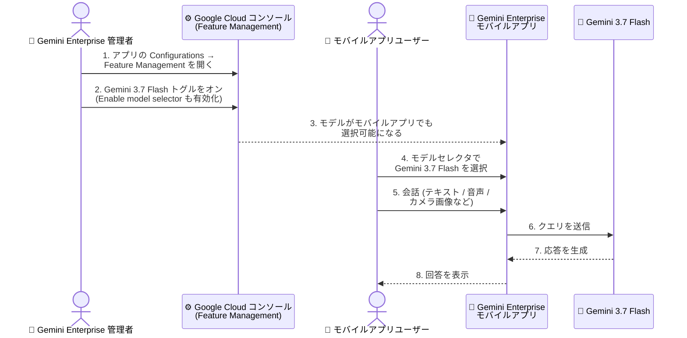

# Gemini Enterprise: Gemini 3.7 Flash がモバイルアプリで利用可能に (GA)

**リリース日**: 2026-08-14

**サービス**: Gemini Enterprise

**機能**: Gemini 3.7 Flash のモバイルアプリ対応 (Gemini 3.7 Flash available in the mobile app)

**ステータス**: GA (一般提供)

📊 [このアップデートのインフォグラフィックを見る](https://takech9203.github.io/google-cloud-news-summary/20260814-gemini-enterprise-gemini-3-7-flash-mobile-app.html)

## 概要

**Gemini 3.7 Flash が Gemini Enterprise モバイルアプリで一般提供 (GA) になりました**。モバイルアプリのユーザーは、アプリ内の会話で Gemini 3.7 Flash モデルを選択して利用できます。モデルをユーザーに開放するには、管理者が Google Cloud コンソールで **Gemini 3.7 Flash の機能トグル (feature toggle)** をオンにする必要があります。

このアップデートは、前日 2026 年 8 月 13 日の「Gemini Enterprise で Gemini 3.7 Flash が GA (`global` / `us` / `eu`)」の続報にあたります。8 月 13 日時点では同日の訂正告知により「Gemini 3.7 Flash はモバイルアプリでは利用できない。モバイル向けロールアウトが完了した時点で新しいリリースノートを追加する」とされていましたが、今回のリリースノートがまさにその「ロールアウト完了」の告知です。これにより、Web アプリとモバイルアプリの間に生じていたモデル世代差が解消されました。

Gemini 3.7 Flash は Gemini 3 シリーズの最新 Flash モデルで、複雑なコーディング、エージェント的ワークフロー、確実なマルチステップ実行を想定した「最も高性能な Flash モデル」と位置づけられています。モバイルアプリでは、外出先からのエージェント利用やカメラによるマルチモーダル入力と組み合わせて、最新モデルの推論品質を活用できるようになります。

**アップデート前の課題**

- Gemini 3.7 Flash は 2026 年 8 月 13 日に Web アプリ側で GA となったものの、同日の訂正告知のとおり **Gemini Enterprise モバイルアプリでは利用できなかった**
- Web アプリとモバイルアプリで利用可能なモデルに差があり、同じ組織内でもデバイスによって回答品質が異なる状態だった
- モバイル中心で業務を行うユーザー (現場担当者、営業など) は、最新の Flash モデルの恩恵を受けられなかった

**アップデート後の改善**

- モバイルアプリのユーザーが、アプリ内の会話で Gemini 3.7 Flash を選択・利用できるようになった
- Web アプリとモバイルアプリで同一の最新 Flash モデルを利用でき、デバイス間の体験差が解消された
- 管理者は Google Cloud コンソールの機能トグルという既存の仕組みのままモバイルへの展開を制御できる (モバイル専用の追加設定は不要)

## アーキテクチャ図

管理者が Google Cloud コンソールの Feature Management で Gemini 3.7 Flash トグルをオンにすると、モバイルアプリのユーザーはアプリ内の会話でこのモデルを選択して利用できるようになります。

## サービスアップデートの詳細

### 主要機能

1. **モバイルアプリでの Gemini 3.7 Flash GA**
   - Gemini 3.7 Flash が Gemini Enterprise モバイルアプリで一般提供 (GA) となった
   - モバイルアプリユーザーは、アプリ内の会話で Gemini 3.7 Flash モデルを選択して利用できる
   - 2026 年 8 月 13 日の訂正告知 (「モバイルアプリは未対応。ロールアウト完了時に新しいリリースノートを追加」) で予告されていたロールアウト完了の告知にあたる

2. **管理者による機能トグルでの有効化**
   - モデルをユーザーが利用できるようにするには、管理者が Google Cloud コンソールで Gemini 3.7 Flash の機能トグルをオンにする必要がある
   - トグルは Feature Management の「Model availability」セクションで管理する。ユーザーにモデルを選択させるには「Enable model selector」トグルが有効になっている必要がある
   - なお、Gemini Enterprise アプリで GA となっているモデル (Gemini 3.5 Flash や Gemini 2.5 Pro など) は、トグルをオフにできない

3. **モバイルアプリの既存機能との組み合わせ**
   - モバイルアプリは Agent Gallery、カメラ/ファイルによるマルチモーダル入力、音声入出力 (Speech to Text / Text to Speech)、インタラクティブアクション、チャット管理などの機能を提供している
   - これらの機能を最新の Flash モデルと組み合わせて利用できるようになる

## 技術仕様

### Gemini 3.7 Flash モデル仕様

| 項目 | 詳細 |
|------|------|
| モデル ID | `gemini-3.7-flash` |
| 入力トークン上限 | 1,048,576 (1M) |
| 出力トークン上限 | 65,536 (64k) |
| 入力データ型 | テキスト、画像、動画、音声、PDF |
| 出力データ型 | テキスト |
| 思考レベル (thinking level) | low / medium / high (デフォルト: medium) |
| 主な用途 | 複雑なコーディング、エージェント的ワークフロー、マルチステップ実行、マルチモーダル推論 |

### モバイルアプリの配布・構成方法

モバイルアプリ自体の配布・構成は、以下の 3 つの方法で行います (今回のアップデートで変更はありません)。

| 方法 | 概要 |
|------|------|
| MDM (Mobile Device Management) | 管理者が MDM ソリューション経由でアプリをリモートインストール・構成。AppConfig 標準のパラメータ (`config_id`、`location` など) を使用。MDM 構成は他の構成方法より優先される |
| QR コード | Feature Management の「Enable mobile app access」トグルを有効にすると、Web アプリのホームページに構成用 QR コードを表示できる。ユーザーはスキャンするだけで接続可能 |
| アクセスリンク | コンソールの Overview ページで「Copy URL」からモバイルリンクを取得し、ユーザーに配布 (例: `https://vertexaisearch.cloud.google.com/mobile?cid=123&cid_location=global`) |

## 設定方法

### 前提条件

1. Gemini Enterprise のライセンスと既存の Gemini Enterprise アプリ
2. 管理操作を行うための Gemini Enterprise 管理者権限
3. ユーザーのデバイスに Gemini Enterprise モバイルアプリがインストール・構成済みであること (Apple App Store / Google Play から入手し、MDM / QR コード / アクセスリンクのいずれかで接続)

### 手順

#### ステップ 1: Feature Management で Gemini 3.7 Flash トグルを有効化

1. Google Cloud コンソールで「Gemini Enterprise」ページに移動
2. 構成対象のアプリ名をクリック
3. 「Configurations」→「Feature Management」タブをクリック
4. Model availability セクションで **Gemini 3.7 Flash** のトグルをオンにする
   - ユーザーにモデルを選択させるには、「Enable model selector」トグルもオンにしておく

すでに 8 月 13 日の Web アプリ向け GA の時点でトグルを有効化している場合、追加の操作は不要で、モバイルアプリ側にもモデルが提供されます。

#### ステップ 2: モバイルアプリでモデルを選択 (ユーザー操作)

1. Gemini Enterprise モバイルアプリにサインイン
2. 会話で使用するモデルとして Gemini 3.7 Flash を選択
3. テキスト、音声、カメラ画像などを使って会話を開始

## メリット

### ビジネス面

- **デバイス間の体験統一**: Web アプリとモバイルアプリで同じ最新 Flash モデルを利用できるようになり、「デバイスによって回答品質が違う」という問い合わせや混乱を解消できる
- **モバイル中心ユーザーへの最新モデル提供**: 現場担当者や外出の多い営業など、モバイルアプリを主に使うユーザーにも最新モデルの恩恵を届けられる
- **展開の運用負荷が低い**: 既存の機能トグルによる制御のままモバイルにも展開されるため、モバイル専用の追加設定や再配布は不要

### 技術面

- **マルチモーダル入力との相乗効果**: モバイルアプリのカメラ入力 (例: ホワイトボードの撮影) やファイルアップロードと、Gemini 3.7 Flash のマルチモーダル推論を組み合わせられる
- **エージェント的タスクの品質向上**: Gemini 3.7 Flash はマルチステップ実行やエージェント的ワークフローの品質向上を掲げた最新 Flash モデルであり、モバイルからの Agent Gallery 利用でも同じ品質を期待できる

## デメリット・制約事項

### 制限事項

- 管理者が Google Cloud コンソールで Gemini 3.7 Flash の機能トグルをオンにしない限り、モバイルアプリユーザーはモデルを利用できない
- 今回のリリースノートには、モバイルアプリにおけるリージョン/データレジデンシーの個別記載はない。データレジデンシーの詳細は公式ドキュメント ([Data residency for Gemini Enterprise Standard and Plus Editions and Gemini Notebook Enterprise](https://docs.cloud.google.com/gemini/enterprise/docs/locations)) を参照する必要がある

### 考慮すべき点

- **Web 側との有効化状態の確認**: 8 月 13 日の Web 向け GA 時にトグルを有効化済みの組織はモバイルにも自動的に展開されるため、意図せずモバイルユーザーにモデルが開放される可能性がある。段階展開を想定していた場合は、モバイルユーザーへの周知タイミングを確認する
- **データレジデンシー要件との整合**: Web アプリ向けの GA では `global` / `us` / `eu` 以外のロケーションで有効化する際に `global` エンドポイントへのルーティング承認が必要とされていた。in-country リージョンで運用している組織は、モバイル利用時も同様にデータレジデンシーの取り扱いをドキュメントで確認することが望ましい
- **社内アナウンスの更新**: 8 月 13 日時点で「モバイルは未対応」と社内周知していた組織は、アナウンスを更新し、モバイルユーザーにモデル選択方法を案内する

## ユースケース

### ユースケース 1: 「Web 先行・モバイル後追い」展開の完了

**シナリオ**: 8 月 13 日の Web 向け GA を受けて Gemini 3.7 Flash トグルを有効化し、社内には「モバイルアプリでは現時点で利用不可」とアナウンスしていた組織。今回のモバイル GA を受けて、社内アナウンスを更新し、モバイルユーザーにもモデル選択方法を周知する。

**効果**: 追加の管理操作なしでモバイル展開が完了し、Web / モバイル間の機能差に起因する問い合わせが解消される。

### ユースケース 2: 現場業務でのマルチモーダル活用

**シナリオ**: 製造現場や店舗の担当者が、モバイルアプリのカメラで設備や掲示物を撮影し、「この内容を要約して」「この手順書に沿った次の作業は?」と質問する。管理者が Gemini 3.7 Flash トグルを有効化しておくことで、現場ユーザーはマルチステップ推論に強い最新モデルで回答を得られる。

**効果**: 現場のモバイル端末だけで、最新モデルによる高品質なマルチモーダル問い合わせが完結する。

## 料金

Gemini Enterprise アプリはユーザー単位・月単位のサブスクリプション課金であり、Gemini 3.7 Flash のモバイルアプリでの利用に対する個別の追加料金はリリースノートに記載されていません。アシスタントのクエリ数などはエディションごとのクォータで管理されます。詳細は [Gemini Enterprise の料金ページ](https://cloud.google.com/gemini-enterprise/pricing) を参照してください。

## 利用可能リージョン

今回のリリースノートには、モバイルアプリにおける利用可能リージョンの個別記載はありません。参考として、Web アプリ向けの Gemini 3.7 Flash は 2026 年 8 月 13 日に `global` / `us` / `eu` で GA となっています。データレジデンシーの詳細は [Gemini Enterprise のデータレジデンシーとロケーション](https://docs.cloud.google.com/gemini/enterprise/docs/locations) を参照してください。

## 関連サービス・機能

- **Feature Management (Gemini Enterprise 管理)**: Gemini 3.7 Flash トグルや「Enable model selector」「Enable mobile app access」など、エンドユーザー機能とモデル提供範囲を管理者が制御する仕組み
- **Gemini Enterprise モバイルアプリ**: MDM / QR コード / アクセスリンクで配布・構成するモバイルクライアント。Agent Gallery、マルチモーダル入力、音声入出力などを提供
- **Gemini Enterprise Web アプリ**: 8 月 13 日に Gemini 3.7 Flash が先行して GA となったクライアント。今回のモバイル対応で両者のモデル提供範囲が揃った
- **Agent Designer**: ノーコード/ローコードでエージェントを構築するツール。Gemini 3.7 Flash はワークフローエージェントでも利用可能 (8 月 13 日発表)

## 参考リンク

- 📊 [インフォグラフィック](https://takech9203.github.io/google-cloud-news-summary/20260814-gemini-enterprise-gemini-3-7-flash-mobile-app.html)
- [公式リリースノート (2026 年 8 月 14 日)](https://docs.cloud.google.com/release-notes#August_14_2026)
- [Gemini Enterprise リリースノート](https://docs.cloud.google.com/gemini/enterprise/docs/release-notes)
- [ドキュメント: Web アプリ機能の管理 (Manage features on the web app)](https://docs.cloud.google.com/gemini/enterprise/docs/manage-web-app-features)
- [ドキュメント: Gemini Enterprise / Gemini Notebook Enterprise のデータレジデンシーとロケーション](https://docs.cloud.google.com/gemini/enterprise/docs/locations)
- [ドキュメント: モバイルアプリの構成 (Configure the mobile app)](https://docs.cloud.google.com/gemini/enterprise/docs/configure-mobile-app)
- [ドキュメント: モバイルアプリの利用 (Use the mobile app)](https://docs.cloud.google.com/gemini/enterprise/docs/use-the-mobile-app)
- [料金ページ: Gemini Enterprise](https://cloud.google.com/gemini-enterprise/pricing)
- [関連レポート: Gemini 3.7 Flash が global / us / eu リージョンで GA (2026-08-13)](./2026-08-13-gemini-enterprise-gemini-3-7-flash-ga.md)

## まとめ

Gemini 3.7 Flash が Gemini Enterprise モバイルアプリでも GA となり、前日の訂正告知で予告されていたモバイル向けロールアウトが完了しました。すでに Web 向けに機能トグルを有効化している組織は追加操作なしでモバイルにも展開されるため、社内アナウンスの更新とモバイルユーザーへのモデル選択方法の案内を行ってください。まだ有効化していない組織は、Google Cloud コンソールの Feature Management で Gemini 3.7 Flash トグルと「Enable model selector」を有効化することで、Web / モバイル両方のユーザーに最新 Flash モデルを提供できます。

---

**タグ**: #GeminiEnterprise #Gemini37Flash #GA #モバイルアプリ #生成AI #モデル管理 #FeatureManagement
