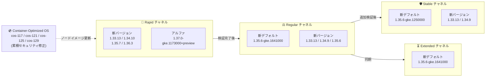

# Google Kubernetes Engine (GKE): バージョンアップデート 2026-R34

**リリース日**: 2026-08-14

**サービス**: Google Kubernetes Engine (GKE)

**機能**: クラスタバージョンの更新とセキュリティアップデート (2026-R34)

**ステータス**: Change + Security (Version Update / Security Update)

📊 [このアップデートのインフォグラフィックを見る](https://takech9203.github.io/google-cloud-news-summary/20260814-gke-version-updates-2026-r34.html)

## 概要

Google Kubernetes Engine (GKE) の全リリースチャネル (Rapid, Regular, Stable, Extended) において、クラスタバージョンが更新された。今回の 2026-R34 アップデートでは、Regular / Extended / No channel のデフォルトバージョンが 1.35.6-gke.1641000 に、Stable チャネルのデフォルトバージョンが 1.35.6-gke.1250000 にそれぞれ更新された。Rapid チャネルには 1.33.13-gke.1462000 / 1.34.10-gke.1106000 / 1.35.7-gke.1150000 / 1.36.3-gke.1537000 の新パッチが追加され、GKE アルファクラスタ向けには Kubernetes 1.37 系のアルファバージョン 1.37.0-gke.1173000+preview が初めて利用可能になった。

あわせて、Rapid チャネルの 1.36.3-gke.1244000 / 1.36.3-gke.1253000、Stable チャネルの 1.33.13-gke.1011000 / 1.34.9-gke.1287000 / 1.35.5 系 3 バージョンなど、複数の旧バージョンが非推奨となり、90 日以内 (またはサポート終了時のいずれか早い時点) に削除される。

セキュリティアップデート (2026-R34) として、更新された Container-Optimized OS イメージを使用する新しい GKE バージョンもリリースされた。これらのイメージは前回の GKE リリース以降に公開されたすべての Container-Optimized OS のセキュリティ修正を累積的に含んでおり、cos-117 / cos-121 / cos-125 / cos-129 の 4 マイルストーンのイメージが更新対象となっている。このアップデートは、GKE クラスタを運用するすべてのプラットフォーム管理者およびインフラエンジニアに影響する。

**アップデート前の課題**

- 前回 (2026-R33) までのバージョンには、直近の Container-Optimized OS セキュリティ修正が含まれていなかった
- Regular / Extended チャネルのデフォルトは旧パッチ (1.35.6-gke.1258000) のままであり、最新の修正が新規クラスタに標準適用されていなかった
- Kubernetes 1.37 系を GKE アルファクラスタで検証する手段が提供されていなかった

**アップデート後の改善**

- Regular / Extended / No channel のデフォルトが 1.35.6-gke.1641000 に、Stable のデフォルトが 1.35.6-gke.1250000 に更新され、新規クラスタに新しいパッチが標準で適用されるようになった
- Rapid チャネルに 1.33.13 / 1.34.10 / 1.35.7 / 1.36.3 系の最新パッチが追加され、アルファクラスタでは 1.37.0-gke.1173000+preview の検証が可能になった
- 新しい GKE バージョンに累積的なセキュリティ修正を含む Container-Optimized OS イメージが適用され、ノード OS の脆弱性リスクが低減された

## アーキテクチャ図



GKE のリリースチャネルは、Rapid で導入されたバージョンが検証を経て Regular、Stable へと段階的に展開されるパイプラインとして機能する。今回は新しい Container-Optimized OS イメージによるセキュリティ修正が各バージョンに組み込まれ、Rapid チャネルには Kubernetes 1.37 系のアルファバージョンも登場した。

## サービスアップデートの詳細

### チャネル別バージョン一覧

| チャネル | デフォルトバージョン | 新規追加バージョン | 非推奨バージョン (90 日以内に削除) |
|---------|---------------------|-------------------|-----------------|
| Rapid | 変更なし | 1.33.13-gke.1462000, 1.34.10-gke.1106000, 1.35.7-gke.1150000, 1.36.3-gke.1537000, アルファ 1.37.0-gke.1173000+preview | 1.36.3-gke.1244000, 1.36.3-gke.1253000 (1.33.13-gke.1329000, 1.34.9-gke.1655000, 1.35.6-gke.1710000 は提供終了) |
| Regular | 1.35.6-gke.1641000 (新デフォルト) | 1.33.13-gke.1329000, 1.34.9-gke.1655000, 1.35.6-gke.1710000 | 1.36.2-gke.1346000 (1.33.13-gke.1109000, 1.34.9-gke.1322000, 1.35.6-gke.1258000 は提供終了) |
| Stable | 1.35.6-gke.1250000 (新デフォルト) | 1.33.13-gke.1109000, 1.34.9-gke.1322000 | 1.33.13-gke.1011000, 1.34.9-gke.1287000, 1.35.5-gke.1057002, 1.35.5-gke.1163012, 1.35.5-gke.1241004 |
| Extended | 1.35.6-gke.1641000 (新デフォルト) | 1.31.14-gke.2456000, 1.31.14-gke.2579000, 1.32.13-gke.2175000, 1.32.13-gke.2268000, 1.33.13-gke.1329000, 1.34.9-gke.1655000, 1.35.6-gke.1710000 | 1.31.14-gke.2246000, 1.31.14-gke.2543000, 1.32.13-gke.1930000, 1.32.13-gke.2231000, 1.36.2-gke.1346000 (1.33.13-gke.1109000, 1.34.9-gke.1322000, 1.35.6-gke.1258000 は提供終了) |
| No channel (非推奨) | 1.35.6-gke.1641000 (新デフォルト) | 1.33.13-gke.1462000, 1.34.10-gke.1106000, 1.35.7-gke.1150000, 1.36.3-gke.1537000 (ノード版はさらに 1.31.14-gke.2579000, 1.32.13-gke.2268000) | 1.33.13-gke.1011000, 1.34.8-gke.1278000, 1.34.9-gke.1287000, 1.35.5-gke.1057002, 1.35.5-gke.1163012, 1.35.5-gke.1241004, 1.36.2-gke.1346000, 1.36.3-gke.1244000, 1.36.3-gke.1253000 |

### 自動アップグレードターゲット

各チャネルで、対象マイナーバージョンのクラスタに新しい自動アップグレードターゲットが設定された。

**Rapid チャネル (マイナーバージョンアップグレード)**

| 現在のマイナーバージョン | アップグレード先 |
|------------------------|------------------|
| 1.32 | 1.33.13-gke.1414000 |
| 1.33 | 1.34.10-gke.1079000 |
| 1.34 | 1.35.7-gke.1027000 |

**Regular チャネル (マイナーバージョンアップグレード)**

| 現在のマイナーバージョン | アップグレード先 |
|------------------------|------------------|
| 1.32 | 1.33.13-gke.1269000 |
| 1.33 | 1.34.9-gke.1610000 |
| 1.34 | 1.35.6-gke.1641000 |

**Stable チャネル (マイナーバージョンアップグレード)**

| 現在のマイナーバージョン | アップグレード先 |
|------------------------|------------------|
| 1.32 | 1.33.13-gke.1101000 |

**Extended チャネル (マイナーバージョンアップグレード)**

| 現在のマイナーバージョン | アップグレード先 |
|------------------------|------------------|
| 1.30 | 1.31.14-gke.2437000 |

メンテナンス除外や非推奨 API の使用などマイナーアップグレードを妨げる要因がある場合は、同一マイナーバージョン内の新パッチへ自動アップグレードされる (例: Regular チャネルの 1.35 系は 1.35.6-gke.1641000、1.36 系は 1.36.2-gke.2064000 へ。Extended チャネルは 1.31 系が 1.31.14-gke.2437000、1.32 系が 1.32.13-gke.2137000 へ)。

### セキュリティアップデート (2026-R34)

新しい GKE バージョンでは、更新された Container-Optimized OS イメージが使用される。これらのイメージは前回の GKE リリース以降のセキュリティ修正を累積的に含む。

| GKE バージョン | Container-Optimized OS バージョン |
|---------------|----------------------------------|
| 1.31.14-gke.2579000 | cos-117-18613-675-37 |
| 1.32.13-gke.2268000 | cos-117-18613-675-37 |
| 1.33.13-gke.1462000 | cos-121-18867-528-36 |
| 1.35.7-gke.1150000 | cos-125-19216-532-62 |
| 1.37.0-gke.1173000+preview | cos-129-19506-299-60 |

解決された個別の脆弱性は、各 Container-Optimized OS イメージのセキュリティリリースノートで確認できる。

### 主要な変更点

1. **デフォルトバージョンが 1.35.6 系の新パッチに更新**
   - Regular / Extended / No channel のデフォルトが 1.35.6-gke.1641000 に更新
   - Stable チャネルのデフォルトも 1.35.6-gke.1250000 に更新され、全チャネルの新規クラスタが 1.35.6 系で作成されるようになった

2. **Rapid チャネルに新パッチシリーズと Kubernetes 1.37 アルファが登場**
   - 1.33.13-gke.1462000 / 1.34.10-gke.1106000 / 1.35.7-gke.1150000 / 1.36.3-gke.1537000 が追加
   - GKE アルファクラスタ向けにアルファバージョン 1.37.0-gke.1173000+preview が利用可能に
   - 1.36.3-gke.1244000 / 1.36.3-gke.1253000 は非推奨となり 90 日以内に削除

3. **Stable / No channel で 1.35.5 系などの旧パッチが一斉に非推奨化**
   - Stable チャネルでは 1.33.13-gke.1011000 / 1.34.9-gke.1287000 / 1.35.5 系 3 バージョンが非推奨
   - No channel ではさらに 1.34.8-gke.1278000 / 1.36.2-gke.1346000 / 1.36.3 系 2 バージョンも非推奨

4. **Container-Optimized OS のセキュリティ修正を累積適用**
   - cos-117 (M117) / cos-121 (M121) / cos-125 (M125) / cos-129 (M129) の 4 マイルストーンのイメージを更新
   - 1.31 〜 1.37 系の新バージョンにそれぞれ適用

## 技術仕様

### リリースチャネルの特性

| チャネル | 今回提供されたマイナーバージョン範囲 | 安定性 | 今回の主な変更 |
|---------|---------------------|--------|------------------|
| Rapid | 1.33 - 1.36 (アルファ 1.37) | 最新機能優先 (SLA 対象外) | 1.33.13 / 1.34.10 / 1.35.7 / 1.36.3 系パッチ追加、1.37 アルファ登場 |
| Regular | 1.33 - 1.35 | バランス重視 | デフォルトが 1.35.6-gke.1641000 に |
| Stable | 1.33 - 1.34 (デフォルトは 1.35.6 系) | 安定性優先 | デフォルトが 1.35.6-gke.1250000 に、1.35.5 系旧パッチが非推奨 |
| Extended | 1.31 - 1.35 | 長期サポート | デフォルト更新 + 1.31.14 / 1.32.13 系の新パッチ追加 |

### バージョンロールアウトの注意点

- リリースノート公開時点でロールアウトは進行中であり、全ゾーンへの展開完了まで数日を要する場合がある
- 非推奨バージョンは 90 日後、またはサポート終了時のいずれか早い時点で削除される
- アルファバージョン 1.37.0-gke.1173000+preview は GKE アルファクラスタ専用であり、本番環境での利用は想定されていない

## 設定方法

### 前提条件

1. Google Cloud プロジェクトで GKE API が有効であること
2. `gcloud` CLI がインストール・認証済みであること
3. クラスタに対する適切な IAM 権限 (`container.admin` ロールなど) を保持していること

### 手順

#### ステップ 1: 現在のクラスタバージョンとチャネルを確認

```bash
gcloud container clusters list \
  --format="table(name,location,currentMasterVersion,releaseChannel.channel)"
```

#### ステップ 2: 利用可能なバージョンを確認

```bash
# Regular チャネルのデフォルトバージョンと利用可能バージョンを確認
gcloud container get-server-config \
  --flatten="channels" \
  --filter="channels.channel=REGULAR" \
  --format="yaml(channels.channel,channels.defaultVersion,channels.validVersions)" \
  --location=asia-northeast1
```

#### ステップ 3: 手動アップグレード (必要な場合)

```bash
# コントロールプレーンのアップグレード
gcloud container clusters upgrade CLUSTER_NAME \
  --master \
  --cluster-version=1.35.6-gke.1641000 \
  --location=LOCATION

# ノードプールのアップグレード
gcloud container clusters upgrade CLUSTER_NAME \
  --node-pool=NODE_POOL_NAME \
  --cluster-version=1.35.6-gke.1641000 \
  --location=LOCATION
```

#### ステップ 4: メンテナンスウィンドウの設定 (推奨)

```bash
# 業務時間外に自動アップグレードを制限
gcloud container clusters update CLUSTER_NAME \
  --maintenance-window-start="2026-08-16T18:00:00+09:00" \
  --maintenance-window-end="2026-08-16T22:00:00+09:00" \
  --maintenance-window-recurrence="FREQ=WEEKLY;BYDAY=SA,SU" \
  --location=LOCATION
```

## メリット

### ビジネス面

- **セキュリティリスクの低減**: 累積的なセキュリティ修正を含む Container-Optimized OS イメージへの更新により、ノード OS の脆弱性露出時間を短縮
- **運用コストの削減**: 自動アップグレードにより、手動でのバージョン管理・パッチ適用作業が不要
- **コンプライアンス対応**: サポート対象バージョンの維持により SLA 適用範囲内を維持

### 技術面

- **最新パッチの標準適用**: 全チャネルのデフォルトが 1.35.6 系の新パッチに更新され、新規クラスタに標準適用
- **次期バージョンの先行検証**: Rapid チャネルの 1.36.3 系新パッチに加え、アルファクラスタで Kubernetes 1.37 系の事前検証が可能に
- **累積的なセキュリティ修正**: COS イメージは前回リリース以降の修正をすべて含むため、途中のパッチをスキップしても最新のセキュリティ状態に到達可能

## デメリット・制約事項

### 制限事項

- ロールアウトは段階的に行われるため、一部のゾーンでは新バージョンがまだ利用できない場合がある
- コントロールプレーンのマイナーバージョンのスキップアップグレードは不可 (1 バージョンずつ順次アップグレードが必要)
- Rapid チャネルのバージョンは GKE SLA の対象外、アルファバージョン (1.37.0-gke.1173000+preview) はアルファクラスタ専用
- Extended チャネルの拡張サポート期間中はセキュリティパッチのみ提供 (新機能追加なし)

### 考慮すべき点

- Stable チャネルで非推奨となった 1.35.5 系 3 バージョン (1.35.5-gke.1057002 / 1.35.5-gke.1163012 / 1.35.5-gke.1241004) や 1.33.13-gke.1011000 / 1.34.9-gke.1287000 を使用中の場合、90 日以内に削除されるため移行計画を早期に策定すること
- Regular チャネルの 1.34 系クラスタは 1.35.6-gke.1641000 への自動アップグレード対象となるため、Kubernetes 1.35 の非推奨 API への対応状況を事前に確認すること
- Extended チャネルの 1.30 系クラスタは 1.31.14-gke.2437000 への自動アップグレード対象となる
- ノードのバージョンスキューポリシー (コントロールプレーンとノードの差は最大 2 マイナーバージョン) に注意

## ユースケース

### ユースケース 1: セキュリティ修正の迅速な適用

**シナリオ**: セキュリティポリシーにより、ノード OS の脆弱性修正を速やかに適用する必要があるプロダクションクラスタを運用している。

**実装例**:
```bash
# 該当ノードプールを COS 更新済みバージョンへ手動アップグレード
gcloud container clusters upgrade my-prod-cluster \
  --node-pool=default-pool \
  --cluster-version=1.33.13-gke.1462000 \
  --location=asia-northeast1
```

**効果**: cos-121-18867-528-36 の累積セキュリティ修正が適用されたノードイメージに更新され、脆弱性の露出時間を最小化できる。

### ユースケース 2: 非推奨バージョンからの計画的移行

**シナリオ**: Stable チャネルで 1.35.5-gke.1241004 を使用しており、90 日以内の削除に備えて移行が必要。

**実装例**:
```bash
# Stable チャネルの新デフォルトへアップグレード
gcloud container clusters upgrade my-cluster \
  --master \
  --cluster-version=1.35.6-gke.1250000 \
  --location=us-central1
```

**効果**: 削除期限前に計画的にアップグレードすることで、強制アップグレードによる予期しない業務影響を回避できる。

### ユースケース 3: アルファクラスタでの Kubernetes 1.37 先行検証

**シナリオ**: 次期メジャーアップグレードに備え、Kubernetes 1.37 系でのアプリケーション互換性を早期に確認したい。

**効果**: Rapid チャネルで利用可能になったアルファバージョン 1.37.0-gke.1173000+preview を GKE アルファクラスタで使用し、アプリケーションやアドオンの動作を先行検証できる。1.37 系が Rapid / Regular チャネルへ展開される前にリスクを洗い出せる。

## 料金

GKE のバージョンアップデート自体には追加料金は発生しない。

### 料金例

| 項目 | 料金 |
|------|------|
| GKE クラスタ管理費 (Standard) | $0.10 / クラスタ / 時間 |
| GKE クラスタ管理費 (Autopilot) | 管理費無料 (Pod リソース課金) |
| Extended サポート追加料金 | 拡張サポート期間に入ったクラスタに追加費用が発生 |
| ノードのコンピューティング費用 | 通常の Compute Engine 料金 |

詳細は [GKE 料金ページ](https://cloud.google.com/kubernetes-engine/pricing) を参照。

## 利用可能リージョン

GKE バージョンアップデートは全リージョンで利用可能。ただし、新バージョンのロールアウトはゾーンごとに段階的に行われ、完了まで数日を要する場合がある。

利用可能なバージョンはロケーションごとに確認可能:

```bash
gcloud container get-server-config --location=LOCATION
```

## 関連サービス・機能

- **Container-Optimized OS**: GKE ノードの OS イメージ。今回のセキュリティアップデートの中核であり、GKE バージョンと連動して更新される
- **Cloud Monitoring**: クラスタのアップグレード状態やバージョン情報を監視し、アップグレードイベントをアラート通知
- **Cloud Logging**: アップグレードイベントのログを記録し、トラブルシューティングに活用
- **GKE Security Posture**: クラスタのセキュリティ状態の継続的評価とバージョン推奨
- **GKE Rollout Sequencing**: 複数クラスタ間でのバージョンロールアウトの順序制御

## 参考リンク

- 📊 [このアップデートのインフォグラフィック](https://takech9203.github.io/google-cloud-news-summary/20260814-gke-version-updates-2026-r34.html)
- [公式リリースノート](https://docs.cloud.google.com/release-notes#August_14_2026)
- [GKE リリースノート](https://docs.cloud.google.com/kubernetes-engine/docs/release-notes)
- [GKE バージョニングとサポート](https://docs.cloud.google.com/kubernetes-engine/versioning)
- [リリースチャネルの概要](https://docs.cloud.google.com/kubernetes-engine/docs/concepts/release-channels)
- [クラスタアップグレードのベストプラクティス](https://docs.cloud.google.com/kubernetes-engine/docs/best-practices/upgrading-clusters)
- [Container-Optimized OS リリースノート (M129)](https://docs.cloud.google.com/container-optimized-os/docs/release-notes/m129)
- [料金ページ](https://cloud.google.com/kubernetes-engine/pricing)

## まとめ

GKE 2026-R34 アップデートにより、Regular / Extended / No channel のデフォルトバージョンが 1.35.6-gke.1641000 に、Stable チャネルのデフォルトが 1.35.6-gke.1250000 に更新され、Rapid チャネルには 1.33.13 / 1.34.10 / 1.35.7 / 1.36.3 系の新パッチと Kubernetes 1.37 系のアルファバージョンが追加された。あわせて累積的なセキュリティ修正を含む Container-Optimized OS イメージが 1.31 〜 1.37 系の新バージョンに適用されている。クラスタ管理者は、非推奨となった 1.36.3 系旧パッチ (Rapid) や 1.35.5 系 3 バージョン (Stable) からの移行計画を早期に策定し、メンテナンスウィンドウの設定を確認したうえで、セキュリティ修正済みバージョンへの計画的なアップグレードを推奨する。

---

**タグ**: #GKE #Kubernetes #VersionUpdate #SecurityUpdate #ReleaseChannel #ContainerOptimizedOS #2026-R34
