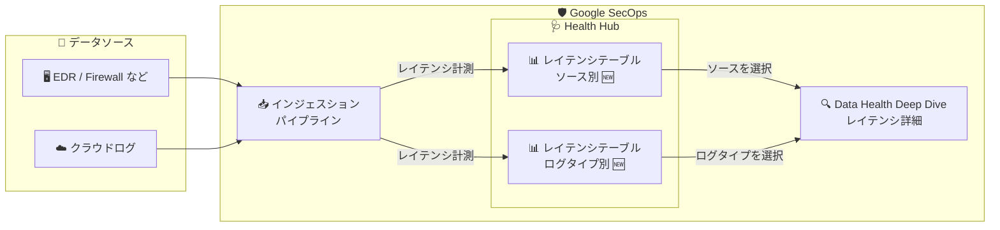

# Google SecOps: Health Hub によるデータレイテンシのモニタリング

**リリース日**: 2026-08-14

**サービス**: Google SecOps

**機能**: Health Hub のインジェスションレイテンシ監視テーブル (ソース別 / ログタイプ別)

**ステータス**: Public Preview (Spotlight Feature)

📊 [このアップデートのインフォグラフィックを見る](https://takech9203.github.io/google-cloud-news-summary/20260814-google-secops-health-hub-data-latency.html)

## 概要

Google SecOps の Health Hub に、インジェスション (取り込み) レイテンシを追跡するための 2 つの新しいテーブルが追加されました。1 つは **ソースレベル**、もう 1 つは **ログタイプレベル** でレイテンシを可視化するもので、特定のソースまたはログタイプを選択すると Data Health Deep Dive ページが開き、インジェスションレイテンシの詳細情報を確認できます。

Health Hub は、Google SecOps 内で構成済みのすべてのデータソースのステータスと健全性を監視するための中央インターフェースです。今回のアップデートにより、ログ取り込みの遅延をエンドツーエンドで可視化できるようになり、遅延ログのデバッグにかかる平均時間 (MTTD: Mean Time To Debug) の短縮が期待できます。SIEM 運用においてログの取り込み遅延は検知ルールの発火遅延やアラートの見逃しに直結するため、SOC エンジニアやセキュリティエンジニアにとって重要な改善です。

なお、リリースノートには「Lookback Window は来週中に完全ロールアウトされる」と記載されています。

**アップデート前の課題**

- ログの遅延を調べるには、Health Status by Data Source / Health Status by Parser テーブルの Last Event Time、Last Collected、Last Ingested といった複数のタイムスタンプを手動で比較し、遅延の有無や発生箇所を推測する必要があった
- ログタイプ単位の遅延は、Last Event Time と Last Ingested の差分 (95 パーセンタイル値) から間接的に推測する方法が中心だった
- ソース単位・ログタイプ単位でレイテンシを一覧比較できる専用ビューがなく、遅延ログの原因切り分けに時間がかかっていた

**アップデート後の改善**

- Health Hub にソース別・ログタイプ別のインジェスションレイテンシ専用テーブルが追加され、遅延状況を一覧で把握できるようになった
- ソースまたはログタイプを選択するだけで Data Health Deep Dive ページに遷移し、レイテンシの詳細情報をドリルダウンできるようになった
- エンドツーエンドの可視性が向上し、遅延ログのデバッグにかかる平均時間 (MTTD) を短縮できるようになった

## アーキテクチャ図

各データソースから取り込まれるログのレイテンシが Health Hub の新しい 2 つのテーブル (ソース別 / ログタイプ別) で可視化され、選択すると Data Health Deep Dive ページで詳細を分析できます。

## サービスアップデートの詳細

### 主要機能

1. **ソース別インジェスションレイテンシの監視**
   - Health Hub の新しいテーブルで、データソース単位の取り込みレイテンシを追跡できる
   - 遅延が発生しているソースを一覧から素早く特定できる

2. **ログタイプ別インジェスションレイテンシの監視**
   - ログタイプ (例: CS_EDR、GCP_CLOUDAUDIT、WINEVTLOG など) 単位でレイテンシを追跡できる
   - 特定のログタイプに偏った遅延の検出に役立つ

3. **Data Health Deep Dive によるレイテンシ詳細分析**
   - テーブルから特定のソースまたはログタイプを選択すると Data Health Deep Dive ページが開く
   - インジェスションレイテンシに関する詳細情報を確認し、原因の切り分けを進められる

4. **エンドツーエンドの可視性向上と MTTD の短縮**
   - ログソースから取り込み完了までの遅延を一元的に可視化
   - 遅延ログのデバッグにかかる平均時間 (MTTD) の短縮に寄与する

### 遅延の切り分けの考え方

Health Hub では、以下のタイムスタンプを比較することで遅延の発生箇所を切り分けられます (公式ドキュメントより)。

| タイムスタンプ | 意味 | 遅延の示唆 |
|------|------|------|
| Last Event Time | 最後に正規化されたログのイベント発生時刻 | Last Collected との差が大きい場合、ソース側 / ネットワーク側の遅延 |
| Last Collected | Google SecOps がイベントを最後に受信した時刻 | Last Ingested との差が大きい場合、SecOps パイプライン内の遅延 (クォータ超過時などに発生) |
| Last Ingested | 最後に取り込みが成功した時刻 | ログが SecOps に到達しているかの確認に使用 |

## 設定方法

### 前提条件

1. Google SecOps を利用しており、データソースが構成されていること
2. 本機能は Pre-GA (Public Preview) であり、[Pre-GA Offerings Terms](https://chronicle.security/legal/service-terms/) の対象であること

### 手順

1. Google SecOps で **Health Hub** を開く
2. 新しく追加されたインジェスションレイテンシのテーブル (ソース別 / ログタイプ別) を確認する
3. 遅延を調査したいソースまたはログタイプを選択し、**Data Health Deep Dive** ページでレイテンシの詳細情報を確認する
4. 必要に応じて、Health Hub のテーブルから Cloud Monitoring へのリンクを開き、Status やログボリュームのメトリクスに基づくアラートを構成する

## メリット

### ビジネス面

- **インシデント対応の信頼性向上**: ログ取り込みの遅延は検知の遅れに直結するため、遅延を早期に発見できることで SOC の検知能力を維持しやすくなる
- **運用工数の削減**: 遅延ログのデバッグにかかる平均時間 (MTTD) が短縮され、SOC / セキュリティエンジニアの調査負荷を軽減できる

### 技術面

- **エンドツーエンドの可視性**: ソースから取り込みまでのレイテンシをソース別・ログタイプ別に一覧で把握できる
- **ドリルダウン分析**: テーブルから Data Health Deep Dive にシームレスに遷移し、フィードの実行履歴や取り込みレートなどの詳細と合わせて原因を切り分けられる
- **既存の健全性監視との統合**: 既存の Health Status by Data Source / Health Status by Parser テーブルや異常検知エンジンと同じ Health Hub 上で運用できる

## デメリット・制約事項

### 制限事項

- Public Preview (Pre-GA) 機能であり、サポートが限定される場合や、他の Pre-GA バージョンと互換性のない変更が入る可能性がある
- Lookback Window は本リリース時点では完全にはロールアウトされておらず、来週中に完全ロールアウト予定と案内されている

### 考慮すべき点

- レイテンシの原因はソース側 (フォワーダーやネットワーク) と SecOps パイプライン側の双方にあり得るため、タイムスタンプの比較による切り分けが引き続き重要
- Last Event Time が古い場合でも、ソースが古いデータを送信しているだけでパイプラインの問題ではないケースがある点に注意が必要

## ユースケース

### ユースケース 1: 検知ルールの発火遅延の原因調査

**シナリオ**: EDR ログに基づく検知ルールのアラートが想定より遅れて発火している。ログの取り込み遅延が疑われる。

**効果**: Health Hub のログタイプ別レイテンシテーブルで該当ログタイプ (例: CS_EDR) のレイテンシを確認し、Data Health Deep Dive で取り込みレートやフィード実行履歴を分析することで、遅延がソース側かパイプライン側かを迅速に切り分けられる。

### ユースケース 2: 多数のデータソースの遅延の定常監視

**シナリオ**: 数十のフィード / データソースを運用する SOC が、日々の運用の中で遅延しているソースを早期に発見したい。

**効果**: ソース別レイテンシテーブルを定期的に確認することで、遅延が発生しているソースを一覧から即座に特定でき、障害の未然防止や SLA 維持に役立つ。Cloud Monitoring と組み合わせればアラートベースの運用も可能。

## 関連サービス・機能

- **Data Health Deep Dive ダッシュボード**: Health Hub のテーブルから遷移する詳細分析ページ。フィード実行履歴 (直近 2000 件)、取り込みレート、パーサーエラーなどを可視化する
- **Cloud Monitoring**: Health Hub は Status とログボリュームのメトリクスを Cloud Monitoring に連携しており、失敗ソースに対するカスタムアラートを構成できる
- **Unified Data Model (UDM)**: 取り込まれた生ログの正規化先となる Google SecOps の標準データモデル。正規化の遅延・失敗も Health Hub で監視できる

## 参考リンク

- 📊 [インフォグラフィック](https://takech9203.github.io/google-cloud-news-summary/20260814-google-secops-health-hub-data-latency.html)
- [公式リリースノート](https://docs.cloud.google.com/release-notes#August_14_2026)
- [Monitor health of data sources (公式ドキュメント)](https://docs.cloud.google.com/chronicle/docs/reports/data-health-monitoring-and-troubleshooting-dashboard)

## まとめ

Health Hub にソース別・ログタイプ別のインジェスションレイテンシテーブルが追加され、遅延ログのエンドツーエンドの可視化と MTTD の短縮が可能になりました。Google SecOps を運用しているチームは、Health Hub で自環境のレイテンシ状況を確認し、遅延が疑われるソース / ログタイプについて Data Health Deep Dive での分析フローを運用手順に組み込むことをお勧めします。Pre-GA 機能である点と、Lookback Window が来週完全ロールアウト予定である点には留意してください。

---

**タグ**: Google SecOps, Health Hub, Data Latency, Ingestion, SIEM, Observability, Public Preview
