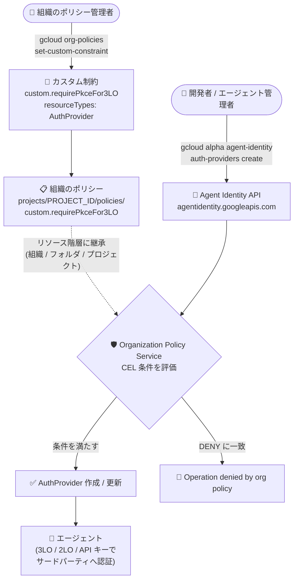

# Identity and Access Management: Agent Identity リソースに対する Organization Policy カスタム制約が GA

**リリース日**: 2026-08-14

**サービス**: Identity and Access Management (IAM) / Organization Policy Service

**機能**: Agent Identity 向けカスタム組織のポリシー (`agentidentity.googleapis.com/AuthProvider`)

**ステータス**: GA (一般提供)

📊 [このアップデートのインフォグラフィックを見る](https://takech9203.github.io/google-cloud-news-summary/20260814-iam-agent-identity-custom-org-policies.html)

## 概要

2026 年 8 月 14 日、Organization Policy Service の**カスタム制約 (custom constraints)** が Agent Identity リソースに対応し、GA (一般提供) となりました。これにより、`agentidentity.googleapis.com/AuthProvider` リソースの**特定のフィールド単位**で、より粒度の細かいガバナンスを組織全体に適用できます。

Agent Identity は 2026 年 4 月 22 日に GA となった機能で、エージェントをホストするリソースのライフサイクルに紐付いた、強く証明された暗号学的な ID をエージェントに付与します。その中の **Agent Identity auth manager** は、3-legged OAuth・2-legged OAuth・API キーといった認証方式を使ってエージェントをサードパーティサービスへ安全に認証させるための仕組みで、その設定を保持するのが `AuthProvider` リソースです。今回のアップデートは、この `AuthProvider` の作成・更新を組織のセキュリティ要件に沿って強制できるようにするものです。

対象となるのは、AI エージェントを Google Cloud 上で本番運用する組織の**組織のポリシー管理者 (Organization Policy Administrator)** およびプラットフォーム/セキュリティチームです。たとえば「3-legged OAuth プロバイダでは PKCE を必須にする」「2-legged OAuth プロバイダの作成を禁止する」「すべての AuthProvider に説明文を必須にする」といったルールを、組織・フォルダ・プロジェクトのいずれかのレベルで強制できます。

**アップデート前の課題**

- `AuthProvider` リソースは Organization Policy のカスタム制約の対象外であり、`clientId`、`tokenUrl`、`authorizationUrl`、`enablePkce`、`allowedScopes` といった**個別フィールドの値を組織として強制する手段がなかった**
- エージェントの認証設定に対するガードレールは IAM ロール (`roles/agentidentity.editor` / `roles/agentidentity.admin`) による「操作できる/できない」の粒度に留まり、「作成は許可するが安全でない設定値は禁止する」という制御ができなかった
- 安全でない認証プロバイダ設定 (PKCE 無効の 3LO、意図しない認可サーバー URL、過剰なスコープなど) は、レビューや監査など**予防的でない仕組み**に頼るしかなかった

**アップデート後の改善**

- `agentidentity.googleapis.com/AuthProvider` の 12 個のフィールドを CEL 条件で参照し、**リクエスト時点で拒否 (DENY) または許可 (ALLOW) を強制**できるようになった
- 認証方式の種別まで踏み込んだガードレールが可能になった (例: `has(resource.authProviderTypeParams.twoLeggedOauth)` で 2LO プロバイダの作成のみを禁止)
- 組織のポリシーとして定義するため、リソース階層に沿って**継承**され、新規プロジェクトにも自動的に適用される
- GA のため、Pre-GA Offerings Terms ではなく通常の一般提供条件のもとで本番環境に適用できる

## アーキテクチャ図



組織のポリシー管理者が定義したカスタム制約は、Agent Identity API への `CREATE` / `UPDATE` リクエストを Organization Policy Service が CEL 条件で評価する形で強制され、違反するリクエストはリソースが作成される前に拒否されます。

## サービスアップデートの詳細

### 主要機能

1. **`agentidentity.googleapis.com/AuthProvider` のフィールド単位制御**
   - OAuth のクライアント ID、認可エンドポイント、トークンエンドポイント、PKCE の有効/無効、許可・ブロックするスコープなど 12 フィールドを CEL 条件で参照可能
   - 認証方式ごとに `authProviderTypeParams.threeLeggedOauth` / `authProviderTypeParams.twoLeggedOauth` のサブフィールドが分かれており、方式別のポリシーを書き分けられる

2. **`CREATE` / `UPDATE` メソッドへの強制**
   - `methodTypes` には `CREATE` のみ、または `CREATE` と `UPDATE` の両方を指定できる (`UPDATE` のみの指定はカスタム制約全体でサポート対象外)
   - `UPDATE` を含めた場合、制約に違反している既存リソースへの変更は、その変更が違反を解消するものでない限りブロックされる

3. **ALLOW / DENY 両方のアクションタイプ**
   - `DENY`: 条件が true と評価された場合に作成・更新をブロック (例: PKCE が無効な 3LO プロバイダを拒否)
   - `ALLOW`: 条件が true の場合のみ許可し、条件に明示されていないその他すべてのケースをブロック (許可リスト方式)

4. **ドライラン (dry-run) モードによる事前検証**
   - `--update-mask=dryRunSpec` でポリシーを適用すると、実際にはブロックせずに違反を検出できる
   - 意図どおりに動作することを確認した後、`--update-mask=spec` でライブポリシーへ切り替える運用が可能

## 技術仕様

### カスタム制約で参照できる Agent Identity リソースとフィールド

| リソース | 参照可能なフィールド |
|---------|-------------------|
| `agentidentity.googleapis.com/AuthProvider` | `resource.allowedScopes` |
| | `resource.authProviderTypeParams.threeLeggedOauth.authorizationUrl` |
| | `resource.authProviderTypeParams.threeLeggedOauth.clientId` |
| | `resource.authProviderTypeParams.threeLeggedOauth.defaultContinueUri` |
| | `resource.authProviderTypeParams.threeLeggedOauth.enablePkce` |
| | `resource.authProviderTypeParams.threeLeggedOauth.tokenUrl` |
| | `resource.authProviderTypeParams.twoLeggedOauth.clientId` |
| | `resource.authProviderTypeParams.twoLeggedOauth.tokenUrl` |
| | `resource.blockedScopes` |
| | `resource.description` |
| | `resource.name` |
| | `resource.workloadIds` |

### カスタム制約の仕様上の上限

| 項目 | 詳細 |
|------|------|
| 制約 ID の長さ | 最大 70 文字 (`custom.` プレフィックスを除く) |
| CEL 条件の長さ | 最大 1,000 文字 |
| 表示名 (`displayName`) | 最大 200 文字 |
| 説明 (`description`) | 最大 2,000 文字 |
| 1 リソースタイプあたりの制約数 | ほとんどのリソースタイプで最大 20 個 (超過すると操作が失敗) |
| `methodTypes` | `CREATE` のみ、または `CREATE` + `UPDATE` (`UPDATE` 単独は非対応) |
| `actionType` | `ALLOW` または `DENY` |
| ポリシー反映までの時間 | 最大 15 分 (適用後、約 2 分で強制が始まる) |

### カスタム制約 YAML の構造

```yaml
name: organizations/ORGANIZATION_ID/customConstraints/custom.requirePkceFor3LO
resourceTypes:
  - agentidentity.googleapis.com/AuthProvider
methodTypes:
  - CREATE
  - UPDATE
condition: "has(resource.authProviderTypeParams.threeLeggedOauth) && resource.authProviderTypeParams.threeLeggedOauth.enablePkce == false"
actionType: DENY
displayName: Require PKCE for 3LO
description: All new 3-legged OAuth authentication providers must have PKCE enabled.
```

### 必要な IAM ロール

| 目的 | ロール | 付与対象 |
|------|-------|---------|
| 組織のポリシーの管理 | Organization Policy Administrator (`roles/orgpolicy.policyAdmin`) | 組織リソース |
| AuthProvider の作成・更新 | Agent Identity Editor (`roles/agentidentity.editor`) または Agent Identity Admin (`roles/agentidentity.admin`) | プロジェクトリソース |

## 設定方法

### 前提条件

1. 組織 ID を把握していること
2. 対象プロジェクトで課金が有効になっていること
3. Google Cloud CLI がインストール・初期化されていること (`gcloud init`)
4. 上表の IAM ロールが付与されていること

### 手順

#### ステップ 1: カスタム制約を作成する

`constraint-require-pkce.yaml` として以下を保存します。

```yaml
name: organizations/ORGANIZATION_ID/customConstraints/custom.requirePkceFor3LO
resourceTypes:
  - agentidentity.googleapis.com/AuthProvider
methodTypes:
  - CREATE
  - UPDATE
condition: "has(resource.authProviderTypeParams.threeLeggedOauth) && resource.authProviderTypeParams.threeLeggedOauth.enablePkce == false"
actionType: DENY
displayName: Require PKCE for 3LO
description: All new 3-legged OAuth authentication providers must have PKCE enabled.
```

```bash
gcloud org-policies set-custom-constraint constraint-require-pkce.yaml

# 制約が登録されたことを確認
gcloud org-policies list-custom-constraints --organization=ORGANIZATION_ID
```

3-legged OAuth プロバイダであり、かつ PKCE が有効になっていない場合に作成・更新を拒否する制約を組織に登録します。

#### ステップ 2: 組織のポリシーで制約を有効化する

`policy-require-pkce.yaml` として以下を保存します。

```yaml
name: projects/PROJECT_ID/policies/custom.requirePkceFor3LO
spec:
  rules:
    - enforce: true
```

```bash
# まずはドライランで検証
gcloud org-policies set-policy policy-require-pkce.yaml --update-mask=dryRunSpec

# 意図どおりであればライブポリシーとして適用
gcloud org-policies set-policy policy-require-pkce.yaml --update-mask=spec

# ポリシーの一覧を確認
gcloud org-policies list --project=PROJECT_ID
```

ポリシーの反映には最大 15 分かかります。適用後は約 2 分待つと強制が始まります。

#### ステップ 3: ポリシーの動作をテストする

```bash
gcloud alpha agent-identity auth-providers create PROVIDER_ID \
  --location=global \
  --project=PROJECT_ID \
  --three-legged-oauth-client-id=CLIENT_ID \
  --three-legged-oauth-client-secret=CLIENT_SECRET \
  --three-legged-oauth-authorization-url=AUTHORIZATION_URL \
  --three-legged-oauth-token-url=TOKEN_URL
```

PKCE を有効にしていない 3LO プロバイダの作成は、制約が強制されていれば以下のように失敗します。

```text
Operation denied by org policy on resource
'projects/PROJECT_ID/locations/global/authProviders/PROVIDER_ID':
["customConstraints/custom.requirePkceFor3LO": "All new 3-legged OAuth
authentication providers must have PKCE enabled."]
```

## メリット

### ビジネス面

- **AI エージェントのガバナンスを予防的に実現**: 監査による事後検出ではなく、リソース作成時点で組織のセキュリティ要件を強制でき、エージェントの認証設定に起因するリスクを構造的に低減できる
- **追加コストなしで適用可能**: Organization Policy Service は、事前定義の制約もカスタムの組織のポリシーも無償で提供されるため、ガバナンス強化に伴う直接的な費用増がない
- **GA によるプロダクション適用**: Pre-GA Offerings Terms の制約を受けずに、本番組織へ正式に展開できる

### 技術面

- **フィールド単位の粒度**: IAM ロールでは表現できない「設定値レベル」の制御を CEL 条件で記述できる
- **リソース階層による一元管理**: 組織・フォルダ・プロジェクトのいずれかに適用すれば配下に継承されるため、プロジェクトごとの個別設定が不要
- **ドライランによる安全な導入**: 既存ワークロードへの影響を事前に把握してから強制モードへ移行できる
- **既存のカスタム制約運用に統合**: IAM allow policy、managed workload identity、Workload Identity Federation、Privileged Access Manager など、既存の IAM 系カスタム制約と同じ `gcloud org-policies` ワークフローで管理できる

## デメリット・制約事項

### 制限事項

- 対応リソースは現時点で `agentidentity.googleapis.com/AuthProvider` のみ
- `UPDATE` のみを指定したカスタム制約はサポートされない (`CREATE` または `CREATE` + `UPDATE` を使用する)
- CEL 条件は最大 1,000 文字、制約 ID は最大 70 文字という長さ制限がある
- ほとんどのリソースタイプで 1 タイプあたり最大 20 個のカスタム制約という上限がある
- `AuthProvider` のクライアントシークレットに相当するフィールドは参照可能なフィールドの一覧に含まれておらず、シークレット値そのものを条件に使うことはできない

### 考慮すべき点

- ポリシー反映に最大 15 分のラグがあるため、CI/CD パイプラインでの検証タイミングに注意が必要
- `ALLOW` を選択すると条件に明示されていないケースがすべてブロックされるため、許可リスト方式を採る場合は条件の網羅性を十分に検証する
- 既存の AuthProvider に対して `UPDATE` を含む制約を適用すると、違反状態のリソースは違反を解消する変更以外がブロックされるため、既存リソースの棚卸しを先に行うことが望ましい
- 表示名・制約 ID・説明はエラーメッセージに露出する可能性があるため、PII や機密情報を含めない
- Agent Identity auth manager 自体の認証方式 (3LO / 2LO / API キー) は Preview 段階の項目があるため、ポリシー設計時に対象機能のローンチステージを確認する

## ユースケース

### ユースケース 1: 3-legged OAuth プロバイダで PKCE を必須化する

**シナリオ**: エージェントがユーザーの権限を借用して外部 SaaS (Jira、GitHub など) にアクセスする 3LO フローを社内標準としているが、認可コード横取り攻撃を防ぐため PKCE を必ず有効にしたい。

**実装例**:
```yaml
name: organizations/ORGANIZATION_ID/customConstraints/custom.requirePkceFor3LO
resourceTypes:
  - agentidentity.googleapis.com/AuthProvider
methodTypes:
  - CREATE
  - UPDATE
condition: "has(resource.authProviderTypeParams.threeLeggedOauth) && resource.authProviderTypeParams.threeLeggedOauth.enablePkce == false"
actionType: DENY
displayName: Require PKCE for 3LO
description: All new 3-legged OAuth authentication providers must have PKCE enabled.
```

**効果**: PKCE 無効の 3LO プロバイダは作成・更新の時点で拒否され、組織全体で PKCE 適用が保証されます。

### ユースケース 2: 2-legged OAuth プロバイダの利用を禁止する

**シナリオ**: マシン間認証には社内標準の別方式を用いる方針であり、2LO プロバイダの新規作成を組織として禁止したい。

**実装例**:
```yaml
name: organizations/ORGANIZATION_ID/customConstraints/custom.disallow2LO
resourceTypes:
  - agentidentity.googleapis.com/AuthProvider
methodTypes:
  - CREATE
condition: "has(resource.authProviderTypeParams.twoLeggedOauth)"
actionType: DENY
displayName: Disallow 2LO
description: 2-legged OAuth AuthProviders are not allowed.
```

**効果**: 2LO の認証プロバイダが新規に作られなくなり、認証方式の標準化を強制できます。

### ユースケース 3: すべての AuthProvider に説明文を必須化する

**シナリオ**: エージェントの認証プロバイダが増えるにつれ用途が不明なリソースが発生しており、運用・監査のために説明文を必ず記載させたい。

**実装例**:
```yaml
name: organizations/ORGANIZATION_ID/customConstraints/custom.requireAuthProviderDescription
resourceTypes:
  - agentidentity.googleapis.com/AuthProvider
methodTypes:
  - CREATE
  - UPDATE
condition: "resource.description == ''"
actionType: DENY
displayName: Require description
description: All AuthProviders must have a description.
```

**効果**: 説明が空の AuthProvider は作成・更新できなくなり、リソースの棚卸しやインシデント対応時の追跡性が向上します。

## 料金

Organization Policy Service は、事前定義の制約およびカスタムの組織のポリシーを含めて**無償**で提供されます。今回のアップデートによる追加料金は発生しません。

なお、ポリシーの適用対象となる Agent Identity や、エージェントをホストする Google Cloud サービス側の料金は別途発生します。

## 利用可能リージョン

Organization Policy はリソース階層 (組織・フォルダ・プロジェクト) に対して適用されるサービスであり、リージョン単位の指定はありません。ポリシー適用対象となる `AuthProvider` リソースはロケーションを持ち、公式ドキュメントの例では `--location=global` が使用されています。

## 関連サービス・機能

- **Agent Identity / Agent Identity auth manager**: 今回のカスタム制約の適用対象。エージェントに暗号学的な ID を付与し、3LO・2LO・API キーによるサードパーティ認証を管理する
- **Agent Identity API (`agentidentity.googleapis.com`)**: `AuthProvider` を管理する API。レガシーの IAM Connectors API (`iamconnectors.googleapis.com`) の後継
- **Organization Policy Service**: カスタム制約と組織のポリシーの定義・適用を行う基盤サービス。ドライランモードやタグによる条件付き適用にも対応
- **IAM カスタム組織のポリシー (`iam.googleapis.com/AllowPolicy`)**: IAM allow policy の変更方法を制御するカスタム制約。ロールやプリンシパルの粒度でガードレールを設定できる
- **managed workload identity / Workload Identity Federation のカスタム制約**: 2026 年 4 月 7 日に提供開始された、ワークロード ID 系のカスタム制約。Agent Identity と合わせて非人間 ID 全体のガバナンスを構成できる
- **Privileged Access Manager (PAM) のカスタム制約**: 2026 年 8 月 3 日に Preview で提供開始。エンタイトルメントとグラントの作成・変更を制御する
- **Policy Simulator**: カスタム制約を含む組織のポリシー変更の影響を事前に評価する

## 参考リンク

- 📊 [インフォグラフィック](https://takech9203.github.io/google-cloud-news-summary/20260814-iam-agent-identity-custom-org-policies.html)
- [公式リリースノート (IAM: August 14, 2026)](https://docs.cloud.google.com/iam/docs/release-notes#August_14_2026)
- [Use custom organization policies for Agent Identity](https://docs.cloud.google.com/iam/docs/agent-identity-custom-constraints)
- [Agent Identity overview](https://docs.cloud.google.com/iam/docs/agent-identity-overview)
- [Creating and managing custom constraints](https://docs.cloud.google.com/resource-manager/docs/organization-policy/creating-managing-custom-constraints)
- [Introduction to the Organization Policy Service](https://docs.cloud.google.com/resource-manager/docs/organization-policy/overview)
- [CustomConstraint REST リファレンス](https://docs.cloud.google.com/organization-policy/reference/rest/v2/organizations.customConstraints)
- [Migrate to the Agent Identity API](https://docs.cloud.google.com/iam/docs/migrate-to-agent-identity-api)

## まとめ

AI エージェントを本番運用する組織にとって、エージェントの認証設定は新たな攻撃面であり、その設定値を組織レベルで予防的に強制できるようになったことは大きな前進です。Organization Policy Service は無償のため、まずはドライランモードで `agentidentity.googleapis.com/AuthProvider` に対する制約を検証し、PKCE 必須化や認証方式の標準化といった自社のセキュリティ基準を段階的にライブポリシーへ移行することを推奨します。既存の AuthProvider がある場合は、`UPDATE` を含む制約の適用前にリソースの棚卸しを実施してください。

---

**タグ**: Identity and Access Management, IAM, Agent Identity, Organization Policy, カスタム制約, custom constraints, AuthProvider, ガバナンス, AI エージェント, セキュリティ, GA
