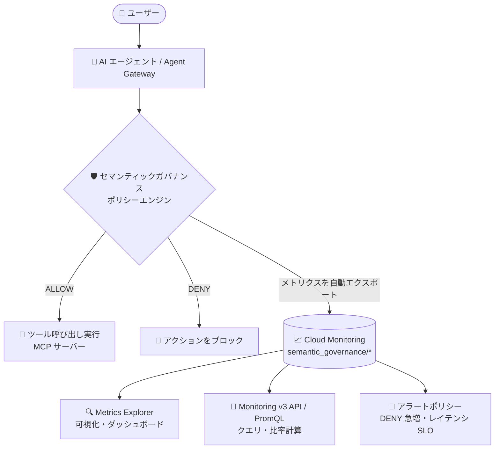

# Gemini Enterprise Agent Platform: セマンティックガバナンスポリシーの組み込みメトリクス (Preview)

**リリース日**: 2026-08-15

**サービス**: Gemini Enterprise Agent Platform

**機能**: セマンティックガバナンスポリシーエンジンの組み込み Cloud Monitoring メトリクス

**ステータス**: Preview

📊 [このアップデートのインフォグラフィックを見る](https://takech9203.github.io/google-cloud-news-summary/20260815-gemini-enterprise-agent-platform-semantic-governance-metrics.html)

## 概要

Gemini Enterprise Agent Platform のセマンティックガバナンスポリシーエンジンに、組み込みの Cloud Monitoring メトリクスが Preview として追加されました。ポリシーエンジンのリクエストスループット、評価回数、レイテンシ、判定結果の分布 (ALLOW / DENY)、および LLM トークン消費量を、Metrics Explorer で直接可視化できるほか、Cloud Monitoring v3 API や PromQL でクエリし、アラートポリシーにも利用できます。

セマンティックガバナンスポリシーは、AI エージェントのツール呼び出しやスキル実行が「ユーザーの意図」と「組織のビジネスルール (自然言語制約)」の両方に合致しているかを LLM を用いて評価するインテリジェントなセキュリティ・コンプライアンスレイヤーです。今回のアップデートにより、このポリシーエンジンの運用状態を SRE / プラットフォーム管理者が標準的なオブザーバビリティツールで継続的に監視できるようになりました。エージェントを本番運用する組織にとって、ポリシーエンジンの健全性・パフォーマンス・コスト (トークン消費) を定量的に把握するための重要な機能です。

**アップデート前の課題**

- ポリシーエンジンの判定結果 (verdict) やトークン使用量は、Cloud Logging に出力される構造化ログ (`semantic-governance-policy` ログ) を Logs Explorer で個別に確認する必要があった
- リクエスト単位のレイテンシは Cloud Trace のトレースで個別に確認する形であり、スループットや判定分布などの集計値を時系列で継続的に可視化する組み込みの手段がなかった
- DENY 率の急増やレイテンシ SLO 違反といった運用上の異常を検知するための、標準メトリクスに基づくアラート設定ができなかった

**アップデート後の改善**

- リクエスト数・評価回数・レイテンシ・判定分布 (ALLOW / DENY)・LLM トークン消費量の 5 種類のメトリクスが自動的に Cloud Monitoring にエクスポートされ、Metrics Explorer で直接観測できるようになった
- Cloud Monitoring v3 API および PromQL でメトリクスをクエリできるようになり、DENY 率などの比率計算やダッシュボードへの組み込みが可能になった
- メトリクスをアラートポリシーの条件に使用できるようになり、MODEL_ERROR の増加、レイテンシの p99 悪化、DENY 率の急上昇などをプロアクティブに検知できるようになった

## アーキテクチャ図



ポリシーエンジンはエージェントのツール呼び出しを評価 (ALLOW / DENY) すると同時に、リクエスト層と評価層のメトリクスを Cloud Monitoring へ自動エクスポートします。管理者は Metrics Explorer での可視化、PromQL でのクエリ、アラートポリシーでの異常検知に活用できます。

## サービスアップデートの詳細

### 主要機能

1. **リクエスト層のメトリクス (`semantic_governance/request_*`)**
   - ポリシーエンジンが検査したエージェントリクエストごとに記録される
   - リクエスト数 (スループット) と、検査によって追加されるエンドツーエンドのレイテンシを観測できる
   - `status` ラベル (OK / MODEL_ERROR / EVALUATION_ERROR / INTERNAL_ERROR) によりエラー種別ごとの分析が可能

2. **評価層のメトリクス (`semantic_governance/evaluation_*`)**
   - ポリシー評価ごとに記録される (複数のポリシーがアタッチされていても評価は 1 回としてカウント)
   - `final_verdict` ラベル (ALLOW / DENY) により判定結果の分布を時系列で追跡できる
   - 評価単位のレイテンシ分布 (DISTRIBUTION 型) も取得できる

3. **LLM トークン消費メトリクス (`evaluation_token_count`)**
   - ポリシー評価で消費された LLM トークン数を記録
   - `category` ラベル (INPUT / OUTPUT / THINKING) によりトークン種別ごとの内訳を把握できる
   - ポリシーエンジンのコスト傾向の監視に活用できる

4. **Metrics Explorer・API・PromQL・アラートへの統合**
   - Metrics Explorer で「Semantic Governance Policy Engine」リソースを選択して直接可視化
   - Cloud Monitoring v3 API のフィルタ `metric.type=starts_with("aiplatform.googleapis.com/semantic_governance")` で全メトリクス定義を取得可能
   - PromQL による比率計算 (DENY 率など) やアラートポリシーの条件設定に対応

## 技術仕様

### 提供されるメトリクス

すべてのメトリクスはモニタリング対象リソース `aiplatform.googleapis.com/SemanticGovernancePolicyEngine` (リソースラベル: `resource_container`、`location`) に関連付けられ、metricKind は DELTA です。

| メトリクス (プレフィックス: `aiplatform.googleapis.com/`) | 型 | 単位 | 内容 |
|------|------|------|------|
| `semantic_governance/request_count` | INT64 | 1{request} | 検査されたエージェントリクエスト数 |
| `semantic_governance/request_latencies` | DISTRIBUTION | s | 検査により追加されたリクエストあたりのレイテンシ |
| `semantic_governance/evaluation_count` | INT64 | 1{evaluation} | 実行されたポリシー評価の回数 |
| `semantic_governance/evaluation_latencies` | DISTRIBUTION | s | 評価あたりのレイテンシ |
| `semantic_governance/evaluation_token_count` | INT64 | 1{token} | 評価で消費された LLM トークン数 |

### メトリクスラベル

| メトリクス | ラベル |
|------|------|
| `request_count` | `method` (POST/GET など)、`status_code`、`status` (OK / MODEL_ERROR / EVALUATION_ERROR / INTERNAL_ERROR)、`request_type` (LLM / TOOL / OTHER / UNKNOWN) |
| `request_latencies` | `method`、`status`、`request_type` |
| `evaluation_count` / `evaluation_latencies` | `final_verdict` (ALLOW / DENY) |
| `evaluation_token_count` | `category` (INPUT / OUTPUT / THINKING) |

## 設定方法

### 前提条件

1. セマンティックガバナンスポリシーエンジンがプロビジョニング済みで、Agent Gateway のトラフィックに適用されていること
2. ポリシーエンジンが動作するプロジェクトで Cloud Monitoring API (`monitoring.googleapis.com`) が有効であること
3. メトリクスを閲覧するユーザーに Monitoring 閲覧者ロール (`roles/monitoring.viewer`) が付与されていること

### 手順

#### ステップ 1: Metrics Explorer でメトリクスを表示する

1. Google Cloud コンソールで **Metrics Explorer** を開き、対象プロジェクトを選択する
2. **Select a metric** をクリックし、「Semantic Governance Policy Engine」を検索してリソースを選択する
3. **semantic_governance** カテゴリからメトリクス (例: Evaluation Count) を選択する
4. 必要に応じてラベルでフィルタ (例: `final_verdict = DENY`) し、集計方法と期間を設定する

#### ステップ 2: PromQL で DENY 率をクエリする

```promql
# 直近 5 分間の DENY 率 (概念例)
sum(rate(evaluation_count{final_verdict="DENY"}[5m]))
/
sum(rate(evaluation_count[5m]))
```

Metrics Explorer のクエリエディタ (PromQL) から、`evaluation_count` を `final_verdict='DENY'` でフィルタした rate の合計を、同一リージョンの全体の rate の合計で除算することで DENY 率を算出できます。トラフィックがない時間帯のゼロ除算の扱いについては、公式ドキュメントの比率メトリクスに関するガイダンスを参照してください。

#### ステップ 3: アラートポリシーを設定する

公式ドキュメントでは以下のようなアラート例が挙げられています。

- **MODEL_ERROR 率の上昇**: `status = MODEL_ERROR` のリクエスト割合がしきい値を超えたら通知
- **レイテンシ SLO 違反**: `evaluation_latencies` の p99 が一定期間目標値を超えたら通知
- **予期しない DENY の急増**: DENY 率がしきい値を超えたら通知 (ポリシーの設定ミスやトラフィック変化の兆候)

## メリット

### ビジネス面

- **ガバナンスの実効性を定量化**: ALLOW / DENY の判定分布を継続的に把握でき、ポリシーが実際にどの程度アクションをブロックしているかを経営層や監査向けに示せる
- **コストの可視化**: ポリシー評価が消費する LLM トークン数を INPUT / OUTPUT / THINKING の内訳付きで監視でき、ガバナンスレイヤーのコスト傾向を把握できる
- **本番導入の判断材料**: ドライランモードと組み合わせて、ポリシー適用前後の挙動をメトリクスで比較しながら段階的に本番適用を進められる

### 技術面

- **標準ツールへの統合**: Metrics Explorer、Monitoring v3 API、PromQL という既存のオブザーバビリティスタックをそのまま利用でき、追加の計測実装が不要
- **プロアクティブな異常検知**: DENY 率の急増やエラー率・レイテンシの悪化をアラートポリシーで自動検知でき、ポリシー設定ミスやモデル起因の障害に早期対応できる
- **多層的なオブザーバビリティ**: 既存の Cloud Logging (評価ごとの verdict と rationale) および Cloud Trace (リクエスト単位のレイテンシ) と組み合わせ、集計 (メトリクス) から個別調査 (ログ・トレース) までドリルダウンできる

## デメリット・制約事項

### 制限事項

- Preview 段階の機能であり、Pre-GA 提供条件が適用される (機能や仕様が変更される可能性がある)
- 複数のポリシーがアタッチされていても、評価は 1 回としてカウントされる (ポリシー単位の内訳メトリクスではない)

### 考慮すべき点

- DENY 率などの比率を PromQL で計算する場合、トラフィックがないウィンドウでのゼロ除算の扱いに注意が必要
- メトリクスは集計値であり、個別の判定理由 (rationale) の調査には引き続き Cloud Logging の構造化ログを参照する必要がある

## ユースケース

### ユースケース 1: ポリシー設定変更後の DENY 率監視

**シナリオ**: 自然言語制約 (NLC) を更新した後、意図しない大量のブロックが発生していないかを確認したい。

**実装例**: `evaluation_count` を `final_verdict` でグループ化したダッシュボードを作成し、DENY 率がしきい値 (例: 20%) を超えた場合に通知するアラートポリシーを設定する。

**効果**: ポリシーの設定ミスによる業務影響 (正当なエージェントアクションのブロック) を早期に検知し、迅速なロールバック判断ができる。

### ユースケース 2: ポリシーエンジンのレイテンシ SLO 管理

**シナリオ**: エージェントの応答性能に対するポリシー検査のオーバーヘッドを SLO として管理したい。

**効果**: `request_latencies` / `evaluation_latencies` の分布 (p99 など) を継続監視し、SLO 違反時にアラートを受け取ることで、エージェント全体のユーザー体験を維持できる。

### ユースケース 3: ガバナンスコストの追跡

**シナリオ**: ポリシー評価に使用される LLM トークン消費が想定内に収まっているかを追跡したい。

**効果**: `evaluation_token_count` を `category` ラベルで分解して監視することで、トークン消費の急増 (例: 制約文の肥大化や評価対象トラフィックの増加) を検知し、コスト最適化のアクションにつなげられる。

## 料金

今回追加されたメトリクスは `aiplatform.googleapis.com/` プレフィックスを持つ Google Cloud サービスのシステムメトリクスとして Cloud Monitoring に取り込まれます。メトリクス自体の課金有無や詳細は、Cloud Monitoring の料金ページを参照してください。

- [Cloud Monitoring 料金](https://cloud.google.com/stackdriver/pricing)

## 関連サービス・機能

- **Cloud Monitoring / Metrics Explorer**: 今回のメトリクスの可視化・ダッシュボード作成・アラートポリシー設定の基盤
- **PromQL (Cloud Monitoring)**: DENY 率などの比率計算を含む柔軟なメトリクスクエリに使用
- **Cloud Logging**: ポリシーエンジンが評価ごとに出力する構造化ログ (`semantic-governance-policy`)。verdict、rationale、トークン使用量の内訳を個別に確認できる
- **Cloud Trace**: ポリシーエンジンが評価したリクエストごとのトレースをエクスポートし、リクエスト単位のレイテンシ分析が可能
- **Agent Gateway / MCP サーバー**: ポリシーエンジンが検査するエージェントのツール呼び出し経路
- **Model Armor**: プロンプト・レスポンスのスキャン (PII、プロンプトインジェクション対策) を担う補完的な保護レイヤー

## 参考リンク

- 📊 [インフォグラフィック](https://takech9203.github.io/google-cloud-news-summary/20260815-gemini-enterprise-agent-platform-semantic-governance-metrics.html)
- [公式リリースノート](https://docs.cloud.google.com/release-notes#August_15_2026)
- [Monitor semantic governance policies (公式ドキュメント)](https://docs.cloud.google.com/gemini-enterprise-agent-platform/govern/policies/monitor-semantic-governance)
- [Semantic governance policies の概要](https://docs.cloud.google.com/gemini-enterprise-agent-platform/govern/policies/semantic-governance-overview)
- [Configure Semantic governance policies](https://docs.cloud.google.com/gemini-enterprise-agent-platform/govern/policies/configure-semantic-governance)
- [Cloud Monitoring 料金](https://cloud.google.com/stackdriver/pricing)

## まとめ

セマンティックガバナンスポリシーエンジンの組み込みメトリクスにより、AI エージェントのガバナンスレイヤーをスループット・レイテンシ・判定分布・トークン消費の観点から定量的に監視できるようになりました。エージェントを本番運用中または導入検討中の組織は、まず Metrics Explorer でメトリクスを確認し、DENY 率とレイテンシ p99 に対するアラートポリシーの設定から始めることを推奨します。Preview 段階のため、本番運用では Pre-GA 提供条件を確認の上で利用してください。

---

**タグ**: #GeminiEnterpriseAgentPlatform #SemanticGovernance #CloudMonitoring #PromQL #Observability #AIAgents #Preview
