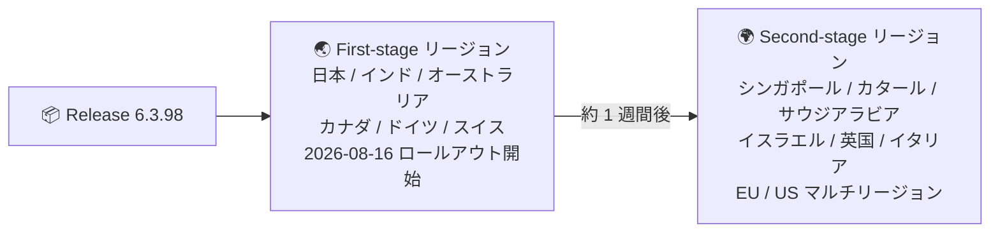

# Google SecOps SOAR: Release 6.3.98 の first-phase リージョンへのロールアウト開始

**リリース日**: 2026-08-16

**サービス**: Google SecOps SOAR

**機能**: Release 6.3.98 (内部および顧客報告のバグ修正)

**ステータス**: Announcement

📊 [このアップデートのインフォグラフィックを見る](https://takech9203.github.io/google-cloud-news-summary/20260816-google-secops-soar-release-6-3-98.html)

## 概要

2026 年 8 月 16 日 (日)、Google SecOps SOAR の **Release 6.3.98 が first-phase リージョン (日本、インド、オーストラリア、カナダ、ドイツ、スイス) へのロールアウトを開始** しました。このリリースには **内部および顧客からのバグ修正 (internal and customer bug fixes)** が含まれています。

SOAR のリリースは通常、日曜日に 2 段階でロールアウトされ、second-stage リージョンは first-stage の約 1 週間後に更新されます。顧客側での適用作業は不要で、リリースは自動的に展開されます。前バージョンの Release 6.3.97 は前日の 8 月 15 日に全リージョンで利用可能になっており、SOAR プラットフォームは週次のリリースサイクルで継続的に更新されています。

なお、同日の 8 月 16 日 (日) には、事前 (8 月 13 日) にアナウンスされていた **SOAR データベース・インフラストラクチャの定期メンテナンス** も標準メンテナンスウィンドウ内で実施される予定です。このメンテナンス中は短時間のダウンタイムが発生しますが、顧客側の対応は不要です。

**アップデート前の課題**

- プラットフォームには内部および顧客から報告された不具合が残存していた

**アップデート後の改善**

- Release 6.3.98 により、内部および顧客報告のバグ修正が first-phase リージョンから順次適用される

## アーキテクチャ図

Release 6.3.98 は 2 段階ロールアウトの first-stage リージョンから展開が開始され、second-stage リージョンは通常その約 1 週間後に更新されます。

## サービスアップデートの詳細

### 主要機能

1. **内部および顧客報告のバグ修正**
   - Release 6.3.98 には internal and customer bug fixes が含まれる
   - リリースノート上で個別の修正内容の詳細は公開されていない

2. **First-phase リージョンへの段階的ロールアウト**
   - 2026 年 8 月 16 日 (日) に first-phase リージョンへの展開を開始
   - 顧客側でのアップグレード作業は不要

## 技術仕様

### リリース展開スケジュール

| 日付 | イベント |
|------|----------|
| 2026 年 8 月 15 日 (土) | (参考) 前バージョン Release 6.3.97 が全リージョンで利用可能に |
| 2026 年 8 月 16 日 (日) | Release 6.3.98 を first-phase リージョンにロールアウト開始 |
| 2026 年 8 月 16 日 (日) | (参考) SOAR データベース・インフラストラクチャの定期メンテナンス (短時間のダウンタイムあり) |
| 以降 (通常約 1 週間後) | Second-stage リージョンへ展開 |

### SOAR リリースの展開ステージ

SOAR のリリースは通常、日曜日に 2 段階でロールアウトされ、second-stage リージョンは first-stage の約 1 週間後に更新されます。

| ステージ | リージョン |
|----------|-----------|
| First-stage | 日本、インド、オーストラリア、カナダ、ドイツ、スイス |
| Second-stage | シンガポール、カタール、サウジアラビア、イスラエル、英国 (ロンドン)、イタリア、EU (マルチリージョン)、US (マルチリージョン) |

自身の割り当てリージョンが不明な場合は、Google SecOps の担当者に問い合わせます。

## メリット

### ビジネス面

- **運用作業ゼロでの品質改善**: バグ修正が自動的に適用されるため、顧客側でのアップグレード作業や計画は不要
- **段階的ロールアウトによるリスク低減**: first-stage で問題がないことを確認したうえで全リージョンに展開される運用のため、大規模障害のリスクが抑えられる

### 技術面

- **プラットフォームの安定性向上**: 内部および顧客報告の不具合修正が first-phase リージョンから順次適用される

## デメリット・制約事項

### 制限事項

- バグ修正の個別の内容はリリースノートで公開されていない
- Second-stage リージョンへの適用は first-stage の約 1 週間後となるため、リージョンによって適用時期に差がある

### 考慮すべき点

- 同日 (2026 年 8 月 16 日) に定期メンテナンスが実施され、短時間のダウンタイムが発生する。SOC 運用チームはリリース適用とメンテナンスを連続する変更イベントとして把握しておくとよい
- First-stage リージョン (日本を含む) のユーザーは、8 月 16 日以降に動作の変化があった場合、Release 6.3.98 の適用を切り分けの観点に含めるとよい

## 料金

このリリースの適用に伴う追加料金は発生しません。Google SecOps の料金体系については、Google Security Operations の料金ページを参照してください。

## 利用可能リージョン

Release 6.3.98 は 2026 年 8 月 16 日時点で **first-phase リージョン (日本、インド、オーストラリア、カナダ、ドイツ、スイス)** へのロールアウトが開始された段階です。Second-stage リージョンへは通常、約 1 週間後に展開されます。

## 関連サービス・機能

- **Google SecOps (統合プラットフォーム)**: SOAR は Google SecOps のケース管理・自動対応 (Security Orchestration, Automation and Response) 機能を担う
- **Release plan for Google SecOps**: SOAR リリースが first-stage → second-stage の 2 段階で展開される仕組みを規定
- **SOAR 定期メンテナンス (2026 年 8 月 16 日)**: 同日に実施されるデータベース・インフラストラクチャのメンテナンス。短時間のダウンタイムが発生する

## 参考リンク

- 📊 [インフォグラフィック](https://takech9203.github.io/google-cloud-news-summary/20260816-google-secops-soar-release-6-3-98.html)
- [公式リリースノート (Google Cloud 全体 / 2026 年 8 月 16 日)](https://docs.cloud.google.com/release-notes#August_16_2026)
- [Google Security Operations SOAR release notes](https://docs.cloud.google.com/chronicle/docs/soar/release-notes)
- [Release plan for Google SecOps (リージョン展開ステージ)](https://docs.cloud.google.com/chronicle/docs/soar/overview-and-introduction/soar-gradual-release)
- [Google Security Operations 料金](https://cloud.google.com/chronicle/pricing)

## まとめ

Google SecOps SOAR の Release 6.3.98 が first-phase リージョン (日本を含む 6 リージョン) へのロールアウトを開始しました。内容は内部・顧客報告のバグ修正で、顧客側の適用作業は不要です。同日に定期メンテナンスによる短時間のダウンタイムも予定されているため、SOC 運用チームは両イベントを変更管理情報として把握しておくことを推奨します。

---

**タグ**: Google SecOps, Google SecOps SOAR, Chronicle, Release 6.3.98, バグ修正, 段階的ロールアウト, SOC 運用
