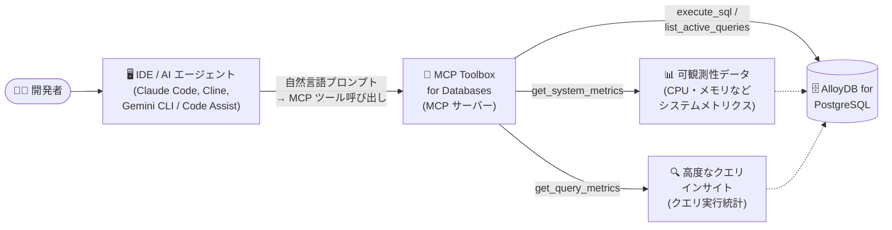

# AlloyDB for PostgreSQL: MCP Toolbox for Databases による可観測性機能と高度なクエリインサイトへの IDE アクセス

**リリース日**: 2026-08-17

**サービス**: AlloyDB for PostgreSQL

**機能**: MCP Toolbox for Databases 経由での可観測性機能・高度なクエリインサイトへのアクセス

**ステータス**: Feature

📊 [このアップデートのインフォグラフィックを見る](https://takech9203.github.io/google-cloud-news-summary/20260817-alloydb-mcp-toolbox-observability.html)

## 概要

AlloyDB for PostgreSQL において、MCP Toolbox for Databases を使用して AlloyDB の可観測性 (Observability) 機能と高度なクエリインサイト (Advanced Query Insights) に IDE から直接アクセスできるようになりました。MCP Toolbox for Databases は、IDE (AI エージェント) とデータベースの間に配置されるオープンソースの Model Context Protocol (MCP) サーバーであり、AI ツールに対するコントロールプレーンとして機能します。

これにより、開発者は Claude Code、Claude Desktop、Cline、Gemini CLI、Gemini Code Assist などの AI 対応開発環境から、自然言語プロンプトで「過去 1 時間の CPU 使用率は?」「直近 15 分間のクエリパフォーマンスメトリクスを見せて」といった問いかけを行い、システムメトリクスやクエリメトリクスを取得できます。Gemini CLI 向けには、MCP Toolbox for Databases をベースにした `alloydb` 拡張機能と `alloydb-observability` 拡張機能が提供されており、データベース操作・リソース管理・ヘルスモニタリングを統合的に行えます。

対象ユーザーは、AlloyDB 上でアプリケーションを開発・運用する開発者や DBA で、パフォーマンスのトラブルシューティングを開発ワークフローの中で完結させたいチームに特に有用です。

**アップデート前の課題**

- AlloyDB のクエリインサイトやシステムメトリクスを確認するには、Google Cloud コンソール (Query Insights ダッシュボードや Cloud Monitoring) に切り替える必要があり、IDE での開発作業とコンテキストスイッチが発生していた
- IDE から MCP Toolbox 経由で行える操作は主にスキーマ探索や SQL 実行などのデータベース操作が中心で、可観測性データへの統一的なアクセス手段がなかった
- クエリのパフォーマンス問題の調査には、メトリクスの選定や PromQL/ダッシュボードの知識が必要だった

**アップデート後の改善**

- IDE 内の AI エージェントから自然言語で AlloyDB の可観測性機能 (システムメトリクス、クエリメトリクス) と高度なクエリインサイトに直接アクセスできるようになった
- `list_active_queries`、`get_query_plan`、`list_top_bloated_tables`、`long_running_transactions` などのヘルス・メンテナンス系ツールと組み合わせ、調査から改善までを IDE 内で完結できるようになった
- Gemini CLI の `alloydb-observability` 拡張機能により、`get_system_metrics` / `get_query_metrics` ツールでパフォーマンスと健全性を統一的に監視できるようになった

## アーキテクチャ図



IDE 内の AI エージェントが MCP Toolbox for Databases を経由して、AlloyDB のデータベース操作に加えて可観測性データと高度なクエリインサイトを取得するデータフローです。

## サービスアップデートの詳細

### 主要機能

1. **IDE からの可観測性データへのアクセス**
   - MCP Toolbox for Databases を経由して、AlloyDB のシステムメトリクス (CPU 使用率、メモリなど) とクエリメトリクスを IDE から取得可能
   - 「過去 1 時間の CPU 使用率などのシステムメトリクスは?」のような自然言語プロンプトで問い合わせできる

2. **高度なクエリインサイトへのアクセス**
   - クエリ単位の実行統計にアクセスし、実行時間の長いクエリの特定やワークロードパターンの把握が IDE 内で可能
   - `get_query_plan` によるクエリプランの説明など、チューニングに必要な情報も同じインターフェースで取得できる

3. **Gemini CLI 拡張機能 (alloydb / alloydb-observability)**
   - `alloydb` 拡張: SQL 実行、テーブル/インデックス/ロック一覧などのデータベース操作、クラスタ・インスタンス・ユーザーのリソース管理、肥大化テーブルや長時間トランザクションの確認などのヘルスモニタリングツールを提供
   - `alloydb-observability` 拡張: `get_system_metrics` と `get_query_metrics` により、パフォーマンスと健全性の監視を統一的に実施
   - スタンドアロンの CLI としても、Gemini Code Assist と統合して IDE 内でも利用可能

4. **幅広い MCP クライアントのサポート**
   - Claude Code、Claude Desktop、Cline などの MCP クライアントから、`--prebuilt alloydb-postgres` 構成の Toolbox 経由で接続可能
   - デフォルトはパブリック IP 接続で、`ALLOYDB_POSTGRES_IP_TYPE=private` によりプライベート IP 接続も設定可能

## 技術仕様

### 主なツールカテゴリ (Gemini CLI 拡張の例)

| カテゴリ | 主なツール | プロンプト例 |
|------|------|------|
| 可観測性 | `get_system_metrics`, `get_query_metrics` | 「過去 1 時間の CPU 使用率などのシステムメトリクスは?」 |
| データベース操作 | `execute_sql`, `list_active_queries`, `get_query_plan`, `list_tables`, `list_indexes`, `list_locks` | 「現在実行中のクエリを見せて」 |
| リソース管理 | `create_cluster`, `list_clusters`, `create_instance`, `create_user` | 「us-east1 に sales-quarterly-db クラスタを作成して」 |
| ヘルス・メンテナンス | `list_top_bloated_tables`, `long_running_transactions`, `list_invalid_indexes`, `replication_stats` | 「肥大化しているテーブルの上位 5 件は?」 |

### 前提バージョン・認証

| 項目 | 詳細 |
|------|------|
| MCP Toolbox for Databases | v0.15.0 以降のバイナリが必要 (オープンソース、GitHub で公開) |
| 認証 | デフォルトでアプリケーションのデフォルト認証情報 (ADC)。データベースユーザー認証も環境変数で設定可能 |
| 接続 | デフォルトはパブリック IP。`ALLOYDB_POSTGRES_IP_TYPE=private` でプライベート IP 接続 |
| 提供状況 | MCP Toolbox for Databases はベータ (pre-v1.0) であり、v1.0 の安定版リリースまで破壊的変更の可能性あり |

## 設定方法

### 前提条件

1. AlloyDB for PostgreSQL のクラスタ・インスタンスが稼働していること
2. MCP Toolbox for Databases v0.15.0 以降をインストールしていること
3. 接続に使用する認証情報 (ADC またはデータベースユーザー) を用意していること

### 手順

#### ステップ 1: MCP Toolbox for Databases のインストール

```bash
# OS/アーキテクチャに応じたバイナリを取得 (例: linux/amd64)
curl -O https://storage.googleapis.com/genai-toolbox/v0.15.0/linux/amd64/toolbox
chmod +x toolbox
./toolbox --version
```

#### ステップ 2: MCP クライアントの設定 (例: Claude Code)

プロジェクトルートの `.mcp.json` に以下を追加します。

```json
{
  "mcpServers": {
    "alloydb": {
      "command": "./PATH/TO/toolbox",
      "args": ["--prebuilt", "alloydb-postgres", "--stdio"],
      "env": {
        "ALLOYDB_POSTGRES_PROJECT": "PROJECT_ID",
        "ALLOYDB_POSTGRES_REGION": "REGION",
        "ALLOYDB_POSTGRES_CLUSTER": "CLUSTER_NAME",
        "ALLOYDB_POSTGRES_INSTANCE": "INSTANCE_NAME",
        "ALLOYDB_POSTGRES_DATABASE": "DATABASE_NAME",
        "ALLOYDB_POSTGRES_USER": "USERNAME",
        "ALLOYDB_POSTGRES_PASSWORD": "PASSWORD"
      }
    }
  }
}
```

#### ステップ 3: Gemini CLI 拡張機能を利用する場合

```bash
# AlloyDB 拡張機能のインストール
gemini extensions install https://github.com/gemini-cli-extensions/alloydb

# 接続情報の設定
export ALLOYDB_POSTGRES_PROJECT="PROJECT_ID"
export ALLOYDB_POSTGRES_REGION="REGION"
export ALLOYDB_POSTGRES_CLUSTER="CLUSTER_NAME"
export ALLOYDB_POSTGRES_INSTANCE="INSTANCE_NAME"
export ALLOYDB_POSTGRES_DATABASE="DATABASE_NAME"

# 対話モードで起動
gemini
```

CLI が拡張機能とツールを自動的に読み込み、自然言語でデータベースと可観測性データにアクセスできます。

## メリット

### ビジネス面

- **トラブルシューティングの迅速化**: パフォーマンス問題の調査を IDE 内で完結でき、コンソールへの切り替えによるコンテキストスイッチを削減できる
- **スキル障壁の低減**: メトリクス名や PromQL の知識がなくても、自然言語でパフォーマンスデータにアクセスできる

### 技術面

- **統一インターフェース**: SQL 実行・スキーマ探索から可観測性・クエリインサイトまで、同じ MCP ツール群として AI エージェントに提供される
- **オープンな標準**: MCP は LLM と外部データソースの接続を標準化するプロトコルであり、Claude Code、Cline、Gemini CLI など複数のクライアントで同じ Toolbox 構成を再利用できる
- **調査から対処までの一貫ワークフロー**: 遅いクエリの特定 (クエリメトリクス) → 実行計画の確認 (`get_query_plan`) → インデックスや肥大化の確認、という流れを対話的に実行できる

## デメリット・制約事項

### 制限事項

- MCP Toolbox for Databases はベータ (pre-v1.0) であり、v1.0 の安定版リリースまで破壊的変更が発生する可能性がある
- Toolbox のバージョンは v0.15.0 以降が必要

### 考慮すべき点

- AI エージェントに `execute_sql` やリソース管理 (クラスタ作成・ユーザー作成など) の強力なツールが公開されるため、接続に使用する認証情報・データベースユーザーの権限は最小権限で設計するべき
- 本番データベースへの接続では、プライベート IP 接続 (`ALLOYDB_POSTGRES_IP_TYPE=private`) の利用を検討する

## ユースケース

### ユースケース 1: IDE 内での遅いクエリの特定とチューニング

**シナリオ**: アプリケーションのレスポンス劣化の報告を受けた開発者が、IDE を離れずに原因を調査したい。

**実装例**:
```
プロンプト例:
「直近 15 分間のクエリパフォーマンスメトリクスを見せて」
「現在実行中のクエリは?」
「過去 6 か月注文のない顧客を抽出するクエリの実行計画を説明して」
```

**効果**: クエリメトリクスで実行時間の長いクエリを特定し、実行計画の確認からインデックス状況の調査まで、AI エージェントとの対話で一貫して実施できる。

### ユースケース 2: システムヘルスチェックの日常運用

**シナリオ**: DBA が AlloyDB インスタンスのサイジングと健全性を定期的に確認したい。

**実装例**:
```
プロンプト例:
「過去 1 時間の CPU 使用率などのシステムメトリクスは?」
「肥大化しているテーブルの上位 5 件をリストして」
「長時間実行中のトランザクションはある?」
```

**効果**: CPU・メモリなどのシステムメトリクスと、肥大化テーブル・長時間トランザクションなどのヘルス情報を自然言語で確認し、リソース逼迫や保守が必要な箇所を早期に発見できる。

## 料金

MCP Toolbox for Databases はオープンソースとして提供されています。AlloyDB for PostgreSQL 自体の料金は通常どおり適用されます。詳細は料金ページを参照してください。

- [AlloyDB for PostgreSQL の料金](https://cloud.google.com/alloydb/pricing)

## 関連サービス・機能

- **Database Insights リモート MCP サーバー**: Google Cloud がホストするリモート MCP サーバー (`https://databaseinsights.googleapis.com/mcp`)。ローカルで動かす MCP Toolbox とは別に、クエリメトリクス・システムメトリクス・待機イベント統計・インデックス推奨などを HTTP エンドポイント経由で取得できる (IAM/OAuth 2.0 で認証)
- **Gemini CLI / Gemini Code Assist**: `alloydb` および `alloydb-observability` 拡張機能を通じて AlloyDB と統合され、IDE やターミナルから自然言語で操作できる
- **Cloud Monitoring**: AlloyDB のメトリクス (`alloydb.googleapis.com/...`) の基盤。可観測性ツールが返すシステム・クエリメトリクスのソース
- **Query Insights**: AlloyDB のクエリパフォーマンス診断機能。今回のアップデートで高度なクエリインサイトへ IDE からアクセス可能になった

## 参考リンク

- 📊 [インフォグラフィック](https://takech9203.github.io/google-cloud-news-summary/20260817-alloydb-mcp-toolbox-observability.html)
- [公式リリースノート](https://docs.cloud.google.com/release-notes#August_17_2026)
- [ドキュメント: Connect your IDE to AlloyDB using MCP Toolbox](https://docs.cloud.google.com/alloydb/docs/connect-ide-using-mcp-toolbox)
- [ドキュメント: Database Insights MCP server で AlloyDB をモニタリング](https://docs.cloud.google.com/alloydb/docs/ai/use-database-insights-mcp)
- [MCP Toolbox for Databases (GitHub)](https://github.com/googleapis/genai-toolbox)
- [Gemini CLI Extension - AlloyDB for PostgreSQL (GitHub)](https://github.com/gemini-cli-extensions/alloydb)
- [料金ページ](https://cloud.google.com/alloydb/pricing)

## まとめ

MCP Toolbox for Databases を介して、AlloyDB の可観測性機能と高度なクエリインサイトに IDE から直接アクセスできるようになり、パフォーマンス調査を開発ワークフロー内で完結できるようになりました。AlloyDB を利用する開発チームは、Toolbox v0.15.0 以降を導入し、Claude Code や Gemini CLI などの MCP クライアントから可観測性ツールを試すことを推奨します。導入時は AI エージェントに付与する権限の最小化とプライベート IP 接続の利用を検討してください。

---

**タグ**: #AlloyDB #PostgreSQL #MCP #ModelContextProtocol #Observability #QueryInsights #AIエージェント #GeminiCLI
