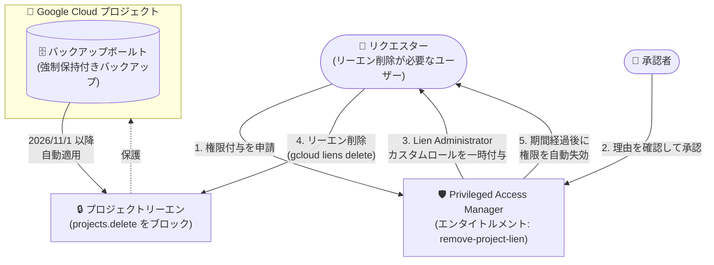

# Backup and DR Service: 強制保持バックアップを含むプロジェクトへのプロジェクトリーエン自動適用と PAM による保護

**リリース日**: 2026-08-17

**サービス**: Backup and DR Service

**機能**: バックアップボールト保護プロジェクトへのプロジェクトリーエン自動適用 + Privileged Access Manager (PAM) による多者承認

**ステータス**: Announcement (2026 年 11 月 1 日より適用開始)

📊 [このアップデートのインフォグラフィックを見る](https://takech9203.github.io/google-cloud-news-summary/20260817-backup-and-dr-project-lien-pam.html)

## 概要

2026 年 11 月 1 日より、Backup and DR Service は、強制保持 (enforced retention) で保護されたバックアップを保持するバックアップボールトを含むプロジェクトに対して、プロジェクトレベルのリーエン (lien) を自動的に適用するようになります。プロジェクトリーエンは、リーエンが削除されるまでプロジェクトの削除を明示的にブロックするガードレールであり、バックアップデータの「不変性 (Immutability)」「削除不可性 (Indelibility)」をプロジェクト削除経路からも担保します。

さらに、このリーエン自体が不正に削除されることを防ぐため、Privileged Access Manager (PAM) を使用した多者承認 (multi-party approval) ワークフローを構成できます。これにより、リーエン削除に必要な権限 (`resourcemanager.projects.updateLiens`) は一時的かつ承認ベースでのみ付与され、単一の管理者アカウントや侵害されたアカウントによるバックアップ破壊のリスクを大幅に低減できます。

本アップデートは、ランサムウェア対策やサイバーレジリエンス強化に取り組む組織、コンプライアンス要件でバックアップの強制保持を利用しているすべての Backup and DR ユーザーに関係します。

**アップデート前の課題**

- バックアップボールトの強制保持期間はバックアップ自体の削除は防げるが、バックアップボールトを含む「プロジェクトごと削除する」という経路への保護はユーザーが手動でリーエンを設定する必要があった
- プロジェクトリーエンを設定しても、レガシー基本ロールのオーナー (`roles/owner`) やプロジェクトリーエン修飾子ロール (`roles/resourcemanager.lienModifier`) を持つプリンシパルは単独でリーエンを削除でき、その後プロジェクトを削除できた
- リーエン削除という高リスク操作に対して、承認ワークフローや一時的権限付与の仕組みが標準では組み込まれていなかった

**アップデート後の改善**

- 2026 年 11 月 1 日以降、強制保持で保護されたバックアップを持つバックアップボールトを含むプロジェクトには、プロジェクトリーエンが自動的に適用される
- PAM の多者承認を構成することで、リーエン削除権限の付与に第二者の明示的な承認を必須化でき、単独のユーザーによるリーエン削除を防止できる
- リーエン削除権限は時間制限付き (just-in-time) で付与され、設定した期間経過後に自動的に取り消される

## アーキテクチャ図



強制保持付きバックアップボールトを含むプロジェクトにはリーエンが自動適用され、リーエンの削除には PAM 経由の申請・承認・一時的権限付与という多者承認フローを経由させることでセキュリティ境界を強化します。

## サービスアップデートの詳細

### 主要機能

1. **プロジェクトリーエンの自動適用 (2026 年 11 月 1 日開始)**
   - 強制保持 (enforced retention) で保護されたバックアップを含むバックアップボールトが存在するプロジェクトに、Backup and DR Service がプロジェクトレベルのリーエンを自動適用する
   - リーエンは `resourcemanager.projects.delete` 権限の行使をブロックし、リーエンが削除されるまでプロジェクトを削除できなくする

2. **PAM による多者承認でのリーエン保護**
   - リーエン削除権限 (`resourcemanager.projects.updateLiens`) を含む「Lien Administrator」カスタムロールを作成し、PAM のエンタイトルメントとして管理する
   - リーエン削除が必要なユーザーは PAM で権限付与を申請し、承認者グループの承認後に一時的にロールが付与される
   - 設定した最大期間 (例: 1 時間) の経過後、ロールは自動的に取り消される

3. **バックアップ構成変更への応用**
   - 同じ多者承認・認可プロセスは、バックアップボールト構成やバックアップ計画設定の変更の管理・制限にも利用できる (公式ドキュメントに明記)

## 技術仕様

### プロジェクトリーエンと PAM の関連要素

| 項目 | 詳細 |
|------|------|
| リーエン自動適用の開始日 | 2026 年 11 月 1 日 |
| 自動適用の対象 | 強制保持付きバックアップを持つバックアップボールトを含むプロジェクト |
| リーエンがブロックする権限 | `resourcemanager.projects.delete` (プロジェクトに対する唯一の有効な restriction) |
| リーエン削除に必要な権限 | `resourcemanager.projects.updateLiens` |
| リーエン削除権限を含む既存ロール | レガシー基本ロールのオーナー (`roles/owner`)、Project Lien Modifier (`roles/resourcemanager.lienModifier`) |
| PAM でのロール指定 | レガシー基本ロール (Owner/Editor/Viewer) は非対応のため、カスタムロールの作成が必要 |
| 強制保持期間の設定範囲 | バックアップボールトあたり 1 日〜99 年 |
| PAM の多層・多者承認 | エンタイトルメントごとに最大 2 レベルの逐次承認、各レベル最大 5 承認 (Preview、Security Command Center Enterprise/Premium ティアが必要) |

### PAM エンタイトルメントの推奨構成 (公式ドキュメントの例)

| 設定項目 | 推奨値 |
|----------|--------|
| Name | `remove-project-lien` |
| Resource | 組織、フォルダ (推奨)、または特定プロジェクト |
| Role | Lien Administrator カスタムロール (`resourcemanager.projects.updateLiens` のみ) |
| Approval required | 有効 (承認者数 1 以上) |
| Max duration | 1 時間 (リーエン削除には通常十分) |
| Justification | 必須 |

## 設定方法

### 前提条件

1. 組織で Privileged Access Manager が有効化されていること
2. IAM 監査・カスタムロール作成のため、Security Admin (`roles/iam.securityAdmin`) または Organization Administrator (`roles/resourcemanager.organizationAdmin`)、および Organization Role Administrator (`roles/iam.organizationRoleAdmin`) を保有していること

### 手順

#### ステップ 1: 権限の制限 (IAM の準備)

レガシー基本ロールのオーナーには `resourcemanager.projects.updateLiens` が含まれるため、ユーザーへのオーナーロール割り当てを監査・排除します。Project Lien Modifier ロールの割り当ても確認します。その上で、`resourcemanager.projects.updateLiens` のみを含む「Lien Administrator」カスタムロールを作成します。

#### ステップ 2: PAM で多者承認エンタイトルメントを構成

Google Cloud コンソールの「IAM と管理 > Privileged Access Manager」で、Lien Administrator ロールを対象としたエンタイトルメント (例: `remove-project-lien`) を作成し、承認必須 (Approval required)、承認者グループ、最大付与期間 (例: 1 時間)、理由の入力必須を設定します。

#### ステップ 3: リーエン削除の実行 (必要時)

リクエスターが PAM で権限付与を申請し、承認者が承認すると、Lien Administrator ロールが一時的に付与されます。その後、次のコマンドでリーエンを削除できます。

```bash
# プロジェクトのリーエン一覧を確認
gcloud alpha resource-manager liens list

# リーエンを削除 (LIEN_NAME は削除対象のリーエン名)
gcloud alpha resource-manager liens delete LIEN_NAME
```

設定した期間の経過後、Lien Administrator ロールは自動的に取り消されます。

## メリット

### ビジネス面

- **ランサムウェア・内部脅威への耐性強化**: バックアップデータの最後の砦であるバックアップボールトを、プロジェクト削除という攻撃経路からも自動的に保護できる
- **コンプライアンス対応**: 強制保持と組み合わせることで、規制要件で求められるバックアップ保持を、単一管理者の操作では覆せない形で担保できる
- **職務分離 (Separation of Duties) の実現**: リーエン削除という高リスク操作に申請者と承認者の分離を強制できる

### 技術面

- **自動適用による設定漏れ防止**: ユーザーが手動でリーエンを設定しなくても、強制保持付きボールトを含むプロジェクトには自動でリーエンが適用される
- **Just-in-Time 権限付与**: リーエン削除権限は必要なときだけ一時的に付与され、期間経過後に自動失効するため、恒常的な広い権限を排除できる
- **監査性**: PAM のエンタイトルメント作成・付与申請・承認などのイベントは Cloud Audit Logs に記録される

## デメリット・制約事項

### 制限事項

- PAM はレガシー基本ロール (Owner、Editor、Viewer) をサポートしないため、カスタムロールの作成が必須
- PAM の多層 (2 レベル) 承認は Preview 機能であり、Security Command Center の Enterprise または Premium ティアが必要 (単一レベルの多者承認は基本機能で構成可能)
- `gcloud alpha resource-manager liens` コマンドは Alpha 版であり、予告なく変更される可能性がある
- プロジェクトリーエン機能自体は Preview (Pre-GA) 段階

### 考慮すべき点

- 2026 年 11 月 1 日以降は自動的にリーエンが適用されるため、強制保持付きバックアップボールトを含むプロジェクトの削除・廃止プロセスを事前に見直す必要がある
- リーエンが適用されても、レガシーオーナーロールなどリーエン削除権限を持つプリンシパルが残っていれば保護は不完全なため、IAM の監査 (オーナーロールの割り当て排除) が実効性の鍵となる
- PAM の承認が得られない場合、付与申請は 24 時間で期限切れになる (未スケジュールのグラントの場合)

## ユースケース

### ユースケース 1: ランサムウェア対策としての集中バックアップハブの保護

**シナリオ**: 中央バックアップハブプロジェクトにバックアップボールトを集約し、本番プロジェクト (スポーク) から強制保持付きでバックアップしている組織。攻撃者が管理者アカウントを侵害してもバックアップを破壊できないようにしたい。

**実装例**:
```bash
# 1. Lien Administrator カスタムロールを作成 (updateLiens 権限のみ)
gcloud iam roles create lien_administrator \
  --organization=ORG_ID \
  --title="Lien Administrator" \
  --permissions=resourcemanager.projects.updateLiens

# 2. PAM でエンタイトルメント remove-project-lien を作成
#    (承認必須、最大付与期間 1 時間、理由必須)
```

**効果**: バックアップボールトの強制保持 (バックアップ削除防止) + 自動リーエン (プロジェクト削除防止) + PAM 多者承認 (リーエン削除防止) の三層防御が完成し、単一アカウントの侵害ではバックアップを破壊できなくなる。

### ユースケース 2: プロジェクト廃止時の統制されたリーエン削除

**シナリオ**: 保持期間を満了したバックアップボールトを含むプロジェクトを正式に廃止したい。ただし削除操作は複数人の確認を経て実施したい。

**効果**: リクエスターが PAM で理由を添えて申請し、チームリーダーが承認した後にのみ一時的なリーエン削除権限が付与されるため、統制の取れたプロジェクト廃止フローを実現できる。権限は期間経過後に自動失効する。

## 料金

プロジェクトリーエンの適用自体に追加料金は発生しません。なお、強制保持期間中のバックアップはボールト内で保持され続けるため、その期間のストレージ料金が発生する点に注意してください。Backup and DR Service の料金詳細は [料金ページ](https://cloud.google.com/backup-disaster-recovery/pricing) を参照してください。

## 関連サービス・機能

- **Privileged Access Manager (PAM)**: Just-in-Time の一時的権限昇格と多者承認ワークフローを提供。本アップデートでリーエン削除権限の保護に利用
- **Resource Manager (プロジェクトリーエン)**: プロジェクト削除をブロックするガードレール機能。Backup and DR が自動適用するリーエンの基盤
- **IAM (カスタムロール)**: PAM はレガシー基本ロール非対応のため、`resourcemanager.projects.updateLiens` のみを持つカスタムロールを作成して利用
- **Security Command Center**: PAM の多層 (2 レベル) 承認機能の利用に Enterprise/Premium ティアが必要。バックアップに対する脅威検知アラートとの統合も可能
- **Cloud Audit Logs**: PAM のエンタイトルメント・グラント関連イベントを記録し、監査証跡を提供
- **VPC Service Controls**: バックアッププロジェクトの周囲にサービス境界を定義し、データ漏えいを防止する補完的なガードレール

## 参考リンク

- 📊 [インフォグラフィック](https://takech9203.github.io/google-cloud-news-summary/20260817-backup-and-dr-project-lien-pam.html)
- [公式リリースノート](https://docs.cloud.google.com/release-notes#August_17_2026)
- [Protect project liens by using Privileged Access Manager](https://docs.cloud.google.com/backup-disaster-recovery/docs/configuration/project-liens-multi-party-approval)
- [Protect projects with liens](https://docs.cloud.google.com/resource-manager/docs/project-liens)
- [Privileged Access Manager overview](https://docs.cloud.google.com/iam/docs/pam-overview)
- [Backup vault の概要](https://docs.cloud.google.com/backup-disaster-recovery/docs/concepts/backup-vault)
- [料金ページ](https://cloud.google.com/backup-disaster-recovery/pricing)

## まとめ

本アナウンスにより、強制保持付きバックアップボールトの保護が「バックアップ削除の防止」から「プロジェクト削除の防止」まで自動的に拡張され、PAM の多者承認と組み合わせることでリーエン自体の不正削除も防げるようになります。強制保持を利用している組織は、2026 年 11 月 1 日の自動適用開始までに、レガシーオーナーロールの割り当て監査と PAM エンタイトルメントの構成を進めることを推奨します。

---

**タグ**: #BackupAndDR #PrivilegedAccessManager #ProjectLien #Security #Ransomware #IAM #MultiPartyApproval
