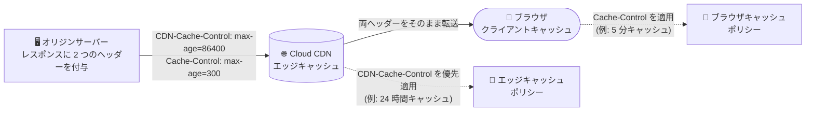

# Cloud CDN: ターゲット型 CDN-Cache-Control HTTP レスポンスヘッダー (RFC 9213) のサポート

**リリース日**: 2026-08-17

**サービス**: Cloud CDN

**機能**: ターゲット型 CDN-Cache-Control レスポンスヘッダー (RFC 9213) のサポート

**ステータス**: GA (一般提供)

📊 [このアップデートのインフォグラフィックを見る](https://takech9203.github.io/google-cloud-news-summary/20260817-cloud-cdn-cdn-cache-control-header.html)

## 概要

Cloud CDN が、RFC 9213 で標準化されたターゲット型キャッシュ制御ヘッダー `CDN-Cache-Control` をサポートしました。オリジンサーバーがレスポンスにこのヘッダーを含めることで、ブラウザなどのクライアント側キャッシュに影響を与えることなく、Cloud CDN のエッジキャッシュに対してのみキャッシュディレクティブを指定できます。

従来の `Cache-Control` ヘッダーは、CDN・プロキシ・ブラウザといったすべてのキャッシュレイヤーに同じ指示を与える「ユニバーサル」なヘッダーでした。今回のアップデートにより、「エッジでは長時間キャッシュし、ブラウザでは短時間だけキャッシュする」といったレイヤーごとに異なるキャッシュ戦略を、標準準拠の方法で宣言的に実現できます。これは CDN 業界全体で採用が進むターゲット型キャッシュ制御 (Targeted Cache-Control) の標準に Cloud CDN が対応したもので、マルチ CDN 構成やオリジンのポータビリティを重視するユーザーにも有益です。

**アップデート前の課題**

- `Cache-Control` ヘッダーは CDN とブラウザの両方に適用されるため、エッジキャッシュとブラウザキャッシュで異なる TTL やディレクティブを個別に指定する標準的な方法がなかった
- エッジのみ長い TTL を設定したい場合、`s-maxage` (共有キャッシュ向け) と `max-age` (ブラウザ向け) の組み合わせで近似するしかなく、CDN 専用のきめ細かい制御 (例: CDN のみ `no-store`) は表現が困難だった
- CDN 固有のキャッシュ動作を変えるには、バックエンドのキャッシュモードや TTL オーバーライドなどインフラ側の設定変更が必要になるケースがあった

**アップデート後の改善**

- オリジンのレスポンスヘッダーに `CDN-Cache-Control` を追加するだけで、Cloud CDN エッジキャッシュ専用のキャッシュディレクティブを指定できるようになった
- ブラウザ向けの `Cache-Control` と CDN 向けの `CDN-Cache-Control` を併記し、レイヤーごとに独立したキャッシュポリシーを宣言できるようになった
- RFC 9213 準拠の業界標準ヘッダーであるため、他の CDN と共通のオリジン実装を使い回しやすくなった

## アーキテクチャ図



オリジンが `CDN-Cache-Control` と `Cache-Control` を併記すると、Cloud CDN エッジは `CDN-Cache-Control` を優先的に使用してキャッシュ動作を決定し、両ヘッダーはそのままクライアントに転送されるため、ブラウザは従来どおり `Cache-Control` に従います。

## サービスアップデートの詳細

### 主要機能

1. **ターゲット型キャッシュ制御 (RFC 9213) のサポート**
   - オリジンレスポンスの `CDN-Cache-Control` ヘッダーで、Cloud CDN エッジキャッシュ専用のキャッシュディレクティブを指定可能
   - ブラウザなどの下流キャッシュの動作には影響しない (下流は引き続き `Cache-Control` に従う)

2. **明確なヘッダー優先順位 (Cache control header precedence)**
   - Cloud CDN はレスポンス評価時に厳格な優先順位で 1 つのヘッダーを選択する
   - `CDN-Cache-Control` が存在する場合、そのディレクティブのみを排他的に使用し、標準の `Cache-Control` は無視される
   - `CDN-Cache-Control` が存在しない場合のみ、従来どおり `Cache-Control` を使用する

3. **下流へのヘッダー転送**
   - `CDN-Cache-Control` ヘッダーは削除されず、そのままクライアントへ転送 (preserve & forward) される

4. **サードパーティ CDN 向けヘッダーの無視**
   - 特定の他社 CDN を対象としたターゲット型キャッシュ制御ヘッダーは Cloud CDN では無視され、この優先順位ロジックの対象外となる

## 技術仕様

### ヘッダー評価の優先順位

| 優先度 | ヘッダー | Cloud CDN の動作 |
|--------|----------|------------------|
| 1 (最高) | `CDN-Cache-Control` | 存在する場合、このディレクティブを排他的に使用。下位の標準ヘッダーは無視。クライアントにはそのまま転送 |
| 2 | `Cache-Control` | `CDN-Cache-Control` がレスポンスに存在しない場合のみ使用 |
| 3 | `Expires` | `Cache-Control` が存在する場合は無視 (従来からの動作) |

### 構文とフォールバックに関する制限

- **構造的フォールバックは非サポート**: レスポンスに `CDN-Cache-Control` が存在する場合、Cloud CDN はそのヘッダーの使用にコミットする
- ヘッダーに構文エラー、パースの問題、無効な値 (例: 数値でない `max-age`) が含まれていても、標準の `Cache-Control` へフォールバックしない。その場合、レスポンスはキャッシュ不可として扱われる可能性がある
- ヘッダーは RFC 9213 が定める Dictionary 構造化フィールド (Structured Fields) の要件に厳密に準拠させる必要がある

### レスポンスヘッダーの記述例

```http
HTTP/1.1 200 OK
Content-Type: image/png
CDN-Cache-Control: max-age=86400
Cache-Control: max-age=300
```

この例では、Cloud CDN エッジは 24 時間 (86,400 秒) キャッシュし、ブラウザは 5 分 (300 秒) だけキャッシュします。

## 設定方法

### 前提条件

1. 外部アプリケーション ロードバランサのバックエンドで Cloud CDN が有効化されていること
2. オリジン (バックエンド) のレスポンスヘッダーを制御できること (Web サーバー設定やアプリケーションコード)
3. キャッシュモードがオリジンヘッダーを尊重する設定であること (`USE_ORIGIN_HEADERS` または `CACHE_ALL_STATIC`。`FORCE_CACHE_ALL` はオリジンのキャッシュディレクティブを上書きする)

### 手順

#### ステップ 1: オリジンで CDN-Cache-Control ヘッダーを付与する

```nginx
# NGINX の例: エッジは 1 日、ブラウザは 5 分キャッシュ
location /static/ {
    add_header CDN-Cache-Control "max-age=86400";
    add_header Cache-Control "max-age=300";
}
```

オリジンの Web サーバーまたはアプリケーションで、CDN 向けとブラウザ向けのヘッダーを併記します。

#### ステップ 2: ヘッダーが正しく機能しているか確認する

```bash
# レスポンスヘッダーの確認 (両ヘッダーがクライアントまで転送される)
curl -sI "https://example.com/static/logo.png" | grep -i -e "cdn-cache-control" -e "cache-control" -e "age"
```

`Age` ヘッダーや Cloud CDN のログ (`cacheHit` フィールドなど) で、エッジキャッシュが意図した TTL で動作しているかを確認します。

## メリット

### ビジネス面

- **キャッシュヒット率の向上によるコスト最適化**: ブラウザ側の鮮度要件を犠牲にすることなくエッジ TTL を長く設定でき、オリジンへのトラフィック (キャッシュフィル) とオリジン負荷を削減できる
- **マルチ CDN・移行のしやすさ**: RFC 9213 は業界標準のため、標準に対応した他の CDN と共通のオリジン実装を利用でき、ベンダーロックインを低減できる

### 技術面

- **キャッシュレイヤーごとの独立した制御**: エッジは長期キャッシュ + 即時パージ運用、ブラウザは短期キャッシュ、といったレイヤー別戦略を宣言的に実現できる
- **アプリケーション主導のキャッシュ制御**: ロードバランサやバックエンド設定を変更せず、オリジンのレスポンスヘッダーだけで CDN の挙動を制御できる

## デメリット・制約事項

### 制限事項

- `CDN-Cache-Control` が存在すると標準の `Cache-Control` は CDN 側で完全に無視されるため、CDN に適用したいディレクティブはすべて `CDN-Cache-Control` 側に記述する必要がある
- 構文エラーや無効な値がある場合、`Cache-Control` へのフォールバックは行われず、レスポンスがキャッシュ不可として扱われる可能性がある (RFC 9213 の構造化フィールド構文への厳密な準拠が必須)
- 他社 CDN 向けのターゲット型ヘッダーは Cloud CDN では無視される

### 考慮すべき点

- `FORCE_CACHE_ALL` キャッシュモードではオリジンのキャッシュディレクティブが上書きされるため、本ヘッダーによる制御を活かすには `USE_ORIGIN_HEADERS` または `CACHE_ALL_STATIC` の利用を検討する
- `CDN-Cache-Control` はクライアントにも転送されるため、ヘッダーの内容 (キャッシュ戦略) が外部から観測できる点に留意する
- 既存のレスポンスに `CDN-Cache-Control` を追加すると、その時点から Cloud CDN のキャッシュ動作が変わるため、TTL 設計を確認のうえ段階的に導入する

## ユースケース

### ユースケース 1: 静的アセットのエッジ長期キャッシュとブラウザ短期キャッシュの両立

**シナリオ**: 頻繁にデプロイする Web サイトで、CDN エッジでは高いヒット率を維持しつつ、ユーザーのブラウザには古いアセットが長く残らないようにしたい。

**実装例**:
```http
CDN-Cache-Control: max-age=604800
Cache-Control: max-age=600
```

**効果**: エッジでは 7 日間キャッシュしてオリジン負荷とレイテンシを削減しつつ、ブラウザは 10 分でキャッシュを再検証するため、デプロイ後 (必要ならキャッシュ無効化と併用) の反映が速い。

### ユースケース 2: API レスポンスをエッジのみでキャッシュ

**シナリオ**: 全ユーザーに共通の API レスポンス (例: 商品カタログ) をエッジで短時間キャッシュしてオリジンを保護したいが、クライアント側にはキャッシュさせず常に最新を取得させたい。

**実装例**:
```http
CDN-Cache-Control: max-age=60
Cache-Control: no-store
```

**効果**: Cloud CDN エッジは 60 秒間レスポンスをキャッシュしてオリジンへのリクエストを集約し、ブラウザやアプリは `no-store` に従いローカルにキャッシュしない。

## 料金

このアップデートによる追加料金はありません。Cloud CDN の利用には、通常どおりキャッシュエグレス、キャッシュフィル、キャッシュルックアップ リクエストなどに対する料金が適用されます。詳細は [Cloud CDN の料金ページ](https://cloud.google.com/cdn/pricing) を参照してください。

## 関連サービス・機能

- **Cloud Load Balancing (外部アプリケーション ロードバランサ)**: Cloud CDN は外部アプリケーション ロードバランサのバックエンドに対して有効化して利用する
- **キャッシュモード (`USE_ORIGIN_HEADERS` / `CACHE_ALL_STATIC` / `FORCE_CACHE_ALL`)**: オリジンヘッダーをどこまで尊重するかを決める設定で、本ヘッダーの効果に直接影響する
- **TTL 設定とオーバーライド**: `default_ttl` / `max_ttl` / `client_ttl` などインフラ側の TTL 制御と組み合わせて利用できる
- **Cloud Storage**: バックエンドバケットのオブジェクトメタデータでキャッシュ制御を設定するオリジンとして利用されることが多い
- **Media CDN**: 大規模メディア配信向けの CDN サービス。ターゲット型キャッシュ制御はエッジキャッシュ戦略の設計で共通する考え方となる

## 参考リンク

- 📊 [インフォグラフィック](https://takech9203.github.io/google-cloud-news-summary/20260817-cloud-cdn-cdn-cache-control-header.html)
- [公式リリースノート](https://docs.cloud.google.com/release-notes#August_17_2026)
- [Cloud CDN キャッシュの概要 (Cache control header precedence)](https://docs.cloud.google.com/cdn/docs/caching)
- [RFC 9213: Targeted HTTP Cache Control](https://www.rfc-editor.org/rfc/rfc9213)
- [Cloud CDN 料金ページ](https://cloud.google.com/cdn/pricing)

## まとめ

Cloud CDN が RFC 9213 準拠の `CDN-Cache-Control` ヘッダーに対応したことで、エッジキャッシュとブラウザキャッシュを独立して制御する業界標準の方法が利用可能になりました。エッジのヒット率向上とクライアント側の鮮度要件を両立したいワークロードでは、オリジンのレスポンスヘッダーへの追加を検討してください。導入時は、ヘッダーが存在すると `Cache-Control` が CDN 側で無視される点と、構文エラー時にフォールバックしない点に注意が必要です。

---

**タグ**: Cloud CDN, CDN-Cache-Control, RFC 9213, キャッシュ制御, HTTP ヘッダー, ネットワーキング, Cloud Load Balancing
