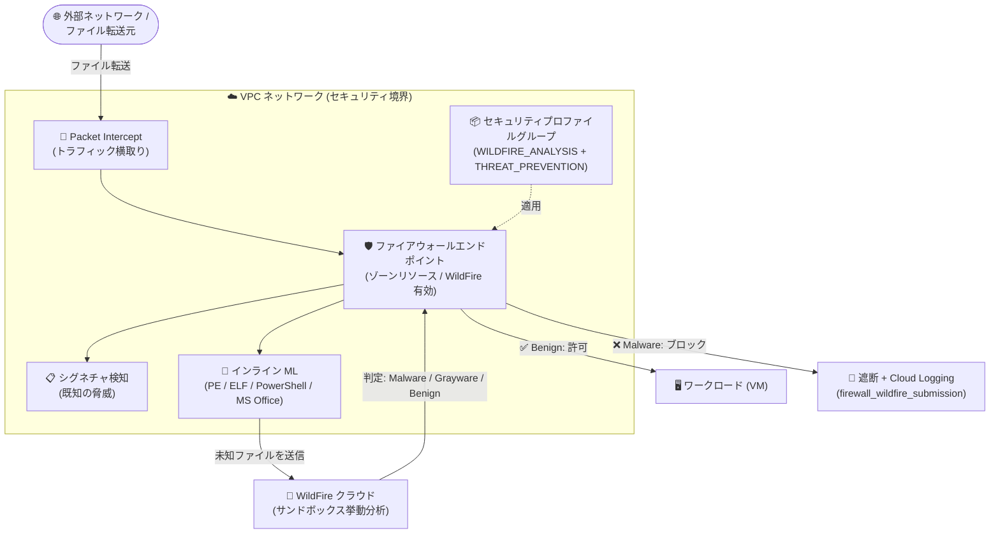

# Cloud NGFW: Advanced malware sandbox (WildFire) サービスのサポート復活 (Preview)

**リリース日**: 2026-08-17

**サービス**: Cloud NGFW (Cloud Next Generation Firewall)

**機能**: Advanced malware sandbox (WildFire) サービス

**ステータス**: Preview

📊 [このアップデートのインフォグラフィックを見る](https://takech9203.github.io/google-cloud-news-summary/20260817-cloud-ngfw-advanced-malware-sandbox-wildfire.html)

## 概要

Cloud NGFW の Advanced malware sandbox (WildFire) サービスのサポートが復活し、再び Preview として利用可能になった。WildFire は Palo Alto Networks の Advanced WildFire を基盤とするマルウェア防御サービスで、高度なマルウェアサンドボックスとリアルタイム機械学習 (ML) を統合し、ネットワーク経由のファイル転送をディープインスペクションすることで、ゼロデイマルウェアがワークロードに到達する前にブロックできる。Cloud NGFW Enterprise ティアで提供される。

WildFire は 2026 年 7 月 20 日に一度 Preview として発表されたが、既存のファイアウォールエンドポイントで WildFire を有効化すると一時的なデータプレーン障害が発生する可能性がある問題が判明し、7 月 27 日に一時的に削除されていた。今回のアップデートにより機能が再提供され、未知・新種のマルウェアやファイルベースの脅威からネットワークを保護する評価・検証を再開できる。

対象ユーザーは、Cloud NGFW Enterprise で IDS/IPS や URL フィルタリングを利用している、あるいはシグネチャベースの検知だけではカバーできないゼロデイマルウェア対策を求めるセキュリティチーム・ネットワーク管理者である。

**アップデート前の課題**

- 従来の Cloud NGFW Enterprise の脅威防御 (IDS/IPS、アンチウイルス) はシグネチャベースの検知が中心であり、既知の脅威シグネチャに一致しない未知・新種 (ゼロデイ) のマルウェアやファイルベースの脅威を検出できない場合があった
- 7 月 20 日に WildFire が Preview として提供されたものの、既存のファイアウォールエンドポイントでの有効化が一時的なデータプレーン障害を引き起こす可能性があるため、7 月 27 日に機能が一時削除され、利用できない状態が続いていた

**アップデート後の改善**

- WildFire サービスのサポートが復活し、ネットワーク経由のファイル転送に対するディープインスペクションを再び構成できるようになった
- ファイアウォールのデータプレーン内で動作するインライン ML と、WildFire クラウドでの挙動分析 (サンドボックス) により、シグネチャに存在しないゼロデイマルウェアをワークロード到達前にブロックできる
- 検体の分析結果 (Malware / Grayware / Benign の判定) やサンドボックスの詳細な挙動レポートを取得でき、SOC のフォレンジック分析に活用できる

## アーキテクチャ図



ファイアウォールエンドポイントが VPC 内のファイル転送を横取りし、シグネチャ検知・インライン ML・WildFire クラウドのサンドボックス分析を組み合わせて、ゼロデイマルウェアをワークロード到達前にブロックする。

## サービスアップデートの詳細

### 主要機能

1. **インライン ML によるリアルタイム検知**
   - ファイアウォールのデータプレーン内で ML モデルが直接動作し、ゼロデイや高度な脅威をリアルタイムに検出する
   - Windows 実行ファイル (PE)、ELF、PowerShell スクリプト、MS Office ドキュメントなどのファイルタイプに対応

2. **インラインクラウド分析 (リアルタイムシグネチャルックアップ)**
   - セキュリティプロファイルで有効化すると、ファイル転送を一時的に保留し、WildFire リアルタイムシグネチャクラウドに照会してからファイルをネットワークに通す
   - 既知の悪性ファイルをワークロード到達前に確実にブロックできる

3. **クラウドサンドボックスによる挙動分析**
   - 判定が「不明」のファイルは抽出され、隔離されたコンテナ環境にアップロードされて実際に実行され、その挙動が監査される
   - 判定は Malware / Grayware / Benign の 3 種類
   - 分析後は詳細な挙動レポートとオリジナルの検体を取得でき、SOC のフォレンジックに活用できる

4. **判定に基づくアクションとロギング**
   - 判定に応じて Deny (ブロック)、Alert (記録)、Allow (許可) のアクションを実行する
   - イベントは `firewall_wildfire_submission` ログとして Cloud Logging に記録され、サブミッションダッシュボードで確認できる
   - `gcloud` では WildFire シグネチャ ID 単位やプロトコル (HTTP、HTTP2、FTP、SMTP、SMB、POP3、IMAP) 単位でアクションのオーバーライドを設定できる

## 技術仕様

### 対応ファイルタイプとサイズ上限

| カテゴリ | 拡張子の例 | 最大サイズ |
|------|------|------|
| PE 実行ファイル | .dll, .exe, .exe64 | 16 MB (インラインクラウド分析時は 10 MB) |
| Linux 実行ファイル | .a, .dex, .elf, .ko, .o, .so | 50 MB |
| MS Office ドキュメント | .doc(x), .xls(x), .ppt(x), .docm など | 16 MB |
| PDF | .pdf | 3 MB |
| アーカイブ | .rar, .zip, .7z, .zbundle | 50 MB |
| APK | .apk | 10 MB |
| JAR | .jar | 5 MB |
| スクリプト / Web | .elink, .hta, .pl, .sh | 20 KB |

### 必要なコンポーネント

| コンポーネント | 役割 |
|------|------|
| WildFire セキュリティプロファイル (`WILDFIRE_ANALYSIS`) | 送信対象のファイルタイプとトラフィック方向 (アップロード / ダウンロード) を定義 |
| 脅威防御プロファイル (`THREAT_PREVENTION`) | WildFire プロファイルをグループに含める場合に必須 |
| セキュリティプロファイルグループ | 上記プロファイルのコンテナ。ファイアウォールポリシールールから参照 |
| ファイアウォールエンドポイント | ゾーン単位の Google 管理リソース。「Enable Advanced malware sandbox (WildFire)」オプションの有効化が必要 |
| ファイアウォールポリシールール | `apply_security_profile_group` アクションで検査対象トラフィックをエンドポイントにリダイレクト |

### MTU に関する制約

| 構成 | パケットサイズ上限 |
|------|------|
| ジャンボフレーム対応エンドポイント | 8,500 バイト |
| ジャンボフレーム非対応エンドポイント | 1,460 バイト |

エンドポイントの上限を超える MTU が設定された VPC では、サンドボックス分析が実行されないため、VPC の MTU 設定に注意が必要である。

## 設定方法

### 前提条件

1. VPC ネットワーク、サブネット、VM インスタンスが構成済みであること
2. 課金プロジェクトで WildFire の EULA に同意すること (ファイアウォールエンドポイントの作成・更新時に実施)
3. TLS インスペクションを併用する場合は、リージョン CA プールとルート CA が必要
4. 必要な IAM ロール: `roles/networksecurity.securityProfileAdmin` (プロファイル管理)、`roles/compute.networkAdmin` または `roles/networksecurity.firewallEndpointAdmin` (エンドポイント管理)、`roles/compute.securityAdmin` (グローバルネットワークファイアウォールポリシー管理) など

### 手順

#### ステップ 1: WildFire セキュリティプロファイルの作成

```bash
gcloud beta network-security security-profiles wildfire-analysis create my-wildfire-profile \
    --organization=ORGANIZATION_ID \
    --location=global \
    --description="WildFire Analysis Security Profile"
```

`WILDFIRE_ANALYSIS` タイプのプロファイルを作成し、送信対象のファイルタイプ (`--analyze-windows-executables`、`--analyze-elf`、`--analyze-ms-office` など) やリアルタイムルックアップ (`--wildfire-realtime-lookup`) を設定する。

#### ステップ 2: セキュリティプロファイルグループの構成

`THREAT_PREVENTION` プロファイルを作成し (WildFire プロファイルと同居必須)、両プロファイルを含むセキュリティプロファイルグループを作成する。

#### ステップ 3: ファイアウォールエンドポイントの作成と関連付け

エンドポイント作成時に Advanced configuration の「Enable Advanced malware sandbox (WildFire)」を有効化し、検査対象ワークロードと同じゾーンで VPC ネットワークに関連付ける。

#### ステップ 4: ファイアウォールポリシールールの追加

グローバルまたは階層型ファイアウォールポリシーに `apply_security_profile_group` アクションのルールを追加し、対象トラフィックを検査に送る。セキュアタグで特定の VM ワークロードに絞り込むこともできる。

## メリット

### ビジネス面

- **ゼロデイ攻撃リスクの低減**: シグネチャ未登録の新種マルウェアをワークロード到達前にブロックでき、インシデント対応コストと事業影響を抑制できる
- **マネージドサービスとしての運用負荷軽減**: サンドボックス基盤は Palo Alto Networks が運用する SaaS (Google Cloud 上でホスト) であり、自前でサンドボックス環境を構築・運用する必要がない

### 技術面

- **多層防御**: シグネチャ検知、インライン ML、クラウドサンドボックスの 3 層でファイルベースの脅威を検査できる
- **既存の Cloud NGFW Enterprise 構成との統合**: 既存のセキュリティプロファイルグループに WildFire プロファイルを追加し、エンドポイントの設定を更新するだけで導入できる
- **フォレンジック対応**: サンドボックスの挙動レポートと検体を取得でき、Cloud Logging の `firewall_wildfire_submission` ログで検出イベントを一元管理できる

## デメリット・制約事項

### 制限事項

- Preview 段階の機能であり、Pre-GA Offerings Terms が適用される (サポートが限定される場合がある)
- WildFire プロファイルをセキュリティプロファイルグループに含める場合、脅威防御 (`THREAT_PREVENTION`) プロファイルが必須
- ファイルタイプごとにサイズ上限があり、上限を超えるファイルは分析対象外 (PE ファイルはインラインクラウド分析時 10 MB に制限)
- エンドポイントの MTU 上限 (ジャンボフレーム対応: 8,500 バイト、非対応: 1,460 バイト) を超える MTU の VPC ではサンドボックス分析が実行されない
- ファイアウォールエンドポイントが接続されていないゾーンの VM は Layer 7 検査の対象外となり、宛先 `0.0.0.0/0` のルールに一致するトラフィックはそのまま許可される

### 考慮すべき点

- 7 月 27 日の一時削除の原因は「既存エンドポイントでの WildFire 有効化による一時的なデータプレーン障害」であったため、本番環境の既存エンドポイントで有効化する際は、メンテナンスウィンドウでの実施や検証環境での事前確認を推奨する
- インラインクラウド分析を有効にするとファイル転送が一時保留されるため、レイテンシへの影響を評価する必要がある
- WildFire のサービスリージョンは Google Cloud の標準リージョンとは対応しておらず、トラフィックはリソースの場所に関係なく Palo Alto Networks のサービスゾーンにルーティングされる。データレジデンシー要件がある場合はエンドポイントで送信先リージョンを明示的に指定する
- 暗号化されたトラフィック内のファイルを検査するには TLS インスペクションの構成 (CA プール、TLS インスペクションポリシー) が別途必要

## ユースケース

### ユースケース 1: インターネットからのファイルダウンロード経路のゼロデイマルウェア対策

**シナリオ**: VPC 内の VM がインターネットからソフトウェアパッケージやドキュメントをダウンロードする環境で、シグネチャに存在しない新種マルウェアの侵入を防ぎたい。

**実装例**:
```
1. WILDFIRE_ANALYSIS プロファイルでダウンロード方向 + PE/ELF/MS Office/PDF を分析対象に設定
2. THREAT_PREVENTION プロファイルとともにセキュリティプロファイルグループを構成
3. WildFire を有効化したファイアウォールエンドポイントをワークロードのゾーンに配置
4. グローバルネットワークファイアウォールポリシーで apply_security_profile_group ルールを適用
```

**効果**: 未知の悪性ファイルがワークロードに到達する前にインライン ML とサンドボックス分析でブロックされ、ゼロデイマルウェア感染のリスクを低減できる。

### ユースケース 2: SOC によるマルウェア検体のフォレンジック分析

**シナリオ**: セキュリティ運用チームが、ネットワークで検出されたマルウェアの挙動を詳細に分析し、影響範囲の特定や IOC (侵害指標) の抽出を行いたい。

**効果**: WildFire のサンドボックスが生成する詳細な挙動レポートとオリジナル検体を取得でき、Cloud Logging の `firewall_wildfire_submission` ログとあわせてインシデントレスポンスの初動を迅速化できる。

## 料金

WildFire は Cloud NGFW Enterprise ティアの機能として提供される。WildFire 固有の料金は今回確認できなかったため、最新の料金体系は公式の料金ページを参照のこと。

- [Cloud NGFW 料金ページ](https://cloud.google.com/firewall/pricing)

## 利用可能リージョン

WildFire のサービスリージョンは Google Cloud の標準リージョンとは独立しており、以下の国・地域のサービスゾーンがサポートされる: オーストラリア、カナダ、フランス、ドイツ、インド、インドネシア、イスラエル、日本、ポーランド、カタール、サウジアラビア、シンガポール、韓国、スペイン、スイス、台湾、英国、米国。

エンドポイントでリージョンを指定しない場合、トラフィックは最寄りのサービスゾーンに自動的にマッピングされる。

## 関連サービス・機能

- **Cloud NGFW 侵入検知・防御サービス (IDS/IPS)**: WildFire と同じファイアウォールエンドポイントで動作するシグネチャベースの脅威防御。WildFire プロファイルの利用には `THREAT_PREVENTION` プロファイルが必須
- **TLS インスペクション**: 暗号化トラフィック内のファイル転送を WildFire で検査するために必要。CA プール (Certificate Authority Service) と TLS インスペクションポリシーを構成する
- **Cloud Logging**: WildFire の検出・送信イベント (`firewall_wildfire_submission`) を記録し、ダッシュボードで可視化
- **セキュアタグ**: ファイアウォールポリシールールで検査対象の VM ワークロードを細かく制御するために使用

## 参考リンク

- 📊 [インフォグラフィック](https://takech9203.github.io/google-cloud-news-summary/20260817-cloud-ngfw-advanced-malware-sandbox-wildfire.html)
- [公式リリースノート](https://docs.cloud.google.com/release-notes#August_17_2026)
- [WildFire overview](https://docs.cloud.google.com/firewall/docs/about-wildfire)
- [Configure WildFire in your network](https://docs.cloud.google.com/firewall/docs/configure-wildfire)
- [Cloud NGFW Release Notes](https://docs.cloud.google.com/firewall/docs/release-notes)
- [料金ページ](https://cloud.google.com/firewall/pricing)

## まとめ

7 月末に一時削除されていた WildFire サービスが復活し、Cloud NGFW Enterprise でゼロデイマルウェア対策の評価を再開できるようになった。シグネチャベースの IDS/IPS を補完するインライン ML とクラウドサンドボックスによる多層防御は、ファイルベースの脅威対策を強化したい組織にとって有力な選択肢である。Preview 段階であるため、まずは検証環境で既存エンドポイントへの有効化手順とレイテンシ影響を確認したうえで、本番導入を計画することを推奨する。

---

**タグ**: Cloud NGFW, WildFire, マルウェア対策, サンドボックス, ゼロデイ, ネットワークセキュリティ, Palo Alto Networks, Preview
