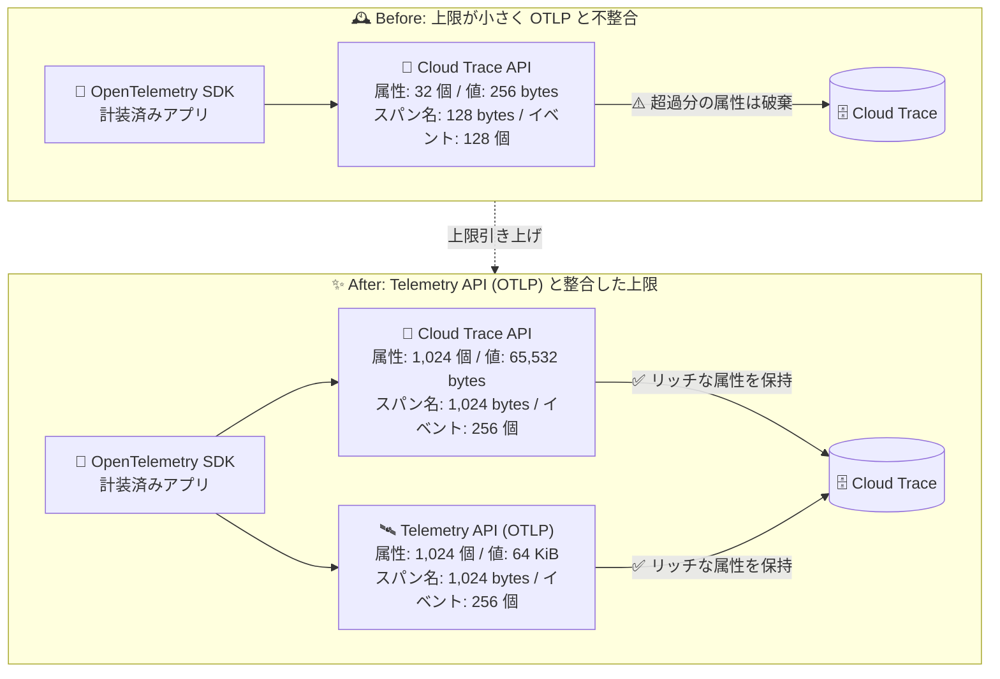

# Cloud Trace: Cloud Trace API の上限引き上げ (OTLP 準拠の Telemetry API と整合)

**リリース日**: 2026-08-17

**サービス**: Cloud Trace

**機能**: Cloud Trace API の各種上限引き上げ

**ステータス**: Feature

📊 [このアップデートのインフォグラフィックを見る](https://takech9203.github.io/google-cloud-news-summary/20260817-cloud-trace-api-limits-increase.html)

## 概要

Cloud Trace API (`cloudtrace.googleapis.com`) に関連する複数の上限が大幅に引き上げられました。スパンあたりの最大属性数が 1,024 個、属性値の最大サイズが 65,532 bytes、属性キーの最大サイズが 512 bytes、スパン名の最大長が 1,024 bytes、スパンあたりの最大イベント数が 256 個となります。

今回の新しい上限は、OpenTelemetry Protocol (OTLP) を実装する Telemetry API がサポートする上限と整合するように設定されています。これにより、Cloud Trace API と Telemetry API のどちらの取り込み経路を使用しても、スパンに付与できるメタデータの量に実質的な差がなくなり、OpenTelemetry SDK で計装されたアプリケーションのトレースデータを情報の欠落なく Cloud Trace に送信しやすくなります。

分散トレーシングを活用してマイクロサービスやサーバーレスアプリケーションの可観測性を高めているユーザー、特にリッチな属性 (HTTP ヘッダー、SQL ステートメント、カスタムビジネスコンテキストなど) をスパンに付与しているユーザーにとって重要なアップデートです。

**アップデート前の課題**

従来の Cloud Trace API では、スパンに付与できるメタデータに厳しい上限がありました。

- スパンあたりの属性数は最大 32 個に制限されており、上限を超えた場合は非決定的なアルゴリズムで 32 個が選択され、残りの属性は破棄されていた
- 属性値の最大サイズは 256 bytes、属性キーの最大サイズは 128 bytes に制限され、長い URL や SQL ステートメントなどの情報が切り捨てられる可能性があった
- スパン名の最大長は 128 bytes、スパンあたりのイベント数は最大 128 個に制限されていた
- OTLP を実装する Telemetry API (属性 1,024 個、属性値 64 KiB など) と上限が大きく異なり、取り込み経路によってデータの保持内容に差が生じていた

**アップデート後の改善**

- スパンあたりの最大属性数が 32 個から 1,024 個へ大幅に増加し、OpenTelemetry のセマンティック規約に沿った多数の属性をそのまま保持できるようになった
- 属性値の最大サイズが 256 bytes から 65,532 bytes へ、属性キーの最大サイズが 128 bytes から 512 bytes へ拡大され、長いペイロードやコンテキスト情報の切り捨てが大幅に減った
- スパン名の最大長が 128 bytes から 1,024 bytes へ、スパンあたりの最大イベント数が 128 個から 256 個へ増加した
- Cloud Trace API と Telemetry API (OTLP) の上限が整合し、取り込み経路によるデータ保持の差異を意識する必要がなくなった

## アーキテクチャ図



Cloud Trace API の上限が OTLP を実装する Telemetry API と整合するレベルまで引き上げられ、どちらの取り込み経路でもリッチなスパンメタデータを欠落なく保持できるようになりました。

## サービスアップデートの詳細

### 主要機能

1. **スパンあたりの最大属性数の引き上げ (32 → 1,024)**
   - OpenTelemetry のセマンティック規約 (HTTP、DB、メッセージングなど) に沿った多数の属性をそのまま保持可能
   - 従来は上限超過時に非決定的なアルゴリズムで 32 個が選択され、残りは破棄されていた

2. **属性のサイズ上限の拡大 (値: 256 bytes → 65,532 bytes、キー: 128 bytes → 512 bytes)**
   - 長い URL、SQL ステートメント、スタックトレースの断片などを属性値として保持しやすくなった
   - 名前空間付きの長い属性キー (例: `myorg.myteam.myservice.detail`) も切り捨てなく使用可能

3. **スパン名とイベント数の上限拡大 (スパン名: 128 → 1,024 bytes、イベント: 128 → 256 個/スパン)**
   - 詳細なオペレーション名や、スパン内の多数のタイムスタンプ付きイベント (ログポイント) を保持可能

4. **Telemetry API (OTLP) との整合**
   - 新しい上限は、OpenTelemetry Protocol (OTLP) を実装する Telemetry API がサポートする上限と一致
   - 取り込み経路 (Cloud Trace API / Telemetry API) の違いによるデータ保持の差異が解消

## 技術仕様

### 上限の Before/After 比較

| 項目 | 旧上限 | 新上限 | Telemetry API (OTLP) |
|------|--------|--------|----------------------|
| スパンあたりの最大属性数 | 32 | 1,024 | 1,024 |
| 属性値の最大サイズ | 256 bytes | 65,532 bytes | 64 KiB |
| 属性キーの最大サイズ | 128 bytes | 512 bytes | 512 bytes |
| スパン名の最大長 | 128 bytes | 1,024 bytes | 1,024 bytes |
| スパンあたりの最大イベント数 | 128 | 256 | 256 |

### 変更されない主な上限・クォータ (Cloud Trace API)

| 項目 | 値 |
|------|-----|
| 読み取りオペレーション | 300 クォータユニット / 60 秒 |
| 書き込みオペレーション | 4,800 クォータユニット / 60 秒 |
| 取り込みスパン数 (日次) | 3,000,000〜5,000,000,000 / 日 (課金アカウント履歴・クォータ増加リクエストに依存) |
| GetTrace 呼び出しあたりの最大スパン数 | 10,000 |
| PatchTraces 呼び出しあたりの最大スパン数 | 25,000 |
| スパン取り込み可能なタイムスタンプ | 過去 14 日〜未来 3 日 |
| スパンデータの保持期間 | 30 日 |

※ 日次スパン取り込みクォータは Cloud Trace API 経由の取り込みのみに適用され、Telemetry API 経由の取り込みには制限がありません。

## メリット

### ビジネス面

- **トラブルシューティングの精度向上**: 属性の破棄・切り捨てがなくなることで、障害調査時に必要なコンテキスト情報が確実に残り、MTTR (平均復旧時間) 短縮に寄与
- **OpenTelemetry 標準への準拠**: OTLP と整合した上限により、ベンダーニュートラルな計装をそのまま活用でき、可観測性基盤の移行・併用が容易になる

### 技術面

- **属性の暗黙的な破棄リスクの解消**: 従来は 32 個超過分が非決定的に破棄されていたが、1,024 個までそのまま取り込まれるため、SDK 側での属性削減ロジックが実質不要になる
- **取り込み経路の統一的な設計**: Cloud Trace API (BatchWrite) と Telemetry API (OTLP) のどちらを使用しても同等のメタデータを保持でき、エクスポーターの選択が柔軟になる
- **リッチなイベント記録**: スパンあたり 256 イベントまで記録できるため、スパン内の詳細なタイムライン (リトライ、キャッシュヒット/ミスなど) を表現しやすい

## デメリット・制約事項

### 制限事項

- 上限を超過してもエラーにならない場合がある (例: 属性数超過時は一部の属性が選択されて残りが破棄される) ため、上限内に収まるように計装する必要がある
- 日次スパン取り込みクォータ (Cloud Trace API 経由) は引き続き適用される

### 考慮すべき点

- 属性数・サイズの上限拡大に伴い、スパンあたりのデータ量を増やすと、トレースデータの取り込み量が増加する。Cloud Trace の課金はスパン数ベース ($0.20/100 万スパン) のため属性追加自体で直接課金は増えないが、BigQuery へのエクスポートを行う場合はエクスポート先のストレージ・取り込みコストに影響しうる
- 高トラフィックシステムではサンプリングレートの調整 (例: 1/1,000〜1/10,000) によるスパン取り込み量の制御が引き続き推奨される

## ユースケース

### ユースケース 1: OpenTelemetry セマンティック規約に沿ったリッチな計装

**シナリオ**: マイクロサービス群を OpenTelemetry SDK で計装し、HTTP・gRPC・DB アクセスの標準属性に加えて、テナント ID や注文 ID などのビジネス属性を多数付与している。従来は 32 個の属性上限により一部が非決定的に破棄されていた。

**実装例**:
```python
from opentelemetry import trace

tracer = trace.get_tracer(__name__)

with tracer.start_as_current_span("checkout.process-order") as span:
    # 標準のセマンティック規約属性 + ビジネス属性を多数付与しても
    # 1,024 個まで破棄されずに Cloud Trace に取り込まれる
    span.set_attribute("http.request.method", "POST")
    span.set_attribute("db.query.text", long_sql_statement)  # 最大 65,532 bytes
    span.set_attribute("myorg.commerce.tenant_id", tenant_id)
    span.set_attribute("myorg.commerce.order_id", order_id)
    span.add_event("cache.miss", {"cache.key": cache_key})   # 最大 256 イベント/スパン
```

**効果**: 属性の破棄を回避するためのカスタム属性削減ロジックが不要になり、障害調査時に必要なコンテキストが確実に保持される。

### ユースケース 2: 長い SQL ステートメントや URL の完全な記録

**シナリオ**: データ分析基盤のクエリ実行をトレースしており、SQL ステートメント全文をスパン属性に記録したいが、従来の 256 bytes 上限では切り捨てられ、遅いクエリの特定に支障があった。

**効果**: 属性値の上限が 65,532 bytes に拡大されたことで、長い SQL ステートメントやリクエスト URL をほぼ全文記録でき、パフォーマンス分析の精度が向上する。

## 料金

Cloud Trace の課金はスパンの取り込み数に基づきます。今回の上限引き上げによる料金体系の変更はありません。

### 料金例

| 項目 | 料金 |
|------|------|
| トレース取り込み | $0.20 / 100 万スパン |
| 無料枠 | 月間 250 万スパンまで無料 |

詳細は [Google Cloud Observability の料金ページ](https://cloud.google.com/stackdriver/pricing) を参照してください。

## 関連サービス・機能

- **Telemetry API (OTLP)**: OpenTelemetry Protocol を実装するトレース取り込み API。今回の Cloud Trace API の新上限はこの API と整合しており、OpenTelemetry SDK で計装されたアプリケーションからの取り込みに最適
- **Cloud Monitoring**: 月間スパン取り込み数 (`Monthly trace spans ingested`) に対するアラートポリシーを作成し、クォータ超過や想定外のコスト増を検知可能
- **Cloud Logging**: トレースとログを関連付けることで、スパンに紐づく詳細なログを横断的に調査可能
- **BigQuery**: トレースデータのエクスポート先として利用可能。エクスポート自体に Cloud Trace の課金は発生しないが、BigQuery 側の料金が発生しうる

## 参考リンク

- 📊 [インフォグラフィック](https://takech9203.github.io/google-cloud-news-summary/20260817-cloud-trace-api-limits-increase.html)
- [公式リリースノート](https://docs.cloud.google.com/release-notes#August_17_2026)
- [Cloud Trace API quotas and limits](https://docs.cloud.google.com/trace/docs/quotas#trace-api-quotas-and-limits)
- [Telemetry API の概要](https://docs.cloud.google.com/stackdriver/docs/reference/telemetry/overview)
- [料金ページ (Google Cloud Observability)](https://cloud.google.com/stackdriver/pricing)

## まとめ

Cloud Trace API の属性数・属性サイズ・スパン名長・イベント数の上限が OTLP 準拠の Telemetry API と整合するレベルまで大幅に引き上げられ、リッチなスパンメタデータを欠落なく保持できるようになりました。OpenTelemetry SDK で計装済みのアプリケーションを運用しているチームは、属性の切り捨てを回避するために実装していた削減ロジックの見直しと、セマンティック規約に沿ったより詳細な計装への移行を検討することを推奨します。

---

**タグ**: Cloud Trace, OpenTelemetry, OTLP, Observability, Telemetry API, 分散トレーシング, クォータ
