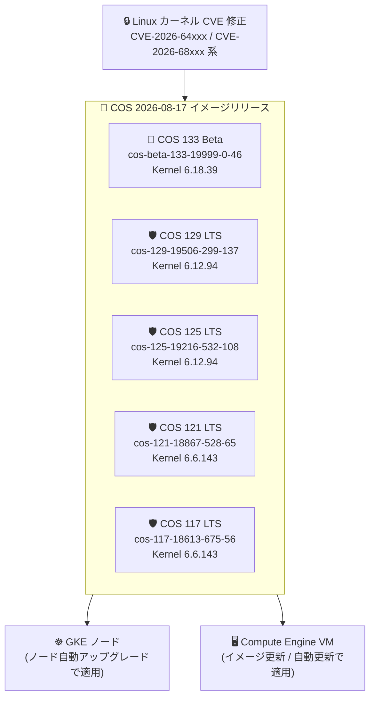

# Container-Optimized OS (COS): 全アクティブマイルストーンへのセキュリティアップデート

**リリース日**: 2026-08-17

**サービス**: Container-Optimized OS (COS)

**機能**: Linux カーネル CVE 修正、CONFIG_UDMABUF 有効化、sysctl デフォルト値変更

**ステータス**: Available

📊 [このアップデートのインフォグラフィックを見る](https://takech9203.github.io/google-cloud-news-summary/20260817-container-optimized-os-security-updates.html)

## 概要

2026 年 8 月 17 日、Google Cloud は Container-Optimized OS (COS) のアクティブな 5 つのマイルストーン (Beta の COS 133、LTS の COS 129 / 125 / 121 / 117) に対して、新しいイメージリリースを一斉に展開した。今回のリリースは、Linux カーネルに存在した多数の CVE (CVE-2026-64xxx 系および CVE-2026-68xxx 系など) を修正するセキュリティアップデートが中心である。

セキュリティ修正に加えて、COS 133 (Beta)、COS 129、COS 125 の x86_64 イメージでは、ユーザー空間から DMA バッファ (dma-buf) を作成できるカーネル機能である `CONFIG_UDMABUF` が有効化された。また COS 129 では、UDP のメモリ管理に関するランタイム sysctl 値 `net.ipv4.udp_mem` のデフォルトが `188034 250715 376068` から `188034 250714 376068` に変更されている。

本アップデートの対象ユーザーは、GKE ノードや Compute Engine VM で Container-Optimized OS を使用しているすべてのユーザーである。修正対象の CVE が多数にのぼるため、セキュリティコンプライアンスの観点から、影響を受ける環境では早期のイメージ更新を推奨する。

**アップデート前の課題**

- 各マイルストーンの Linux カーネルに CVE-2026-68081、CVE-2026-64561、CVE-2026-64562、CVE-2026-64567、CVE-2026-64572、CVE-2026-68092、CVE-2026-68296 をはじめとする多数の脆弱性が存在していた
- COS 133 (Beta) / COS 129 / COS 125 の x86_64 イメージでは `CONFIG_UDMABUF` が有効化されておらず、ユーザー空間からの dma-buf 作成を必要とするワークロードに対応できなかった

**アップデート後の改善**

- 全アクティブマイルストーンで Linux カーネルの多数の CVE が修正され、セキュリティリスクが軽減された
- COS 133 (Beta) / COS 129 / COS 125 の x86_64 イメージで `CONFIG_UDMABUF` が有効化された
- COS 129 で `net.ipv4.udp_mem` のデフォルト値が調整された

## アーキテクチャ図



今回のリリースは Beta 1 系統 + LTS 4 系統の全アクティブマイルストーンに共通のカーネル CVE 修正を展開するものであり、GKE ノードと Compute Engine VM の両方に影響する。

## サービスアップデートの詳細

### リリースされたイメージ一覧

| マイルストーン | イメージ名 | Kernel | Docker | Containerd |
|------|------|------|------|------|
| COS 133 (Beta) | cos-beta-133-19999-0-46 | COS-6.18.39 | v29.4.3 | v2.3.2 |
| COS 129 (LTS) | cos-129-19506-299-137 | COS-6.12.94 | v27.5.1 | v2.2.6 |
| COS 125 (LTS) | cos-125-19216-532-108 | COS-6.12.94 | v27.5.1 | v2.1.9 |
| COS 121 (LTS) | cos-121-18867-528-65 | COS-6.6.143 | v27.5.1 | v2.0.10 |
| COS 117 (LTS) | cos-117-18613-675-56 | COS-6.6.143 | v24.0.9 | v1.7.34 |

### 主要な変更点

1. **Linux カーネル CVE 修正 (全マイルストーン共通)**
   - CVE-2026-64xxx 系 (CVE-2026-64561、CVE-2026-64562、CVE-2026-64567、CVE-2026-64572 など) および CVE-2026-68xxx 系 (CVE-2026-68081、CVE-2026-68092、CVE-2026-68296 など) の多数の脆弱性を修正
   - 修正された CVE の完全なリストは各マイルストーンのリリースノートを参照

2. **CONFIG_UDMABUF の有効化 (COS 133 Beta / COS 129 / COS 125、x86_64)**
   - ユーザー空間のメモリページから DMA バッファ (dma-buf) を作成できるカーネル機能を有効化
   - dma-buf を利用するワークロードとの互換性が向上

3. **net.ipv4.udp_mem デフォルト値の変更 (COS 129)**
   - ランタイム sysctl の `net.ipv4.udp_mem` を `188034 250715 376068` から `188034 250714 376068` に変更
   - UDP ソケットのメモリ管理 (圧迫しきい値) に関わるパラメータの調整

## 技術仕様

### COS マイルストーン別サポート状況

公式ドキュメント (バージョニングとライフサイクル) に基づく各マイルストーンの状況は以下のとおり。

| マイルストーン | イメージファミリ | ステージ | サポート終了 |
|------|------|------|------|
| COS 133 | cos-beta / cos-arm64-beta | Beta (安定化フェーズ) | 未定 |
| COS 129 | cos-129-lts / cos-arm64-129-lts | LTS | 2028 年 3 月 |
| COS 125 | cos-125-lts / cos-arm64-125-lts | LTS | 2027 年 9 月 |
| COS 121 | cos-121-lts / cos-arm64-121-lts | LTS | 2027 年 3 月 |
| COS 117 | cos-117-lts / cos-arm64-117-lts | LTS | 2026 年 9 月 |

LTS マイルストーンは 2 年間サポートされ、高優先度のバグ・セキュリティ修正はオンデマンドで、中・低優先度の修正は 3 か月ごとの「LTS Refresh」リリースで提供される。

### 修正された CVE の概要 (マイルストーン別)

今回のリリースでは全イメージで多数の Linux カーネル CVE が修正されている。代表的なものをグループ化して示す。

| 対象マイルストーン | 対象コンポーネント | 修正された CVE (代表例) |
|------|------|------|
| COS 133 / 129 / 125 / 121 / 117 | Linux kernel | CVE-2026-64xxx 系: CVE-2026-64561、CVE-2026-64562、CVE-2026-64567、CVE-2026-64572 ほか多数 |
| COS 133 / 129 / 125 / 121 / 117 | Linux kernel | CVE-2026-68xxx 系: CVE-2026-68081、CVE-2026-68092、CVE-2026-68296 ほか多数 |

各イメージで修正された CVE の正確な一覧は、マイルストーンごとのリリースノート ([m133](https://cloud.google.com/container-optimized-os/docs/release-notes/m133)、[m129](https://cloud.google.com/container-optimized-os/docs/release-notes/m129)、[m125](https://cloud.google.com/container-optimized-os/docs/release-notes/m125)、[m121](https://cloud.google.com/container-optimized-os/docs/release-notes/m121)、[m117](https://cloud.google.com/container-optimized-os/docs/release-notes/m117)) を参照。

## 設定方法

### 前提条件

1. Compute Engine または GKE で Container-Optimized OS イメージを使用していること
2. 本番環境では LTS イメージファミリ (`cos-[MILESTONE]-lts`) の使用が推奨される

### 手順

#### ステップ 1: 最新イメージの確認

```bash
# アクティブな LTS イメージの一覧を確認
gcloud compute images list --no-standard-images --project=cos-cloud | grep lts
```

#### ステップ 2: Compute Engine VM のイメージ更新

```bash
# COS 129 LTS の最新イメージで VM を作成
gcloud compute instances create my-instance \
  --image=cos-129-19506-299-137 \
  --image-project=cos-cloud \
  --zone=us-central1-a
```

スタンドアロンの COS VM では、自動更新機能 (`cos-update-strategy=update_enabled`) を有効にすると、同一マイルストーン内の最新イメージが自動的にパッシブパーティションへダウンロードされ、再起動後に適用される。なお、マイルストーン 117 以降では自動更新はデフォルトで無効となっている。

```bash
# 既存インスタンスで自動更新を有効化
gcloud compute instances add-metadata INSTANCE_NAME \
  --metadata cos-update-strategy=update_enabled
```

#### ステップ 3: GKE ノードの更新

GKE では COS の更新は GKE が管理するため、ノード自動アップグレードが有効であれば、修正済みイメージを含む GKE バージョンが順次適用される。手動でアップグレードする場合は以下を実行する。

```bash
# ノードプールを手動アップグレード
gcloud container clusters upgrade CLUSTER_NAME \
  --node-pool=POOL_NAME \
  --zone=ZONE
```

## メリット

### ビジネス面

- **セキュリティリスクの低減**: CVE-2026-64xxx / CVE-2026-68xxx 系を含む多数のカーネル脆弱性が修正され、脆弱性スキャンやコンプライアンス要件への対応が容易になる
- **全マイルストーン同時対応**: Beta から LTS 4 系統まで同時にリリースされたため、どのマイルストーンを使用していても同等のセキュリティ水準を維持できる

### 技術面

- **CONFIG_UDMABUF 有効化**: COS 133 (Beta) / 129 / 125 の x86_64 でユーザー空間からの dma-buf 作成が可能になり、これを必要とするワークロードへの対応範囲が広がる
- **イメージ全体の更新モデル**: COS はアクティブ・パッシブのルートパーティション方式でカーネルを含む OS 全体を更新するため、パッケージ単位の更新に比べて一貫性のある状態を保ちやすい

## デメリット・制約事項

### 制限事項

- COS 117 のサポートは 2026 年 9 月に終了予定であり、COS 117 を使用している場合は COS 121 以降への移行を早期に計画する必要がある
- COS 133 は Beta (安定化フェーズ) であり、本番環境での使用は推奨されない。本番環境には LTS ファミリを使用すべきである
- `CONFIG_UDMABUF` の有効化は x86_64 イメージのみが対象である

### 考慮すべき点

- COS 129 の `net.ipv4.udp_mem` デフォルト値変更はごく小さな調整だが、UDP を多用するワークロードで sysctl 値に依存した設定をしている場合は確認しておくとよい
- 本番インスタンスの作成には Image Family API ではなく、検証済みの特定イメージ名を参照することが公式に推奨されている
- GKE や Cloud SQL などのマネージドサービス上の COS はサービス側が更新を管理するため、スタンドアロン VM のみ自動更新設定の確認が必要

## ユースケース

### ユースケース 1: セキュリティコンプライアンス対応

**シナリオ**: セキュリティチームが脆弱性スキャンで検出された Linux カーネルの CVE (CVE-2026-68081 など) への対応を求められている。

**実装例**:
```bash
# 修正済みイメージで GKE ノードプールを最新化 (自動アップグレード有効化)
gcloud container node-pools update POOL_NAME \
  --cluster=CLUSTER_NAME \
  --zone=ZONE \
  --enable-autoupgrade
```

**効果**: 修正済み COS イメージを含む GKE バージョンへの更新により、対象 CVE が解消され、脆弱性スキャンのアラートがクローズできる。

### ユースケース 2: 新マイルストーンの事前検証

**シナリオ**: プラットフォームチームが次期 LTS となる COS 133 の互換性を本番導入前に検証したい。

**実装例**:
```bash
# cos-beta ファミリでテスト用 VM を作成
gcloud compute instances create cos133-test \
  --image-family=cos-beta \
  --image-project=cos-cloud \
  --zone=us-central1-a
```

**効果**: Kernel 6.18 系 / Docker v29 / Containerd v2.3 という新しいコンポーネント構成を早期に検証でき、LTS 昇格後の移行をスムーズに行える。

## 関連サービス・機能

- **Google Kubernetes Engine (GKE)**: COS は GKE ノードのデフォルトイメージ (`cos_containerd`)。GKE のセキュリティリリースは更新済み COS イメージを取り込んで配信される
- **Compute Engine**: `cos-cloud` プロジェクトのイメージファミリから COS VM を直接作成可能
- **Security Command Center**: CVE の検出・管理に使用し、脆弱なイメージを使用しているインスタンスの特定に役立つ
- **Cloud SQL などのマネージドサービス**: 内部で COS を使用しており、サービス側が自動的にイメージを更新する

## 参考リンク

- 📊 [インフォグラフィック](https://takech9203.github.io/google-cloud-news-summary/20260817-container-optimized-os-security-updates.html)
- [公式リリースノート](https://docs.cloud.google.com/release-notes#August_17_2026)
- [COS 133 リリースノート](https://cloud.google.com/container-optimized-os/docs/release-notes/m133)
- [COS 129 リリースノート](https://cloud.google.com/container-optimized-os/docs/release-notes/m129)
- [COS 125 リリースノート](https://cloud.google.com/container-optimized-os/docs/release-notes/m125)
- [COS 121 リリースノート](https://cloud.google.com/container-optimized-os/docs/release-notes/m121)
- [COS 117 リリースノート](https://cloud.google.com/container-optimized-os/docs/release-notes/m117)
- [COS バージョニングとライフサイクル](https://docs.cloud.google.com/container-optimized-os/docs/concepts/versioning)
- [COS サポートポリシー](https://docs.cloud.google.com/container-optimized-os/docs/resources/support-policy)
- [COS 自動更新の仕組み](https://docs.cloud.google.com/container-optimized-os/docs/concepts/auto-update)
- [GKE ノードイメージ](https://cloud.google.com/kubernetes-engine/docs/concepts/node-images)

## まとめ

今回のアップデートは、Container-Optimized OS の全アクティブマイルストーン (Beta 1 系統 + LTS 4 系統) に対する広範なカーネル CVE 修正であり、GKE ノードと Compute Engine VM を運用するすべてのユーザーに関係する。修正対象の CVE が多数にのぼるため、ノード自動アップグレードの有効化状況を確認し、無効の環境では計画的なイメージ更新を実施すべきである。また、COS 117 のサポート終了 (2026 年 9 月) が目前に迫っているため、COS 117 利用者は COS 121 以降への移行を早急に進めることを推奨する。

---

**タグ**: #ContainerOptimizedOS #COS #GKE #Security #LinuxKernel #CVE #LTS #ComputeEngine
