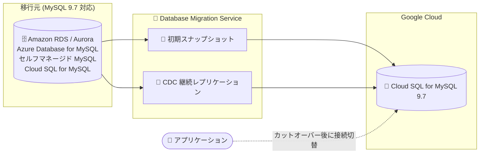

# Cloud Database Migration Service: MySQL 同種移行での MySQL 9.7 サポート

**リリース日**: 2026-08-17

**サービス**: Cloud Database Migration Service

**機能**: MySQL 同種移行 (homogeneous migrations) での MySQL バージョン 9.7 サポート

**ステータス**: Announcement (利用可能)

📊 [このアップデートのインフォグラフィックを見る](https://takech9203.github.io/google-cloud-news-summary/20260817-database-migration-service-mysql-9-7.html)

## 概要

Database Migration Service (DMS) の MySQL 同種移行 (MySQL から Cloud SQL for MySQL への移行) が、MySQL バージョン 9.7 に対応しました。移行元として Amazon RDS、Amazon Aurora、Microsoft Azure Database for MySQL、セルフマネージド MySQL (オンプレミスや任意のクラウド VM)、Cloud SQL for MySQL の各 9.7 バージョンを、移行先として Cloud SQL for MySQL 9.7 を選択できます。

本アップデートは 2026 年 6 月 23 日に事前告知され、7 月 2 日から全リージョンへのロールアウトが進められていたもので、今回のアナウンスにより正式に利用可能となりました。前提となる Cloud SQL for MySQL 9.7 (マイナーバージョン 9.7.1) は 2026 年 8 月 6 日にサポートが開始されています。

MySQL 9.7 を利用中、または移行を機に最新メジャーバージョンへ更新したい企業にとって、DMS の CDC (Change Data Capture) ベースの継続レプリケーションによる最小ダウンタイム移行を MySQL 9.7 でもそのまま利用できるようになる、実用性の高いアップデートです。

**アップデート前の課題**

- DMS の MySQL 同種移行がサポートするバージョンは 5.5/5.6/5.7/8.0/8.4 までで、MySQL 9.7 は移行元・移行先のいずれにも選択できなかった
- 他クラウドやオンプレミスで MySQL 9.7 を運用しているユーザーは、DMS のマネージドな移行フローを利用できず、別の移行手段を検討する必要があった
- 移行先として Cloud SQL for MySQL 9.7 を指定した最小ダウンタイム移行を DMS で構成できなかった

**アップデート後の改善**

- Amazon RDS / Amazon Aurora / Azure Database for MySQL / セルフマネージド MySQL / Cloud SQL for MySQL の各 MySQL 9.7 を移行元として選択できるようになった
- 移行先として Cloud SQL for MySQL 9.7 を選択できるようになり、最新バージョンへの移行パスが確立された
- 初期スナップショット + CDC による継続レプリケーションという DMS の最小ダウンタイム移行フローを MySQL 9.7 でも利用できるようになった

## アーキテクチャ図



MySQL 9.7 の移行元データベースから、DMS が初期スナップショットの取得と CDC による継続レプリケーションを行い、Cloud SQL for MySQL 9.7 へ最小ダウンタイムで移行するフローです。

## サービスアップデートの詳細

### 主要機能

1. **移行元としての MySQL 9.7 サポート**
   - Amazon RDS: 5.6、5.7、8.0、8.4 に加えて 9.7 をサポート
   - セルフマネージド MySQL (オンプレミスまたは任意のクラウド VM): 5.5、5.6、5.7、8.0、8.4 に加えて 9.7 をサポート
   - Cloud SQL for MySQL: 5.6、5.7、8.0、8.4 に加えて 9.7 をサポート
   - Amazon Aurora: 5.6、5.7、8.0、8.4 に加えて 9.7 をサポート
   - Microsoft Azure Database for MySQL: 5.7、8.0、8.4 に加えて 9.7 をサポート

2. **移行先としての Cloud SQL for MySQL 9.7 サポート**
   - 移行先データベースとして Cloud SQL for MySQL 9.7 を選択可能
   - Cloud SQL for MySQL 9.7 はマイナーバージョン 9.7.1 として 2026 年 8 月 6 日にサポート開始

3. **DMS の既存の移行機能をそのまま利用可能**
   - サーバーレスアーキテクチャによる初期スナップショット取得と CDC ベースの継続レプリケーション
   - 移行中も移行元データベースは稼働を継続でき、ダウンタイムを最小化
   - SSL/TLS による接続の暗号化

## 技術仕様

### MySQL 同種移行のサポートバージョン (2026 年 8 月時点)

| 項目 | 詳細 |
|------|------|
| 移行元 (Amazon RDS) | 5.6、5.7、8.0、8.4、**9.7** |
| 移行元 (セルフマネージド MySQL) | 5.5、5.6、5.7、8.0、8.4、**9.7** |
| 移行元 (Cloud SQL for MySQL) | 5.6、5.7、8.0、8.4、**9.7** |
| 移行元 (Amazon Aurora) | 5.6、5.7、8.0、8.4、**9.7** |
| 移行元 (Azure Database for MySQL) | 5.7、8.0、8.4、**9.7** |
| 移行先 (Cloud SQL for MySQL) | 5.6、5.7、8.0 (対応マイナーバージョン)、8.4 (一部制限あり)、**9.7** |
| Cloud SQL for MySQL 9.7 のマイナーバージョン | 9.7.1 (2026 年 8 月 6 日サポート開始) |

なお、公式ドキュメントでは、新しいマイナーバージョンから古いマイナーバージョンへの移行は推奨されていません。

## 設定方法

### 前提条件

1. 移行元 MySQL 9.7 データベースへのネットワーク接続 (VPC ピアリング、IP 許可リストなど) を構成できること
2. 移行元データベースで DMS 用の移行アカウントとレプリケーションに必要な設定 (バイナリログなど) を準備すること

### 手順

#### ステップ 1: 移行元の接続プロファイルを作成

```bash
gcloud database-migration connection-profiles create mysql SOURCE_PROFILE_ID \
  --region=REGION \
  --host=SOURCE_HOST \
  --port=3306 \
  --username=MIGRATION_USER \
  --password=PASSWORD
```

移行元 MySQL 9.7 データベースの接続情報を接続プロファイルとして登録します。

#### ステップ 2: 移行ジョブを作成して開始

Google Cloud コンソールの Database Migration Service で移行ジョブを作成し、移行先として Cloud SQL for MySQL 9.7 の新規または既存インスタンスを指定します。ジョブのテストを実行して接続を検証した後、移行を開始します。CDC による継続レプリケーションが追いついた時点で移行ジョブをプロモートし、アプリケーションの接続先を切り替えます。

## メリット

### ビジネス面

- **最新バージョンへの移行パス確立**: 他クラウドやオンプレミスの MySQL 9.7 環境から Google Cloud への移行をマネージドサービスで実現でき、移行プロジェクトの計画が立てやすくなる
- **追加コストなしの移行**: MySQL から Cloud SQL for MySQL への同種移行は追加料金なしで利用できるため、移行コストを抑えられる

### 技術面

- **最小ダウンタイム移行**: 初期スナップショット + CDC 継続レプリケーションにより、移行元を稼働させたまま MySQL 9.7 データを移行できる
- **マルチクラウド継続レプリケーション**: Amazon RDS/Aurora や Azure Database for MySQL の 9.7 から Cloud SQL への継続レプリケーション構成が可能

## デメリット・制約事項

### 制限事項

- 新しいマイナーバージョンから古いマイナーバージョンへの移行は推奨されない
- メジャーバージョンをまたぐ移行 (クロスバージョン移行) では、移行先バージョンのリリースノートを確認し、非互換性への対応が必要
- 完全ダンプ (初期スナップショット) フェーズ中は、移行元データベースで DDL 操作 (ALTER TABLE、DROP TABLE、TRUNCATE TABLE など) を実行できない

### 考慮すべき点

- Cloud SQL for MySQL 9.7 は 2026 年 8 月にサポートが開始された新しいバージョンのため、利用するアプリケーションやドライバの互換性を事前に検証することが望ましい
- MySQL の既知の制限事項 (物理バックアップファイルを使用する移行の対象バージョン制限など) は公式の Known limitations ページで最新情報を確認すること

## ユースケース

### ユースケース 1: 他クラウドの MySQL 9.7 から Cloud SQL への移行

**シナリオ**: Amazon RDS for MySQL 9.7 または Azure Database for MySQL 9.7 で稼働中のデータベースを、ダウンタイムを最小化しながら Cloud SQL for MySQL 9.7 に移行する。

**効果**: DMS の CDC ベース継続レプリケーションにより、移行元を稼働させたままデータを同期し、カットオーバー時の停止時間を最小限に抑えられる。同種移行のため DMS 自体の追加料金は発生しない。

### ユースケース 2: セルフマネージド MySQL 9.7 のマネージドサービス化 (リフト & シフト)

**シナリオ**: オンプレミスやクラウド VM 上でセルフホストしている MySQL 9.7 を Cloud SQL for MySQL 9.7 に移行し、インフラ管理から脱却する。

**効果**: 高可用性、バックアップ、パッチ適用などを Cloud SQL のマネージド機能に任せられるようになり、バージョンを維持したままの移行のためアプリケーション側の改修を最小化できる。

## 料金

MySQL から Cloud SQL for MySQL への同種移行 (ネイティブ移行・レプリケーション) は、Database Migration Service の**追加料金なし**で利用できます。

移行先の Cloud SQL for MySQL インスタンスの料金 (vCPU、メモリ、ストレージ、ネットワーク) は別途発生します。詳細は各料金ページを参照してください。

| 項目 | 料金 |
|------|------|
| DMS: MySQL → Cloud SQL for MySQL (同種移行) | 追加料金なし |
| Cloud SQL for MySQL インスタンス | [Cloud SQL 料金](https://cloud.google.com/sql/pricing) に準拠 |

## 利用可能リージョン

2026 年 7 月 2 日のリリースノートで全リージョンへのロールアウトが告知されており、今回のアナウンス (2026 年 8 月 17 日) をもって利用可能となりました。DMS が利用可能なリージョンの一覧は [料金ページ](https://cloud.google.com/database-migration/pricing) のリージョン一覧を参照してください。

## 関連サービス・機能

- **Cloud SQL for MySQL**: 本移行シナリオの移行先となるマネージド MySQL サービス。MySQL 9.7 (9.7.1) は 2026 年 8 月 6 日にサポート開始
- **AlloyDB for PostgreSQL / Cloud SQL for PostgreSQL・SQL Server**: DMS がサポートするその他の同種移行の移行先
- **Migration Center**: 移行前のデータベース検出・評価に利用でき、DMS と組み合わせて移行計画を立てられる

## 参考リンク

- 📊 [インフォグラフィック](https://takech9203.github.io/google-cloud-news-summary/20260817-database-migration-service-mysql-9-7.html)
- [公式リリースノート](https://docs.cloud.google.com/release-notes#August_17_2026)
- [DMS リリースノート](https://docs.cloud.google.com/database-migration/docs/release-notes#August_17_2026)
- [サポートされる移行元・移行先データベース](https://docs.cloud.google.com/database-migration/docs/supported-databases)
- [Cloud SQL for MySQL のデータベースバージョン](https://docs.cloud.google.com/sql/docs/mysql/db-versions)
- [MySQL 移行の既知の制限事項](https://docs.cloud.google.com/database-migration/docs/mysql/known-limitations)
- [料金ページ](https://cloud.google.com/database-migration/pricing)

## まとめ

Database Migration Service の MySQL 同種移行が MySQL 9.7 に対応し、他クラウドやオンプレミスの最新 MySQL 環境から Cloud SQL for MySQL 9.7 への最小ダウンタイム移行が追加料金なしで可能になりました。MySQL 9.7 環境の Google Cloud 移行を検討しているチームは、サポート対象バージョンと既知の制限事項を確認のうえ、DMS を第一の選択肢として評価することを推奨します。

---

**タグ**: #DatabaseMigrationService #CloudSQL #MySQL #DataMigration #Announcement
