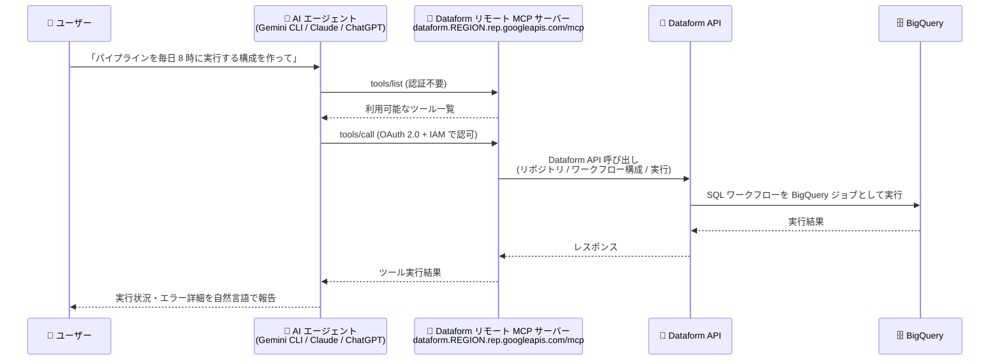

# Dataform: リモート Model Context Protocol (MCP) サーバーが一般提供 (GA)

**リリース日**: 2026-08-17

**サービス**: Dataform

**機能**: Dataform remote MCP server

**ステータス**: GA (一般提供)

📊 [このアップデートのインフォグラフィックを見る](https://takech9203.github.io/google-cloud-news-summary/20260817-dataform-remote-mcp-server-ga.html)

## 概要

Dataform のリモート Model Context Protocol (MCP) サーバーが一般提供 (GA) になりました。Gemini CLI、ChatGPT、Claude などの AI アプリケーションや自作の AI エージェントから、Dataform のデータ変換ワークフローを自然言語で管理できるようになります。

MCP は、LLM や AI エージェントが外部データソース・サービスに接続する方法を標準化するプロトコルです。Dataform リモート MCP サーバーは Google Cloud のインフラストラクチャ上で稼働するマネージドな HTTP エンドポイント (`https://dataform.REGION.rep.googleapis.com/mcp`) として提供され、Dataform API を有効化するだけで利用できます。ノートブックや保存済みクエリなどのコードアセット管理、BigQuery 上でのパイプラインのスケジュール・実行、実行失敗時のトラブルシューティングといったタスクを AI エージェント経由で実行できます。

BigQuery を中心としたデータ変換パイプラインを Dataform で運用しているデータエンジニアリングチームにとって、エージェンティックな開発・運用フローを公式サポートの下で構築できる重要なアップデートです。

**アップデート前の課題**

- AI エージェントから Dataform を操作するには、Dataform API の呼び出しや gcloud CLI の実行をエージェントのカスタムツールとして個別に実装する必要があった
- ローカル MCP サーバーを利用する場合、各開発者のマシンでのセットアップ・運用・認証情報の管理が必要だった
- エージェントによる Dataform 操作に対して、組織として一貫した認可制御や監査を適用する標準的な仕組みがなかった

**アップデート後の改善**

- Google Cloud が運用するマネージドなリモート MCP エンドポイントに接続するだけで、AI エージェントから Dataform を操作可能になった (Dataform API の有効化のみで利用可能)
- OAuth 2.0 と IAM による fine-grained な認可、集中監査ロギング、Model Armor によるプロンプト/レスポンス保護 (オプション) が利用可能になった
- リポジトリ作成、ファイル編集・コミット、ワークフロー構成の作成、実行のトリガー/キャンセル、失敗原因の調査までを自然言語プロンプトで実行できるようになった
- GA となり、本番環境での利用が正式にサポートされた

## アーキテクチャ図



AI エージェントは MCP クライアント経由でリモート MCP サーバーの HTTP エンドポイントに接続し、MCP サーバーが Dataform API 呼び出しをオーケストレーションして BigQuery 上でデータ変換ワークフローを実行します。

## サービスアップデートの詳細

### 主要機能

1. **単一ファイルアセットのセットアップ**
   - リポジトリの作成、ディレクトリ内容のクエリなど、基本的なリソースセットアップをエージェントが管理
   - ノートブックや保存済みクエリなどのコードアセットの作成・読み取り・編集・コミット・プッシュに対応

2. **パイプラインとリリースの管理**
   - ワークフロー構成・リリース構成の管理、コンパイル結果の生成
   - ワークフロー実行 (workflow invocation) のトリガーとキャンセル
   - 「毎日 8:00 AM にパイプラインを実行するワークフロー構成を作成して」といった自然言語での指示が可能

3. **トラブルシューティングと検証**
   - コンパイル結果の取得やワークフロー実行アクションのクエリにより、パイプライン失敗の原因をエージェントが特定
   - 「最近のパイプライン実行のステータスを確認して、失敗があればエラー詳細を教えて」といった調査が可能

4. **Google Cloud リモート MCP サーバー共通の利点**
   - 一元化されたディスカバリとマネージドなリージョナル HTTP エンドポイント
   - IAM による fine-grained な認可と集中監査ロギング
   - Model Armor によるプロンプト/レスポンスのセキュリティ保護 (オプション)

## 技術仕様

### 接続情報

| 項目 | 詳細 |
|------|------|
| サーバー名 | Dataform MCP server |
| エンドポイント | `https://dataform.REGION.rep.googleapis.com/mcp` (例: `us-central1`) |
| トランスポート | HTTP |
| 有効化方法 | Dataform API の有効化で自動的に利用可能 (BigQuery API も必要) |
| 対応クライアント | Gemini CLI、ChatGPT、Claude、Antigravity、カスタム AI アプリケーション |

### 認証・認可

| 項目 | 詳細 |
|------|------|
| プロトコル | OAuth 2.0 + IAM |
| `tools/list` (ディスカバリ) | 認証不要 |
| `tools/call` (実行) | BigQuery スコープの有効な OAuth トークンが必要 |
| 対応 ID | すべての Google Cloud identities |

### 必要な IAM ロール

| ロール | 用途 |
|--------|------|
| `roles/mcp.toolUser` (MCP Tool User) | MCP ツール呼び出し (`mcp.tools.call`) |
| `roles/dataform.editor` (Dataform Editor) | リポジトリ・ワークスペースの作成、ファイル編集 |
| `roles/bigquery.jobUser` (BigQuery Job User) | BigQuery ジョブの実行 |

### ツール一覧の取得例

`tools/list` メソッドは認証不要で、MCP inspector または HTTP リクエストで直接確認できます。

```json
POST /mcp HTTP/1.1
Host: dataform.googleapis.com
Content-Type: application/json

{
  "jsonrpc": "2.0",
  "method": "tools/list",
  "id": 1
}
```

## 設定方法

### 前提条件

1. Google Cloud プロジェクトで課金が有効になっていること
2. BigQuery API と Dataform API が有効になっていること
3. Dataform リポジトリが GitHub や GitLab などのサードパーティ Git プロバイダに接続されていること
4. AI エージェントに BigQuery スコープの有効な OAuth トークンが構成されていること
5. 必要な IAM ロール (`roles/mcp.toolUser`、`roles/dataform.editor`、`roles/bigquery.jobUser`) が付与されていること

### 手順

#### ステップ 1: MCP クライアントの設定

AI アプリケーションでリモート MCP サーバーの追加・接続画面を開き、以下を設定します。

```text
Server name : Dataform MCP server
Server URL  : https://dataform.REGION.rep.googleapis.com/mcp
              (REGION はリポジトリのリージョン。例: us-central1)
Transport   : HTTP
認証情報     : Google Cloud 認証情報、OAuth Client ID/secret、
              またはエージェント ID と認証情報
```

#### ステップ 2: 自然言語プロンプトで操作

エージェントに以下のようなプロンプトを与えて Dataform を操作します (公式ドキュメントのサンプルプロンプトより)。

```text
"Create a new Dataform repository named REPOSITORY_ID in project PROJECT_ID."
"Create a workflow configuration that schedules my pipeline to run every day at 8:00 AM."
"Trigger a new execution for the WORKFLOW_CONFIGURATION_ID workflow configuration."
"Check the status of my recent pipeline executions and tell me if any failed,
 including the error details."
"Cancel the workflow invocation named WORKFLOW_INVOCATION_ID in repository
 REPOSITORY_ID, which is now running."
```

#### ステップ 3 (オプション): Model Armor による保護の有効化

Model Armor の floor settings で MCP トラフィックの検査・ブロックを構成できます。

```bash
gcloud model-armor floorsettings update \
  --full-uri='projects/PROJECT_ID/locations/global/floorSetting' \
  --enable-floor-setting-enforcement=TRUE \
  --add-integrated-services=GOOGLE_MCP_SERVER \
  --google-mcp-server-enforcement-type=INSPECT_AND_BLOCK \
  --enable-google-mcp-server-cloud-logging \
  --malicious-uri-filter-settings-enforcement=ENABLED \
  --add-rai-settings-filters='[{"confidenceLevel": "MEDIUM_AND_ABOVE", "filterType": "DANGEROUS"}]'
```

## メリット

### ビジネス面

- **データパイプライン運用の効率化**: パイプラインの作成・スケジュール・実行・障害調査を自然言語で行えるため、定型的な運用作業の時間を削減できる
- **エージェンティックワークフローの公式サポート**: GA となったことで、本番環境のデータ変換基盤に AI エージェントを組み込む際の正式なサポートが得られる
- **導入コストの低さ**: Dataform API の有効化のみで利用でき、追加のサーバー構築・運用が不要

### 技術面

- **マネージドなリモートエンドポイント**: サーバーのホスティングやスケーリングは Google Cloud 側で管理され、クライアントは HTTP エンドポイントに接続するだけでよい
- **既存のセキュリティ基盤との統合**: OAuth 2.0 + IAM による認可、IAM deny policy によるツール単位の制御、集中監査ロギング、Model Armor による保護が利用可能
- **マルチクライアント対応**: Gemini CLI、ChatGPT、Claude、カスタムアプリケーションなど、MCP に対応する幅広い AI アプリケーションから同一のサーバーを利用できる

## デメリット・制約事項

### 制限事項

- `tools/call` の実行には BigQuery スコープの OAuth トークンが必須 (ツール呼び出し中にアクセスするリソースによっては追加スコープが必要な場合がある)
- Dataform リポジトリをサードパーティ Git プロバイダ (GitHub、GitLab など) に接続しておく必要がある
- エンドポイントはリージョナルであり、リポジトリが存在するリージョンを指定する必要がある

### 考慮すべき点

- MCP ツールは幅広い操作が可能なため、新たなセキュリティリスクへの考慮が必要。エージェント用に専用の ID を作成し、アクセスの制御と監視を分離することが推奨されている
- Model Armor でロギングを有効化するとペイロード全体がログに記録されるため、機密情報がログに含まれる可能性がある
- Model Armor が利用できないリージョンで MCP サーバーを使用する場合、呼び出しのルーティング動作によってデータレジデンシー要件に影響する可能性がある
- Model Armor の floor settings の変更は MCP だけでなく Vertex AI など統合されたすべてのサービスのトラフィック検査に影響する

## ユースケース

### ユースケース 1: 自然言語によるパイプラインのスケジュール設定

**シナリオ**: データエンジニアが、新しく作成した SQL ワークフローを毎朝定時に実行するよう設定したい。従来は Google Cloud コンソールや Terraform でワークフロー構成を定義していた。

**実装例**:
```text
プロンプト: "Create a workflow configuration that schedules my pipeline
to run every day at 8:00 AM."
```

**効果**: エージェントが Dataform API を通じてワークフロー構成を作成し、コンソール操作や構成コードの記述なしにスケジュール実行を設定できる。

### ユースケース 2: パイプライン障害のエージェントによる一次調査

**シナリオ**: 夜間バッチのデータ変換パイプラインが失敗した際、担当者がコンパイル結果や実行ログを手動で確認して原因を特定していた。

**実装例**:
```text
プロンプト: "Check the status of my recent pipeline executions and tell me
if any failed, including the error details."
プロンプト: "Show me the details of the specific execution that failed."
```

**効果**: エージェントがコンパイル結果とワークフロー実行アクションを取得して失敗原因を特定し、エラー詳細を自然言語で報告するため、障害対応の初動が高速化する。

### ユースケース 3: コードアセットの作成と Git 管理

**シナリオ**: 分析チームがノートブックや保存済みクエリなどのアセットを作成し、変更を Git リポジトリにコミットする一連の作業をエージェントに委譲したい。

**効果**: リポジトリ作成、ファイルの読み書き、コミット・プッシュまでを AI エージェント経由で実行でき、開発フローを会話ベースで完結できる。

## 料金

Dataform 自体は無料のサービスであり、Dataform リモート MCP サーバーの利用に固有の料金は公式料金ページに記載されていません。ただし、以下の関連コストが発生します。

- **BigQuery**: Dataform はテーブル・ビューの作成などのクエリを BigQuery で実行するため、クエリ実行分が BigQuery 経由で課金される
- **Cloud Logging**: ワークフロー実行のモニタリングに Cloud Logging が使用される (デフォルトで有効、すべてのワークフロー実行に必須)
- **その他**: パイプライン実行に Managed Service for Apache Airflow、Cloud Scheduler、Cloud Workflows などを使用する場合はそれぞれの料金が発生

詳細は [Dataform 料金ページ](https://cloud.google.com/dataform/pricing) を参照してください。

## 利用可能リージョン

エンドポイントはリージョナル (`https://dataform.REGION.rep.googleapis.com/mcp`) で提供され、Dataform リポジトリが存在するリージョンを指定します。対応リージョンの詳細は [Dataform locations](https://docs.cloud.google.com/dataform/docs/locations) を参照してください。

## 関連サービス・機能

- **BigQuery**: Dataform のワークフローは BigQuery ジョブとして実行される。MCP サーバーの認証にも BigQuery OAuth スコープを使用する
- **Model Armor**: MCP ツール呼び出しのプロンプト/レスポンスを検査・ブロックし、悪意ある入力や機密データ漏えいから保護する (オプション)
- **IAM**: `roles/mcp.toolUser` などのロールによる認可に加え、deny policy でプリンシパル・ツール属性・ツール名・OAuth クライアント ID に基づく MCP 利用制御が可能
- **Cloud Logging**: ワークフロー実行のモニタリングと MCP の集中監査ロギングに使用
- **その他の Google Cloud リモート MCP サーバー**: Filestore、Datastream、Data Lineage、Recommender など、多数のサービスがリモート MCP サーバーを提供しており、[Google Cloud MCP servers overview](https://docs.cloud.google.com/mcp/overview) で一覧を確認できる

## 参考リンク

- 📊 [インフォグラフィック](https://takech9203.github.io/google-cloud-news-summary/20260817-dataform-remote-mcp-server-ga.html)
- [公式リリースノート](https://docs.cloud.google.com/release-notes#August_17_2026)
- [ドキュメント: Use the Dataform remote MCP server](https://docs.cloud.google.com/dataform/docs/use-dataform-mcp)
- [Google Cloud MCP servers overview](https://docs.cloud.google.com/mcp/overview)
- [料金ページ](https://cloud.google.com/dataform/pricing)

## まとめ

Dataform リモート MCP サーバーの GA により、AI エージェントからのデータ変換ワークフロー管理が Google Cloud のマネージドエンドポイントとして正式にサポートされました。Dataform を利用中のチームは、まず開発環境で Gemini CLI などの MCP クライアントを接続し、パイプラインの状態確認や障害調査といった読み取り中心のタスクから試すことを推奨します。本番導入時にはエージェント専用の ID の作成、IAM deny policy、Model Armor によるガバナンス設計を併せて検討してください。

---

**タグ**: Dataform, MCP, Model Context Protocol, AI エージェント, BigQuery, データ変換, GA, データエンジニアリング
