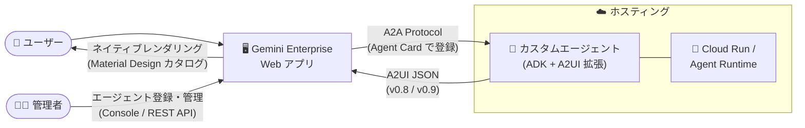

# Gemini Enterprise: A2UI / A2A エージェント登録が一般提供 (GA) に

**リリース日**: 2026-08-17

**サービス**: Gemini Enterprise

**機能**: A2UI および A2A エージェントの登録・管理 (A2UI v0.9 サポートを含む)

**ステータス**: GA (一般提供)

📊 [このアップデートのインフォグラフィックを見る](https://takech9203.github.io/google-cloud-news-summary/20260817-gemini-enterprise-a2ui-a2a-agents-ga.html)

## 概要

Gemini Enterprise において、[Agent to UI (A2UI)](https://a2ui.org/introduction/what-is-a2ui/) でカスタムインターフェースを構築するエージェントと、[Agent2Agent (A2A) Protocol](https://a2a-protocol.org/) で通信するエージェントの登録・管理機能が一般提供 (GA) になりました。管理者は、外部でホストされたカスタムエージェントを Gemini Enterprise アプリに登録し、組織内のユーザーに提供できます。

A2UI は、エージェントがフォーム・ボタン・日付ピッカーなどの UI を JSON メッセージとして宣言的に記述するプロトコルです。クライアント (Gemini Enterprise) 側が自身のネイティブコンポーネントでレンダリングするため、任意コード実行や iframe を必要とせず、ホストアプリのスタイリングとアクセシビリティを継承した安全なリッチ UI を実現できます。今回の GA では、従来サポートされていた A2UI v0.8 に加えて v0.9 がサポートされ、v0.9 では新しい Material Design ベースのコンポーネントカタログに対応します。

対象ユーザーは、社内向けカスタム AI エージェントを開発・運用するエンタープライズの開発者と、Gemini Enterprise を管理する管理者です。テキスト応答にとどまらないインタラクティブなエージェント体験を、本番環境向けの GA 品質で構築できるようになりました。

**アップデート前の課題**

- 本機能は Public Preview (Pre-GA Offerings Terms 適用) であり、サポートが限定的で「as is」提供のため、本番ワークロードへの適用が難しかった
- Gemini Enterprise がサポートする A2UI 仕様は v0.8 のみで、`surfaceUpdate` や `literalString` ラッパーなどネストの深いレガシーなメッセージ構造を使う必要があった
- v0.9 で導入された `createSurface` によるサーフェス初期化やフラットなコンポーネント形式、新しいコンポーネントカタログを利用できなかった

**アップデート後の改善**

- A2UI / A2A エージェントの登録・管理が GA となり、本番環境での利用に適したサポートレベルで提供されるようになった
- A2UI v0.8 に加えて v0.9 がサポートされ、新しい Material Design ベースのコンポーネントカタログを利用したリッチな UI を構築できるようになった
- 管理者は Google Cloud コンソールまたは REST API (`agents.create`) からエージェントを登録し、Agents ページで一元的に管理できる

## アーキテクチャ図



Cloud Run や Agent Runtime でホストしたカスタムエージェントを A2A Protocol で Gemini Enterprise に登録し、エージェントが返す A2UI JSON を Gemini Enterprise がネイティブコンポーネントとしてレンダリングする流れを示しています。

## サービスアップデートの詳細

### 主要機能

1. **A2UI / A2A エージェント登録の GA 化**
   - Gemini Enterprise 管理者が、A2UI でカスタム UI を構築し A2A Protocol で通信するエージェントを登録・管理する機能が Public Preview から GA に昇格
   - 登録は Google Cloud コンソールまたは REST API (Discovery Engine API の `agents.create` メソッド) で実行可能
   - 登録後は Gemini Enterprise の Agents ページでエージェントの表示・管理が可能

2. **A2UI v0.9 サポートの追加**
   - 従来の v0.8 に加えて v0.9 をサポート
   - v0.9 は新しい Material Design ベースのコンポーネントカタログに対応
   - v0.9 仕様では `createSurface` によるサーフェス初期化、フラットなコンポーネント形式、`updateComponents` / `updateDataModel` によるメッセージ構造が導入されている (v0.8 の `surfaceUpdate` / `dataModelUpdate` / `beginRendering` 構造から刷新)

3. **標準 A2UI コンポーネントのレンダリング**
   - Gemini Enterprise はすべての標準 A2UI コンポーネントをサポートし、Gemini Enterprise 組み込みのスタイリングでレンダリング
   - レイアウト (Row / Column / List)、表示 (Text / Image / Icon / Divider)、インタラクティブ (Button / TextField / CheckBox / Slider / DateTimeInput / MultipleChoice)、コンテナ (Card / Modal / Tabs) の各コンポーネントを利用可能

4. **柔軟なホスティングオプション**
   - エージェントは一般アクセス可能なエンドポイントにデプロイして利用
   - Gemini Enterprise Agent Platform の Agent Runtime (フルマネージド)、または Cloud Run (サーバーレスコンテナ) でのホスティングが可能

## 技術仕様

### A2UI コンポーネントカテゴリ

| カテゴリ | コンポーネント | 用途 |
|------|------|------|
| レイアウト | Row, Column, List | 子コンポーネントの水平・垂直配置、スクロールリスト |
| 表示 | Text, Image, Icon, Divider | テキスト (h1〜h5 / caption / body)、画像、アイコン、区切り線 |
| インタラクティブ | Button, TextField, CheckBox, Slider, DateTimeInput, MultipleChoice | アクション実行、テキスト入力 (正規表現バリデーション対応)、選択操作 |
| コンテナ | Card, Modal, Tabs | コンテンツのグループ化、オーバーレイダイアログ、タブ切り替え |

すべてのコンポーネントは共通プロパティとして `id` (必須)、`accessibility`、`weight` を持ちます。

### Agent Card での A2UI 拡張の宣言

A2A の Agent Card 内で、A2UI 拡張とサポートするカタログを `capabilities.extensions` に宣言します (v0.8 の例)。

```json
{
  "protocolVersion": "0.3.0",
  "name": "contacts-agent",
  "url": "AGENT_URL",
  "version": "1.0.0",
  "capabilities": {
    "streaming": true,
    "extensions": [
      {
        "uri": "https://a2ui.org/a2a-extension/a2ui/v0.8",
        "description": "Ability to render A2UI",
        "required": false,
        "params": {
          "supportedCatalogIds": [
            "https://a2ui.org/specification/v0_8/standard_catalog_definition.json"
          ]
        }
      }
    ]
  },
  "skills": [],
  "defaultInputModes": ["text/plain"],
  "defaultOutputModes": ["text/plain"]
}
```

## 設定方法

### 前提条件

1. Discovery Engine Admin (`roles/discoveryengine.admin`) ロールを持っていること
2. 既存の Gemini Enterprise アプリがあること
3. エージェントが A2UI 仕様と A2A Protocol を実装し、Gemini Enterprise からアクセス可能なエンドポイントでホストされていること

### 手順

#### ステップ 1: エージェントに A2UI / A2A を実装してホスト

Agent Development Kit (ADK) と A2UI 拡張でエージェントを構築し、Cloud Run または Agent Runtime にデプロイします。Cloud Run を使用する場合は、Discovery Engine のサービスエージェントに Cloud Run Invoker ロールを付与します。

```bash
gcloud projects add-iam-policy-binding PROJECT_ID \
  --member="serviceAccount:service-PROJECT_NUMBER@gcp-sa-discoveryengine.iam.gserviceaccount.com" \
  --role="roles/run.invoker"
```

#### ステップ 2: A2A エージェントとして Gemini Enterprise に登録

REST API でエージェントを登録します (コンソールの「Agents > Add Agents > Custom agent via A2A」からも登録可能)。

```bash
curl -X POST \
  -H "Authorization: Bearer $(gcloud auth print-access-token)" \
  -H "Content-Type: application/json" \
  "https://ENDPOINT_LOCATION-discoveryengine.googleapis.com/v1alpha/projects/PROJECT_ID/locations/LOCATION/collections/default_collection/engines/APP_ID/assistants/default_assistant/agents" \
  -d '{
    "name": "AGENT_NAME",
    "displayName": "AGENT_DISPLAY_NAME",
    "description": "AGENT_DESCRIPTION",
    "a2aAgentDefinition": {
      "jsonAgentCard": "{...Agent Card JSON...}"
    }
  }'
```

`LOCATION` はデータストアのマルチリージョン (`global` / `us` / `eu`) を指定します。エージェントがユーザーに代わって Google Cloud リソースにアクセスする場合は、`authorizationConfig` フィールドで OAuth の認可リソースを紐付けます。

#### ステップ 3: Agents ページで管理

登録後、Gemini Enterprise 管理者は Agents ページでエージェントの表示・管理を行い、組織のユーザーに提供します。

## メリット

### ビジネス面

- **本番利用への移行**: Pre-GA Offerings Terms の制約下にあった機能が GA となり、エンタープライズの本番ワークロードで安心して採用できる
- **エージェント体験の向上**: テキストのみの応答ではなく、フォームや選択肢などのリッチ UI をエージェントが提示できるため、業務アプリケーションとしての完成度が高まる

### 技術面

- **セキュアな UI 描画**: A2UI は UI を JSON データとして記述するため、任意コード実行や iframe が不要で、クライアント側がセキュリティとスタイリングの制御を維持できる
- **標準プロトコルによる相互運用性**: オープンな A2A Protocol と A2UI 仕様に準拠するため、ADK など標準的なツールチェーンで構築したエージェントをそのまま登録できる
- **v0.9 のモダンな仕様**: フラットなコンポーネント形式と Material Design ベースのカタログにより、UI 定義の記述性と一貫性が向上する

## デメリット・制約事項

### 制限事項

- エージェントのホスティングと保守は利用者側の責任 (Gemini Enterprise はホスティングを行わない)
- エージェントは Gemini Enterprise からアクセス可能な公開エンドポイントで提供する必要がある
- この方法で追加した A2A エージェントへのトラフィックは Agent Gateway を経由せず、Agent Gateway のポリシーは適用されない

### 考慮すべき点

- v0.8 と v0.9 はメッセージ構造が大きく異なる (v0.8 はレガシー扱い) ため、新規開発では v0.9 の採用を検討する
- Agent Card の `supportedCatalogIds` で宣言するカタログと、実際にエージェントが出力するコンポーネントの整合性を保つ必要がある
- エージェントがユーザーに代わって Google Cloud リソースへアクセスする場合は、OAuth クライアント ID / シークレットなどの認可設定が別途必要

## ユースケース

### ユースケース 1: 社内申請フォームを提示する業務エージェント

**シナリオ**: 経費申請や休暇申請の対話中に、エージェントが TextField・DateTimeInput・MultipleChoice を組み合わせた入力フォームを Gemini Enterprise 上に動的に表示し、ユーザーの入力値をデータモデル経由で受け取って処理する。

**実装例**:
```json
{
  "id": "date-picker",
  "component": {
    "DateTimeInput": {
      "value": { "path": "/booking/date" },
      "enableDate": true,
      "enableTime": false
    }
  }
}
```

**効果**: 自由記述の聞き返しを繰り返すことなく、構造化された入力を一度で収集でき、入力ミスの削減と処理の自動化につながる。

### ユースケース 2: 既存の A2A エージェント資産の Gemini Enterprise への統合

**シナリオ**: Cloud Run 上で運用している ADK 製の A2A エージェント群を、Agent Card を登録するだけで Gemini Enterprise の統一インターフェースから利用できるようにする。

**効果**: 個別 UI の開発・維持コストを削減しつつ、権限管理された単一のエントリポイントから社内エージェントを横断的に提供できる。

## 料金

本機能自体の追加料金は確認されていませんが、利用には Gemini Enterprise のライセンスが必要です。外部で構築したフルコードエージェントの利用 ("Use your own full-code agents built outside of Gemini Enterprise") は、Standard / Plus / Pay-as-you-go / Frontline の各エディションで利用可能で、Business エディションでは提供されません。また、エージェントのホスティングに Cloud Run や Agent Runtime を使用する場合は、それぞれのサービスの料金が発生します。

詳細は [Gemini Enterprise の料金ページ](https://cloud.google.com/gemini-enterprise/pricing) および[エディション比較](https://docs.cloud.google.com/gemini/enterprise/docs/editions)を参照してください。

## 利用可能リージョン

エージェント登録 API はデータストアのマルチリージョンとして `global` / `us` / `eu` を指定できます。詳細は[ロケーションのドキュメント](https://docs.cloud.google.com/gemini/enterprise/docs/locations)を参照してください。

## 関連サービス・機能

- **Agent Development Kit (ADK)**: A2UI 拡張と組み合わせてエージェントを構築するためのフレームワーク。チュートリアルでも ADK ベースのサンプルが提供されている
- **Cloud Run**: エージェントのサーバーレスホスティング先。Discovery Engine サービスエージェントへの `roles/run.invoker` 付与で Gemini Enterprise からの呼び出しを許可
- **Agent Runtime (Gemini Enterprise Agent Platform)**: AI エージェントのデプロイとスケーリングに特化したフルマネージドホスティング
- **Discovery Engine API**: エージェント登録 (`agents.create`) や認可リソース管理に使用する API
- **Agent Gateway**: A2A エージェントのガバナンス機構。ただし本方式で登録したエージェントのトラフィックは Agent Gateway を経由しない点に注意

## 参考リンク

- 📊 [インフォグラフィック](https://takech9203.github.io/google-cloud-news-summary/20260817-gemini-enterprise-a2ui-a2a-agents-ga.html)
- [公式リリースノート](https://docs.cloud.google.com/release-notes#August_17_2026)
- [Register and manage an A2UI agent](https://docs.cloud.google.com/gemini/enterprise/docs/a2ui-agents/register-and-manage-an-a2ui-agent)
- [A2UI component gallery reference](https://docs.cloud.google.com/gemini/enterprise/docs/a2ui-agents/a2ui-component-gallery-reference)
- [Tutorial: Host an A2UI agent on Cloud Run](https://docs.cloud.google.com/gemini/enterprise/docs/a2ui-agents/tutorial-host-agent-cloud-run)
- [Register and manage A2A agents](https://docs.cloud.google.com/gemini/enterprise/docs/register-and-manage-an-a2a-agent)
- [What is A2UI? (a2ui.org)](https://a2ui.org/introduction/what-is-a2ui/)
- [Agent2Agent (A2A) Protocol](https://a2a-protocol.org/)
- [料金ページ](https://cloud.google.com/gemini-enterprise/pricing)

## まとめ

A2UI / A2A エージェントの Gemini Enterprise への登録が GA となり、カスタムエージェントによるリッチなインタラクティブ UI を本番環境で提供できるようになりました。A2UI v0.9 と Material Design ベースのコンポーネントカタログへの対応により、UI 定義の表現力も向上しています。既存の A2A エージェント資産を持つ組織は Gemini Enterprise への統合を、新規開発では v0.9 ベースでの実装を検討することを推奨します。

---

**タグ**: #GeminiEnterprise #A2UI #A2A #AIエージェント #GA #ADK #CloudRun
