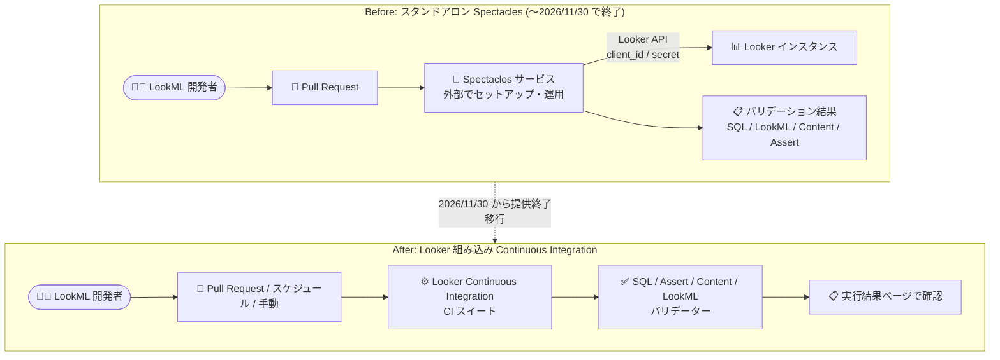

# Looker: レガシー スタンドアロン Spectacles サービスの提供終了を発表 (2026 年 11 月 30 日から)

**リリース日**: 2026-08-17

**サービス**: Looker

**機能**: レガシー スタンドアロン Spectacles サービスの提供終了 (Looker Continuous Integration への統合)

**ステータス**: Announcement (Deprecation)

📊 [このアップデートのインフォグラフィックを見る](https://takech9203.github.io/google-cloud-news-summary/20260817-looker-spectacles-discontinuation.html)

## 概要

Google Cloud は、Looker の LookML テスト自動化ツールとして利用されてきたレガシーのスタンドアロン Spectacles サービスを、**2026 年 11 月 30 日から提供終了 (discontinue)** することを発表しました。Looker の Continuous Integration (CI) 機能は Spectacles をベースに構築されており、Google は今後も Spectacles の機能を Looker の Continuous Integration に統合・進化させていく方針です。

Spectacles は、LookML プロジェクトに対して SQL / LookML / Content / Assert の 4 種類のバリデーションを実行し、本番環境に問題が反映される前にエラーを検出するためのツールとして、Looker の CI/CD ワークフローで広く利用されてきました。今回の発表により、スタンドアロン版 Spectacles の利用者は、Looker に組み込まれた Continuous Integration 機能への移行が必要になります。

既存の Spectacles 利用者には詳細を記載したメールが送付される予定です。質問やサポートが必要な場合の連絡先は **spectacles-support@google.com** です。

**アップデート前の課題**

- LookML の自動テスト (SQL / LookML / Content / Assert バリデーション) を行うには、Looker 本体とは別にスタンドアロンの Spectacles サービス (または CLI) をセットアップ・運用する必要があった
- Spectacles 用に Looker API 認証情報 (client_id / client_secret) を発行し、環境ごとの設定ファイル (config-dev.yaml など) を外部で管理する必要があった
- テストの実行やスケジューリングは Looker の外部 (CI パイプラインなど) で構成する必要があり、Looker の管理画面から一元管理できなかった

**アップデート後の改善**

- Spectacles の機能は Looker 組み込みの Continuous Integration 機能として統合され、Looker インスタンス上で CI スイートを作成・実行・結果確認まで一元的に行える
- CI バリデーションは、スケジュール実行、LookML リポジトリへの Pull Request 送信時の自動実行、手動実行のいずれのトリガーにも対応
- CI 有効化時に Looker CI 用のサービスアカウント (Looker CI Users) が自動作成されるため、外部ツール用の API 認証情報の手動管理が不要になる

## アーキテクチャ図

外部サービスとして運用していたスタンドアロン Spectacles が終了し、Looker インスタンスに組み込まれた Continuous Integration 機能 (CI スイート) に一本化されます。

## サービスアップデートの詳細

### 主要なポイント

1. **提供終了のスケジュール**
   - レガシーのスタンドアロン Spectacles サービスは 2026 年 11 月 30 日から提供終了 (discontinue)
   - 既存の Spectacles 利用者には詳細を記載したメールが送付される
   - 問い合わせ先: spectacles-support@google.com

2. **Spectacles 機能の Looker CI への統合**
   - Looker の Continuous Integration はレガシー スタンドアロン Spectacles サービスをベースに構築されている
   - Google は今後も Spectacles の機能を Looker の Continuous Integration に統合・進化させていく
   - Spectacles が提供していた 4 種類のバリデーター (SQL / LookML / Content / Assert) は、Looker CI で同等の機能が提供される

3. **Looker Continuous Integration の機能**
   - **SQL Validator**: Explore のディメンションがデータベースに対して正しく実行できるかを検証
   - **Assert Validator**: LookML の data test を実行し、失敗とエラーを報告
   - **Content Validator**: LookML プロジェクトに紐づく Look やダッシュボードのエラー (フィールド参照切れなど) を検出
   - **LookML Validator**: プロジェクト内の LookML の構文エラーを検証
   - これらを「CI スイート」として定義し、スケジュール / Pull Request / 手動のトリガーで実行できる

## 技術仕様

### スタンドアロン Spectacles と Looker CI の比較

| 項目 | スタンドアロン Spectacles (レガシー) | Looker Continuous Integration |
|------|-------------------------------------|-------------------------------|
| 提供形態 | Looker とは別の外部サービス / CLI | Looker 組み込み機能 |
| 認証 | Looker API の client_id / client_secret を設定ファイルで管理 | CI 有効化時に Looker CI ユーザー (サービスアカウント) が自動作成 |
| バリデーター | SQL / LookML / Content / Assert | SQL / Assert / Content / LookML (同等の 4 種類) |
| 実行トリガー | CLI / 外部 CI パイプラインから実行 | スケジュール、Pull Request、手動実行 |
| 結果確認 | CLI 出力や PR コメントなど | Looker の実行結果ページで確認 |
| 提供状況 | 2026 年 11 月 30 日から提供終了 | Public Preview (Pre-GA Offerings Terms 適用) |

### Looker Continuous Integration の利用要件

| 要件 | 内容 |
|------|------|
| インスタンス | Continuous Integration が有効化された Looker ホスト型インスタンス |
| Looker (Google Cloud core) の制約 | Public 接続 (secure) 構成のみサポート。CMEK 有効インスタンス、Private / Hybrid 接続構成では非サポート |
| CI ユーザー | CI 有効化時に「Looker CI Users」グループに 10 個の Looker CI ユーザーが自動作成される |
| GitHub 連携 | Pull Request をトリガーに CI を実行する場合は、GitHub 組織への CI GitHub アプリのインストールが必要 (全構成で推奨) |

## 移行 (設定) 方法

### 前提条件

1. Looker 管理者権限を持っていること
2. Looker ホスト型インスタンスであること (Looker (Google Cloud core) の場合は Public secure 接続構成)

### 手順

#### ステップ 1: Continuous Integration の有効化

Looker 管理パネルの「Continuous Integration」ページからインスタンスの CI を有効化します。有効化すると Looker CI ユーザーが自動作成されます。

#### ステップ 2: CI GitHub アプリのインストール

Pull Request トリガーで CI を実行する場合、GitHub 組織に CI GitHub アプリをインストールします (すべての実装で推奨)。

#### ステップ 3: CI スイートの作成

LookML プロジェクトに対して CI スイートを作成し、使用するバリデーター (SQL / Assert / Content / LookML) とオプション (対象 Explore、除外フォルダ、個人フォルダの除外、増分検証など)、トリガー (スケジュール / Pull Request / 手動) を設定します。

#### ステップ 4: 既存の Spectacles ワークフローの置き換え

スタンドアロン Spectacles の CLI 呼び出しや設定ファイル (config-*.yaml) に依存していた CI/CD パイプラインを、Looker CI スイートのトリガーに置き換え、2026 年 11 月 30 日までに移行を完了させます。

## メリット

### ビジネス面

- **運用負荷の削減**: 外部サービスのセットアップ・認証情報管理・保守が不要になり、Looker 内で完結する
- **継続的な機能進化**: Spectacles の機能が Looker CI に統合され、Google により継続的に開発・進化される

### 技術面

- **一元管理**: CI スイートの定義、実行、結果確認が Looker の UI 上で完結する
- **柔軟なトリガー**: スケジュール実行、Pull Request 連動、手動実行に対応し、既存の開発ワークフローに組み込みやすい
- **自動化されたサービスアカウント**: Looker CI ユーザーが自動作成され、API キーの手動発行・配布が不要

## デメリット・制約事項

### 制限事項

- スタンドアロン Spectacles は 2026 年 11 月 30 日から利用できなくなるため、期限までの移行が必須
- Looker Continuous Integration は現時点で Public Preview であり、Pre-GA Offerings Terms が適用される
- Looker (Google Cloud core) インスタンスでは、CMEK 有効、Private 接続、Hybrid 接続の構成では Looker CI がサポートされない

### 考慮すべき点

- 既存の CI/CD パイプラインで Spectacles CLI を直接呼び出している場合、パイプラインの再設計が必要
- CI Content Validator のスコーピングはポストプロセッシング (インスタンス全体を検証後にフィルタリング) であり、標準の Content Validator (検証前スコーピング) とは挙動が異なる
- 標準の Content Validator が持つフィールド名の一括置換や Look の削除などの修正機能は、CI Content Validator の役割 (検出) とは別であることに留意

## 関連サービス・機能

- **Looker Continuous Integration (CI スイート)**: Spectacles の後継となる組み込み CI 機能。SQL / Assert / Content / LookML の 4 バリデーターを提供
- **LookML data test**: Assert Validator が実行するテスト定義。モデルロジックの検証に使用
- **Looker Content Validator (標準)**: 手動実行のコンテンツ検証機能。フィールド名の置換や Look の削除などの修正操作が可能
- **GitHub (CI GitHub アプリ)**: Pull Request をトリガーとした CI 実行に必要な連携

## 参考リンク

- 📊 [インフォグラフィック](https://takech9203.github.io/google-cloud-news-summary/20260817-looker-spectacles-discontinuation.html)
- [公式リリースノート](https://docs.cloud.google.com/release-notes#August_17_2026)
- [Looker Continuous Integration の概要](https://docs.cloud.google.com/looker/docs/continuous-integration)
- [CI スイートの作成](https://docs.cloud.google.com/looker/docs/ci-create-suite)
- [CI スイートの実行](https://docs.cloud.google.com/looker/docs/ci-run-suite)
- [レガシー Spectacles を使用した CI/CD ワークフロー (参考)](https://docs.cloud.google.com/looker/docs/looker-cicd-usage)

## まとめ

Looker の LookML テスト自動化を支えてきたスタンドアロン Spectacles サービスが 2026 年 11 月 30 日から提供終了となり、その機能は Looker 組み込みの Continuous Integration に統合されます。現在 Spectacles を利用している場合は、期限までに Looker CI スイートへの移行計画を立て、CI の有効化・GitHub アプリのインストール・CI スイートの作成を進めることを推奨します。Looker (Google Cloud core) の CMEK / Private 接続構成では Looker CI が未サポートである点に注意し、該当する場合は spectacles-support@google.com への相談を検討してください。

---

**タグ**: Looker, Spectacles, Continuous Integration, CI/CD, LookML, Deprecation, 提供終了
