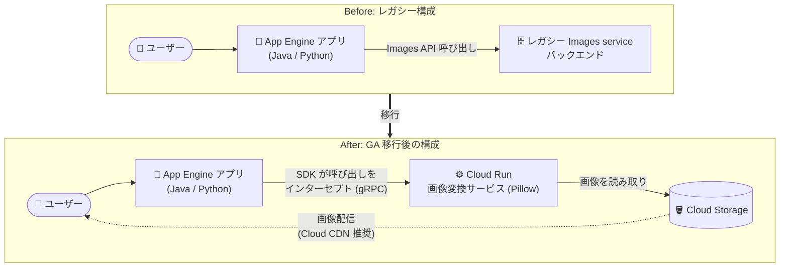

# App Engine standard environment (Java / Python): Images service から Cloud Run への移行が GA に

**リリース日**: 2026-08-18

**サービス**: App Engine standard environment (Java / Python)

**機能**: App Engine Images service から Cloud Run への移行サポート

**ステータス**: GA (一般提供)

📊 [このアップデートのインフォグラフィックを見る](https://takech9203.github.io/google-cloud-news-summary/20260818-app-engine-images-service-cloud-run-migration.html)

## 概要

App Engine スタンダード環境の Java および Python ランタイムにおいて、レガシーな **App Engine Images service** (バンドルサービス) から **Cloud Run** への移行サポートが一般提供 (GA) になりました。2026 年 7 月 7 日に Preview として発表された機能が、約 1 か月半で GA に昇格した形です。

この移行では、コンテナ化された画像変換サービス (image transformation service) を Cloud Run にデプロイし、App Engine アプリケーションからの Images service 呼び出しをそのサービスにルーティングします。App Engine services SDK が Images service の API 呼び出しをインターセプトし、gRPC 経由で Cloud Run サービスに転送するため、**画像処理コードの大幅な書き換えや、アプリケーション自体の Cloud Run への移行は不要**です。Cloud Run 上のサービスはオープンソースの [Pillow](https://pypi.org/project/pillow/) エンジンで画像を処理し、結果を App Engine アプリケーションに返します。

レガシーバンドルサービスに依存し続けている既存の App Engine アプリケーション (Java / Python) を運用しているチームにとって、モダナイゼーションへの現実的な第一歩となるアップデートです。なお、この仕組みは画像の「処理」と「配信」を分離する設計であり、画像の配信には Cloud Storage や Cloud CDN の利用が推奨されます。

**アップデート前の課題**

- App Engine Images service はレガシーなバンドルサービスであり、モダンなアーキテクチャへの移行パスが限られていた
- 移行しようとすると、画像処理コードの大幅な書き換えや、アプリケーション全体の Cloud Run への移植が必要になるケースがあった
- Preview 期間中 (2026 年 7 月〜) は Pre-GA Offerings Terms が適用され、本番環境での利用にはサポート面の制約があった

**アップデート後の改善**

- 移行機能が GA となり、SLA を含むフルサポートのもとで本番環境に適用可能になった
- App Engine services SDK が Images API 呼び出しを自動的に Cloud Run サービスへルーティングするため、アプリケーションコードの大幅な書き換えなしで移行できる
- 画像処理バックエンドが Pillow ベースのクラウドネイティブなサービスに置き換わり、レガシーバックエンドへの依存を解消できる

## アーキテクチャ図



移行後は、App Engine services SDK が Images service の呼び出しをインターセプトし、認証付きの Cloud Run 画像変換サービスに gRPC でルーティングします。画像処理 (リサイズ・切り抜き・回転など) は Cloud Run が担い、画像の配信は Cloud Storage / Cloud CDN が担う分離構成になります。

## サービスアップデートの詳細

### 主要機能

1. **ビルド済み画像変換サービスコンテナの提供**
   - Google が提供するビルド済みコンテナイメージを Cloud Run にデプロイするだけで、画像変換バックエンドを構築できる
   - 認証を強制した状態 (`--no-allow-unauthenticated`) でのデプロイが前提で、App Engine services SDK が呼び出し時の認証を処理する

2. **SDK による透過的なルーティング**
   - App Engine services SDK が既存の Images service API 呼び出しをインターセプトし、Cloud Run サービスに gRPC でルーティング
   - 環境変数 (`APPENGINE_USE_CUSTOM_IMAGES_GRPC_SERVICE`、`APPENGINE_IMAGES_SERVICE_ENDPOINT`) の設定でオプトインする方式のため、SDK をアップグレードしただけでは挙動は変わらない

3. **Pillow エンジンによる画像処理**
   - Cloud Run 上のサービスはオープンソースの Pillow エンジンで画像を処理
   - リサイズ、切り抜き、回転などの画像処理タスクに対応し、Cloud Storage 上の画像を読み取って処理できる

4. **Java / Python 両ランタイムでの GA**
   - Java は `appengine-api-1.0-sdk` (5.0.5-beta.1 以降) と `google-auth-library-oauth2-http` の依存関係追加で対応
   - Python は `appengine-python-standard>=3.0.0b0` の依存関係追加で対応

## 技術仕様

### 移行の構成要素

| 項目 | 詳細 |
|------|------|
| 対象ランタイム | App Engine スタンダード環境 Java / Python (サポート対象バージョン) |
| 画像処理エンジン | Pillow (オープンソース) |
| 通信プロトコル | gRPC |
| 認証 | Cloud Run Invoker (`roles/run.invoker`) を App Engine デフォルトサービスアカウントに付与 |
| 画像読み取り | Storage Object Viewer (`roles/storage.objectViewer`) を Compute Engine デフォルトサービスアカウントに付与 |
| 有効化方法 | 環境変数 `APPENGINE_USE_CUSTOM_IMAGES_GRPC_SERVICE=true` と `APPENGINE_IMAGES_SERVICE_ENDPOINT` の設定 |
| 推奨デプロイ先 | App Engine サービスと同一リージョンの Cloud Run |

## 設定方法

### 前提条件

1. App Engine アプリケーションのソースコードにアクセスできること
2. Cloud Run Admin API と Artifact Registry API が有効化されていること
3. デプロイアカウントに必要な IAM ロール (Cloud Run Source Developer、Service Usage Consumer、Service Account User など) が付与されていること

### 手順

#### ステップ 1: 画像変換サービスを Cloud Run にデプロイ

```bash
gcloud run deploy image-processing-service \
  --image=us-central1-docker.pkg.dev/gae-bundled-services-images/image-processing-service-staging/image-processing-service:public-image-d476f7ef9d1b \
  --no-allow-unauthenticated \
  --region=REGION
```

認証を強制した状態でビルド済みコンテナをデプロイし、サービス URL (例: `https://image-processing-service-xyz-uc.a.run.app`) を控えます。App Engine サービスと同一リージョンへのデプロイが推奨されます。

#### ステップ 2: IAM ロールを付与

```bash
# App Engine デフォルト SA に Cloud Run Invoker を付与
gcloud run services add-iam-policy-binding image-processing-service \
  --member="serviceAccount:PROJECT_ID@appspot.gserviceaccount.com" \
  --role="roles/run.invoker" \
  --region=REGION

# 画像変換サービスが Cloud Storage の画像を読めるようにする
gcloud projects add-iam-policy-binding PROJECT_ID \
  --member="serviceAccount:PROJECT_NUMBER-compute@developer.gserviceaccount.com" \
  --role="roles/storage.objectViewer"
```

App Engine アプリからプライベートな Cloud Run サービスへの認証付き呼び出しと、Cloud Storage 上の画像読み取りを許可します。

#### ステップ 3: アプリケーションを構成してデプロイ (Python の例)

`requirements.txt` に依存関係を追加します。

```
appengine-python-standard>=3.0.0b0
```

`app.yaml` で Images service と環境変数を設定します。

```yaml
runtime: RUNTIME  # サポート対象の Python バージョン
app_engine_bundled_services:
  - images
env_variables:
  APPENGINE_USE_CUSTOM_IMAGES_GRPC_SERVICE: "true"
  APPENGINE_IMAGES_SERVICE_ENDPOINT: "RUN_SERVICE_URL"
```

```bash
gcloud app deploy
```

Java の場合は `pom.xml` に `appengine-api-1.0-sdk` (5.0.5-beta.1 以降) と `google-auth-library-oauth2-http` を追加し、`appengine-web.xml` の `<app-engine-bundled-services>` と `<env-variables>` で同様の設定を行います。

## メリット

### ビジネス面

- **本番適用が可能に**: GA 昇格により Pre-GA Offerings Terms の制約がなくなり、本番ワークロードで安心して利用できる
- **段階的なモダナイゼーション**: アプリケーション全体を移植することなく、レガシー依存部分 (画像処理) だけを先行してモダナイズできる

### 技術面

- **コード書き換えの最小化**: SDK が API 呼び出しを透過的にルーティングするため、既存の画像処理コードの大幅な変更が不要
- **処理と配信の分離**: 画像処理は Cloud Run、配信は Cloud Storage / Cloud CDN という責務分離により、スケーラビリティと保守性が向上
- **オプトイン方式**: 環境変数で明示的に有効化する方式のため、SDK 更新による意図しない挙動変更が起きない

## デメリット・制約事項

### 制限事項

- カスタム画像処理サービスの利用時は **serving URL を生成できない**。`get_serving_url()` (Python) / `getServingUrl()` (Java) を呼び出すとランタイム例外がスローされる
- 過去にレガシー API で生成した既存の serving URL は引き続き画像を配信する
- SDK をアップグレードしただけでは Cloud Run へのルーティングは有効にならず、環境変数 (`APPENGINE_USE_CUSTOM_IMAGES_GRPC_SERVICE`、`APPENGINE_IMAGES_SERVICE_ENDPOINT`) の設定が必要

### 考慮すべき点

- 画像の配信には Cloud Storage の URL から直接配信するか、Cloud CDN を組み合わせた構成への移行が推奨される
- Cloud Run サービスの実行コストが新たに発生する (従来のバンドルサービスとはコストモデルが異なる)
- Cloud Run サービスは App Engine サービスと同一リージョンにデプロイすることが推奨される

## ユースケース

### ユースケース 1: レガシー App Engine アプリの段階的モダナイゼーション

**シナリオ**: 長年運用している Python 2 系から移行済みの App Engine アプリが、サムネイル生成に Images service を利用している。アプリ全体の Cloud Run 移行は工数的に難しいが、レガシーバンドルサービスへの依存は解消したい。

**効果**: 画像処理部分だけを Cloud Run の画像変換サービスに切り出すことで、アプリ本体は App Engine で稼働させたままレガシー依存を解消できる。将来的なフル移行への足がかりにもなる。

### ユースケース 2: 画像配信アーキテクチャの近代化

**シナリオ**: `get_serving_url()` に依存した画像配信を行っており、配信性能やキャッシュ制御に課題がある。

**効果**: 移行を機に、画像処理は Cloud Run、配信は Cloud Storage + Cloud CDN という構成に再編することで、キャッシュ戦略やグローバル配信の柔軟性が向上する。

## 料金

移行後の画像変換サービスは Cloud Run 上で稼働するため、Cloud Run の料金体系 (リクエスト数、vCPU / メモリの使用時間に基づく従量課金) が適用されます。詳細は料金ページを参照してください。

- [Cloud Run の料金](https://cloud.google.com/run/pricing)
- [App Engine の料金](https://cloud.google.com/appengine/pricing)

## 関連サービス・機能

- **Cloud Run**: 画像変換サービスのホスティング先。認証付きプライベートサービスとしてデプロイする
- **Cloud Storage**: 処理対象の画像の保存先。移行後の画像配信元としても推奨される
- **Cloud CDN**: Cloud Storage バケットと組み合わせた画像配信の高速化に推奨
- **IAM**: Cloud Run Invoker / Storage Object Viewer ロールによるサービス間のアクセス制御
- **Artifact Registry**: ビルド済み画像変換サービスコンテナの取得元

## 参考リンク

- 📊 [インフォグラフィック](https://takech9203.github.io/google-cloud-news-summary/20260818-app-engine-images-service-cloud-run-migration.html)
- [公式リリースノート (2026 年 8 月 18 日)](https://docs.cloud.google.com/release-notes#August_18_2026)
- [Java: Migrate from the App Engine Images service to Cloud Run](https://docs.cloud.google.com/appengine/migration-center/standard/java/images-to-cloud-run)
- [Python: Migrate from the App Engine Images service to Cloud Run](https://docs.cloud.google.com/appengine/migration-center/standard/python/images-to-cloud-run)
- [App Engine Images service (レガシーバンドルサービス)](https://docs.cloud.google.com/appengine/docs/standard/services/images)
- [Cloud Run の料金](https://cloud.google.com/run/pricing)

## まとめ

App Engine Images service から Cloud Run への移行サポートが Java / Python 両ランタイムで GA となり、本番環境でレガシーバンドルサービスからの脱却を進められるようになりました。コードの大幅な書き換えなしに画像処理バックエンドをモダナイズできるため、Images service に依存する App Engine アプリを運用しているチームは、serving URL の制限事項を確認したうえで移行を検討することをおすすめします。

---

**タグ**: #AppEngine #CloudRun #Java #Python #Migration #GA #Serverless
