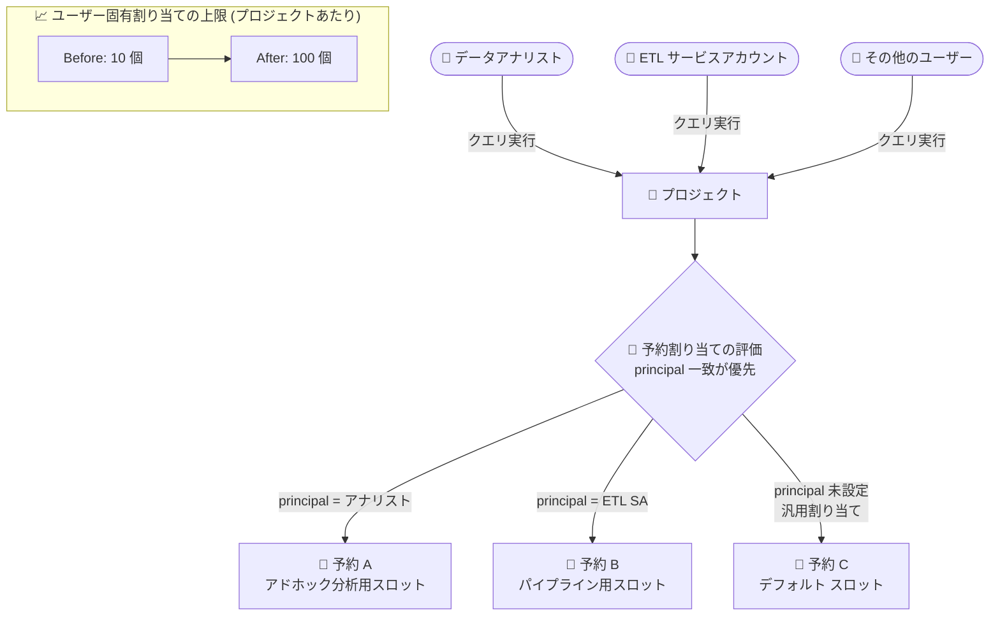

# BigQuery: ユーザー固有の予約割り当て (Reservation Assignments) のデフォルト上限が 10 から 100 に引き上げ

**リリース日**: 2026-08-18

**サービス**: BigQuery

**機能**: ユーザー固有の予約割り当てのプロジェクトあたりデフォルト上限の引き上げ (10 → 100)

**ステータス**: 機能アップデート (対象機能「ユーザー固有の予約割り当て」はプレビュー)

📊 [このアップデートのインフォグラフィックを見る](https://takech9203.github.io/google-cloud-news-summary/20260818-bigquery-reservation-assignments-limit-increase.html)

## 概要

BigQuery のユーザー固有の予約割り当て (user-specific reservation assignments) について、プロジェクトあたりのデフォルト上限が従来の 10 個から 100 個に引き上げられました。ユーザー固有の予約割り当ては、予約割り当てにオプションの `principal` プロパティを指定することで、ジョブを実行するユーザー、サービスアカウント、またはサードパーティ ID (Workforce / Workload Identity Pool の単一 ID) に基づいて、クエリを特定の予約 (Reservation) にルーティングできるプレビュー機能です。

同一の割り当て先リソース内では、`principal` が一致する割り当てが、`principal` 未設定の汎用的な割り当てより優先されます。これにより、管理者は「特定の分析チームのサービスアカウントは大容量の予約へ」「アドホック クエリを実行する一般ユーザーは小規模な予約へ」といった、ID ベースのきめ細かいワークロード管理を実現できます。

今回の上限引き上げにより、多数のユーザーやサービスアカウントを抱える大規模組織でも、クォータ引き上げ申請なしで ID ベースのワークロード ルーティングを広範囲に適用できるようになりました。BigQuery Editions で予約を運用し、部門・チーム・パイプライン単位で細かくスロットを制御したい管理者にとって有用なアップデートです。

**アップデート前の課題**

- ユーザー固有の予約割り当てはプロジェクトあたりデフォルト 10 個までに制限されており、多数のユーザーやサービスアカウントを個別にルーティングするには不十分だった
- 上限を超えて ID ベースのルーティングを構成するには、Google へ個別に上限緩和を依頼する必要があった
- 大規模組織では、ユーザー単位の細かいワークロード分離を諦め、プロジェクト単位の粗い割り当てで妥協するケースがあった

**アップデート後の改善**

- プロジェクトあたりのデフォルト上限が 100 個に拡大され、10 倍の規模で ID ベースのルーティングを構成可能になった
- 多くのユースケースで上限緩和申請が不要になり、セルフサービスで大規模なワークロード管理を構築できるようになった
- チーム・パイプライン・サービスアカウント単位での予約の使い分けを、より広範囲に適用できるようになった

## アーキテクチャ図



ジョブを実行する ID (`principal`) に基づいてクエリを異なる予約にルーティングする仕組みと、今回引き上げられたプロジェクトあたりの割り当て上限を示しています。

## サービスアップデートの詳細

### 主要機能

1. **ユーザー固有の予約割り当てのデフォルト上限引き上げ**
   - プロジェクトあたりのユーザー固有割り当て (principal 付き割り当て) のデフォルト上限が 10 個から 100 個に増加
   - 100 個を超える上限が必要な場合は、従来どおり bigquery-wlm-feedback@google.com への連絡で個別対応を依頼可能

2. **ID ベースのクエリ ルーティング (前提となるプレビュー機能)**
   - 予約割り当てのオプション `principal` プロパティにユーザー、サービスアカウント、サードパーティ ID を指定
   - 同一の割り当て先リソース内では、principal が一致する割り当てが汎用割り当てより優先される
   - プロジェクトレベルの汎用割り当てが存在する場合でも、同レベルにユーザー固有割り当てを作成することで特定ユーザーを確実にルーティング可能

3. **評価ロジック**
   - BigQuery はリソース階層 (プロジェクト > フォルダ > 組織) の優先順位で割り当てを評価
   - その中で principal 一致の割り当てが汎用割り当てに優先する

## 技術仕様

### ユーザー固有の予約割り当て

| 項目 | 詳細 |
|------|------|
| プロジェクトあたりのデフォルト上限 | **100 個** (従来は 10 個) |
| principal に指定可能な ID | Google アカウント、サービスアカウント、Workforce Identity Pool の単一 ID、Workload Identity Pool の単一 ID |
| 優先順位 | 同一割り当て先リソース内で principal 一致 > principal 未設定の汎用割り当て |
| 対応ジョブタイプ | QUERY、CONTINUOUS、PIPELINE、BACKGROUND、ML_EXTERNAL など |
| 機能ステータス | プレビュー (Pre-GA Offerings Terms が適用) |
| 上限のさらなる引き上げ | bigquery-wlm-feedback@google.com へ連絡 |

### 必要な IAM 権限

予約割り当ての作成には、管理プロジェクトと割り当て先の両方に対して以下の権限が必要です。

| 権限 | 含まれる事前定義ロール |
|------|------------------------|
| `bigquery.reservationAssignments.create` | BigQuery 管理者、BigQuery リソース管理者、BigQuery リソース編集者 |

## 設定方法

### 前提条件

1. BigQuery Editions (Enterprise / Enterprise Plus など) の予約が作成済みであること
2. 管理プロジェクトと割り当て先に対する `bigquery.reservationAssignments.create` 権限を持っていること

### 手順

#### ステップ 1: SQL (DDL) でユーザー固有の割り当てを作成

```sql
CREATE ASSIGNMENT
  `ADMIN_PROJECT_ID.region-LOCATION.RESERVATION_NAME.ASSIGNMENT_ID`
OPTIONS (
  assignee = "projects/PROJECT_ID",
  job_type = "QUERY",
  principal = "user@example.com"
);
```

`principal` に、ルーティング対象のユーザー、サービスアカウント、またはサードパーティ ID を指定します。

#### ステップ 2: bq コマンドラインでの作成・確認

```bash
# ユーザー固有の割り当てを作成
bq mk \
  --project_id=ADMIN_PROJECT_ID \
  --location=LOCATION \
  --reservation_assignment \
  --reservation_id=RESERVATION_NAME \
  --assignee_type=PROJECT \
  --assignee_id=PROJECT_ID \
  --job_type=QUERY \
  --principal=PRINCIPAL

# ユーザー固有の割り当てを確認
bq show \
  --project_id=ADMIN_PROJECT_ID \
  --location=LOCATION \
  --reservation_assignment \
  --job_type=QUERY \
  --assignee_id=PROJECT_ID \
  --assignee_type=PROJECT \
  --principal=PRINCIPAL
```

Google Cloud コンソールでは、「ワークロード管理 (Workload management)」ページ (「容量管理」から名称変更) の「予約」タブから割り当てを作成し、「ユーザー」フィールドに ID のメールアドレスを入力します。有効なユーザー固有割り当ては `INFORMATION_SCHEMA.ASSIGNMENTS` ビューの `principal` 列でも確認できます。

## メリット

### ビジネス面

- **大規模組織への適用性向上**: 数十人規模のチームや多数のサービスアカウントに対して、上限緩和申請なしで ID ベースのスロット管理を展開できる
- **運用負荷の軽減**: クォータ引き上げ依頼とその待ち時間が不要になり、セルフサービスで迅速にワークロード管理を構成できる

### 技術面

- **きめ細かいワークロード分離**: 同一プロジェクト内でも、ユーザーやサービスアカウントごとに異なる予約 (スロットプール) へクエリをルーティングできる範囲が 10 倍に拡大
- **既存構成との互換性**: 上限値の変更のみであり、既存の割り当ての動作や評価ロジックに変更はない

## デメリット・制約事項

### 制限事項

- ユーザー固有の予約割り当て機能自体は引き続きプレビューであり、Pre-GA Offerings Terms が適用される (サポートが限定的な場合がある)
- `principal` に指定できるのは単一 ID のみで、グループ単位での指定はサポートされない (Workforce / Workload Identity Pool も単一 ID のみ)
- 100 個を超える割り当てが必要な場合は、引き続き bigquery-wlm-feedback@google.com への個別依頼が必要

### 考慮すべき点

- ユーザー固有割り当てが増えるほどルーティング構成が複雑になるため、`INFORMATION_SCHEMA.ASSIGNMENTS` での棚卸しや命名規則の整備を推奨
- 割り当て作成後は反映まで少なくとも 5 分待ってからクエリを実行しないと、オンデマンド料金で課金される可能性がある

## ユースケース

### ユースケース 1: 部門横断の共有プロジェクトでのチーム別スロット管理

**シナリオ**: 複数チームが同一プロジェクトで BigQuery を利用しており、重要な BI ワークロードを実行するチームのメンバー (数十人) にだけ専用予約のスロットを確保したい。

**実装例**:
```sql
-- BI チームのメンバーごとにユーザー固有割り当てを作成 (最大 100 個/プロジェクト)
CREATE ASSIGNMENT
  `admin-proj.region-us.bi-reservation.assign-bi-user01`
OPTIONS (
  assignee = "projects/shared-analytics",
  job_type = "QUERY",
  principal = "bi-user01@example.com"
);
```

**効果**: 従来の上限 10 個では対応できなかった数十人規模のチームでも、メンバー個別に専用予約へルーティングでき、他チームのアドホック クエリの影響を受けない安定した BI 実行環境を確保できる。

### ユースケース 2: 多数のサービスアカウントによるパイプラインの分離

**シナリオ**: ETL / ELT パイプラインごとに専用のサービスアカウントを発行しており、重要度に応じてパイプラインを異なる予約 (ベースラインスロット大 / 小) に振り分けたい。

**効果**: サービスアカウント単位で最大 100 個までルーティングルールを定義できるため、パイプラインの重要度に応じたスロット配分を大規模に自動化でき、クリティカルなジョブの SLA を保護できる。

## 料金

ユーザー固有の予約割り当ての作成自体に追加料金はありません。予約 (Reservation) は BigQuery Editions (Standard / Enterprise / Enterprise Plus) のスロット料金に基づいて課金されます。詳細は料金ページを参照してください。

- [BigQuery の料金](https://cloud.google.com/bigquery/pricing)

## 利用可能リージョン

BigQuery の予約 (Editions) が利用可能なリージョンで使用できます。リージョンごとのスロット上限などの詳細は [BigQuery の割り当てと上限](https://docs.cloud.google.com/bigquery/quotas) を参照してください。

## 関連サービス・機能

- **BigQuery Editions (Enterprise / Enterprise Plus)**: 予約とスロットの購入単位。ユーザー固有割り当ての前提となる予約を作成する
- **IAM (Workforce / Workload Identity Federation)**: `principal` に指定するサードパーティ ID の基盤。単一 ID の識別子形式で指定する
- **INFORMATION_SCHEMA (ASSIGNMENTS / JOBS ビュー)**: 有効なユーザー固有割り当ての確認や、どの予約でジョブが実行されたかの検証に使用
- **予約割り当ての principal プロパティ (同日発表)**: 本上限引き上げの対象であるユーザー固有ルーティング機能。同日のリリースノートで正式に案内された

## 参考リンク

- 📊 [インフォグラフィック](https://takech9203.github.io/google-cloud-news-summary/20260818-bigquery-reservation-assignments-limit-increase.html)
- [公式リリースノート](https://docs.cloud.google.com/release-notes#August_18_2026)
- [予約割り当ての操作 (公式ドキュメント)](https://docs.cloud.google.com/bigquery/docs/reservations-assignments)
- [予約を使用したワークロード管理](https://docs.cloud.google.com/bigquery/docs/reservations-workload-management)
- [BigQuery の割り当てと上限](https://docs.cloud.google.com/bigquery/quotas)
- [料金ページ](https://cloud.google.com/bigquery/pricing)

## まとめ

ユーザー固有の予約割り当てのデフォルト上限が 10 から 100 に引き上げられたことで、大規模組織でも上限緩和申請なしに ID ベースのきめ細かいワークロード ルーティングを展開できるようになりました。BigQuery Editions で予約を運用している場合は、チームやサービスアカウント単位のスロット分離をこの機会に見直し、`INFORMATION_SCHEMA.ASSIGNMENTS` で現状の割り当てを棚卸ししたうえで、principal ベースのルーティング活用を検討することを推奨します。

---

**タグ**: BigQuery, Reservations, ワークロード管理, スロット, クォータ, principal, Editions
