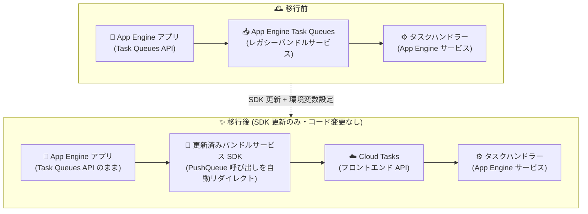

# App Engine スタンダード環境: バンドルサービス SDK 更新による Push キューの Cloud Tasks 移行 (Preview)

**リリース日**: 2026-08-19

**サービス**: App Engine standard environment (Go / Java / Python)

**機能**: バンドルサービス SDK の更新による Push キューの Cloud Tasks 移行

**ステータス**: Preview

📊 [このアップデートのインフォグラフィックを見る](https://takech9203.github.io/google-cloud-news-summary/20260819-app-engine-push-queues-cloud-tasks-migration.html)

## 概要

App Engine スタンダード環境 (Go、Java、Python) において、バンドルサービス SDK (App Engine services SDK) を更新するだけで、App Engine の Push キュー (Task Queues) を Cloud Tasks に移行できる新しい方法が Preview として発表されました。この方法では、SDK が `PushQueue` の呼び出しを Cloud Tasks のフロントエンド API に自動的にリダイレクトするため、アプリケーションコードを修正することなく移行が完了します。

従来、Task Queues から Cloud Tasks への移行は Cloud Tasks クライアントライブラリへのコード書き換えが必要であり、レガシーバンドルサービスに依存する多くの既存アプリケーションにとって大きな移行障壁となっていました。今回のアップデートにより、既存のキューとタスクはそのまま保持され、データ移行も不要なため、長年運用されてきた App Engine アプリケーションのモダナイゼーションが大幅に容易になります。

対象ユーザーは、App Engine スタンダード環境で Task Queues API (Push キュー) を利用している Go、Java、Python アプリケーションの開発者・運用者です。

**アップデート前の課題**

このアップデート以前は、Push キューを Cloud Tasks に移行するにはコードのリファクタリングが必要でした。

- Cloud Tasks クライアントライブラリへの移行では、Push キューを作成・操作するすべてのコードを書き換える必要があった
- Cloud Tasks API 直接利用への移行では、Datastore トランザクション内でのタスクのエンキュー、deferred タスクライブラリ、マルチテナント (Namespace) 対応、ローカル開発サーバーでのシミュレーション、非同期タスク追加といった Task Queues 固有の機能が利用できなかった
- レガシーバンドルサービスに深く依存したアプリケーションでは、移行コストが高く、モダナイゼーションが進めにくかった

**アップデート後の改善**

- バンドルサービス SDK を最新版に更新し、環境変数を設定するだけで、アプリケーションコードを変更せずに Push キューを Cloud Tasks に移行できるようになった
- 既存のキューとタスクはそのまま保持されるため、キューやタスクの再作成・データ移行が不要になった
- SDK ラッパー経由で deferred タスク、Namespace、ローカルシミュレーション、Datastore トランザクション内のタスクエンキューなどの機能が引き続きサポートされる
- バッチタスク作成 (1 回の呼び出しで最大 100 タスク) やタスク単位のリトライ設定にも対応

## アーキテクチャ図



移行前はレガシーバンドルサービスの Task Queues がタスクを処理していましたが、SDK 更新後は同じ Task Queues API 呼び出しが SDK ラッパーによって Cloud Tasks へ自動的にリダイレクトされます。アプリケーションコードとタスクハンドラーは変更不要です。

## サービスアップデートの詳細

### 主要機能

1. **コード変更不要の移行パス**
   - バンドルサービス SDK を最新版に更新すると、`PushQueue` の呼び出しが Cloud Tasks のフロントエンド API に自動的にリダイレクトされる
   - 既存のキューとタスクはそのまま保持されるため、データ移行は不要
   - 環境変数 `APPENGINE_USE_CLOUDTASK_PUSH_QUEUE: "true"` で切り替えを制御

2. **Task Queues 固有機能の継続サポート**
   - Cloud Tasks クライアントライブラリへの直接移行では利用できなかった deferred タスク、Namespace、ローカルシミュレーションが SDK ラッパー経由でサポートされる
   - Datastore トランザクション内でのタスクエンキュー (トランザクショナルタスク) にも対応 (cron によるスイープ設定が必要)

3. **拡張されたタスク管理機能**
   - バッチタスク作成: 1 回の呼び出しで最大 100 タスクを作成可能
   - タスクレベルのリトライ: タスクごとにリトライ構成を指定可能

4. **対象ランタイム**
   - App Engine スタンダード環境の Go、Java、Python の各ランタイムで同日に Preview として提供開始

## 技術仕様

### 移行方式の比較

| 項目 | SDK 更新による移行 (今回の新機能) | Cloud Tasks クライアントライブラリへの移行 (従来) |
|------|----------------------------------|--------------------------------------------------|
| コード変更 | 不要 (SDK 更新と環境変数設定のみ) | 必要 (タスク作成・操作コードの書き換え) |
| 既存キュー・タスク | そのまま保持 | そのまま保持 (ただし操作コードは書き換え) |
| deferred タスク | サポート | 非サポート (ワーカーサービスが必要) |
| Namespace (マルチテナント) | サポート | 非サポート |
| ローカル開発サーバーでのシミュレーション | サポート | 非サポート |
| Datastore トランザクション内のエンキュー | サポート (cron スイープ設定が必要) | 非サポート |
| ステータス | Preview | GA |

### 必要な設定 (Go の例)

| 項目 | 詳細 |
|------|------|
| SDK バージョン | `google.golang.org/appengine/v2` を `v2.1.0-preview` 以降に更新 |
| 有効化する API | Cloud Tasks API、Cloud Scheduler API |
| IAM ロール | App Engine サービスアカウントに Cloud Tasks Enqueuer (`roles/cloudtasks.enqueuer`) をプロジェクトレベルで付与 |
| 環境変数 | `APPENGINE_USE_CLOUDTASK_PUSH_QUEUE: "true"` |
| トランザクショナルタスク利用時 | `cron.yaml` に `/_ah/cloudtask/sweep` を定期実行するジョブを追加 (例: 30 分ごと) |

## 設定方法

### 前提条件

1. App Engine アプリのソースコードにアクセスできること
2. Cloud Tasks API と Cloud Scheduler API が有効化されていること
3. App Engine サービスアカウントに Cloud Tasks Enqueuer ロール (`roles/cloudtasks.enqueuer`) が付与されていること
4. Pull キューを利用している場合は、Push キューより先に Pull キューの移行を完了しておくこと (公式ガイド推奨)

### 手順 (Go の例)

#### ステップ 1: バンドルサービス SDK の更新

```bash
# go.mod で SDK バージョンを更新
go get google.golang.org/appengine/v2@v2.1.0-preview
```

`go.mod` の `google.golang.org/appengine/v2` を `v2.1.0-preview` 以降に更新します。Java、Python も各言語向けの移行ガイドに従って SDK を最新版に更新します。

#### ステップ 2: 環境変数の設定

```yaml
# app.yaml
env_variables:
  APPENGINE_USE_CLOUDTASK_PUSH_QUEUE: "true"
```

アプリ構成ファイルに環境変数を追加し、Push キュー呼び出しの Cloud Tasks へのルーティングを有効化します。

#### ステップ 3: デプロイと確認

```bash
gcloud app deploy
```

デプロイ後、Cloud Tasks コンソールでアプリが Cloud Tasks を使用していることを確認します。

#### ステップ 4 (任意): トランザクショナルタスク用の cron 設定

```yaml
# cron.yaml
cron:
- description: "sweep transactional tasks"
  url: /_ah/cloudtask/sweep
  schedule: every 30 minutes
```

Datastore トランザクション内でタスクをエンキューしている場合、コミット時にエンキューに失敗したタスクを回収するためのスイープジョブを設定します。

## メリット

### ビジネス面

- **移行コストの大幅削減**: アプリケーションコードの書き換えが不要なため、開発工数とテスト工数を最小限に抑えてレガシーサービスから脱却できる
- **モダナイゼーションの加速**: レガシーバンドルサービスへの依存を解消し、Cloud Tasks という独立したマネージドサービスへの移行を低リスクで進められる

### 技術面

- **機能の互換性維持**: deferred タスク、Namespace、ローカルシミュレーションなど、クライアントライブラリ移行では失われていた Task Queues 固有機能が SDK ラッパー経由で維持される
- **データ移行不要**: 既存のキューとタスクがそのまま保持されるため、切り替えに伴うタスク消失や再作成のリスクがない
- **機能拡張**: バッチタスク作成 (最大 100 タスク/呼び出し) やタスクレベルのリトライ構成など、Cloud Tasks の機能も活用できる

## デメリット・制約事項

### 制限事項

- **Preview 段階**: Pre-GA 提供条件が適用され、サポートが限定される可能性がある。本番環境への適用は慎重に判断が必要
- **対象ランタイム**: App Engine スタンダード環境の Go、Java、Python が対象 (各言語の移行ガイドを参照)
- **トランザクショナルタスク**: Datastore トランザクション内のエンキューを利用する場合、`/_ah/cloudtask/sweep` への cron ジョブ設定が別途必要

### 考慮すべき点

- **コスト増の可能性**: Task Queues は無料だったのに対し、Cloud Tasks はタスクの作成・削除・管理などのオペレーションごとに課金される。移行前に Cloud Tasks の料金ページで月額コストを見積もることが推奨される
- **クォータの変化**: Cloud Tasks のリクエストは App Engine のリクエストクォータにカウントされるほか、Cloud Tasks 固有のクォータも適用されるため、移行によりクォータの状況が変わる可能性が高い
- **Pull キューの先行移行**: Pull キューを併用している場合は Push キューより先に移行する必要がある。順序を逆にすると `queue.yaml` の使用により予期しない動作が発生する可能性がある
- **queue.yaml の扱い**: 移行開始後は `queue.yaml` の変更が予期しない動作を引き起こす可能性があるため、`.gcloudignore` への追加や権限制限による保護が推奨される

## ユースケース

### ユースケース 1: レガシー App Engine アプリの段階的モダナイゼーション

**シナリオ**: 長年運用している Python 製 App Engine アプリが Task Queues API に深く依存しており、deferred タスクや Namespace も活用しているため、Cloud Tasks クライアントライブラリへの書き換えを断念していた。

**実装例**:
```yaml
# app.yaml に環境変数を追加し、SDK を最新版に更新するだけ
env_variables:
  APPENGINE_USE_CLOUDTASK_PUSH_QUEUE: "true"
```

**効果**: コードを書き換えることなく Push キューのバックエンドを Cloud Tasks に切り替えられ、deferred タスクや Namespace も維持したままレガシーサービスへの依存を解消できる。

### ユースケース 2: 移行リスクを抑えた本番切り替えの検証

**シナリオ**: 本番稼働中の Java アプリで、Cloud Tasks への移行による動作影響を最小化しながら検証を進めたい。

**効果**: 環境変数による切り替え方式のため、ステージング環境で SDK 更新版をデプロイして動作検証を行い、問題があれば環境変数を戻すことで切り戻しも容易。既存のキューとタスクが保持されるため、検証時のデータ再作成も不要。

## 料金

この移行機能自体に追加料金はありませんが、移行後は Cloud Tasks の料金体系が適用されます。Task Queues では無料だったタスクの作成・削除・管理などのオペレーションが課金対象となるため、移行前にコスト見積もりが推奨されます。なお、Cloud Tasks から App Engine アプリへの Push 配信リクエスト自体は Task Queues と同様に無料です。

### Cloud Tasks の料金 (課金対象オペレーション: API 呼び出しまたは Push 配信試行、32 KB 単位でチャンク化)

| 月間課金対象オペレーション数 | 料金 (100 万オペレーションあたり) |
|--------|-----------------|
| 最初の 100 万 | 無料 |
| 50 億まで | $0.40 |
| 50 億超 | 営業に問い合わせ |

詳細は [Cloud Tasks の料金ページ](https://cloud.google.com/tasks/pricing) を参照してください。

## 利用可能リージョン

リージョン固有の制限に関する公式情報は確認できませんでした。App Engine および Cloud Tasks の利用可能リージョンについては [Cloud Tasks のドキュメント](https://cloud.google.com/tasks/docs) を参照してください。

## 関連サービス・機能

- **Cloud Tasks**: 移行先となるフルマネージドのタスクキューサービス。キューとタスクの管理、レート制御、リトライ制御を提供
- **Cloud Scheduler**: 本移行機能の前提として API の有効化が必要。cron ジョブのマネージド実行を提供
- **Datastore / Firestore**: トランザクション内でのタスクエンキュー (トランザクショナルタスク) と連携。SDK ラッパー経由で引き続き利用可能
- **App Engine バンドルサービス (レガシー)**: 今回の SDK 更新の対象。Task Queues のほか Memcache、Mail などのレガシーサービス群
- **Cloud Run**: App Engine からのさらなるモダナイゼーション先の選択肢。Cloud Tasks は Cloud Run へのタスク配信にも対応

## 参考リンク

- 📊 [インフォグラフィック](https://takech9203.github.io/google-cloud-news-summary/20260819-app-engine-push-queues-cloud-tasks-migration.html)
- [公式リリースノート](https://docs.cloud.google.com/release-notes#August_19_2026)
- [Push キュー移行ガイド (Go)](https://cloud.google.com/appengine/migration-center/standard/go/migrating-push-queues-upgrade-sdk)
- [Push キュー移行ガイド (Java)](https://docs.cloud.google.com/appengine/migration-center/standard/java/migrating-push-queues-upgrade-sdk)
- [Push キュー移行ガイド (Python)](https://docs.cloud.google.com/appengine/migration-center/standard/python/migrating-push-queues-upgrade-sdk)
- [Push キュー移行の概要 (Python)](https://docs.cloud.google.com/appengine/migration-center/standard/python/migrating-push-queues-overview)
- [Cloud Tasks 料金ページ](https://cloud.google.com/tasks/pricing)
- [Cloud Tasks クォータ](https://cloud.google.com/tasks/docs/quotas)

## まとめ

このアップデートにより、App Engine スタンダード環境 (Go / Java / Python) の Push キューを、アプリケーションコードを変更することなく Cloud Tasks へ移行できるようになり、レガシーバンドルサービスからの脱却の障壁が大きく下がりました。Task Queues に依存する既存アプリを運用しているチームは、まずステージング環境で SDK 更新と環境変数設定による切り替えを検証し、Cloud Tasks の料金・クォータへの影響を見積もった上で移行計画を策定することを推奨します。Preview 機能のため、本番適用は Pre-GA 提供条件を確認の上で判断してください。

---

**タグ**: #AppEngine #CloudTasks #TaskQueues #Migration #Go #Java #Python #Preview #Serverless
