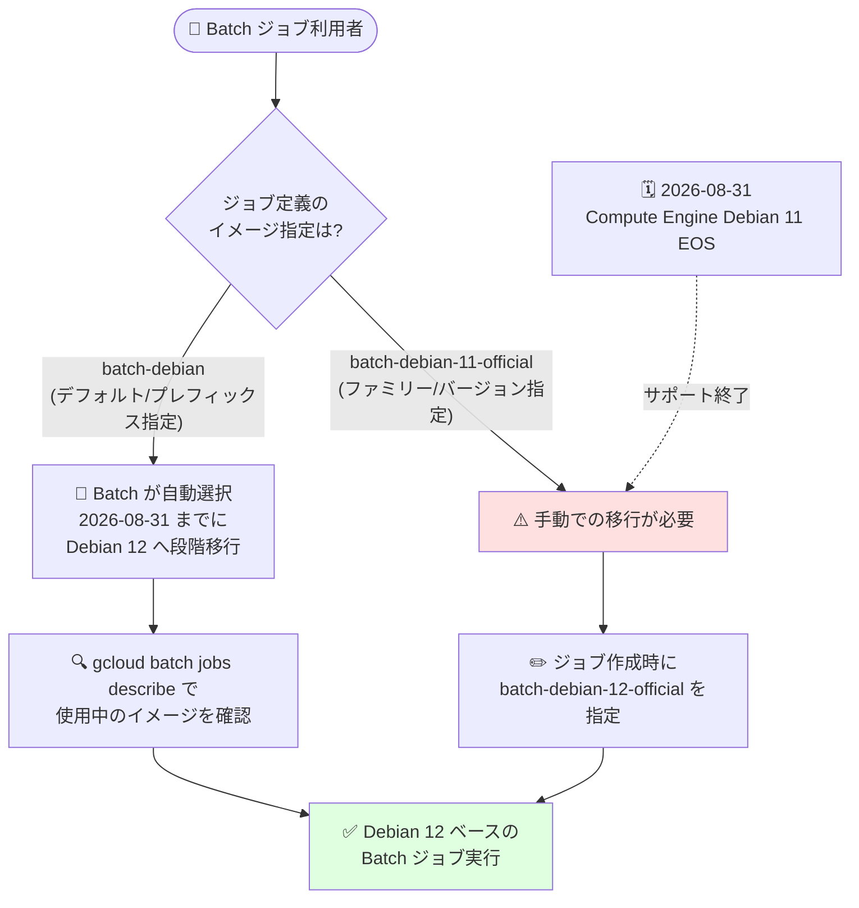

# Batch: Debian 11 OS イメージファミリーの開発終了 (2026 年 8 月 31 日サポート終了)

**リリース日**: 2026-08-19

**サービス**: Batch

**機能**: Batch Debian 11 OS イメージファミリーの非推奨化

**ステータス**: Deprecated (非推奨)

📊 [このアップデートのインフォグラフィックを見る](https://takech9203.github.io/google-cloud-news-summary/20260819-batch-debian-11-image-deprecation.html)

## 概要

Google Cloud Batch の Debian 11 オペレーティングシステム (OS) イメージファミリーが開発終了 (end of development) となりました。これは、Compute Engine の Debian 11 イメージが 2026 年 8 月 31 日にサポート終了 (EOS: End of Support) を迎えることに伴う措置です。`batch-debian-11-official` プレフィックスを持つすべてのイメージバージョンは、2026 年 8 月 31 日までのみサポートされます。

Batch イメージは `batch-custom-image` プロジェクトで提供される Batch ジョブ用に最適化された公式イメージであり、Batch Debian (`batch-debian` プレフィックス) はスクリプト runnable を含むジョブのデフォルトイメージです。そのため、明示的に Debian 11 を指定しているジョブだけでなく、デフォルトイメージに依存しているジョブも影響を受ける可能性があります。

Batch Debian 11 イメージを使用しているジョブは、2026 年 8 月 31 日までに Batch Debian 12 イメージ (`batch-debian-12-official`) などの別のイメージへ移行する必要があります。デフォルトの `batch-debian` プレフィックスを使用するジョブ定義については、Batch がジョブ作成時に自動選択するイメージが遅くとも 2026 年 8 月 31 日までに段階的に Debian 12 へ移行されます。

**アップデート前の課題**

- Batch Debian 11 (`batch-debian-11-official`) は、Batch のスクリプトジョブで利用可能なイメージファミリーとして提供されてきた
- ベース OS である Compute Engine の Debian 11 (bullseye) が 2026 年 8 月 31 日に EOS を迎えるため、以降はセキュリティ更新やイメージ更新が提供されなくなる
- EOS 後の OS を使い続けると、脆弱性対応や不具合修正が受けられず、運用リスクが増大する

**アップデート後の改善**

- Batch Debian 11 イメージのサポート終了日 (2026 年 8 月 31 日) と移行手順が公式に明示された
- デフォルトイメージ (`batch-debian` プレフィックス) を使用するジョブは、Batch 側で自動的に Debian 12 への段階的移行が行われるため、多くの場合はユーザー側の変更が不要
- 移行先として Debian 12 ベースの `batch-debian-12-official` イメージファミリーが利用可能 (Compute Engine Debian 12 の EOS は 2028 年 6 月 30 日)

## アーキテクチャ図



ジョブ定義でのイメージ指定方法によって対応が分岐します。デフォルトの `batch-debian` プレフィックスを使用する場合は Batch が自動的に Debian 12 へ移行しますが、`batch-debian-11-official` を明示指定している場合はジョブ作成時に別のイメージを指定する必要があります。

## サービスアップデートの詳細

### 主要な変更点

1. **Batch Debian 11 イメージファミリーの開発終了**
   - `batch-debian-11-official` プレフィックスを持つすべてのイメージバージョンが対象
   - 最終サポート期限は 2026 年 8 月 31 日 (Compute Engine Debian 11 の EOS 日と同日)
   - EOS 後は Debian コミュニティおよび Google からのイメージ更新・セキュリティ修正が提供されない

2. **デフォルトイメージの自動移行**
   - `batch-debian` プレフィックス (スクリプト runnable を含むジョブのデフォルトイメージ) を使用するジョブ定義では、ジョブ作成時に Batch が自動選択するイメージが遅くとも 2026 年 8 月 31 日までに段階的に Debian 12 へ移行される
   - 2026 年 8 月 31 日より前に作成されたジョブについては、ジョブを describe することで Debian 11 と Debian 12 のどちらを使用しているか確認できる

3. **明示指定ジョブの移行方法**
   - `batch-debian-11-official` イメージファミリー、またはそのプレフィックスを持つイメージバージョンを指定しているジョブ定義は、ジョブ作成時に別のイメージを指定する必要がある
   - 例: Debian 12 へ移行する場合は `batch-debian-12-official` イメージファミリー、またはそのプレフィックスを持つイメージバージョンを指定する

## 技術仕様

### 影響を受けるイメージと移行先

| 項目 | 詳細 |
|------|------|
| 非推奨イメージファミリー | `batch-debian-11-official` (Debian 11 bullseye ベース) |
| サポート終了日 | 2026 年 8 月 31 日 |
| 終了理由 | Compute Engine Debian 11 イメージの EOS (2026 年 8 月 31 日) |
| 推奨移行先 | `batch-debian-12-official` (Debian 12 bookworm ベース) |
| Debian 12 の EOS 予定日 | 2028 年 6 月 30 日 (Compute Engine) |
| イメージプロジェクト | `batch-custom-image` |
| デフォルトイメージの扱い | `batch-debian` プレフィックスは 2026 年 8 月 31 日までに段階的に Debian 12 へ自動移行 |

### Batch イメージの参照形式

Batch ジョブの `bootDisk.image` フィールドでは、以下のいずれかの形式でイメージを指定できます。

| 指定方法 | 形式 | 例 |
|----------|------|-----|
| Batch OS プレフィックス | `BATCH_OS_PREFIX` | `batch-debian` (最新イメージを自動選択) |
| イメージファミリー | `projects/IMAGE_PROJECT_ID/global/images/family/IMAGE_FAMILY` | `projects/batch-custom-image/global/images/family/batch-debian-12-official` |
| イメージバージョン | `projects/IMAGE_PROJECT_ID/global/images/IMAGE_NAME` | `projects/batch-custom-image/global/images/batch-debian-12-official-YYYYMMDD-...` |

## 設定方法

### 前提条件

1. Batch API が有効化されたプロジェクトと、ジョブ作成に必要な IAM ロール (`roles/batch.jobsEditor` および `roles/iam.serviceAccountUser`)
2. gcloud CLI がインストール済みであること

### 手順

#### ステップ 1: 既存ジョブが使用しているイメージを確認する

```bash
# ジョブの詳細を表示して使用中の OS イメージを確認
gcloud batch jobs describe JOB_NAME --location LOCATION

# Batch が提供するイメージの一覧を確認 (非推奨イメージも表示する場合)
gcloud compute images list \
    --project=batch-custom-image \
    --no-standard-images \
    --show-deprecated
```

2026 年 8 月 31 日より前に作成されたジョブについて、Debian 11 と Debian 12 のどちらを使用しているかを describe で確認できます。

#### ステップ 2: ジョブ定義のイメージ指定を Debian 12 に変更する

```json
{
  "taskGroups": [
    {
      "taskSpec": {
        "runnables": [
          {
            "script": {
              "text": "echo Hello world from task ${BATCH_TASK_INDEX}."
            }
          }
        ]
      },
      "taskCount": 3,
      "parallelism": 1
    }
  ],
  "allocationPolicy": {
    "instances": [
      {
        "policy": {
          "bootDisk": {
            "image": "projects/batch-custom-image/global/images/family/batch-debian-12-official"
          }
        }
      }
    ]
  },
  "logsPolicy": {
    "destination": "CLOUD_LOGGING"
  }
}
```

`batch-debian-11-official` を指定していた箇所を `batch-debian-12-official` に置き換えます。

#### ステップ 3: 更新した定義でジョブを作成して動作確認する

```bash
gcloud batch jobs submit JOB_NAME \
    --location LOCATION \
    --config JSON_CONFIGURATION_FILE
```

Debian 12 上でスクリプトや依存パッケージが問題なく動作することを、期限前に検証してください。

## メリット

### ビジネス面

- **明確な移行期限の提示**: サポート終了日 (2026 年 8 月 31 日) が明示されたことで、移行計画とテストのスケジュールを立てやすくなった
- **運用リスクの低減**: EOS 後の OS を使い続けることによるセキュリティ・コンプライアンスリスクを回避できる

### 技術面

- **デフォルト利用者の負担軽減**: `batch-debian` プレフィックスを使用するジョブは Batch 側で自動的に Debian 12 へ移行されるため、多くの場合コード変更が不要
- **長期サポートの確保**: 移行先の Debian 12 は Compute Engine で 2028 年 6 月 30 日まで EOS が予定されておらず、より長いサポート期間を確保できる

## デメリット・制約事項

### 制限事項

- `batch-debian-11-official` イメージファミリーおよび同プレフィックスのイメージバージョンは 2026 年 8 月 31 日以降サポートされない
- Compute Engine の仕様上、EOS を迎えた OS バージョンはイメージファミリー経由で参照できなくなり、イメージ更新も提供されない

### 考慮すべき点

- Debian 11 と Debian 12 ではパッケージバージョン (Python、glibc、各種ライブラリなど) が異なるため、スクリプトや依存関係の互換性テストが必要
- Batch Debian イメージをベースにしたカスタムイメージを使用している場合は、Debian 12 ベースの Batch イメージ上でカスタムイメージを再構築する必要がある
- デフォルトイメージの自動移行は「段階的」に行われるため、移行期間中はジョブごとに Debian 11 / 12 のどちらが選択されたかを describe で確認することが推奨される

## ユースケース

### ユースケース 1: デフォルトイメージを使用するスクリプトジョブの確認

**シナリオ**: ジョブ定義でイメージを明示指定せず、スクリプト runnable のデフォルト (batch-debian) に依存している。自動移行の対象だが、Debian 12 でスクリプトが動作するか事前に確認したい。

**実装例**:
```bash
# 既存ジョブが使用しているイメージを確認
gcloud batch jobs describe my-script-job --location us-central1 \
    | grep -A 2 "bootDisk"

# Debian 12 を明示指定してテストジョブを実行
# (bootDisk.image に batch-debian-12-official を指定した JSON を使用)
gcloud batch jobs submit my-script-job-debian12-test \
    --location us-central1 \
    --config job-debian12.json
```

**効果**: 自動移行に先立って Debian 12 での動作を検証でき、移行期限直前のトラブルを回避できる。

### ユースケース 2: Debian 11 を明示指定している定期バッチの移行

**シナリオ**: 夜間の定期データ処理ジョブで `batch-debian-11-official` イメージファミリーを明示指定している。2026 年 8 月 31 日までに移行が必須。

**効果**: ジョブ定義の `bootDisk.image` を `batch-debian-12-official` に変更してテスト実行することで、サポート期限後もセキュリティ更新を受けられる環境で定期処理を継続できる。

## 料金

このアップデート自体による料金への直接的な影響はありません。Batch サービス自体には追加料金がなく、ジョブが使用する Compute Engine リソース (VM、ディスクなど) に対して課金されます。Debian イメージのライセンスは無料 (Free) です。

- [Batch の料金](https://cloud.google.com/batch/pricing)

## 利用可能リージョン

この非推奨化は、Batch が利用可能なすべてのリージョンの Batch Debian 11 イメージに適用されます。

- [Batch のロケーション](https://docs.cloud.google.com/batch/docs/locations)

## 関連サービス・機能

- **Compute Engine**: Batch ジョブの VM 実行基盤。本件は Compute Engine Debian 11 イメージの EOS (2026 年 8 月 31 日) に起因する
- **Batch Container-Optimized OS (batch-cos)**: コンテナ runnable のみのジョブで使用されるデフォルトイメージ。今回の非推奨化の影響は受けない
- **カスタムイメージ (Compute Engine)**: Batch イメージをベースにカスタムイメージを構築している場合、Debian 12 ベースでの再構築が必要
- **組織ポリシー (trusted image policy)**: `compute.trustedImageProjects` 制約で許可イメージを管理している場合、移行先イメージが許可されているか確認が必要

## 参考リンク

- 📊 [インフォグラフィック](https://takech9203.github.io/google-cloud-news-summary/20260819-batch-debian-11-image-deprecation.html)
- [公式リリースノート](https://docs.cloud.google.com/release-notes#August_19_2026)
- [Batch リリースノート](https://docs.cloud.google.com/batch/docs/release-notes#August_19_2026)
- [VM OS 環境の概要 (Batch)](https://docs.cloud.google.com/batch/docs/vm-os-environment-overview)
- [Batch の VM OS イメージを表示する](https://docs.cloud.google.com/batch/docs/view-os-images)
- [特定の VM OS イメージを使用するジョブを作成・実行する](https://docs.cloud.google.com/batch/docs/specify-vm-os-image)
- [Compute Engine オペレーティングシステムの詳細 (Debian)](https://docs.cloud.google.com/compute/docs/images/os-details#debian)
- [料金ページ](https://cloud.google.com/batch/pricing)

## まとめ

Batch Debian 11 イメージファミリーは Compute Engine Debian 11 の EOS に伴い、2026 年 8 月 31 日でサポートが終了します。デフォルトの `batch-debian` プレフィックスを使用するジョブは自動的に Debian 12 へ移行されますが、`batch-debian-11-official` を明示指定しているジョブ定義は期限までに `batch-debian-12-official` などへの変更が必須です。まずは `gcloud batch jobs describe` で現在使用中のイメージを確認し、Debian 12 での動作検証を早めに実施することを推奨します。

---

**タグ**: `Batch`, `Debian`, `Compute Engine`, `Deprecated`, `EOS`, `OS イメージ`, `移行`
