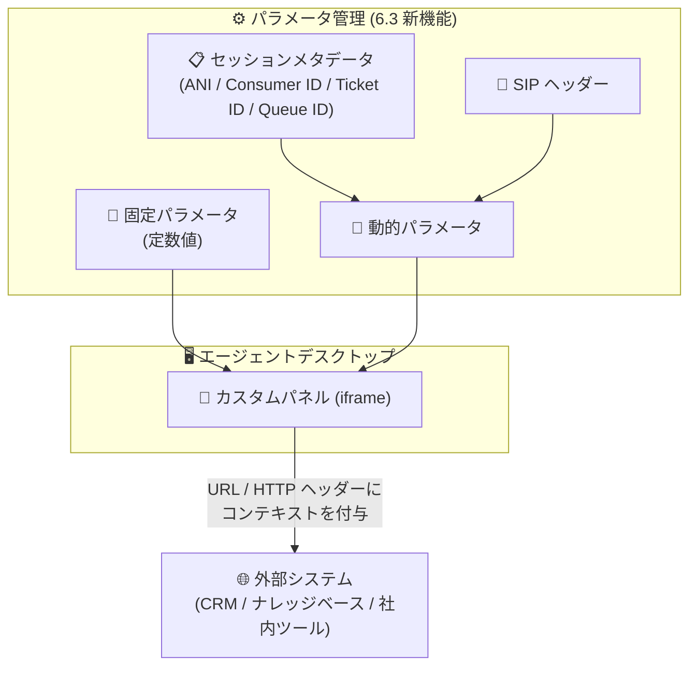
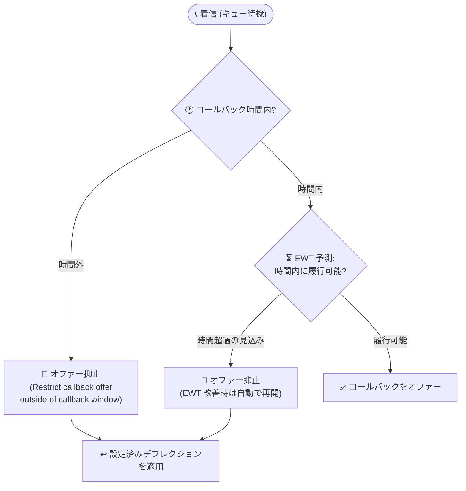

# Google Cloud Contact Center as a Service (CCaaS): バージョン 6.3 リリース

**リリース日**: 2026-08-19

**サービス**: Google Cloud Contact Center as a Service (CCaaS)

**機能**: CCaaS 6.3 (カスタムパネル URL パラメータ、コールバックオファー制限、多数のバグ修正)

**ステータス**: リリース済み (GA)

📊 [このアップデートのインフォグラフィックを見る](https://takech9203.github.io/google-cloud-news-summary/20260819-ccaas-6-3-release.html)

## 概要

Google Cloud Contact Center as a Service (CCaaS) のバージョン 6.3 がリリースされました。各インスタンスへの適用タイミングは、契約者が選択しているデプロイメントスケジュールに依存します。本バージョンでは、エージェントデスクトップとコールバック管理に関する 2 つの新機能に加え、エージェントデスクトップ、ルーティング、コールバック、SSO、ダッシュボード、SDK、CRM 連携など広範囲にわたる 90 件近くのバグ修正が含まれています。

新機能の 1 つ目は「カスタムパネル URL のパラメータ対応」です。エージェントデスクトップのカスタムパネル (外部リソースを iframe 表示するパネル) の URL に、固定パラメータおよび動的パラメータを設定できるようになりました。セッションメタデータや SIP ヘッダーから取得した顧客・エージェント・セッションのコンテキストを外部システムに引き渡せるため、CRM やナレッジベースなど社内ツールとの連携が容易になります。

2 つ目は「コールバックオファーの制限」です。コールバック時間外にコールバックのオファーが行われることを防止したり、推定待ち時間 (EWT) に基づいてコールバック時間内に完了しない可能性が高いオファーを抑止したりできるようになりました。キューの状況が改善 (EWT が減少) した場合は、システムが自動的に調整してコールバックのオファーを再開します。

**アップデート前の課題**

- カスタムパネルの URL には変数 (エージェント ID、電話番号など) は利用できたものの、セッションメタデータや SIP ヘッダーに基づく柔軟なパラメータ設定ができず、外部システムへ渡せるコンテキストが限定的だった
- コールバック時間の終了間際や時間外でもコールバックがオファーされ、履行できないコールバックが発生してしまうことがあった (時間外のコールバックはロールオーバー無効時に即キャンセルされるなど、顧客体験を損なう挙動になっていた)
- エージェントステータスの不整合 (通話中でも Available のまま)、キューに滞留したまま割り当てられないコール/チャット、SSO 環境での不適切な認証フローなど、運用に影響する多数の既知の問題が存在していた

**アップデート後の改善**

- カスタムパネルの URL と HTTP ヘッダーに固定/動的パラメータを設定でき、ANI (発信元電話番号)、Consumer ID、Call/Chat ID、CRM チケット ID、キュー ID などのセッションメタデータや SIP ヘッダーの値を外部システムへ引き渡せるようになった
- コールバック時間外のオファー防止と、EWT に基づく「時間内に履行できない見込みのオファー」の抑止をグローバルおよびキュー単位で設定できるようになった
- エージェントデスクトップ、ルーティング、コールバック、SSO、ダッシュボード、SDK、各種連携にわたる多数の不具合が解消され、安定性と信頼性が大幅に向上した

## アーキテクチャ図



カスタムパネルの URL・HTTP ヘッダーに固定/動的パラメータを設定し、セッションメタデータや SIP ヘッダー由来のコンテキストを外部システムへ引き渡すフローです。



コールバックオファー制限の判定フローです。時間外のオファーと EWT に基づき時間内に履行できない見込みのオファーを抑止し、キュー状況が改善すればオファーを再開します。

## サービスアップデートの詳細

### 主要機能

1. **カスタムパネル URL のパラメータ対応 (Feature)**
   - カスタムパネルおよびカスタムリンクパネルの URL と HTTP ヘッダーの値に、固定パラメータと動的パラメータを設定可能
   - 固定パラメータ: 管理者が指定した定数値を付与
   - 動的パラメータ: セッションメタデータ (ANI、Consumer ID、Call ID/Chat ID、CRM チケット ID、キュー ID、DNIS/TFN、直近エージェント ID/メール、キュー言語、Verified Customer / Bad Actor / Repeat Customer などの予約データプロパティ) または SIP ヘッダーの値を付与
   - 設定場所: CCAI Platform ポータルの **Settings > Operations Management > Agent Desktop > Custom panel management > Parameter management**
   - 既存の変数 ({QUEUE_ID} など) と重複するパラメータもあるため、どちらか一方のみを使用することが推奨されている

2. **コールバックオファーの制限 (Feature)**
   - **Restrict callback offer outside of callback window**: コールバック時間外のコールバックオファーを防止
   - **Restrict callback offer that will exceed hours of operation. If queue condition improve offer callbacks**: EWT (推定待ち時間) に基づき、コールバック時間内に発生しない見込みのオファーを防止。EWT が減少して条件が改善した場合はオファーを再開
   - 設定場所 (グローバル): **Settings > Call > Callback Settings** ペイン
   - 設定場所 (キュー単位): **Settings > Queue > IVR (Interactive Voice Response) > Edit / View > 対象キュー > Callback Settings > Configure > Callback Management** ペイン (キュー単位の設定はグローバル設定を上書き)
   - オファーが抑止された場合でも、設定済みのデフレクションオプションは引き続き有効

3. **多数のバグ修正 (Fixed)**
   - 本リリースには約 90 件のバグ修正が含まれる。主なカテゴリは以下のとおり (全リストは公式リリースノートを参照)
   - **エージェントデスクトップ / エージェントステータス**: 着信の Answer ボタンが表示されない、チャット受諾時に画面が空白になる、ラップアップ中にディスポジションコードを送信できない、異常終了後にステータス変更ができない、アウトバウンド通話中に Available のまま新規着信がルーティングされる、カスタムステータスが Unavailable と誤表示される、などの修正
   - **ルーティング / キュー滞留**: Web チャットやインバウンド IVR コール、予測キャンペーンコール、自動応答インタラクションがキューに滞留したままになる問題、カスケードグループが次に進まない問題、カスケードのエージェント可用性条件が適用されない問題、転送メニューのロード遅延、などの修正
   - **コールバック**: エージェントが応答を逃した際にコールバックが恒久的にキュー滞留する問題、完了後も Connected ステータスのままになる問題、Manager API のコールバック応答に parent_id フィールドが欠落する問題、などの修正
   - **チャット / 仮想エージェント / 翻訳**: キュー間転送後にライブ翻訳が動作しない (または逆方向に翻訳される) 問題、リアルタイム秘匿化有効時の転送でエージェント名が undefined と表示される問題、仮想エージェントからのエスカレーション時にトランスクリプトが失われる問題、サジェスチョンチップ使用時に空のチャットバブルが表示される問題、などの修正
   - **テレフォニー / SIP / キャリア**: Telnyx・Nexmo 番号でのデフレクション時のアプリケーションエラー、カスタム SIP ヘッダーの欠落、保留中に相互の音声が聞こえる問題、決済トランザクション中の DTMF 入力でコールが放棄される問題、通話録音が正しく配信・処理されない問題、などの修正
   - **SSO / 認証**: SAML/SSO 専用環境で存在しない「パスワードを忘れた場合」フローへ誘導する招待メールが送られる問題、IdP 起点の SAML SSO でエージェントデスクトップではなくデフォルトホームページに遷移する問題、アクティブセッションがあるのに再認証を強制される問題、全セッションから予期せずログアウトされる問題の修正
   - **ダッシュボード / レポーティング**: Deflections - Calls ダッシュボードのリダイレクト先キューの誤報告、重複した処理時間イベントによる不正確なレポート、レガシーダッシュボードの英語ラベル制限、放棄コールがキュー失敗として誤集計される問題、user_activity_logs / agent_activity_logs エンドポイントの遅延・タイムアウトの修正
   - **SDK / API / 連携**: iOS・Android SDK で初期メッセージとカスタムデータがルーティング API に渡されない問題、ヘッドレス Web SDK のチャットタイムアウトイベント未送出 (セッションが最大 120 分残留)、Salesforce Lightning / Zendesk 埋め込みでのプレゼンス接続不安定、チャットアダプタでのリッチテキスト送信・PDF/テキストファイル添付の失敗、Customer Experience Insights での録音セグメント重複、などの修正
   - **ローカライゼーション**: Portuguese (Portugal) / Spanish (Spain) / Spanish (Mexico) の表示不整合、コールアダプタの言語がエージェントのシステム言語に従わない問題、などの修正

## 技術仕様

### 動的パラメータで利用可能なセッションメタデータ

| Incoming Field | 説明 |
|------|------|
| ANI (phone number) | エンドユーザーの発信元電話番号 |
| Consumer ID | エンドユーザーの ID |
| Call ID/Chat ID | コールまたはチャットの ID |
| Ticket ID (CRM) | セッションに紐づく CRM チケット ID |
| Queue ID | セッションのエスカレーション元キューの ID |
| DNIS/TFN | エンドユーザーがダイヤルした番号 (着信番号/フリーダイヤル) |
| Latest Agent ID / Email | アクティブコールの直近セグメントを担当したエージェントの ID / メール |
| Queue Language | キューまたは部門の言語コード |
| Verified Customer / Bad Actor / Repeat Customer | 予約データプロパティ (正規顧客 / 不正の疑い / リピート顧客の判定) |

### コールバックオファー制限の設定項目

| 設定項目 | 動作 |
|------|------|
| Restrict callback offer outside of callback window | コールバック時間外のオファーを防止 |
| Restrict callback offer that will exceed hours of operation. If queue condition improve offer callbacks | EWT に基づき時間内に履行できない見込みのオファーを防止。EWT 改善時はオファーを再開 |

## 設定方法

### 前提条件

1. Google Cloud CCaaS (CCAI Platform) のインスタンスがバージョン 6.3 に更新されていること (適用タイミングはデプロイメントスケジュールに依存)
2. コールバックオファー制限を利用する場合: IVR の Overcapacity deflection が有効化されており、コールバック時間 (Callback Hours) が定義されていること

### 手順

#### ステップ 1: カスタムパネルのパラメータを追加する

1. CCAI Platform ポータルで **Settings > Operations Management** をクリック
2. **Agent Desktop** ペインの **Custom panel management** で **Manage custom panels list** をクリック
3. **Parameter management > Add parameter** をクリック
4. 固定パラメータの場合は **Type** で **Fixed** を選択し、Destination Field / Destination Value を入力
5. 動的パラメータの場合は **Type** で **Dynamic** を選択し、**Source** で **Session Metadata** または **SIP Header** を選択して Incoming Field と Destination Field を指定
6. **Add Parameter** をクリックし、カスタムパネルの URL や HTTP ヘッダーでパラメータを参照

#### ステップ 2: コールバックオファー制限を設定する (グローバル)

1. CCAI Platform ポータルで **Settings > Call** をクリック
2. **Callback Settings** ペインで **Define Callback Hours** にコールバック履行時間を設定
3. **Restrict callback offer outside of callback window** チェックボックスを選択 (時間外オファーの防止)
4. **Restrict callback offer that will exceed hours of operation. If queue conditions improve, offer callbacks** チェックボックスを選択 (EWT ベースの抑止)
5. **Save Callback Settings** をクリック

キュー単位で設定する場合は **Settings > Queue > IVR (Interactive Voice Response) > Edit / View > 対象キュー > Callback Settings > Configure** から同様に設定します (キュー設定がグローバル設定を上書き)。

## メリット

### ビジネス面

- **顧客体験の向上**: 履行できないコールバックのオファーを抑止することで、「コールバックを約束されたのに連絡が来ない」という顧客の不満を防止できる
- **エージェント生産性の向上**: カスタムパネルに顧客・セッションコンテキストを自動で引き渡せるため、エージェントが手動で顧客情報を検索する手間が減り、平均処理時間 (AHT) の短縮につながる
- **運用の安定化**: ステータス不整合やキュー滞留など運用に直結する多数の不具合が解消され、コンタクトセンターの安定運用と正確なレポーティングが期待できる

### 技術面

- **柔軟な外部連携**: セッションメタデータと SIP ヘッダーの両方をソースとする動的パラメータにより、コードを書かずに CRM・社内ツールへのコンテキスト連携を構成できる
- **EWT に基づく動的制御**: コールバックオファーが静的な時間帯設定だけでなく推定待ち時間に基づいて動的に制御され、キュー状況の改善に自動追従する
- **グローバル/キュー単位の階層設定**: コールバック制限をグローバルに設定しつつ、特定キューでは個別に上書きできる柔軟な構成が可能

## デメリット・制約事項

### 制限事項

- 6.3 の適用タイミングは選択しているデプロイメントスケジュールに依存し、即時にすべてのインスタンスへ反映されるわけではない
- カスタムパネルの URL は iframe 表示に対応している必要がある (非対応の URL はパネルに何も表示されない)
- パラメータの一部は既存の変数 (例: {QUEUE_ID} 変数と Queue ID メタデータ) と値が重複するため、併用せずどちらか一方を使用する必要がある
- パラメータを削除すると、それを参照している URL や HTTP ヘッダーが動作しなくなる可能性があるため、削除前に参照有無の確認が必要

### 考慮すべき点

- コールバックオファー制限を有効化した場合でも、設定済みのデフレクションオプションは引き続き適用されるため、抑止時の顧客導線 (アナウンス、リダイレクト先) をあわせて確認しておく
- コールバック履行時間は、割り当て先キューの営業時間と同じタイムゾーンで設定することが推奨されている
- 多数のバグ修正が含まれるため、既知の問題への独自ワークアラウンド (運用回避策) を実施している場合は、6.3 適用後に不要になっていないか見直すとよい

## ユースケース

### ユースケース 1: CRM 画面へのセッションコンテキスト自動連携

**シナリオ**: エージェントが着信を受けた際に、社内 CRM の顧客詳細画面をカスタムパネルに表示したい。顧客の電話番号と CRM チケット ID を URL パラメータとして渡す必要がある。

**実装例**:
```
1. Parameter management で動的パラメータを追加:
   - Source: Session Metadata / Incoming Field: ANI (phone number) → Destination Field: phone
   - Source: Session Metadata / Incoming Field: Ticket ID (CRM) → Destination Field: ticket
2. カスタムパネルの Display URL に設定:
   https://crm.example.com/customer?phone={phone}&ticket={ticket}
```

**効果**: 着信と同時に該当顧客の CRM 画面がパネルに表示され、エージェントの検索作業が不要になり応対開始までの時間を短縮できる。

### ユースケース 2: 営業終了間際のコールバックオファー抑止

**シナリオ**: コールバック時間が 9:00〜18:00 のコンタクトセンターで、17 時台の高負荷時 (EWT 90 分) にコールバックをオファーすると履行が 18 時を超えてしまい、翌日以降に持ち越されるか失敗するリスクがある。

**効果**: 「Restrict callback offer that will exceed hours of operation」を有効化することで、EWT を考慮して時間内に履行できない見込みのオファーを自動的に抑止。その後 EWT が 30 分に改善すれば自動的にオファーを再開するため、機会損失と顧客不満の両方を最小化できる。

## 料金

本アップデートによる料金体系の変更はアナウンスされていません。CCaaS の料金は同時利用ライセンス数などに基づきます。詳細は公式料金ページを参照してください。

- [Google Cloud CCaaS の料金](https://cloud.google.com/solutions/contact-center-ai-platform/pricing)

## 利用可能リージョン

すべての CCaaS インスタンスに順次展開されます。適用タイミングは選択しているデプロイメントスケジュールに依存します。詳細は [Deployment schedules](https://cloud.google.com/contact-center/ccai-platform/docs/deployment-schedules) を参照してください。

## 関連サービス・機能

- **Agent Assist**: 通話・チャット中のライブ文字起こしや生成 AI サマリーを提供。本リリースで転送・保留後にライブ文字起こしが停止する問題が修正された
- **Dialogflow / 仮想エージェント**: 仮想エージェントから人間のエージェントへのエスカレーションに関する複数の不具合 (トランスクリプト消失、デフレクションメッセージのバイパスなど) が修正された
- **Salesforce / Zendesk 連携**: CRM 埋め込み環境でのプレゼンス接続やチャットアダプタの安定性が改善された
- **Customer Experience Insights**: 複数録音セグメントによる重複エントリの問題が修正され、分析データの正確性が向上した

## 参考リンク

- 📊 [インフォグラフィック](https://takech9203.github.io/google-cloud-news-summary/20260819-ccaas-6-3-release.html)
- [公式リリースノート](https://docs.cloud.google.com/release-notes#August_19_2026)
- [ドキュメント: カスタムパネルのパラメータ](https://docs.cloud.google.com/contact-center/ccai-platform/docs/agent-desktop-configure-widgets#parameters)
- [ドキュメント: コールバックの管理](https://docs.cloud.google.com/contact-center/ccai-platform/docs/call-settings#callback-fulfillment-hours)
- [ドキュメント: デプロイメントスケジュール](https://cloud.google.com/contact-center/ccai-platform/docs/deployment-schedules)
- [料金ページ](https://cloud.google.com/solutions/contact-center-ai-platform/pricing)

## まとめ

CCaaS 6.3 は、カスタムパネルへのコンテキスト連携とコールバックオファーの動的制御という実用性の高い 2 つの新機能に加え、運用に直結する約 90 件のバグ修正を含む重要なリリースです。CCaaS を利用中の場合は、デプロイメントスケジュールに沿った適用時期を確認のうえ、カスタムパネルのパラメータ設定とコールバック制限の有効化を検討し、既存のワークアラウンドが不要になっていないか見直すことを推奨します。

---

**タグ**: #GoogleCloud #CCaaS #CCAIPlatform #ContactCenter #AgentDesktop #Callback #リリースノート
