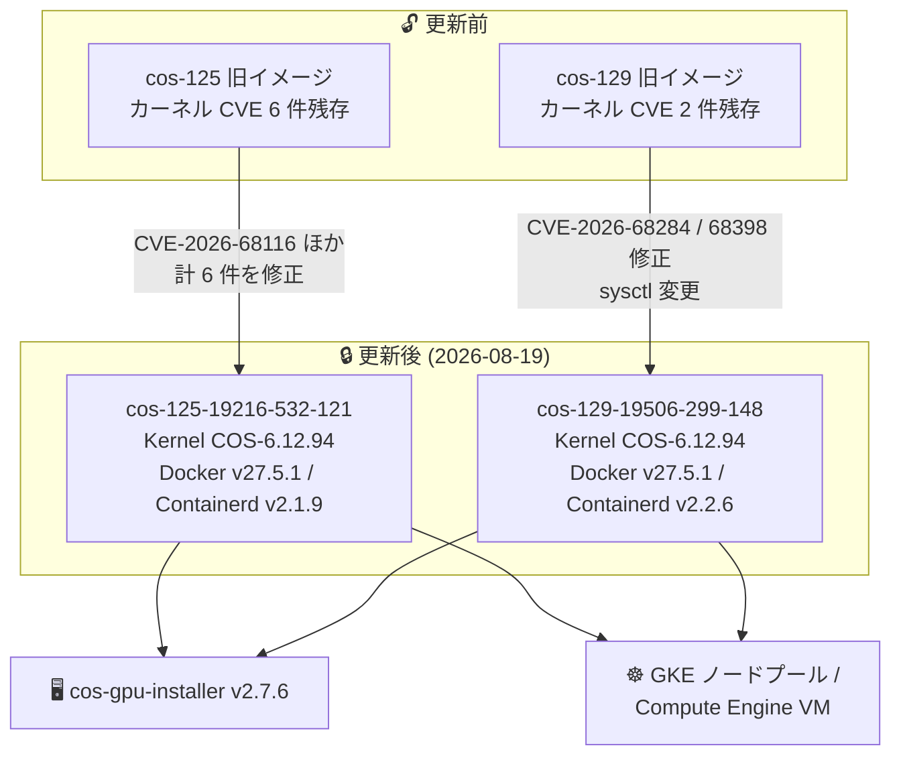

# Container-Optimized OS: LTS イメージのセキュリティアップデート (cos-125 / cos-129)

**リリース日**: 2026-08-19

**サービス**: Container-Optimized OS

**機能**: LTS マイルストーン 125 / 129 の新イメージリリース (カーネル CVE 修正、cos-gpu-installer 更新)

**ステータス**: Change / Fixed / Security

📊 [このアップデートのインフォグラフィックを見る](https://takech9203.github.io/google-cloud-news-summary/20260819-container-optimized-os-security-updates.html)

## 概要

2026 年 8 月 19 日、Container-Optimized OS (COS) の LTS マイルストーン 125 と 129 に対して、新しいイメージ **cos-125-19216-532-121** と **cos-129-19506-299-148** がリリースされました。両イメージとも Linux カーネル COS-6.12.94 をベースとし、Linux カーネルに存在する複数の CVE (合計 8 件) の修正が含まれるセキュリティ中心のアップデートです。

cos-125 では CVE-2026-68116、CVE-2026-68139、CVE-2026-68171、CVE-2026-68325、CVE-2026-68336、CVE-2026-68343 の 6 件、cos-129 では CVE-2026-68284、CVE-2026-68398 の 2 件のカーネル脆弱性が修正されています。また、両イメージで GPU ドライバーのインストールを担う cos-gpu-installer が v2.7.6 に更新されており、cos-129 ではランタイム sysctl (`net.ipv4.udp_mem`) の値も変更されています。

Container-Optimized OS は Compute Engine 上でコンテナを実行するために Google が最適化した OS イメージであり、GKE のノードのデフォルト OS としても使用されています。COS ノードを利用する GKE クラスタや、COS イメージで VM を直接運用しているユーザーが対象です。

**アップデート前の課題**

- 従来のイメージ (COS 125 / 129 の前リリース) では、Linux カーネルに未修正の CVE (計 8 件) が残存していた
- cos-gpu-installer が旧バージョンのままで、最新の修正が反映されていなかった
- cos-129 では `net.ipv4.udp_mem` の設定値が他の最新イメージと揃っていなかった

**アップデート後の改善**

- Linux カーネルの脆弱性計 8 件 (cos-125: 6 件、cos-129: 2 件) が修正され、ノードのセキュリティ姿勢が向上した
- cos-gpu-installer v2.7.6 への更新により、GPU ドライバーインストールに最新の修正が反映された
- cos-129 の `net.ipv4.udp_mem` が `188034 250714 376068` から `188034 250715 376068` に変更され、UDP バッファメモリ設定が他マイルストーンの最新イメージと整合した

## アーキテクチャ図



COS 125 / 129 の両 LTS マイルストーンが同一カーネル (COS-6.12.94) 上でそれぞれの CVE 修正を受け、GKE ノードや Compute Engine VM に展開される構成を示しています。

## サービスアップデートの詳細

### 主要機能

1. **Linux カーネルの CVE 修正 (計 8 件)**
   - cos-125-19216-532-121: CVE-2026-68116、CVE-2026-68139、CVE-2026-68171、CVE-2026-68325、CVE-2026-68336、CVE-2026-68343 を修正
   - cos-129-19506-299-148: CVE-2026-68284、CVE-2026-68398 を修正
   - いずれも Linux カーネル内の脆弱性であり、ノード OS レイヤーのセキュリティを強化

2. **cos-gpu-installer v2.7.6 への更新 (両イメージ共通)**
   - COS 上で NVIDIA GPU ドライバーをインストールするツールの更新
   - GPU ワークロード (AI/ML 推論・学習など) を COS ノードで実行するユーザーに影響

3. **cos-129 のランタイム sysctl 変更**
   - `net.ipv4.udp_mem`: `188034 250714 376068` → `188034 250715 376068`
   - UDP ソケットが使用できるメモリページ数 (min / pressure / max) のうち pressure 値が微調整され、他の最新イメージと整合

## 技術仕様

### イメージ別コンポーネントバージョン

| 項目 | cos-125-19216-532-121 | cos-129-19506-299-148 |
|------|----------------------|----------------------|
| マイルストーン | COS 125 LTS | COS 129 LTS |
| カーネル | COS-6.12.94 | COS-6.12.94 |
| Docker | v27.5.1 | v27.5.1 |
| Containerd | v2.1.9 | v2.2.6 |
| cos-gpu-installer | v2.7.6 | v2.7.6 |
| 修正 CVE (カーネル) | 6 件 | 2 件 |
| イメージファミリー | cos-125-lts / cos-arm64-125-lts | cos-129-lts / cos-arm64-129-lts |
| サポート終了 (予定) | 2028 年 2 月 | 2028 年 7 月 |

### 修正された CVE 一覧

| イメージ | CVE |
|----------|-----|
| cos-125-19216-532-121 | CVE-2026-68116, CVE-2026-68139, CVE-2026-68171, CVE-2026-68325, CVE-2026-68336, CVE-2026-68343 |
| cos-129-19506-299-148 | CVE-2026-68284, CVE-2026-68398 |

## 設定方法

### 前提条件

1. Compute Engine で COS イメージ (`cos-cloud` プロジェクト) を利用している、または GKE で COS ベースのノードプールを運用している
2. `gcloud` CLI がセットアップ済みであること

### 手順

#### ステップ 1: 最新イメージの確認

```bash
# COS 125 / 129 LTS ファミリーの最新イメージを確認
gcloud compute images describe-from-family cos-125-lts --project cos-cloud
gcloud compute images describe-from-family cos-129-lts --project cos-cloud
```

イメージファミリーを参照すると、常に最新のリリース済みイメージが返されます。

#### ステップ 2: VM のイメージ更新 (Compute Engine 直接利用の場合)

```bash
# 新しいイメージで VM を作成 (例)
gcloud compute instances create my-cos-vm \
  --image-family cos-129-lts \
  --image-project cos-cloud \
  --zone asia-northeast1-a
```

既存 VM はインスタンステンプレートの更新やマネージドインスタンスグループのローリング更新で新イメージへ移行します。

#### ステップ 3: GKE ノードプールのアップグレード (GKE 利用の場合)

```bash
# ノードの自動アップグレード状況を確認
gcloud container node-pools describe my-pool \
  --cluster my-cluster \
  --zone asia-northeast1-a \
  --format="value(management.autoUpgrade)"
```

GKE ではノード自動アップグレードが有効な場合、修正済み COS イメージを含む GKE バージョンへ順次自動更新されます。セキュリティ観点で早期適用が必要な場合は手動アップグレードも検討します。

## メリット

### ビジネス面

- **セキュリティリスクの低減**: カーネル脆弱性 8 件の修正により、コンテナ基盤の攻撃対象領域が縮小され、コンプライアンス要件への対応が容易になる
- **LTS による安定運用**: COS 125 (2028 年 2 月まで)、COS 129 (2028 年 7 月まで) の LTS サポート期間内で、機能を安定させたままセキュリティ修正のみを受け取れる

### 技術面

- **自動更新による運用負荷軽減**: COS の自動更新機能や GKE のノード自動アップグレードにより、パッチ適用を自動化できる
- **GPU 環境の保守性向上**: cos-gpu-installer v2.7.6 への更新により、GPU ドライバーインストールの最新修正が反映される

## デメリット・制約事項

### 制限事項

- 修正の適用にはノード (VM) の再起動・再作成が必要
- リリースノートには各 CVE の深刻度 (CVSS スコア) は記載されておらず、詳細は各 CVE のデータベースで確認が必要

### 考慮すべき点

- GKE のノード自動アップグレードが無効な場合、修正イメージが適用されないため手動対応が必要
- cos-129 の `net.ipv4.udp_mem` 変更は pressure 値のごく小さな調整だが、UDP を多用するワークロード (DNS、ストリーミングなど) では念のため挙動を確認するとよい
- COS 125 と 129 で Containerd のバージョンが異なる (v2.1.9 / v2.2.6) 点に注意

## ユースケース

### ユースケース 1: GKE クラスタのノードセキュリティ維持

**シナリオ**: COS ベースのノードプールで本番ワークロードを運用しており、カーネル脆弱性への迅速なパッチ適用が求められる。

**実装例**:
```bash
# リリースチャンネル利用クラスタでノードを手動アップグレード
gcloud container clusters upgrade my-cluster \
  --node-pool my-pool \
  --zone asia-northeast1-a
```

**効果**: 修正済みの COS イメージを含むノードバージョンへ更新し、今回修正された CVE の影響を回避できる。

### ユースケース 2: GPU ワークロード基盤の最新化

**シナリオ**: COS 上で cos-gpu-installer を使って NVIDIA ドライバーを導入し、AI/ML 推論を実行している。

**効果**: v2.7.6 に更新された cos-gpu-installer により、最新の修正が反映された状態で GPU ドライバーを導入でき、GPU ノードの安定性が向上する。

## 料金

Container-Optimized OS 自体は無償で提供され、追加のライセンス費用は発生しません。COS イメージを実行する Compute Engine インスタンスや GKE クラスタの通常料金のみが適用されます。

- [Compute Engine の料金](https://cloud.google.com/compute/pricing)
- [GKE の料金](https://cloud.google.com/kubernetes-engine/pricing)

## 利用可能リージョン

COS イメージは `cos-cloud` イメージプロジェクトを通じて、Compute Engine が利用可能なすべてのリージョンで使用できます。

## 関連サービス・機能

- **Google Kubernetes Engine (GKE)**: COS はノードのデフォルト OS。ノード自動アップグレードにより修正イメージが順次展開される
- **Compute Engine**: COS イメージで VM を直接実行可能。イメージファミリー (`cos-125-lts` / `cos-129-lts`) 参照で最新イメージを取得できる
- **GKE セキュリティ情報 (Security Bulletins)**: 深刻度の高い脆弱性は GKE のセキュリティ情報ページでも案内される
- **Container Threat Detection / Security Command Center**: ノード・コンテナレイヤーの脅威検知と組み合わせた多層防御が可能

## 参考リンク

- 📊 [インフォグラフィック](https://takech9203.github.io/google-cloud-news-summary/20260819-container-optimized-os-security-updates.html)
- [公式リリースノート](https://docs.cloud.google.com/release-notes#August_19_2026)
- [COS Milestone 125 リリースノート](https://docs.cloud.google.com/container-optimized-os/docs/release-notes/m125)
- [COS Milestone 129 リリースノート](https://docs.cloud.google.com/container-optimized-os/docs/release-notes/m129)
- [Container-Optimized OS ドキュメント](https://cloud.google.com/container-optimized-os/docs)
- [COS で GPU を実行する](https://cloud.google.com/container-optimized-os/docs/how-to/run-gpus)

## まとめ

COS 125 / 129 LTS の今回のリリースは、Linux カーネルの CVE 計 8 件を修正するセキュリティ中心のアップデートです。GKE でノード自動アップグレードを有効にしている場合は順次適用されますが、セキュリティ要件が厳しい環境では最新イメージへの手動アップグレードを推奨します。GPU ノードを運用している場合は cos-gpu-installer v2.7.6 への更新もあわせて確認してください。

---

**タグ**: Container-Optimized OS, COS, セキュリティ, CVE, Linux カーネル, GKE, LTS, GPU
