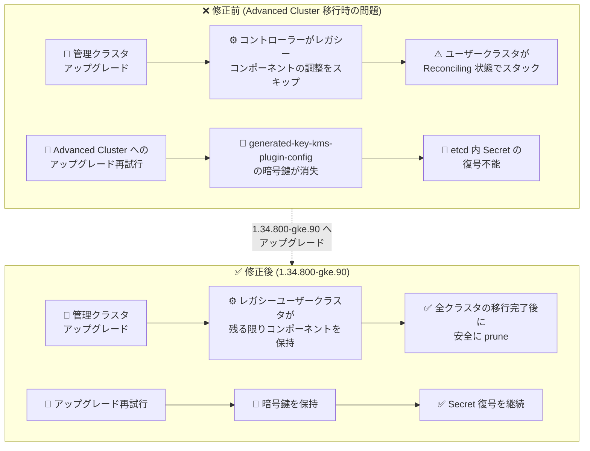

# Google Distributed Cloud (software only): 1.34.800-gke.90 リリース (VMware / ベアメタル)

**リリース日**: 2026-08-19

**サービス**: Google Distributed Cloud (software only) for VMware / for bare metal

**機能**: バージョン 1.34.800-gke.90 リリース (脆弱性修正・バグ修正)

**ステータス**: Announcement / Fixed

📊 [このアップデートのインフォグラフィックを見る](https://takech9203.github.io/google-cloud-news-summary/20260819-gdc-software-only-1-34-800-gke-90.html)

## 概要

Google Distributed Cloud (software only) for VMware および for bare metal の新しいパッチバージョン **1.34.800-gke.90** が同日にリリースされ、ダウンロード可能になりました。両プラットフォームとも Kubernetes **v1.34.7-gke.200** 上で動作します。リリース後、GKE On-Prem API クライアント (Google Cloud コンソール、gcloud CLI、Terraform) で利用可能になるまでには約 7〜14 日かかります。

本リリースはセキュリティ脆弱性の修正に加え、VMware 版ではクラスタライフサイクル管理に関する 3 件の重要なバグ修正が含まれています。特に、管理クラスタのアップグレード後にユーザークラスタが `Reconciling` 状態でスタックする問題と、Advanced Cluster へのアップグレード再試行時に暗号鍵が消失して etcd 内の Kubernetes Secret が復号できなくなる問題は、アップグレード運用の信頼性に直結する修正です。ベアメタル版では、非推奨となっていた `csi-snapshot-validation-webhook` コンポーネントが削除されました。

オンプレミス環境で GDC (software only) クラスタを運用している管理者、特に 1.34 系で Advanced Cluster への移行を進めている組織にとって、優先的に適用を検討すべきパッチリリースです。

**アップデート前の課題**

- **VMware**: 管理クラスタのアップグレード時、初期移行アノテーションが設定されていない限りコントローラーがレガシークラスタライフサイクルコンポーネントの調整 (reconcile) をスキップしていた。レガシーユーザークラスタが残存している場合、レガシー API (`cluster.k8s.io/v1alpha1`) のディスカバリが欠落し、ユーザークラスタが `Reconciling` 状態でスタックしていた
- **VMware**: プライベートコンテナレジストリの CA 証明書ファイルの読み取り権限が不足しており、`gkectl prepare` が permission denied エラーで失敗することがあった
- **VMware**: Advanced Cluster への失敗したアップグレードを再試行 (既存のブートストラップクラスタでの再実行など) すると、`generated-key-kms-plugin-config` Secret 内の暗号鍵が消失・破損し、コントロールプレーンが etcd 内の既存 Kubernetes Secret を復号できなくなる恐れがあった
- **ベアメタル**: 非推奨の `csi-snapshot-validation-webhook` (スナップショット検証 Webhook) コンポーネントが残存しており、余分な運用コンポーネントとなっていた

**アップデート後の改善**

- **VMware**: コントローラーはレガシーユーザークラスタが 1 つでも存在する限りレガシーコンポーネントを保持し、すべてのユーザークラスタが Advanced Cluster に移行した後にのみ削除 (prune) するようになり、`Reconciling` スタックが解消された
- **VMware**: プライベートレジストリの CA 証明書のファイル権限が 644 に設定され、`gkectl prepare` の permission denied エラーが解消された
- **VMware**: Advanced Cluster へのアップグレード再試行時にも `generated-key-kms-plugin-config` Secret の暗号鍵が保持され、etcd 内の Secret 復号失敗が発生しなくなった
- **両プラットフォーム**: Vulnerability fixes に記載されたセキュリティ脆弱性が修正された
- **ベアメタル**: `csi-snapshot-validation-webhook` が削除され、コンポーネント構成が簡素化された (上流 Kubernetes では、スナップショット検証は CRD 内の CEL ルールによりネイティブに処理される方式へ移行済み)

## アーキテクチャ図



VMware 版における Advanced Cluster 移行関連の 2 つの重大な問題 (Reconciling スタックと KMS 暗号鍵消失) が、本リリースでどのように修正されたかを Before/After で示しています。

## サービスアップデートの詳細

### 主要な変更点

1. **バージョン 1.34.800-gke.90 の提供開始 (VMware / ベアメタル共通)**
   - Kubernetes v1.34.7-gke.200 上で動作
   - GKE On-Prem API クライアント (コンソール、gcloud CLI、Terraform) での利用は、リリース後約 7〜14 日で可能になる
   - サードパーティストレージベンダーを使用している場合は、認定済みストレージパートナーの一覧を確認する必要がある

2. **セキュリティ脆弱性の修正 (VMware / ベアメタル共通)**
   - 各プラットフォームの Vulnerability fixes ページに記載された脆弱性が修正された

3. **ユーザークラスタの Reconciling スタック問題の修正 (VMware)**
   - 管理クラスタのアップグレード中、コントローラーは初期移行アノテーションが設定されていない限りレガシークラスタライフサイクルコンポーネントの調整をスキップしていた
   - レガシーユーザークラスタが残存する環境では `cluster.k8s.io/v1alpha1` API のディスカバリが欠落し、コントローラーの調整が停止していた
   - 修正後は、レガシーユーザークラスタが存在する限りレガシーコンポーネントを保持し、すべてのユーザークラスタが Advanced Cluster へ移行した後にのみ削除する

4. **gkectl prepare の permission denied エラー修正 (VMware)**
   - プライベートレジストリの CA 証明書を読み取る際に権限不足で失敗していた問題を修正
   - 証明書ファイルの権限が 644 に設定されるようになった

5. **Advanced Cluster アップグレード再試行時の暗号鍵消失の修正 (VMware)**
   - 失敗したアップグレードを再試行 (既存ブートストラップクラスタでの再実行など) した際、`generated-key-kms-plugin-config` Secret 内の暗号鍵が消失・破損する問題を修正
   - この問題が発生すると、コントロールプレーンが etcd 内の既存 Kubernetes Secret を復号できなくなるため、影響が大きい修正である

6. **csi-snapshot-validation-webhook の削除 (ベアメタル)**
   - 非推奨のスナップショット検証 Webhook コンポーネントが削除された
   - 上流 Kubernetes では、ボリュームスナップショットの検証は CRD にデプロイされた CEL (Common Expression Language) ルールでネイティブに処理される方式に移行しており、専用 Webhook は不要になっている

## 技術仕様

### リリース情報

| 項目 | 詳細 |
|------|------|
| バージョン | 1.34.800-gke.90 |
| Kubernetes バージョン | v1.34.7-gke.200 |
| 対象プラットフォーム | VMware (vSphere) / bare metal |
| GKE On-Prem API クライアント対応 | リリース後約 7〜14 日 |
| リリースタイプ | パッチリリース (脆弱性修正 + バグ修正) |

### 修正内容の対象マトリクス

| 修正内容 | VMware | ベアメタル |
|----------|--------|-----------|
| セキュリティ脆弱性の修正 | ✅ | ✅ |
| Reconciling スタック問題の修正 | ✅ | - |
| gkectl prepare の権限エラー修正 | ✅ | - |
| KMS プラグイン暗号鍵消失の修正 | ✅ | - |
| csi-snapshot-validation-webhook の削除 | - | ✅ |

## 設定方法

### 前提条件

1. 既存の Google Distributed Cloud (software only) クラスタ (1.34 系またはサポートされるアップグレード元バージョン) が稼働していること
2. サードパーティストレージベンダーを使用している場合、当該ベンダーがこのリリースの認定を通過していることを確認すること

### 手順

#### ステップ 1: 対象バージョンの確認とツールの準備

```bash
# VMware の場合: gkectl のバージョン確認
gkectl version

# ベアメタルの場合: bmctl のバージョン確認
bmctl version
```

アップグレード先のバージョン (1.34.800-gke.90) に対応するツールをダウンロードします。

#### ステップ 2: クラスタのアップグレード

```bash
# VMware の場合 (例: 管理クラスタのアップグレード)
gkectl upgrade admin \
    --kubeconfig ADMIN_CLUSTER_KUBECONFIG \
    --config ADMIN_CLUSTER_CONFIG_FILE

# ベアメタルの場合 (例: クラスタのアップグレード)
bmctl upgrade cluster -c CLUSTER_NAME \
    --kubeconfig ADMIN_KUBECONFIG
```

詳細な手順は各プラットフォームの「Upgrade clusters」ドキュメントを参照してください。GKE On-Prem API クライアント (コンソール、gcloud CLI、Terraform) 経由でのアップグレードは、リリース後約 7〜14 日で利用可能になります。

## メリット

### ビジネス面

- **アップグレード運用の信頼性向上**: Advanced Cluster への移行過程で発生していたスタックやデータアクセス不能のリスクが解消され、計画的なバージョンアップが安全に実施できる
- **セキュリティリスクの低減**: 既知の脆弱性が修正され、オンプレミス環境のコンプライアンス要件への対応が容易になる

### 技術面

- **レガシー/Advanced 混在環境の安定化**: レガシーユーザークラスタと Advanced Cluster が混在する移行期間中でも、コントローラーの調整処理が停止しなくなった
- **Secret 暗号化の保全**: アップグレード再試行時にも KMS プラグインの暗号鍵が保持され、etcd 内の Secret が復号不能になる重大障害を回避できる
- **コンポーネントの簡素化 (ベアメタル)**: 不要になった検証 Webhook が削除され、クラスタ内の運用対象コンポーネントが削減された

## デメリット・制約事項

### 制限事項

- GKE On-Prem API クライアント (コンソール、gcloud CLI、Terraform) からこのバージョンを利用できるようになるまで、リリース後約 7〜14 日かかる
- サードパーティストレージベンダーを使用している場合、ベンダーが本リリースの認定を通過しているかを事前に確認する必要がある

### 考慮すべき点

- 1.33 から 1.34 へのアップグレードでは、非 Advanced クラスタは常に Advanced Cluster へ変換される。移行手順と既知の問題を事前に確認すること
- 過去に Advanced Cluster へのアップグレードが失敗し再試行した環境では、`generated-key-kms-plugin-config` Secret の状態を確認しておくことが望ましい
- ベアメタル版で `csi-snapshot-validation-webhook` に依存する独自の監視・運用手順がある場合は、削除に合わせて見直しが必要

## ユースケース

### ユースケース 1: レガシーユーザークラスタが残る環境での管理クラスタアップグレード

**シナリオ**: VMware 環境で複数のユーザークラスタを運用しており、一部がまだ Advanced Cluster へ移行していない状態で管理クラスタを先行アップグレードする。

**効果**: 従来はレガシー API ディスカバリの欠落によりユーザークラスタが `Reconciling` 状態でスタックする恐れがあったが、1.34.800-gke.90 ではレガシーコンポーネントが適切に保持されるため、段階的な移行を安全に進められる。

### ユースケース 2: Advanced Cluster へのアップグレードが一度失敗した環境での再試行

**シナリオ**: Advanced Cluster へのアップグレードがネットワーク障害などで中断し、既存のブートストラップクラスタを使って再実行する。

**効果**: 従来は再試行時に KMS プラグインの暗号鍵が消失し、etcd 内の既存 Secret が復号できなくなるリスクがあったが、本バージョンでは暗号鍵が保持されるため、安心して再試行できる。

### ユースケース 3: プライベートレジストリを使用するエアギャップ環境での準備作業

**シナリオ**: インターネットに接続できない環境で、プライベートコンテナレジストリと独自 CA 証明書を使用して `gkectl prepare` を実行する。

**効果**: CA 証明書の読み取り権限が 644 に設定されるようになり、permission denied エラーによる準備作業の失敗が解消された。

## 料金

Google Distributed Cloud (software only) 自体のパッチ適用に追加料金は発生しません。ライセンス料金は vCPU ベースの課金体系です。詳細は公式料金ページを参照してください。

- [Google Distributed Cloud (software only) の料金](https://cloud.google.com/distributed-cloud/pricing)

## 利用可能リージョン

オンプレミス環境 (VMware vSphere / ベアメタル) で稼働するソフトウェアのため、リージョンの制約はありません。フリートの登録先となる Google Cloud プロジェクトのリージョン要件は通常どおりです。

## 関連サービス・機能

- **GKE Enterprise (フリート管理)**: GDC (software only) クラスタはフリートに登録され、Google Cloud コンソールから一元管理される
- **GKE On-Prem API**: コンソール、gcloud CLI、Terraform からのクラスタライフサイクル管理を提供 (本バージョンは約 7〜14 日後に利用可能)
- **Advanced Clusters**: 1.33 以降で導入された改良アーキテクチャ。1.34 へのアップグレードで非 Advanced クラスタは Advanced Cluster に変換される
- **Cloud KMS / KMS プラグイン**: etcd 内の Kubernetes Secret の保存時暗号化に使用され、本リリースの暗号鍵保持修正に関連する
- **Kubernetes VolumeSnapshot (CSI)**: ベアメタル版で削除された検証 Webhook の機能は、CRD の CEL ルールによる検証に置き換えられている

## 参考リンク

- 📊 [インフォグラフィック](https://takech9203.github.io/google-cloud-news-summary/20260819-gdc-software-only-1-34-800-gke-90.html)
- [公式リリースノート](https://docs.cloud.google.com/release-notes#August_19_2026)
- [GDC (software only) for VMware リリースノート](https://docs.cloud.google.com/kubernetes-engine/distributed-cloud/vmware/docs/release-notes)
- [GDC (software only) for bare metal リリースノート](https://docs.cloud.google.com/kubernetes-engine/distributed-cloud/bare-metal/docs/release-notes)
- [GDC for VMware: クラスタのアップグレード](https://docs.cloud.google.com/kubernetes-engine/distributed-cloud/vmware/docs/how-to/upgrading)
- [GDC for bare metal: クラスタのアップグレード](https://docs.cloud.google.com/kubernetes-engine/distributed-cloud/bare-metal/docs/how-to/upgrade)
- [GDC for VMware: Vulnerability fixes](https://docs.cloud.google.com/kubernetes-engine/distributed-cloud/vmware/docs/vulnerabilities)
- [GDC for bare metal: Vulnerability fixes](https://docs.cloud.google.com/kubernetes-engine/distributed-cloud/bare-metal/docs/vulnerabilities)
- [Advanced Clusters の概要](https://docs.cloud.google.com/kubernetes-engine/distributed-cloud/vmware/docs/concepts/advanced-clusters)
- [認定済みストレージパートナー](https://docs.cloud.google.com/kubernetes-engine/enterprise/docs/resources/partner-storage)
- [料金ページ](https://cloud.google.com/distributed-cloud/pricing)

## まとめ

Google Distributed Cloud (software only) 1.34.800-gke.90 は、VMware 版とベアメタル版が同日にリリースされたパッチであり、セキュリティ脆弱性の修正に加えて、VMware 版では Advanced Cluster 移行時の Reconciling スタックや KMS 暗号鍵消失といった運用に重大な影響を与えうる問題が修正されています。1.34 系を運用中、特にレガシークラスタから Advanced Cluster への移行を進めている組織は、早期の適用を推奨します。適用前に、認定済みストレージパートナーの確認と、GKE On-Prem API クライアント経由の場合は約 7〜14 日の提供遅延を考慮した計画を立ててください。

---

**タグ**: `Google Distributed Cloud`, `GDC software only`, `VMware`, `bare metal`, `Kubernetes`, `パッチリリース`, `脆弱性修正`, `Advanced Clusters`, `オンプレミス`, `GKE Enterprise`
