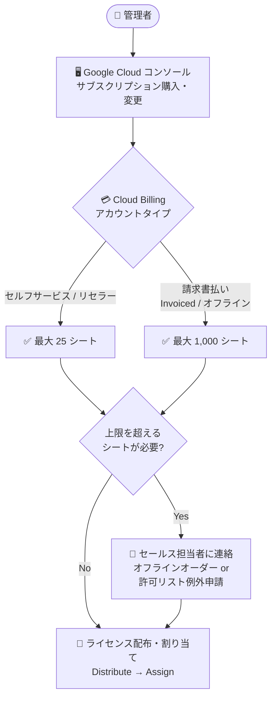

# Gemini Enterprise: サブスクリプションのシート数上限の導入

**リリース日**: 2026-08-19

**サービス**: Gemini Enterprise

**機能**: サブスクリプションのシート数上限 (Subscription seat quantity limits)

**ステータス**: Change (仕様変更)

📊 [このアップデートのインフォグラフィックを見る](https://takech9203.github.io/google-cloud-news-summary/20260819-gemini-enterprise-subscription-seat-limits.html)

## 概要

Google Cloud コンソールから Gemini Enterprise のシートベースのサブスクリプションを購入または変更する際に、Cloud Billing アカウントのタイプに応じたシート数の上限 (キャップ) が適用されるようになりました。セルフサービス (オンライン) アカウントおよびリセラー経由 (resold) のアカウントは 1 アカウントあたり最大 25 シート、請求書払い (オフライン / Invoiced) アカウントは 1 アカウントあたり最大 1,000 シートが上限となります。

この変更は、Google Cloud コンソール経由でのセルフサービス購入・変更のみに適用される制限です。上限を超えるシート数が必要な場合は、Google Cloud のセールス担当者またはアカウントマネージャーに連絡し、オフラインのオーダーフォームによる追加ライセンス購入、または請求先アカウントの許可リスト (allowlist) 例外申請を行うことで対応できます。

Gemini Enterprise の管理者 (Billing Account Administrator) や、組織へのライセンス展開を計画している Solutions Architect にとって、シート数の調達計画やスケール時の購買フローに直接影響する変更です。

**アップデート前の課題**

- Google Cloud コンソールからのシートベースサブスクリプションの購入・変更において、請求先アカウントタイプに応じた明示的なシート数上限が定義されていなかった
- セルフサービス経由での大量シート購入に対するガードレールがなく、大規模契約は本来セールス経由で管理されるべきという購買プロセスの区分が不明確だった

**アップデート後の改善**

- 請求先アカウントタイプごとのシート数上限が明文化され、コンソール購入時の挙動が予測可能になった (セルフサービス / リセラー: 25 シート、請求書払い: 1,000 シート)
- 上限超過時には「The quantity exceeds the maximum limit of seats for this account」エラーが返るようになり、トラブルシューティングガイドに対処方法が明記された
- 上限を超えるシートが必要な場合の正式なエスカレーションパス (オフラインオーダー、許可リスト例外申請) が公式ドキュメントに定義された

## アーキテクチャ図



Google Cloud コンソールからのシート購入時に、Cloud Billing アカウントタイプに応じた上限が適用され、超過する場合はセールス経由のオフラインオーダーまたは許可リスト例外申請にエスカレーションするフローを示しています。

## サービスアップデートの詳細

### 主要機能

1. **請求先アカウントタイプ別のシート数上限**
   - セルフサービス (オンライン) およびリセラー経由の請求先アカウント: 1 アカウントあたり最大 25 シート
   - 請求書払い (オフライン / Invoiced) の請求先アカウント: 1 アカウントあたり最大 1,000 シート
   - 上限は Google Cloud コンソールからサブスクリプションを購入・変更する場合に自動的に適用される

2. **上限超過時のエラーと対処フロー**
   - 上限を超えるシート数を購入・追加しようとすると「The quantity exceeds the maximum limit of seats for this account」エラーで操作が失敗する
   - オフラインオーダーフォームで上限を超えて既にプロビジョニングされているアカウントに対して、コンソールからシートを追加しようとした場合も同じエラーが発生する

3. **上限を超えるための正式なエスカレーションパス**
   - Google Cloud のセールス担当者またはアカウントマネージャーに連絡し、オフラインオーダーで追加ライセンスを購入する
   - もしくは、請求先アカウントに対する許可リスト (allowlist) 例外を申請する

## 技術仕様

### シート数上限の詳細

| 請求先アカウントタイプ | コンソール経由のシート上限 | 備考 |
|------|------|------|
| セルフサービス (オンライン) | 25 シート / アカウント | クレジットカードなどによるオンライン決済アカウント |
| リセラー経由 (resold) | 25 シート / アカウント | パートナー / リセラー管理のアカウント |
| 請求書払い (Invoiced / オフライン) | 1,000 シート / アカウント | 月次請求書が発行されるアカウント |
| 上限超過が必要な場合 | セールス経由 | オフラインオーダーまたは許可リスト例外申請 |

### 適用範囲

| 項目 | 詳細 |
|------|------|
| 適用対象 | Google Cloud コンソールからのシートベースサブスクリプションの購入・変更 |
| 対象エディション | コンソールから購入可能なエディション (Gemini Enterprise Standard、Plus、Pay-as-you-go) のうちシートベースのもの |
| 適用されないケース | セールス経由のオフラインオーダーによる購入 (1,000 シート超のプロビジョニングも可能) |
| エラーメッセージ | `The quantity exceeds the maximum limit of seats for this account` |

## 設定方法

### 前提条件

1. Gemini Enterprise のサブスクリプションを管理する請求先アカウントに対する Billing Account Administrator ロール (`roles/billing.admin`) または必要な権限を持つカスタムロール
2. ライセンス配布先プロジェクトで Discovery Engine API が有効化されていること

### 手順

#### ステップ 1: 現在のサブスクリプションとシート数の確認

```bash
# REST API でサブスクリプション詳細 (ライセンス数など) を確認
curl -X GET \
  -H "Authorization: Bearer $(gcloud auth print-access-token)" \
  -H "Content-Type: application/json" \
  -H "X-Goog-User-Project: PROJECT_NUMBER" \
  "https://discoveryengine.googleapis.com/v1alpha/billingAccounts/BILLING_ACCOUNT_ID/billingAccountLicenseConfigs"
```

コンソールの場合は、[Gemini Enterprise] ページ → [Manage subscriptions] → 請求先アカウントを選択 → サブスクリプション名をクリックして、`licenseCount` (シート数) を確認します。

#### ステップ 2: コンソールでのシート数変更 (上限内の場合)

```text
1. Google Cloud コンソールで [Gemini Enterprise] ページに移動
2. [Manage subscriptions] をクリック
3. 対象のサブスクリプションを選択
4. [Subscription details] の横の [Edit] をクリック
5. ライセンス数を更新して [Submit]
```

請求先アカウントタイプごとの上限 (25 / 1,000 シート) の範囲内であれば、そのまま変更が反映されます。

#### ステップ 3: 上限を超えるシートが必要な場合

上限超過エラーが発生した場合は、Google Cloud のセールス担当者またはアカウントマネージャーに連絡し、以下のいずれかを依頼します。

- オフラインオーダーフォームによる追加ライセンスの購入 (オーダーフォームの更新)
- 請求先アカウントに対する許可リスト (allowlist) 例外の適用

## メリット

### ビジネス面

- **購買プロセスの明確化**: セルフサービス購入とセールス主導の大規模契約の境界が明文化され、調達計画が立てやすくなった
- **意図しない大量購入の防止**: コンソール操作ミスなどによる想定外の大量シート購入 (およびそれに伴う課金) に対するガードレールとして機能する

### 技術面

- **エラー時の対処が明確**: 上限超過時のエラーメッセージと対処方法が公式トラブルシューティングに記載され、原因の切り分けが容易になった
- **既存の大規模契約への配慮**: オフラインオーダーで上限超にプロビジョニング済みのアカウントについても、エスカレーションパス (許可リスト例外) が用意されている

## デメリット・制約事項

### 制限事項

- セルフサービス (オンライン) およびリセラー経由のアカウントは、コンソールからは最大 25 シートまでしか購入・追加できない
- 請求書払いアカウントでも、コンソールからは最大 1,000 シートが上限となる
- オフラインオーダーで既に上限を超えてプロビジョニングされているサブスクリプションに対して、コンソールからシートを追加しようとするとエラーになる

### 考慮すべき点

- 25 シートを超える展開を予定している組織 (特にセルフサービスアカウント利用時) は、あらかじめセールス担当者との調整またはアカウントタイプの見直し (請求書払いへの移行) を検討する必要がある
- ライセンスはプロジェクトとロケーションに紐づくため、シート数の計画時にはマルチリージョン構成 (例: US と global) でライセンスが別々に必要になる点も考慮する

## ユースケース

### ユースケース 1: 小規模チームでのセルフサービス導入

**シナリオ**: スタートアップがセルフサービス (オンライン) の請求先アカウントで Gemini Enterprise Standard を 20 シート導入し、その後 30 シートへ拡張しようとする。

**効果**: 20 → 25 シートまではコンソールで即時に変更可能。25 シートを超える拡張が必要になった時点で、セールス担当者経由のオフラインオーダーまたは許可リスト例外申請に切り替えるという判断基準が明確になり、拡張計画を事前に立てられる。

### ユースケース 2: 大企業での全社展開

**シナリオ**: 請求書払い (Invoiced) アカウントを持つ大企業が、Gemini Enterprise Plus を全社 3,000 ユーザーに展開する。

**効果**: コンソール経由では 1,000 シートが上限のため、最初からアカウントマネージャーを通じたオフラインオーダーで契約する。部門単位のパイロット (1,000 シート以内) はコンソールで迅速に開始し、全社展開はセールス経由で行うといった段階的な調達戦略を取れる。

## 料金

今回の変更は料金体系自体の変更ではなく、コンソール経由で購入できるシート数の上限に関する変更です。Gemini Enterprise はエディション (Business / Standard / Plus / Pay-as-you-go / Frontline) ごとにシート単位の月額または年額サブスクリプションで課金されます (Pay-as-you-go は従量課金)。

最新の料金は公式ページを参照してください。

- [Gemini Enterprise 料金](https://cloud.google.com/gemini-enterprise/pricing)

## 関連サービス・機能

- **Cloud Billing**: 請求先アカウントのタイプ (セルフサービス / リセラー / 請求書払い) によって適用されるシート上限が決まる。上限緩和には請求先アカウント単位の許可リスト例外が必要
- **Discovery Engine API**: Gemini Enterprise のライセンス配布・管理に使用される API。サブスクリプション詳細の取得やライセンス配布は REST API 経由でも実行可能
- **Gemini Enterprise エディション (Standard / Plus / Pay-as-you-go)**: コンソールから購入可能なエディション。シートベースのサブスクリプションが今回の上限の対象
- **IAM (Billing Account Administrator)**: サブスクリプションの購入・変更・ライセンス配布に必要なロール (`roles/billing.admin`)

## 参考リンク

- 📊 [インフォグラフィック](https://takech9203.github.io/google-cloud-news-summary/20260819-gemini-enterprise-subscription-seat-limits.html)
- [公式リリースノート](https://docs.cloud.google.com/release-notes#August_19_2026)
- [ドキュメント: サブスクリプションのシート数上限 (Subscription seat quantity limits)](https://docs.cloud.google.com/gemini/enterprise/docs/licenses#seat-limits)
- [ドキュメント: ライセンスの FAQ / トラブルシューティング](https://docs.cloud.google.com/gemini/enterprise/docs/licenses-faqs)
- [ドキュメント: Gemini Enterprise エディションの比較](https://docs.cloud.google.com/gemini/enterprise/docs/editions)
- [料金ページ](https://cloud.google.com/gemini-enterprise/pricing)

## まとめ

Google Cloud コンソール経由の Gemini Enterprise シートベースサブスクリプションに、請求先アカウントタイプ別のシート数上限 (セルフサービス / リセラー: 25 シート、請求書払い: 1,000 シート) が導入されました。上限を超える展開を計画している組織は、あらかじめセールス担当者経由のオフラインオーダーや許可リスト例外申請を調達プロセスに組み込んでおくことを推奨します。既存サブスクリプションのシート数と請求先アカウントタイプを確認し、今後の拡張計画に影響がないか点検しておきましょう。

---

**タグ**: #GeminiEnterprise #CloudBilling #ライセンス管理 #サブスクリプション #Change
