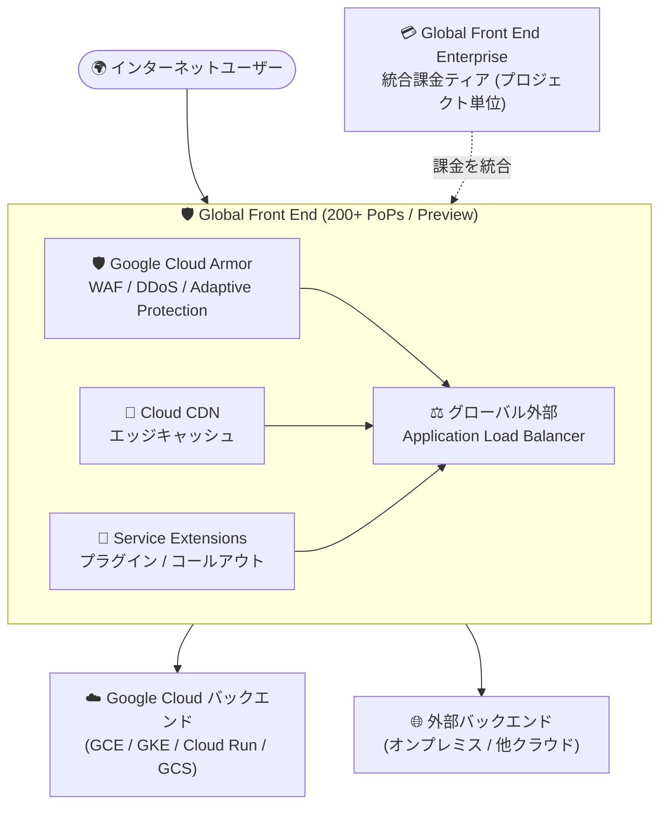

# Cloud Load Balancing / Cloud CDN / Google Cloud Armor: Global Front End (Preview)

**リリース日**: 2026-08-19

**サービス**: Cloud Load Balancing、Cloud CDN、Google Cloud Armor、Service Extensions

**機能**: Global Front End (統合エッジソリューションと Enterprise 課金ティア)

**ステータス**: Preview

📊 [このアップデートのインフォグラフィックを見る](https://takech9203.github.io/google-cloud-news-summary/20260819-global-front-end-preview.html)

## 概要

Google Cloud は、インターネット向けアプリケーションの配信・スケーリング・保護を単一のソリューションとして提供する「Global Front End」を Preview として発表しました。Global Front End は、グローバル外部アプリケーションロードバランサ、Google Cloud Armor、Cloud CDN、Service Extensions を統合した Cross-Cloud Network ソリューションで、Google Cloud の 200 以上の PoP (Points of Presence) を活用し、インターネットユーザーと任意のクラウド・コロケーション・データセンターにホストされたバックエンドとの間の統合エッジゲートウェイとして機能します。

このアップデートの中核は「Global Front End Enterprise」という新しい課金ティアです。従来は Cloud CDN、ロードバランサ、Cloud Armor、Service Extensions のそれぞれで個別の SKU に基づく課金が発生していましたが、Global Front End Enterprise をプロジェクトで有効化すると、これらの料金が統合された SKU に集約され、課金がシンプルになります。さらに、有効化したプロジェクト内のグローバル外部アプリケーションロードバランサでは、Cloud Armor Enterprise ティアの特定機能 (Adaptive Protection、Google Threat Intelligence など) が利用可能になります。

対象ユーザーは、マルチクラウド・ハイブリッド環境に分散したアプリケーションを管理・保護するエンタープライズネットワークアーキテクト、セキュリティ管理者、プラットフォームエンジニアリングチームです。同日の Cloud CDN、Cloud Load Balancing、Google Cloud Armor の各リリースノートで同時に発表されました。

**アップデート前の課題**

- エッジ配信構成 (ロードバランサ + CDN + WAF + 拡張機能) を構築する際、複数の製品にまたがる多数の SKU と複数の料金オプションを個別に見積もる必要があり、コスト予測が複雑だった
- Cloud Armor Enterprise の高度なセキュリティ機能 (Adaptive Protection、Threat Intelligence など) を利用するには、Cloud Armor Enterprise (Annual または Paygo) への個別の加入・登録が必要だった
- エッジネットワークを構成する各製品を個別に調達・構成・維持する必要があり、運用コストが高くなりがちだった

**アップデート後の改善**

- Global Front End Enterprise をプロジェクトで有効化するだけで、ロードバランサ・Cloud CDN・Cloud Armor・Service Extensions の料金が「インスタンス」「リクエスト」「データ処理」の 3 つの統合 SKU に集約され、課金がシンプルになった
- 有効化したプロジェクト内のすべてのグローバル外部アプリケーションロードバランサで、Cloud Armor Enterprise ティアの機能へのアクセスが可能になった
- 配信 (CDN)・スケーリング (ロードバランシング)・保護 (WAF/DDoS)・カスタマイズ (Service Extensions) を単一ソリューションとして扱えるようになり、エッジ構成の設計と運用が統一された

## アーキテクチャ図

Global Front End は 4 つのネットワーキング製品を統合エッジゲートウェイとして束ね、Google Cloud 内外のバックエンドへトラフィックを配信します。Global Front End Enterprise を有効化すると、これらの課金がプロジェクト単位で統合されます。

## サービスアップデートの詳細

### 主要機能

1. **統合エッジソリューション**
   - グローバル外部アプリケーションロードバランサ (グローバル Anycast ルーティング、HTTP パラメータベースの高度なルーティング、URL リライト・リダイレクト・ヘッダー変更・トラフィックミラーリングなどのトラフィック管理)
   - Google Cloud Armor (L3〜L7 セキュリティポリシー、レート制限、機械学習による Adaptive Protection、Google Threat Intelligence、アドレスグループ、DDoS 攻撃の可視化)
   - Cloud CDN (URL マップのキャッシュポリシーによる詳細なキャッシュ制御、キャッシュ無効化、位置情報・デバイスメタデータによるリクエスト特性化)
   - Service Extensions (Google 管理のサンドボックスで実行されるプラグイン、ユーザー管理のコンピュートインスタンスへの gRPC コールアウト)

2. **Global Front End Enterprise 課金ティア**
   - プロジェクト単位で有効化する統合課金ティア。個別製品の SKU を 3 つの統合 SKU に集約
   - 有効化すると、プロジェクト内のすべてのグローバル外部アプリケーションロードバランサが Cloud Armor Enterprise ティアの機能にアクセス可能になる
   - 従来通り各サービスの個別料金で支払う「à la carte (Standard) 課金」も引き続きデフォルトとして選択可能

3. **マルチクラウド・ハイブリッド対応**
   - Cross-Cloud Network ソリューションの一部として、バックエンドの場所 (Google Cloud、オンプレミス、他クラウド) を問わず一元的なトラフィックルーティングと統一セキュリティポリシーを適用
   - 対応バックエンド: Compute Engine VM、GKE Pod、Cloud Run サービス、Cloud Storage バケット、および外部バックエンド

## 技術仕様

### Global Front End Enterprise の統合 SKU

| SKU | 課金内容 |
|------|------|
| Global Front End instance | デプロイしたサービスに関連付ける転送ルール (forwarding rule) ごとの固定時間料金 |
| Global Front End requests | アプリケーショントラフィックと Cloud CDN のエッジキャッシュトラフィックの両方をカバーする、10,000 リクエストあたりの単一料金 |
| Global Front End data processing | 処理された Ingress / Egress トラフィックに対する GiB あたりの段階制料金 |

### 有効化のスコープと動作

| 項目 | 詳細 |
|------|------|
| 有効化の単位 | Google Cloud プロジェクトレベルのみ (個別の転送ルール単位では不可) |
| 適用範囲 | プロジェクト内のすべての互換性のある転送ルールに課金モデルが適用される |
| クロスプロジェクトバックエンド | ロードバランサのフロントエンドが存在するプロジェクトにのみ Global Front End Enterprise 料金が適用され、バックエンド側プロジェクトの使用量は個別製品料金に従う |
| Cloud Armor ティアへの影響 | グローバル外部アプリケーションロードバランサ向けにセキュリティ機能を提供するが、プロジェクト自体の Cloud Armor ティアは変更しない |
| 無効化時の動作 | 以前の Cloud Armor セキュリティ構成は保持されないため、バックエンドサービスを別の Cloud Armor ティアに関連付け直す必要がある |

## メリット

### ビジネス面

- **課金の簡素化**: 複数製品・多数の SKU にまたがっていた見積もりとコスト管理が 3 つの統合 SKU に集約され、コスト予測が容易になる
- **運用コストの削減**: 個別のスタンドアロン製品を調達・構成・維持する場合と比較して、エッジネットワークを統合することで運用コストを低減できる
- **Enterprise セキュリティへのアクセス簡素化**: Cloud Armor Enterprise の個別サブスクリプションを経由せずに、プロジェクトの有効化だけで Enterprise 機能 (対象はグローバル外部 ALB) を利用できる

### 技術面

- **グローバルパフォーマンス**: 200 以上の PoP でコンテンツをキャッシュし、Anycast ルーティングにより最も近い正常なバックエンドへトラフィックを誘導
- **多層防御**: L3/L4 の DDoS 緩和が組み込みで提供され、機械学習ベースの L7 保護 (Adaptive Protection) も利用可能
- **マルチクラウド・ハイブリッドの一元管理**: バックエンドのホスト場所を問わず、集中型ルーティングと統一セキュリティポリシーを適用できる
- **データパスのカスタマイズ**: Service Extensions のプラグイン・コールアウトによりリクエスト/レスポンス属性の変更などの独自ロジックを組み込める

## デメリット・制約事項

### 制限事項

- Preview 段階のため、Pre-GA Offerings Terms が適用され、サポートが限定される可能性がある
- Global Front End Enterprise の有効化はプロジェクトレベルのみで、個別の転送ルール単位では有効化できない
- Cloud Armor Enterprise 機能の対象はグローバル外部アプリケーションロードバランサに限定される (クラシック ALB やリージョナル ALB は対象外)

### 考慮すべき点

- 有効化するとプロジェクト内のすべての互換転送ルールに統合課金モデルが適用されるため、ワークロード構成によっては個別 (à la carte) 課金の方が安価になる場合があり、事前のコスト比較が必要
- クロスプロジェクト構成では、フロントエンドのあるプロジェクトのみが Global Front End Enterprise 料金の対象となり、バックエンド側は個別料金のままである点に注意
- 無効化すると Cloud Armor のセキュリティ構成が保持されないため、無効化前に代替ティアへの移行計画が必要

## ユースケース

### ユースケース 1: グローバル E コマースサイトの配信と保護

**シナリオ**: 世界中のユーザーにサービスを提供する E コマースサイトで、CDN による静的コンテンツ配信、WAF による攻撃防御、L7 DDoS 対策を組み合わせたいが、複数製品のコスト見積もりと管理が煩雑になっている。

**効果**: Global Front End Enterprise を有効化することで、配信・保護のコストが 3 つの統合 SKU に集約され、コスト管理が簡素化される。同時に Adaptive Protection や Threat Intelligence などの Enterprise セキュリティ機能で HTTP フラッドなどの攻撃からサイトを保護できる。

### ユースケース 2: マルチクラウド環境の API エンドポイント統合

**シナリオ**: バックエンドが Google Cloud、オンプレミス、他クラウドに分散しており、API エンドポイントのアクセラレーションと統一されたセキュリティポリシーの適用が課題になっている。

**効果**: Global Front End が統合エッジゲートウェイとして機能し、バックエンドの場所を問わず一元的なルーティングと統一セキュリティポリシーを適用できる。Google の 200 以上の PoP により API レイテンシも低減される。

## 料金

Global Front End では 2 つの課金モデルを選択できます。

- **À la carte (Standard) 課金**: 各サービス (Cloud Load Balancing、Cloud CDN、Cloud Armor、Service Extensions) の個別 SKU で支払うデフォルトの課金モデル
- **Global Front End Enterprise 課金**: プロジェクトで有効化することで、「Global Front End instance (転送ルールごとの時間料金)」「Global Front End requests (10,000 リクエストあたり)」「Global Front End data processing (GiB あたりの段階制)」の 3 SKU に統合される課金モデル

具体的な単価は [ネットワーク料金ページ](https://cloud.google.com/vpc/network-pricing) を参照してください。

## 利用可能リージョン

Global Front End はグローバルサービスであり、Google Cloud の 200 以上の PoP を通じて提供されます。対象となるのはグローバル外部アプリケーションロードバランサを使用する構成です。

## 関連サービス・機能

- **Cross-Cloud Network**: Global Front End は Cross-Cloud Network ソリューションの一部として位置付けられており、マルチクラウド・ハイブリッド接続の全体像の中でインターネット向けアプリケーション配信を担う
- **Cloud Armor Enterprise**: Global Front End Enterprise の有効化により、グローバル外部 ALB で Enterprise ティアの機能 (Adaptive Protection、Threat Intelligence、DDoS 可視化など) が利用可能になる
- **Media CDN**: 大規模メディア配信向けの CDN。Global Front End の対象は Cloud CDN であり、メディアストリーミング用途では Media CDN が補完的な選択肢となる
- **Certificate Manager**: グローバル外部 ALB の TLS 証明書管理に使用され、Global Front End 構成と組み合わせて利用される

## 参考リンク

- 📊 [インフォグラフィック](https://takech9203.github.io/google-cloud-news-summary/20260819-global-front-end-preview.html)
- [公式リリースノート](https://docs.cloud.google.com/release-notes#August_19_2026)
- [Global Front End overview](https://docs.cloud.google.com/docs/networking/cross-cloud-network/global-front-end/gfee-overview)
- [リファレンスアーキテクチャ: Use Google Cloud Armor, Cloud Load Balancing, and Cloud CDN to deploy programmable global front ends](https://docs.cloud.google.com/architecture/deploy-programmable-gfe-cloud-armor-lb-cdn)
- [Cloud Armor Enterprise overview](https://docs.cloud.google.com/armor/docs/armor-enterprise-overview)
- [ネットワーク料金ページ](https://cloud.google.com/vpc/network-pricing)

## まとめ

Global Front End は、これまで個別に構成・課金されていたグローバル外部 ALB、Cloud CDN、Cloud Armor、Service Extensions を単一ソリューションとして扱い、Enterprise 課金ティアで料金を統合する重要なアップデートです。エッジ配信とセキュリティの構成を持つプロジェクトでは、現在の個別課金と Global Front End Enterprise のコストを比較し、Cloud Armor Enterprise 機能の利用価値も含めて Preview 段階での評価を始めることを推奨します。

---

**タグ**: #CloudLoadBalancing #CloudCDN #CloudArmor #ServiceExtensions #GlobalFrontEnd #Networking #Preview
