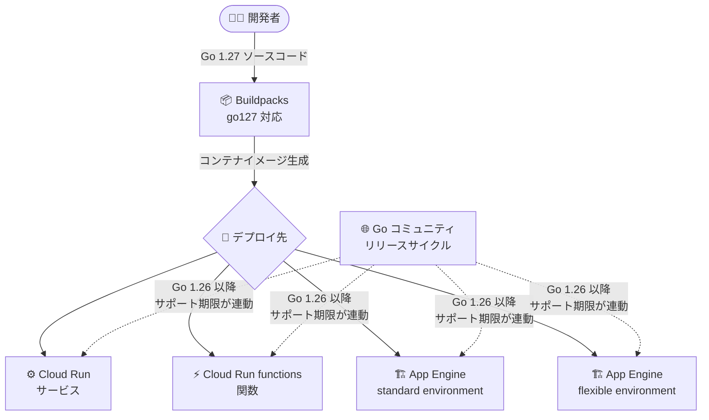

# Google Cloud サーバーレス: Go 1.27 ランタイムが Preview で利用可能に

**リリース日**: 2026-08-19

**サービス**: App Engine (flexible / standard)、Cloud Run、Cloud Run functions、Buildpacks

**機能**: Go 1.27 ランタイムのサポート (Preview)

**ステータス**: Preview

📊 [このアップデートのインフォグラフィックを見る](https://takech9203.github.io/google-cloud-news-summary/20260819-go-1-27-runtime-preview-serverless.html)

## 概要

Google Cloud のサーバーレス製品群 (App Engine flexible environment、App Engine standard environment、Cloud Run、Cloud Run functions、Buildpacks) において、Go 1.27 ランタイムのサポートが Preview として同日に発表されました。Go の最新メジャーバージョンをサーバーレス環境でいち早く検証できるようになり、Go アプリケーションを運用する開発チームは新バージョンへの移行準備を早期に開始できます。

あわせて、Go ランタイムのライフサイクルポリシーに関する重要なアナウンスもありました。Go 1.26 以降のランタイムでは、サポート期限 (End of support / Deprecation などの主要日程) が Go コミュニティのリリースサイクルにより近い形で設定されます。Go コミュニティのリリースポリシーでは、各メジャーリリースは 2 つの新しいメジャーリリースが出るまでサポートされるため、Google Cloud 上の Go ランタイムのサポート期間もこのサイクルに沿って運用されることになります。

このアップデートの対象は、Go でサーバーレスアプリケーション・API・イベント駆動関数を開発しているすべてのユーザーです。特に、複数のサーバーレス製品 (Cloud Run と Cloud Run functions など) を併用しているチームにとっては、全製品で同一バージョンのランタイムが同時に利用可能になった点が重要です。

**アップデート前の課題**

- Go 1.27 で開発したアプリケーションを Google Cloud のマネージドランタイムでそのまま実行できず、コンテナイメージを自前でビルドする必要があった
- Google Cloud の Go ランタイムのサポート期限が Go コミュニティのリリースサイクルと完全には一致しておらず、アップグレード計画の立案時に両者のスケジュールを個別に管理する必要があった
- 旧バージョン (Go 1.23 は 2026-08-21 にサポート終了予定、Go 1.24 は Cloud Run functions で 2026-09-02 に非推奨化予定) を利用中のユーザーには、移行先として最新バージョンの早期提供が求められていた

**アップデート後の改善**

- App Engine (flexible / standard)、Cloud Run、Cloud Run functions、Buildpacks のすべてで Go 1.27 ランタイムが Preview として利用可能になった
- Buildpacks が Go 1.27 に対応したことで、Dockerfile を書かずにソースコードから直接 Go 1.27 アプリケーションをビルド・デプロイできるようになった
- Go 1.26 以降のランタイムはライフサイクルの主要日程が Go コミュニティのリリースサイクルに近づき、アップグレード計画を Go 本体のリリースポリシーに沿って立てやすくなった

## アーキテクチャ図



Go 1.27 のソースコードは Buildpacks によりコンテナ化され、4 つのサーバーレス製品すべてにデプロイできます。Go 1.26 以降はランタイムのサポート期限が Go コミュニティのリリースサイクルに連動します。

## サービスアップデートの詳細

### 主要機能

1. **Go 1.27 ランタイムの Preview 提供 (全サーバーレス製品)**
   - App Engine flexible environment、App Engine standard environment、Cloud Run、Cloud Run functions、Buildpacks で同時に利用可能
   - Preview 段階のため、本番ワークロードへの適用前に検証環境での動作確認が推奨される

2. **Buildpacks の Go 1.27 対応**
   - Google Cloud's buildpacks がソースコードから Go 1.27 のコンテナイメージを自動生成
   - `gcloud run deploy --source .` などのソースデプロイで Go 1.27 を指定可能

3. **ライフサイクルポリシーの変更 (Go 1.26 以降)**
   - Go 1.26 以降のランタイムでは、サポート期限が Go コミュニティのリリースサイクルにより近い形で設定される
   - Go のリリースポリシーでは各メジャーリリースは 2 つの新しいメジャーリリースが出るまでサポートされるため、約 1 年ごとのアップグレードサイクルを前提とした計画が立てやすくなる

## 技術仕様

### 製品別のランタイム指定方法

| 製品 | ランタイム指定 | 備考 |
|------|---------------|------|
| App Engine standard environment | `app.yaml` の `runtime: go127` | 第 2 世代ランタイム |
| App Engine flexible environment | `app.yaml` の `runtime: go` + `runtime_config` でバージョン指定 | |
| Cloud Run (functions) | `--base-image go127` | ランタイムベースイメージとして指定 |
| Cloud Run functions (旧 Cloud Functions) | `gcloud beta functions deploy --runtime go127` | Preview ランタイムは `gcloud beta` を使用 |
| Buildpacks | `GOOGLE_RUNTIME_VERSION` などでバージョン指定 | ソースからの自動ビルド |

### 直近の Go ランタイムサポートスケジュール (Cloud Run functions の例)

| ランタイム | Runtime ID | スタック | 非推奨化 (Deprecation) | 廃止 (Decommission) |
|-----------|-----------|---------|----------------------|---------------------|
| Go 1.27 (Preview) | go127 | - | 未定 | 未定 |
| Go 1.26 | go126 | google-24 (デフォルト) / google-24-full | 未定 | 未定 |
| Go 1.25 | go125 | google-22 (デフォルト) / google-22-full | 未定 | 未定 |
| Go 1.24 | go124 | google-22 (デフォルト) / google-22-full | 2026-09-02 | 2027-03-02 |
| Go 1.23 | go123 | google-22 (デフォルト) / google-22-full | 2026-02-21 | 2026-08-21 |

App Engine standard / flexible environment でも Go 1.23 は 2026-08-21、Go 1.24 は 2027-03-02 にサポート終了 (End of support) が予定されており、Go 1.26 は Ubuntu 24.04 ベースで提供されています。

## 設定方法

### 前提条件

1. Google Cloud プロジェクトで対象 API (Cloud Run Admin API、App Engine Admin API など) が有効化されていること
2. gcloud CLI が最新バージョンにアップデートされていること
3. アプリケーションの `go.mod` で Go 1.27 に対応したモジュール設定がされていること

### 手順

#### ステップ 1: Cloud Run functions に Go 1.27 で関数をデプロイ

```bash
gcloud beta functions deploy my-function \
  --runtime go127 \
  --trigger-http \
  --region us-central1 \
  --source .
```

Preview 段階のランタイムを使用するため、`gcloud beta` コマンドを使用します。

#### ステップ 2: Cloud Run にソースコードからデプロイ (関数の場合)

```bash
gcloud run deploy my-service \
  --source . \
  --function MyEntryPoint \
  --base-image go127 \
  --region us-central1
```

`--base-image` フラグで Go 1.27 のランタイムベースイメージを指定します。Buildpacks が Go 1.27 でソースをビルドします。

#### ステップ 3: App Engine standard environment へのデプロイ

```yaml
# app.yaml
runtime: go127
```

```bash
gcloud app deploy
```

`app.yaml` の `runtime` フィールドに `go127` を指定してデプロイします。

## メリット

### ビジネス面

- **早期検証によるリスク低減**: 本番 GA 前に Go 1.27 での互換性・性能を検証でき、GA 後の移行をスムーズに進められる
- **アップグレード計画の簡素化**: Go 1.26 以降はサポート期限が Go コミュニティのサイクルに連動するため、社内の言語バージョン管理ポリシーと Google Cloud のランタイム管理を統一しやすい

### 技術面

- **全サーバーレス製品での同時提供**: Cloud Run、Cloud Run functions、App Engine を併用する構成でも、全製品で同一の Go バージョンに統一できる
- **Buildpacks によるビルドの自動化**: Dockerfile のメンテナンスなしで最新ランタイムを利用可能
- **最新の Go 言語機能・標準ライブラリの利用**: Go 1.27 の言語仕様・標準ライブラリの改善やパフォーマンス向上をサーバーレス環境で活用できる

## デメリット・制約事項

### 制限事項

- Go 1.27 ランタイムは Preview であり、SLA の対象外。本番ワークロードへの適用は GA を待つことが推奨される
- Cloud Run functions で Preview ランタイムにデプロイする場合は `gcloud beta functions deploy` コマンドの使用が必要
- Go 1.27 の非推奨化・廃止日程はまだ公開されていない (Go コミュニティの後続リリース時期に依存)

### 考慮すべき点

- Go 1.23 ランタイムは 2026-08-21 に廃止/サポート終了を迎えるため、該当バージョンを利用中の場合は Go 1.25/1.26 (GA) または Go 1.27 (Preview 検証) への移行を早急に計画すべき
- Go 1.24 も Cloud Run functions で 2026-09-02 に非推奨化されるため、移行スケジュールの確認が必要
- Go 1.26 以降はサポート期間が Go コミュニティのサイクル (2 つ後のメジャーリリースまで) に近づくため、従来よりも定期的なアップグレード運用 (概ね年 1 回以上) を前提とした体制が求められる

## ユースケース

### ユースケース 1: 既存 Cloud Run functions の新ランタイム互換性検証

**シナリオ**: Go 1.24 で運用中のイベント駆動関数群について、2026-09-02 の非推奨化を前に次期バージョンへの移行検証を行いたい。

**実装例**:
```bash
# 検証環境に Go 1.27 (Preview) で同一ソースをデプロイ
gcloud beta functions deploy my-function-canary \
  --runtime go127 \
  --trigger-topic my-topic-staging \
  --region us-central1 \
  --source .
```

**効果**: GA 前に依存ライブラリの互換性やコールドスタート性能を確認でき、GA 後の本番移行を最小限の作業で完了できる。

### ユースケース 2: マルチプロダクト構成での Go バージョン統一

**シナリオ**: フロント API を Cloud Run、バッチ処理を Cloud Run functions、管理画面を App Engine standard で運用しており、Go バージョンをそろえて CI/CD とローカル開発環境を統一したい。

**効果**: 全サーバーレス製品で Go 1.27 が同時に Preview 提供されたため、単一の Go バージョンで全コンポーネントのビルド・テスト・デプロイパイプラインを統一できる。

## 料金

ランタイムバージョンの追加による料金変更はありません。各製品の既存の料金体系 (vCPU・メモリ・リクエスト数などに基づく従量課金) がそのまま適用されます。

- [Cloud Run の料金](https://cloud.google.com/run/pricing)
- [App Engine の料金](https://cloud.google.com/appengine/pricing)

## 利用可能リージョン

各製品が提供されているすべてのリージョンで利用可能です。詳細は各製品のロケーションページを参照してください。

## 関連サービス・機能

- **Cloud Build / Buildpacks**: ソースコードから Go 1.27 コンテナイメージを自動生成するビルド基盤
- **Artifact Registry**: ランタイムベースイメージ (`google-24/go1xx` など) の提供元であり、ビルド成果物の保存先
- **Cloud Monitoring / Cloud Logging**: 新ランタイム移行時の性能比較・エラー監視に活用
- **App Engine 長期サポート (組織ポリシー)**: サポート終了後のレガシーランタイムへのデプロイ再有効化に関連

## 参考リンク

- 📊 [インフォグラフィック](https://takech9203.github.io/google-cloud-news-summary/20260819-go-1-27-runtime-preview-serverless.html)
- [公式リリースノート (2026 年 8 月 19 日)](https://docs.cloud.google.com/release-notes#August_19_2026)
- [Cloud Run functions ランタイムサポートスケジュール](https://docs.cloud.google.com/functions/docs/runtime-support)
- [Cloud Run の Go ランタイム](https://docs.cloud.google.com/run/docs/runtimes/go)
- [App Engine standard environment ランタイムサポートスケジュール](https://docs.cloud.google.com/appengine/docs/standard/lifecycle/support-schedule)
- [App Engine flexible environment ランタイムサポートスケジュール](https://docs.cloud.google.com/appengine/docs/flexible/lifecycle/support-schedule)
- [Go リリースポリシー (go.dev)](https://go.dev/doc/devel/release#policy)
- [Cloud Run の料金](https://cloud.google.com/run/pricing)

## まとめ

Go 1.27 ランタイムが Google Cloud の全サーバーレス製品で Preview 提供され、あわせて Go 1.26 以降のサポート期限が Go コミュニティのリリースサイクルに連動するようになりました。Go 1.23/1.24 など旧バージョンのサポート終了が目前に迫っているため、Go ワークロードを運用しているチームは、まず GA 済みの Go 1.25/1.26 への移行を進めつつ、Go 1.27 の互換性検証を Preview 段階で開始することを推奨します。

---

**タグ**: #GoogleCloud #CloudRun #AppEngine #CloudRunFunctions #Buildpacks #Go #Serverless #Preview
