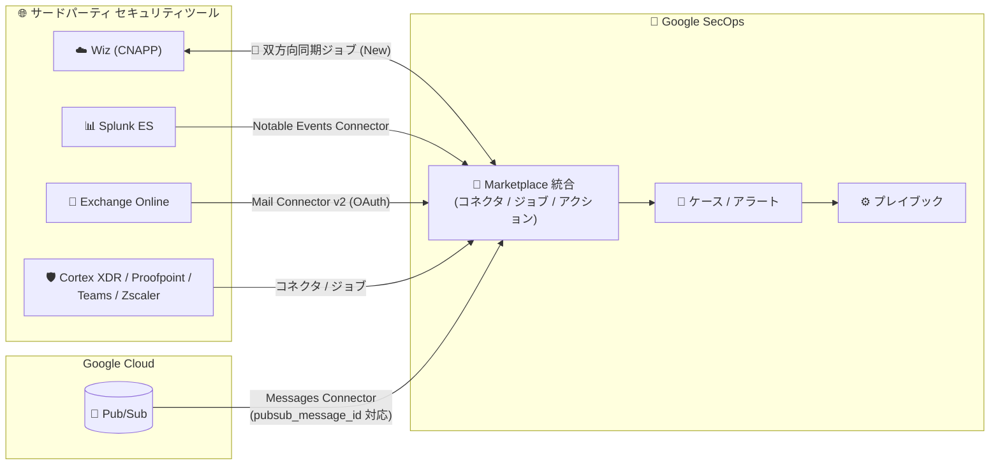

# Google SecOps Marketplace: 統合 (インテグレーション) アップデート (Wiz、Splunk、Exchange ほか 8 件)

**リリース日**: 2026-08-19

**サービス**: Google SecOps Marketplace

**機能**: サードパーティ統合のアップデート (Wiz v9.0、Exchange v125.0、Microsoft Teams v39.0、Palo Alto Cortex XDR v32.0、Proofpoint Cloud Threat Response v5.0、Pub/Sub v4.0、Splunk v67.0、Zscaler v16.0)

**ステータス**: Feature / Change / Fixed

📊 [このアップデートのインフォグラフィックを見る](https://takech9203.github.io/google-cloud-news-summary/20260819-google-secops-marketplace-integration-updates.html)

## 概要

2026 年 8 月 19 日、Google SecOps Marketplace において 8 つのサードパーティ統合 (インテグレーション) が同時にアップデートされました。Google SecOps Marketplace は、Google Security Operations (旧 Chronicle SOAR) にサードパーティ製セキュリティツールとの連携機能 (コネクタ、アクション、ジョブ) を提供するカタログであり、SOC (Security Operations Center) チームがアラート取り込みやプレイブックによる自動対応を実現するための基盤です。

今回のアップデートで最も注目すべきは、CNAPP (Cloud-Native Application Protection Platform) である **Wiz 統合 v9.0 への双方向同期ジョブの追加**です。「Wiz and Google SecOps Bi-directional Sync Job」により、Wiz の Issue と Google SecOps のケースのステータスを双方向で同期できるようになり、クラウドセキュリティ態勢管理と SOC 運用の間の分断を解消します。そのほか、Splunk ES Notable Events Connector のルックバックタイムスタンプ進行ロジックの改善、Exchange Mail Connector v2 のネストされた S/MIME 添付ファイル解析の改善、Pub/Sub Messages Connector での `pubsub_message_id` サポートなど、コネクタの信頼性・堅牢性を高める修正が多数含まれています。

これらのアップデートは、Google SecOps を SIEM/SOAR として運用し、Wiz、Splunk、Microsoft 365、Palo Alto Cortex XDR、Proofpoint、Zscaler などのセキュリティツールと連携している SOC エンジニア・セキュリティ運用担当者に影響します。

**アップデート前の課題**

- Wiz と Google SecOps 間でステータスを同期する専用ジョブがなく、Wiz Issue と SecOps ケースのステータス整合はアクション実行やカスタム実装に依存していた
- Exchange Mail Connector v2 (OAuth 認証) では、macOS や Windows から送信されたネストされた S/MIME メール添付ファイル (.eml) の解析に問題があった
- Palo Alto Cortex XDR の Sync Incidents ジョブは、Google SecOps 側でケースがマージまたは削除された場合にエラーを繰り返しログ出力していた
- Proofpoint Cloud Threat Response の Incidents Connector は、API ペイロード内の priority 値が null、欠落、または未マッピングの場合にログ取り込みエラーを起こしていた
- Pub/Sub Messages Connector の Unique ID Field パラメータで `pubsub_message_id` を利用できず、メッセージの一意識別の選択肢が限られていた
- Zscaler 統合では、URL パスの正規化の問題によりレガシー API キー/パスワード認証が失敗することがあった
- Splunk ES - Notable Events Connector のルックバックタイムスタンプの進行ロジックに改善の余地があり、イベント取得の時間管理が最適でないケースがあった

**アップデート後の改善**

- Wiz v9.0 の双方向同期ジョブにより、Wiz Issue と Google SecOps ケースのステータスが自動的に相互同期されるようになった
- Exchange v125.0 でネストされた S/MIME 添付ファイル (.eml) の解析ロジックが更新され、macOS / Windows 発のメールを正しく処理できるようになった
- Microsoft Teams v39.0 で Refresh Token Renewal ジョブのエラーハンドリングが改善され、トークン更新の運用安定性が向上した
- Palo Alto Cortex XDR v32.0 でケースのマージ・削除時のエラーログ反復問題が修正された
- Proofpoint Cloud Threat Response v5.0 で priority 値が不正な場合の取り込みエラーが解消された
- Pub/Sub v4.0 で Unique ID Field パラメータに `pubsub_message_id` を指定できるようになり、重複排除の精度が向上した
- Splunk v67.0 でルックバックタイムスタンプ進行ロジックが更新され、Notable Events の取りこぼし・重複リスクが低減した
- Zscaler v16.0 でレガシー認証の URL パス正規化問題が修正され、認証の互換性が回復した

## アーキテクチャ図



Google SecOps Marketplace の各統合がサードパーティツールからアラート・イベントを取り込み、ケース化してプレイブックで自動対応する構成です。今回のアップデートで Wiz とはステータスの双方向同期が可能になりました。

## サービスアップデートの詳細

### 主要機能

1. **Wiz v9.0: 双方向同期ジョブの追加 (Feature)**
   - 新ジョブ「Wiz and Google SecOps Bi-directional Sync Job」が追加された
   - Wiz の Issue と Google SecOps のケース間でステータスを双方向に同期し、どちらか一方でクローズ・解決された場合にもう一方へ反映できる
   - 従来から提供されていた Reopen Issue / Resolve Issue / Ignore Issue などの手動・プレイブックアクションを補完し、定期実行ジョブとして継続的な整合性を担保する

2. **Splunk v67.0: Notable Events Connector のルックバックロジック更新 (Change)**
   - Splunk ES - Notable Events Connector におけるルックバックタイムスタンプの進行 (progression) ロジックが更新された
   - Notable Events 取得時の時間ウィンドウ管理が改善され、イベントの取りこぼしや重複取り込みのリスクを低減する

3. **Exchange v125.0: ネストされた S/MIME 添付ファイルの解析改善 (Change)**
   - OAuth 認証を使用する Exchange Mail Connector v2 において、macOS および Windows から送信されたネストされた S/MIME メール添付ファイル (.eml) の解析ロジックが更新された
   - 暗号化・署名されたメールを転送・添付するフィッシング報告ワークフローなどでの解析精度が向上する

4. **Pub/Sub v4.0: Unique ID Field での pubsub_message_id サポート (Feature)**
   - Messages Connector の Unique ID Field パラメータで `pubsub_message_id` がサポートされた
   - Pub/Sub がメッセージごとに払い出す一意の ID をアラートの重複排除キーとして利用でき、ペイロード内にユニークなフィールドがない場合でも確実な重複排除が可能になる

5. **信頼性向上のための修正 (Fixed)**
   - **Microsoft Teams v39.0**: Refresh Token Renewal ジョブのエラーハンドリングを更新
   - **Palo Alto Cortex XDR v32.0**: Google SecOps 側でケースがマージ・削除された際に Sync Incidents ジョブがエラーを繰り返しログ出力する問題を修正
   - **Proofpoint Cloud Threat Response v5.0**: API ペイロードの priority 値が null / 欠落 / 未マッピングの場合に Incidents Connector でログ取り込みエラーが発生する問題を修正
   - **Zscaler v16.0**: URL パス正規化の問題によりレガシー API キー/パスワード認証が失敗する問題を修正

## 技術仕様

### アップデート対象の統合一覧

| 統合 | バージョン | 種別 | 変更内容 |
|------|-----------|------|----------|
| Wiz | v9.0 | Feature | 双方向同期ジョブ「Wiz and Google SecOps Bi-directional Sync Job」を追加 |
| Exchange | v125.0 | Change | Mail Connector v2 (OAuth) のネストされた S/MIME 添付ファイル (.eml) 解析ロジックを更新 |
| Microsoft Teams | v39.0 | Change | Refresh Token Renewal ジョブのエラーハンドリングを更新 |
| Palo Alto Cortex XDR | v32.0 | Fixed | ケースのマージ・削除時に Sync Incidents ジョブがエラーを繰り返す問題を修正 |
| Proofpoint Cloud Threat Response | v5.0 | Fixed | priority 値の null / 欠落 / 未マッピングによる取り込みエラーを修正 |
| Pub/Sub | v4.0 | Feature | Messages Connector の Unique ID Field で `pubsub_message_id` をサポート |
| Splunk | v67.0 | Change | Splunk ES - Notable Events Connector のルックバックタイムスタンプ進行ロジックを更新 |
| Zscaler | v16.0 | Fixed | URL パス正規化によるレガシー API キー/パスワード認証の失敗を修正 |

### Wiz 統合の主要パラメータ (参考)

| パラメータ | 説明 |
|-----------|------|
| API Root | 必須。Wiz インスタンスの API Root |
| Client ID | 必須。Wiz API 認証情報のクライアント ID |
| Client Secret | 必須。Wiz API 認証情報のクライアントシークレット |
| Verify SSL | 必須。Wiz サーバー接続時に SSL 証明書を検証 (デフォルト有効) |

Wiz サービスアカウントには、実行する操作に応じたスコープ (読み取り系: `read:issues` など、書き込み系: `write:issue_status`、`write:threat_issue_status` など) の付与が必要です。双方向同期ジョブでは Issue のステータス読み取りと更新の両方の権限が求められます。

## 設定方法

### 前提条件

1. Google SecOps (SOAR 機能) の利用環境があること
2. 対象統合が Google SecOps Marketplace からインストール済みであること
3. 各サードパーティ製品側の API 認証情報 (Wiz の場合は API Root / Client ID / Client Secret) が用意されていること

### 手順

#### ステップ 1: 統合を最新バージョンに更新

Google SecOps の **Marketplace > Integrations** で対象統合 (例: Wiz) を検索し、新バージョン (例: v9.0) に更新します。Marketplace のアップデートは自動では適用されないため、手動での更新確認を推奨します。

#### ステップ 2: 新ジョブの有効化 (Wiz の場合)

**Response > Jobs Scheduler** で「Wiz and Google SecOps Bi-directional Sync Job」を追加し、Wiz インテグレーションインスタンスと同期間隔を設定して有効化します。

#### ステップ 3: コネクタパラメータの見直し (Pub/Sub の場合)

Pub/Sub Messages Connector を使用している場合、Unique ID Field パラメータに `pubsub_message_id` を指定することで、Pub/Sub ネイティブのメッセージ ID による重複排除が利用できます。

## メリット

### ビジネス面

- **クラウドセキュリティと SOC 運用の統合**: Wiz の双方向同期により、CNAPP で検出された Issue のライフサイクルと SOC のケース管理が一体化し、対応漏れや二重対応を防止できる
- **運用負荷の低減**: 各コネクタの不具合修正 (Cortex XDR のエラーログ反復、Proofpoint の取り込みエラーなど) により、SOC チームのトラブルシューティング工数が削減される

### 技術面

- **取り込みパイプラインの信頼性向上**: Splunk のルックバックロジック改善や Pub/Sub の `pubsub_message_id` サポートにより、イベントの取りこぼし・重複が減少する
- **メール解析の堅牢性**: Exchange のネストされた S/MIME (.eml) 解析改善により、クライアント OS (macOS / Windows) に依存しないフィッシング調査ワークフローが実現する
- **認証の安定性**: Microsoft Teams のトークン更新ジョブのエラーハンドリング改善と Zscaler のレガシー認証修正により、認証起因の連携断が減少する

## デメリット・制約事項

### 制限事項

- Marketplace 統合のバージョンアップは自動適用されないため、各環境で手動更新が必要
- Wiz 双方向同期ジョブの利用には、Wiz サービスアカウントに Issue の読み取り・更新の両スコープが必要
- Splunk ES - Notable Events Connector は Splunk ES (Enterprise Security) 専用であり、通常の Splunk には適用されない

### 考慮すべき点

- Zscaler のレガシー API キー/パスワード認証は修正されたものの、長期的には新しい認証方式 (OAuth ベース) への移行を検討することを推奨
- コネクタのバージョン更新時は、既存のパラメータ設定やプレイブックへの影響を検証環境で確認してから本番適用する
- Pub/Sub コネクタで Unique ID Field を変更すると重複排除の基準が変わるため、切り替え直後の重複取り込みに注意する

## ユースケース

### ユースケース 1: Wiz Issue と SecOps ケースのライフサイクル同期

**シナリオ**: クラウドセキュリティチームが Wiz で検出した Critical な Issue を Google SecOps でケース化して対応している。従来は SecOps 側でケースをクローズしても Wiz 側の Issue が Open のまま残り、手動でのステータス更新が必要だった。

**実装例**:
```
1. Marketplace で Wiz 統合を v9.0 に更新
2. Jobs Scheduler で「Wiz and Google SecOps Bi-directional Sync Job」を有効化
3. Wiz サービスアカウントに read:issues / write:issue_status 等のスコープを付与
```

**効果**: SecOps ケースのクローズが Wiz Issue に自動反映され (逆方向も同様)、二重管理の手間とステータス不整合が解消される。

### ユースケース 2: Pub/Sub 経由のカスタムアラート取り込みの重複排除

**シナリオ**: 自社開発の検知システムから Pub/Sub トピック経由で Google SecOps にアラートを送信しているが、ペイロードに一意な ID フィールドがなく、リトライ時に重複ケースが作成されていた。

**効果**: Messages Connector の Unique ID Field に `pubsub_message_id` を指定することで、Pub/Sub のメッセージ ID を重複排除キーとして利用でき、重複ケースの作成を防止できる。

## 料金

Google SecOps Marketplace の統合自体に追加料金はありません。Google SecOps のライセンス (パッケージ) に含まれる SOAR 機能の範囲で利用できます。連携先のサードパーティ製品 (Wiz、Splunk など) のライセンスは別途必要です。

- [Google SecOps の料金](https://cloud.google.com/chronicle/docs/preview/pricing)

## 関連サービス・機能

- **Google SecOps (SIEM/SOAR)**: 本アップデートの対象プラットフォーム。コネクタで取り込んだアラートをケース化し、プレイブックで自動対応する
- **Cloud Pub/Sub**: Messages Connector の取り込み元。カスタム検知システムとの疎結合な連携に利用
- **Google Cloud Marketplace の SecOps 統合カタログ**: コネクタ、アクション、ジョブのバージョン管理・配布基盤

## 参考リンク

- 📊 [インフォグラフィック](https://takech9203.github.io/google-cloud-news-summary/20260819-google-secops-marketplace-integration-updates.html)
- [公式リリースノート](https://docs.cloud.google.com/release-notes#August_19_2026)
- [Wiz 統合ドキュメント](https://docs.cloud.google.com/chronicle/docs/soar/marketplace-integrations/wiz)
- [Splunk 統合ドキュメント](https://docs.cloud.google.com/chronicle/docs/soar/marketplace-integrations/splunk)
- [統合の設定方法 (Google SecOps)](https://docs.cloud.google.com/chronicle/docs/soar/respond/integrations-setup/configure-integrations)
- [コネクタによるデータ取り込み](https://docs.cloud.google.com/chronicle/docs/soar/ingest/connectors/ingest-your-data-connectors)

## まとめ

今回の Google SecOps Marketplace アップデートは、Wiz との双方向同期という新機能に加え、Splunk、Exchange、Pub/Sub など主要コネクタの信頼性を底上げする実用的な改善が中心です。該当する統合を利用している SOC チームは、Marketplace で各統合を最新バージョンに更新し、特に Wiz 利用環境では新しい双方向同期ジョブの有効化を検討することを推奨します。

---

**タグ**: Google SecOps, SecOps Marketplace, SOAR, Wiz, Splunk, Exchange, Microsoft Teams, Palo Alto Cortex XDR, Proofpoint, Pub/Sub, Zscaler, セキュリティ運用
