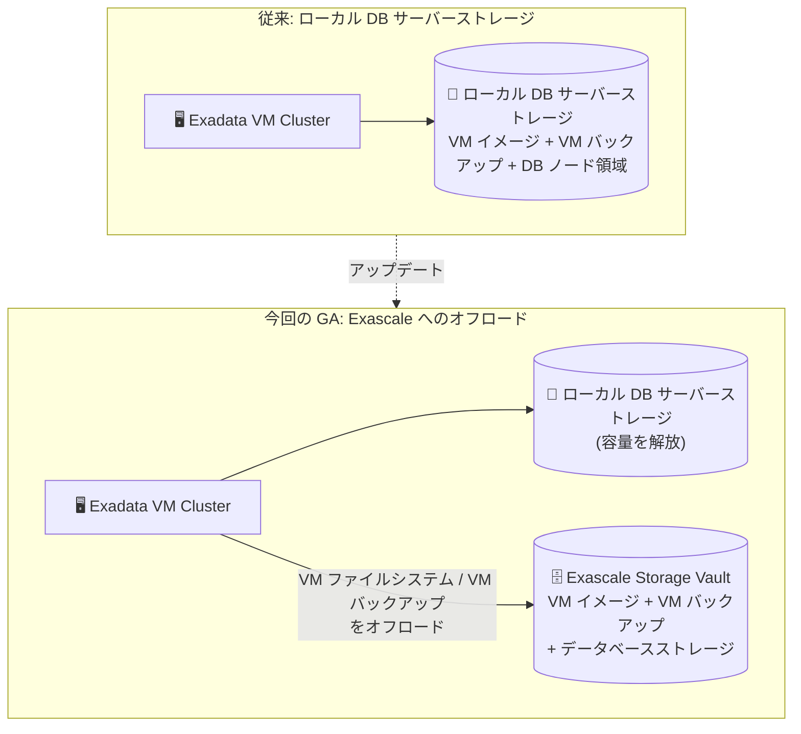

# Oracle Database@Google Cloud: Exascale ストレージへの VM ファイルシステム・VM バックアップ配置 (GA)

**リリース日**: 2026-08-19

**サービス**: Oracle Database@Google Cloud

**機能**: Exadata VM Cluster の VM ファイルシステムストレージ (VM イメージ) と VM バックアップの Exascale ストレージへのプロビジョニング

**ステータス**: GA (一般提供)

📊 [このアップデートのインフォグラフィックを見る](https://takech9203.github.io/google-cloud-news-summary/20260819-oracle-database-exascale-vm-storage-ga.html)

## 概要

Oracle Database@Google Cloud において、Exadata VM Cluster の VM ファイルシステムストレージ (VM イメージ) と VM バックアップを Exascale ストレージ上にプロビジョニングする機能が一般提供 (GA) になりました。従来、これらの VM アーティファクトはローカルの DB サーバーストレージに保存されていましたが、今回のアップデートにより Exascale Storage Vault へオフロードできるようになります。

この機能により、DB サーバーのローカルストレージ容量を解放し、ローカルストレージへの依存を削減できます。Exascale Storage Vault は、ダウンタイムなしで即座に拡張可能なスケーラブルで高性能な Exadata ストレージを提供するため、VM アーティファクトの保存先としてもローカルディスクの物理的な制約から解放されます。

対象ユーザーは、Google Cloud 上で Oracle Exadata Database Service を利用しており、Exadata Infrastructure 上に複数の Exadata VM Cluster を集約したい、あるいは DB サーバーのローカルストレージ容量の逼迫に課題を抱えているエンタープライズユーザーです。

**アップデート前の課題**

- VM ファイルシステムストレージ (VM イメージ) と VM バックアップはローカルの DB サーバーストレージに保存する必要があり、ローカルストレージ容量を消費していた
- DB サーバーのローカルストレージ容量が VM Cluster の集約度 (作成できるクラスタ数や VM のサイズ) の制約要因になり得た
- VM アーティファクトの保存がローカルストレージに依存していたため、容量計画の柔軟性が限られていた

**アップデート後の改善**

- VM ファイルシステムストレージ (VM イメージ) を Exascale ストレージにプロビジョニングできるようになった (`VM_FILE_SYSTEM_STORAGE_TYPE_EXASCALE`)
- VM バックアップを Exascale ストレージにプロビジョニングできるようになった (`VM_BACKUP_STORAGE_TYPE_EXASCALE`)
- VM アーティファクトを Exascale にオフロードすることで、DB サーバーのローカルストレージ容量を解放し、ローカルストレージへの依存を削減できるようになった

## アーキテクチャ図



VM イメージと VM バックアップの保存先を、ローカルの DB サーバーストレージから Exascale Storage Vault へオフロードできるようになった構成の Before/After 比較です。

## サービスアップデートの詳細

### 主要機能

1. **VM ファイルシステムストレージ (VM イメージ) の Exascale 配置**
   - Exadata VM Cluster 作成時に、VM ファイルシステムストレージの保存先としてローカル DB サーバーまたは Exascale ストレージを選択可能
   - gcloud CLI の `--properties-vm-file-system-storage-type` フラグで指定 (デフォルトは `VM_FILE_SYSTEM_STORAGE_TYPE_LOCAL`)

2. **VM バックアップの Exascale 配置**
   - VM バックアップの保存先としてローカル DB サーバーまたは Exascale ストレージを選択可能
   - gcloud CLI の `--properties-vm-backup-storage-type` フラグで指定 (デフォルトは `VM_BACKUP_STORAGE_TYPE_LOCAL`)

3. **Exadata Infrastructure への Exascale VM ストレージ割り当て**
   - `configure-exascale` コマンドで、Exadata Infrastructure から Exascale ストレージ (`--total-storage-size-gb`) と Exascale VM ストレージ (`--total-vm-storage-size-gb`) を割り当て可能

## 技術仕様

### ストレージタイプの指定値

| 項目 | 詳細 |
|------|------|
| VM ファイルシステムストレージ | `VM_FILE_SYSTEM_STORAGE_TYPE_LOCAL` (デフォルト) / `VM_FILE_SYSTEM_STORAGE_TYPE_EXASCALE` |
| VM バックアップストレージ | `VM_BACKUP_STORAGE_TYPE_LOCAL` (デフォルト) / `VM_BACKUP_STORAGE_TYPE_EXASCALE` |
| Exascale Storage Vault の容量 | 300 GiB 〜 100,000 GiB |
| クラスタ作成に必要な Vault の空き容量 | 2,048 GB 以上 |
| Exadata Infrastructure あたりの VM Cluster 数 | 最大 8 クラスタ |
| 操作インターフェース | Exascale Storage Vault を使用するクラスタ作成は gcloud CLI または API のみ (コンソール非対応) |

### 必要な IAM ロール・権限

| 操作 | 必要なロール・権限 |
|------|-------------------|
| Exascale Storage Vault の構成 | `oracledatabase.cloudExadataInfrastructures.update` 権限 |
| Exadata VM Cluster の作成 | `roles/oracledatabase.cloudVmClusterAdmin` |
| Exadata Infrastructure の利用 | `roles/oracledatabase.cloudExadataInfrastructureUser` |
| ネットワーク参照 | `compute.networks.list` 権限 |

## 設定方法

### 前提条件

1. gcloud CLI のセットアップと Oracle Database@Google Cloud API の有効化
2. ODB Network と ODB Subnet の作成 (Exadata VM Cluster にはクライアントサブネットとバックアップサブネットが必要)
3. Exadata Infrastructure インスタンスの作成
4. Exadata Infrastructure と同一プロジェクトへの Exascale Storage Vault の作成
5. 上記 IAM ロール・権限の付与

### 手順

#### ステップ 1: Exascale Storage Vault の作成

```bash
gcloud oracle-database exascale-db-storage-vaults create VAULT_ID \
  --project=PROJECT_ID \
  --location=REGION \
  --display-name="VAULT_DISPLAY_NAME" \
  --exascale-db-storage-details-total-size-gbs=VAULT_SIZE \
  --exadata-infrastructure=projects/PROJECT_ID/locations/REGION/cloudExadataInfrastructures/EXADATA_INSTANCE_ID \
  --async
```

Vault の容量 (`VAULT_SIZE`) は 300 GiB 〜 100,000 GiB の範囲で指定します。Exadata VM Cluster 全体のストレージ容量以上である必要があります。

#### ステップ 2: Exadata Infrastructure への Exascale Storage Vault の構成

```bash
gcloud oracle-database cloud-exadata-infrastructures configure-exascale EXADATA_INFRASTRUCTURE_ID \
  --project=PROJECT_ID \
  --location=REGION \
  --total-storage-size-gb=STORAGE_SIZE \
  --total-vm-storage-size-gb=VM_STORAGE_SIZE
```

`--total-vm-storage-size-gb` で、VM アーティファクト用に Exadata Infrastructure から割り当てる Exascale VM ストレージ容量 (GiB) を指定します。

#### ステップ 3: Exascale ストレージを使用する Exadata VM Cluster の作成

```bash
gcloud oracle-database cloud-vm-clusters create CLUSTER_ID \
  --exadata-infrastructure=projects/PROJECT_ID/locations/REGION/cloudExadataInfrastructures/EXADATA_INSTANCE_ID \
  --project=PROJECT_ID \
  --location=REGION \
  --display-name="DISPLAY_NAME" \
  --odb-subnet=projects/ODB_NETWORK_PROJECT_ID/locations/REGION/odbNetworks/ODB_NETWORK_ID/odbSubnets/CLIENT_SUBNET_ID \
  --backup-odb-subnet=projects/ODB_NETWORK_PROJECT_ID/locations/REGION/odbNetworks/ODB_NETWORK_ID/odbSubnets/BACKUP_SUBNET_ID \
  --properties-license-type=LICENSE_TYPE \
  --properties-ssh-public-keys="SSH_KEYS" \
  --properties-gi-version=GI_VERSION \
  --properties-hostname-prefix=HOSTNAME_PREFIX_NAME \
  --properties-cpu-core-count=CPU_CORE_COUNT \
  --properties-memory-size-gb=TOTAL_RAM_GB \
  --properties-db-node-storage-size-gb=TOTAL_LOCAL_DISK_GB \
  --properties-db-server-ocids="DB_SERVER_OCIDS" \
  --properties-vm-file-system-storage-type=VM_FILE_SYSTEM_STORAGE_TYPE_EXASCALE \
  --properties-vm-backup-storage-type=VM_BACKUP_STORAGE_TYPE_EXASCALE \
  --exascale-db-storage-vault=VAULT_ID \
  --async
```

`--properties-vm-file-system-storage-type` と `--properties-vm-backup-storage-type` に `*_EXASCALE` を指定することで、VM イメージと VM バックアップが Exascale ストレージに配置されます。

## メリット

### ビジネス面

- **リソース利用効率の向上**: DB サーバーのローカルストレージ容量を解放することで、既存の Exadata Infrastructure をより有効に活用できる
- **容量計画の柔軟性**: VM アーティファクトの保存先がローカルディスクの物理容量に縛られなくなり、インフラの集約・拡張計画が立てやすくなる

### 技術面

- **ローカルストレージ依存の削減**: VM イメージと VM バックアップを Exascale にオフロードし、ローカル DB サーバーストレージへの依存を削減できる
- **スケーラブルなストレージ基盤**: Exascale Storage Vault はダウンタイムなしの即時拡張が可能な高性能 Exadata ストレージであり、VM アーティファクトもその恩恵を受けられる
- **データベースストレージとの統合管理**: データベースストレージと VM アーティファクトを同じ Exascale Storage Vault 基盤で管理できる

## デメリット・制約事項

### 制限事項

- Exascale Storage Vault は 26ai データベースと Grid Infrastructure ホームのみをサポートし、Exascale Storage Vault をデータベースストレージに使用する Exadata VM Cluster では 19c データベースは実行できない
- 1 つの Exadata VM Cluster で Exascale Storage Vault と ASM をデータベースストレージとして併用することはできない
- クラスタ作成には Exascale Storage Vault に 2,048 GB 以上の空き容量が必要
- VM ファイルシステムストレージ (VM イメージ) を Exascale にプロビジョニングする場合は、VM バックアップも Exascale にプロビジョニングする必要がある
- Exascale Storage Vault を使用するクラスタの作成は gcloud CLI または API のみで、Google Cloud コンソールからは作成できない

### 考慮すべき点

- 1 つの Exadata Infrastructure インスタンスがサポートする Exadata VM Cluster は最大 8 つ
- Exascale Storage Vault は Exadata Infrastructure と同一プロジェクトに作成する必要がある
- 既定値はローカルストレージ (`*_LOCAL`) のため、Exascale への配置はクラスタ作成時に明示的に指定する必要がある

## ユースケース

### ユースケース 1: DB サーバーのローカルストレージ容量逼迫の解消

**シナリオ**: 既存の Exadata Infrastructure 上で複数の Exadata VM Cluster を運用しており、VM イメージと VM バックアップがローカル DB サーバーストレージを圧迫している。

**実装例**:
```bash
# Exadata Infrastructure に Exascale VM ストレージを割り当て
gcloud oracle-database cloud-exadata-infrastructures configure-exascale my-exadata-infra \
  --project=my-project \
  --location=us-east4 \
  --total-storage-size-gb=10240 \
  --total-vm-storage-size-gb=4096

# 新規クラスタで VM アーティファクトを Exascale に配置
gcloud oracle-database cloud-vm-clusters create my-cluster \
  --properties-vm-file-system-storage-type=VM_FILE_SYSTEM_STORAGE_TYPE_EXASCALE \
  --properties-vm-backup-storage-type=VM_BACKUP_STORAGE_TYPE_EXASCALE \
  --exascale-db-storage-vault=my-vault \
  ... (その他のパラメータ)
```

**効果**: VM アーティファクトが Exascale にオフロードされ、ローカル DB サーバーストレージの空き容量が増加。クラスタ集約度の向上に活用できる。

### ユースケース 2: 26ai データベース向け新規クラスタの Exascale 統合構成

**シナリオ**: Oracle Database 26ai を利用する新規の Exadata VM Cluster を構築するにあたり、データベースストレージ・VM イメージ・VM バックアップをすべて Exascale Storage Vault に統合したい。

**効果**: ストレージ管理が Exascale Storage Vault に一元化され、ダウンタイムなしの容量拡張が可能なスケーラブルな基盤の上で、ローカルストレージに依存しないクラスタ構成を実現できる。

## 料金

Oracle Database@Google Cloud の課金は Google Cloud の Cloud Billing に統合されています。Oracle が OCPU 時間やストレージ消費量などの使用量を計測し、集約された課金データが Cloud Billing に連携され、Google Cloud の月次請求書に明細として記載されます。Pay-As-You-Go の公開オファーと、Oracle と直接交渉するプライベートオファーの 2 種類の課金モデルがあります。

Exascale ストレージ利用分の具体的な料金は、Oracle の料金ページを参照してください。

- [Oracle Database@Google Cloud pricing (Oracle)](https://www.oracle.com/cloud/google/oracle-database-at-google-cloud/pricing/)

## 利用可能リージョン

利用可能なリージョン・ゾーンは公式ドキュメントを参照してください。

- [Supported regions and zones](https://docs.cloud.google.com/oracle/database/docs/regions-and-zones)

## 関連サービス・機能

- **Exadata Database Service on Exascale Infrastructure**: Exascale Storage Vault を基盤とする Exascale VM Cluster を提供するサービス。今回の機能は Exadata Infrastructure 上の Exadata VM Cluster でも Exascale ストレージを VM アーティファクトに活用できるようにするもの
- **ODB Network / ODB Subnet**: Exadata VM Cluster への接続を管理するネットワーク機能。クラスタ作成にはクライアントサブネットとバックアップサブネットが必要
- **Identity and Access Management (IAM)**: Exadata Infrastructure や VM Cluster の操作権限を管理。`roles/oracledatabase.cloudVmClusterAdmin` などのロールを使用
- **Cloud Billing**: Oracle Database@Google Cloud の使用量が Google Cloud の請求書に統合され、予算とアラートの設定も可能

## 参考リンク

- 📊 [インフォグラフィック](https://takech9203.github.io/google-cloud-news-summary/20260819-oracle-database-exascale-vm-storage-ga.html)
- [公式リリースノート](https://docs.cloud.google.com/release-notes#August_19_2026)
- [Configure Exascale Storage Vault for Exadata Infrastructure](https://docs.cloud.google.com/oracle/database/docs/configure-exascale-storage)
- [Create Exadata VM Clusters (Exascale Storage Vault を使用したクラスタ作成)](https://docs.cloud.google.com/oracle/database/docs/create-clusters)
- [Create Exascale Storage Vaults on Exadata Infrastructure](https://docs.cloud.google.com/oracle/database/docs/create-exadata-storage-vaults)
- [Oracle Database@Google Cloud 概要](https://docs.cloud.google.com/oracle/database/docs/overview)
- [料金ページ (Oracle Database@Google Cloud pricing)](https://www.oracle.com/cloud/google/oracle-database-at-google-cloud/pricing/)

## まとめ

Exadata VM Cluster の VM イメージと VM バックアップを Exascale ストレージへオフロードできる機能が GA となり、DB サーバーのローカルストレージ容量の制約を緩和する新たな選択肢が加わりました。Exadata Infrastructure 上でクラスタの集約度を高めたい場合や、ローカルストレージの逼迫に悩んでいる場合は、`configure-exascale` による Exascale VM ストレージの割り当てと、クラスタ作成時の `*_EXASCALE` ストレージタイプ指定の活用を検討してください。なお、26ai データベース限定や gcloud CLI / API のみでの作成といった制約があるため、既存の 19c 環境では事前にバージョン要件を確認することを推奨します。

---

**タグ**: #OracleDatabase #GoogleCloud #Exadata #Exascale #Storage #GA #マルチクラウド
