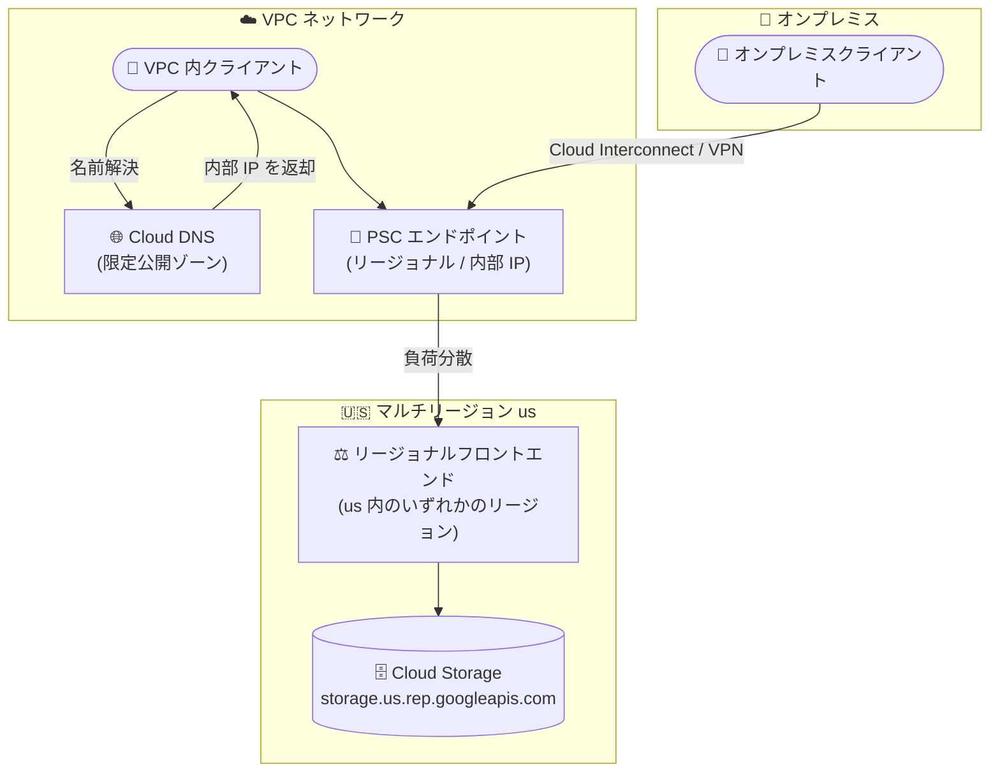

# Virtual Private Cloud (VPC): Private Service Connect によるマルチリージョンサービスエンドポイントへのアクセスが GA

**リリース日**: 2026-08-19

**サービス**: Virtual Private Cloud (VPC)

**機能**: Private Service Connect エンドポイント / バックエンドによるマルチリージョンサービスエンドポイントへのアクセス

**ステータス**: GA (一般提供)

📊 [このアップデートのインフォグラフィックを見る](https://takech9203.github.io/google-cloud-news-summary/20260819-vpc-psc-multi-regional-endpoints-ga.html)

## 概要

Private Service Connect (PSC) のエンドポイントおよびバックエンドを使用して、`storage.us.rep.googleapis.com` のような**マルチリージョンサービスエンドポイント**にアクセスする機能が一般提供 (GA) になりました。これまでの PSC によるリージョナルエンドポイント (`SERVICE.REGION.rep.googleapis.com` 形式) へのアクセスに加えて、`us` や `eu` といったマルチリージョン単位のエンドポイント (`SERVICE.MULTI_REGION.rep.googleapis.com` 形式) を PSC のターゲットとして指定できます。

このアップデートは、データレジデンシー (データ所在地) やデータ主権の要件により、転送中のデータを特定のリージョンまたはマルチリージョン内に留める必要がある組織にとって重要です。Cloud Storage のマルチリージョンバケットなど、マルチリージョンで構成されたリソースに対して、VPC 内部からプライベートかつ地理的境界を保証した形でアクセスできるようになります。

対象ユーザーは、金融・公共・医療など規制業界でコンプライアンス要件 (データが特定の地理的範囲を出ないことの保証) を持つ企業や、Cloud Interconnect / Cloud VPN 経由でオンプレミスから Google API にプライベートアクセスしている企業です。

**アップデート前の課題**

- PSC エンドポイントのターゲットとして安定的に利用できるのはリージョナルサービスエンドポイント (例: `storage.us-central1.rep.googleapis.com`) が中心で、マルチリージョンエンドポイントへの PSC アクセスは GA として保証されていなかった
- Cloud Storage のマルチリージョンバケット (例: `us`) を利用する場合でも、リージョン単位のエンドポイントを個別に指定する必要があり、マルチリージョン構成と経路設計が一致しなかった
- 転送中データをマルチリージョン境界内に留めることをプライベート接続で保証する構成が取りにくかった

**アップデート後の改善**

- PSC エンドポイントおよび PSC バックエンドのターゲットとして `storage.us.rep.googleapis.com` などのマルチリージョンエンドポイントを GA サポートで指定できるようになった
- マルチリージョンリソースへのトラフィックが、マルチリージョンを構成するいずれかのリージョンのフロントエンドに負荷分散され、地理的境界内でのルーティングが保証される
- 本番環境でのデータレジデンシー要件を満たすプライベート接続構成を、GA の SLA 水準で採用できるようになった

## アーキテクチャ図



VPC 内またはオンプレミスのクライアントは、リージョナルな PSC エンドポイント (内部 IP) を経由してマルチリージョンエンドポイントにアクセスします。トラフィックはマルチリージョン (`us` など) を構成するいずれかのリージョンのフロントエンドに負荷分散され、地理的境界内で処理されます。

## サービスアップデートの詳細

### 主要機能

1. **マルチリージョンエンドポイントを PSC のターゲットに指定可能 (GA)**
   - `SERVICE.MULTI_REGION.rep.DOMAIN` 形式のホスト名 (例: `storage.us.rep.googleapis.com`) を PSC エンドポイントの `--target-google-api` に指定できる
   - PSC エンドポイント自体はリージョナルリソース (特定リージョンに作成) だが、ターゲットはマルチリージョン (`us`、`eu` など) を指定できる

2. **マルチリージョン内での負荷分散**
   - PSC エンドポイントからのトラフィックは、マルチリージョンに関連付けられたいずれかのリージョンにあるリージョナルフロントエンドへ負荷分散される
   - 転送中データがマルチリージョン境界内に留まることを保証できる

3. **既存の PSC 機能との互換性**
   - グローバルアクセス (`--enable-global-access`) により、他リージョンのクライアントからもエンドポイントへアクセス可能
   - Cloud Interconnect / Cloud VPN 経由のハイブリッドアクセス、VPC ネットワークピアリング経由のアクセス、Network Connectivity Center (NCC) を通じた接続伝播に対応
   - IPv4 / IPv6 の両方をサポート

## 技術仕様

### エンドポイント形式と特性

| 項目 | 詳細 |
|------|------|
| リージョナルエンドポイント形式 | `SERVICE.REGION.rep.DOMAIN` (例: `storage.us-central1.rep.googleapis.com`) |
| マルチリージョンエンドポイント形式 | `SERVICE.MULTI_REGION.rep.DOMAIN` (例: `storage.us.rep.googleapis.com`) |
| PSC エンドポイントのスコープ | リージョナル (特定リージョンに作成、内部 IP アドレスを割り当て) |
| プライベートホスト名 (`p.rep.DOMAIN`) | リージョナルエンドポイントのみ対応。**マルチリージョンエンドポイントは非対応** |
| IP バージョン | IPv4 / IPv6 |
| デフォルトのアクセス範囲 | エンドポイントと同一リージョン・同一 VPC (グローバルアクセス有効化で他リージョンからも可) |
| DNS 設定 | 手動設定 (Cloud DNS 限定公開ゾーンなど) |
| ハイブリッド接続 | Cloud Interconnect / Cloud VPN 経由のアクセスに対応 |

### マルチリージョンエンドポイントの例

公式ドキュメントの対応エンドポイント一覧には、以下のようなマルチリージョンエンドポイントが記載されています。

| サービス | マルチリージョンエンドポイントの例 |
|------|------|
| Cloud Storage | `storage.us.rep.googleapis.com` |
| Cloud Trace | `cloudtrace.us.rep.googleapis.com`、`cloudtrace.eu.rep.googleapis.com` |
| Backup and DR Service | `backupdr.us.rep.googleapis.com`、`backupdr.eu.rep.googleapis.com` |
| Compliance Manager | `cloudsecuritycompliance.us.rep.googleapis.com` |

対応サービスの完全な一覧は [Regional service endpoints](https://docs.cloud.google.com/vpc/docs/regional-service-endpoints) を参照してください。

## 設定方法

### 前提条件

1. VPC ネットワークとサブネット (通常のサブネット) が作成済みであること
2. エンドポイント管理に必要な IAM ロール (Compute Network Admin など) が付与されていること。Shared VPC 構成の場合は、ホストプロジェクトに対する Compute Network User ロールと、Network Connectivity サービスアカウントへの権限付与が追加で必要

### 手順

#### ステップ 1: PSC エンドポイントの作成

```bash
gcloud network-connectivity regional-endpoints create psc-storage-us \
    --region=us-central1 \
    --network=projects/PROJECT_ID/global/networks/NETWORK_NAME \
    --subnetwork=projects/PROJECT_ID/regions/us-central1/subnetworks/SUBNET_NAME \
    --target-google-api=storage.us.rep.googleapis.com
```

`--target-google-api` にマルチリージョンエンドポイントのホスト名を指定します。IP アドレスを省略した場合はサブネットから IPv4 アドレスが自動割り当てされます。他リージョンからのアクセスを許可する場合は `--enable-global-access` フラグを追加します。

#### ステップ 2: DNS の設定

```bash
# Cloud DNS 限定公開ゾーンを作成し、エンドポイントの内部 IP に解決させる
gcloud dns managed-zones create rep-zone \
    --dns-name="rep.googleapis.com." \
    --visibility=private \
    --networks=NETWORK_NAME

gcloud dns record-sets create storage.us.rep.googleapis.com. \
    --zone=rep-zone \
    --type=A \
    --ttl=300 \
    --rrdatas=ENDPOINT_IP
```

マルチリージョンエンドポイントの DNS 設定は手動で行います。クライアントが `storage.us.rep.googleapis.com` を名前解決した際に、PSC エンドポイントの内部 IP が返るように構成します。

#### ステップ 3: 動作確認

```bash
# エンドポイントの一覧と状態を確認
gcloud network-connectivity regional-endpoints list --region=us-central1
```

## メリット

### ビジネス面

- **コンプライアンス対応の強化**: 転送中データがマルチリージョン境界 (`us`、`eu` など) を出ないことをプライベート接続で保証でき、データレジデンシー・データ主権要件への対応が容易になる
- **GA による本番採用**: 一般提供となったことで、規制業界の本番ワークロードにも安心して採用できる

### 技術面

- **マルチリージョン構成との整合**: Cloud Storage マルチリージョンバケットなどのリソース構成と、ネットワーク経路の地理的境界を一致させられる
- **可用性の向上**: トラフィックがマルチリージョン内の複数リージョンのフロントエンドに負荷分散されるため、単一リージョンのエンドポイント指定と比べて経路の冗長性が高まる
- **ハイブリッド環境からのプライベートアクセス**: Cloud Interconnect / Cloud VPN 経由でオンプレミスからもマルチリージョンエンドポイントへプライベートにアクセスできる

## デメリット・制約事項

### 制限事項

- マルチリージョンエンドポイントはプライベートホスト名形式 (`p.rep.DOMAIN`) に対応していない (パブリックホスト名形式のみ)
- PSC エンドポイント自体はリージョナルリソースであり、デフォルトでは同一リージョン・同一 VPC のクライアントからのみアクセス可能 (他リージョンからはグローバルアクセスの有効化が必要)
- 利用できるサービスは対応エンドポイント一覧に記載されたものに限られる

### 考慮すべき点

- DNS 設定は自動化されないため、Cloud DNS 限定公開ゾーンなどで手動構成が必要
- Shared VPC 構成では、ユーザーアカウントと Network Connectivity サービスアカウントの両方にホストプロジェクトへの追加権限が必要
- アプリケーション側で API のエンドポイント URL を `storage.us.rep.googleapis.com` などに変更する必要がある

## ユースケース

### ユースケース 1: データレジデンシー要件のある Cloud Storage マルチリージョンバケットへのアクセス

**シナリオ**: 米国内のデータ所在を義務付けられた金融機関が、`us` マルチリージョンの Cloud Storage バケットに VPC 内のワークロードからアクセスする。転送中データも米国内に留める必要がある。

**実装例**:
```bash
gcloud network-connectivity regional-endpoints create psc-storage-us \
    --region=us-central1 \
    --network=projects/my-project/global/networks/prod-vpc \
    --subnetwork=projects/my-project/regions/us-central1/subnetworks/prod-subnet \
    --target-google-api=storage.us.rep.googleapis.com \
    --enable-global-access
```

**効果**: バケットのマルチリージョン構成 (`us`) とネットワーク経路の地理的境界が一致し、転送中データが米国外を経由しないことを保証しつつ、マルチリージョンバケットの高可用性を享受できる。

### ユースケース 2: オンプレミスからのプライベートアクセス

**シナリオ**: Cloud Interconnect で Google Cloud と接続しているエンタープライズが、オンプレミスのバックアップシステムから `us` マルチリージョンの Cloud Storage へインターネットを経由せずにデータを転送する。

**効果**: オンプレミスからのトラフィックが Cloud Interconnect と PSC エンドポイントを経由してプライベートに Cloud Storage へ到達し、パブリックインターネットへの露出なしにマルチリージョンストレージを利用できる。

## 料金

Private Service Connect の料金体系の詳細は、公式の料金ページを参照してください。

- [Private Service Connect の料金](https://cloud.google.com/vpc/pricing#psc-pricing)

## 利用可能リージョン

PSC エンドポイントは対応リージョンに作成できます。ターゲットとして指定可能なマルチリージョンエンドポイント (`us`、`eu` など) とサービスの組み合わせは、公式ドキュメントの対応エンドポイント一覧を参照してください。

- [Regional service endpoints (対応エンドポイント一覧)](https://docs.cloud.google.com/vpc/docs/regional-service-endpoints)

## 関連サービス・機能

- **Cloud Storage**: 今回の代表的なターゲットサービス。マルチリージョンバケットへのアクセスを PSC でプライベート化できる
- **Cloud DNS**: 限定公開ゾーンを使用して、マルチリージョンエンドポイントのホスト名を PSC エンドポイントの内部 IP に解決させる
- **Cloud Interconnect / Cloud VPN**: オンプレミスから PSC エンドポイント経由で Google API にアクセスするハイブリッド構成で利用
- **Network Connectivity Center (NCC)**: 接続伝播により、スポーク VPC から PSC エンドポイントへのアクセスを実現
- **Assured Workloads**: データレジデンシー要件への対応を補完するコンプライアンスフレームワーク

## 参考リンク

- 📊 [インフォグラフィック](https://takech9203.github.io/google-cloud-news-summary/20260819-vpc-psc-multi-regional-endpoints-ga.html)
- [公式リリースノート](https://docs.cloud.google.com/release-notes#August_19_2026)
- [About accessing regional and multi-regional Google APIs through endpoints](https://docs.cloud.google.com/vpc/docs/about-accessing-regional-google-apis-endpoints)
- [Access regional and multi-regional Google APIs through endpoints (設定手順)](https://docs.cloud.google.com/vpc/docs/access-regional-google-apis-endpoints)
- [Regional service endpoints (対応エンドポイント一覧)](https://docs.cloud.google.com/vpc/docs/regional-service-endpoints)
- [料金ページ (Private Service Connect)](https://cloud.google.com/vpc/pricing#psc-pricing)

## まとめ

PSC エンドポイント / バックエンドによるマルチリージョンサービスエンドポイントへのアクセスが GA となり、Cloud Storage マルチリージョンバケットなどへのプライベートアクセスをデータレジデンシー保証付きで本番採用できるようになりました。データ所在地要件を持つ組織は、リージョナルエンドポイントの個別指定からマルチリージョンエンドポイントへの移行を検討する価値があります。まずは対応サービス一覧を確認し、対象ワークロードの API エンドポイント設定と DNS 構成の変更を計画してください。

---

**タグ**: #VPC #PrivateServiceConnect #GA #ネットワーク #データレジデンシー #CloudStorage #セキュリティ
