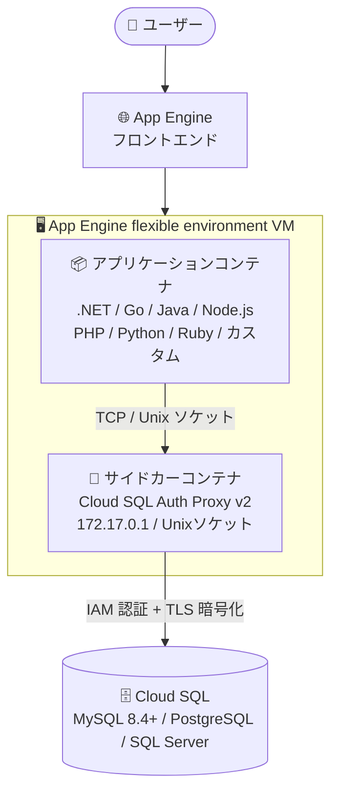

# App Engine flexible environment: Cloud SQL Auth Proxy v2 が組み込みサイドカーコンテナに

**リリース日**: 2026-08-20

**サービス**: App Engine flexible environment (全ランタイム: .NET / Go / Java / Node.js / PHP / Python / Ruby / カスタムランタイム)

**機能**: Cloud SQL 接続用の組み込みサイドカーコンテナとして Cloud SQL Auth Proxy v2 を採用

**ステータス**: Feature (2026 年 8 月より順次適用)

📊 [このアップデートのインフォグラフィックを見る](https://takech9203.github.io/google-cloud-news-summary/20260820-app-engine-flexible-cloud-sql-auth-proxy-v2.html)

## 概要

2026 年 8 月より、App Engine flexible environment が Cloud SQL への接続に使用する組み込みサイドカーコンテナが Cloud SQL Auth Proxy v2 に更新されました。このアップデートは .NET、Go、Java、Node.js、PHP、Python、Ruby およびカスタムランタイムを含む、App Engine flexible environment の全ランタイムに適用されます。

App Engine flexible environment では、`app.yaml` の `beta_settings: cloud_sql_instances` を設定すると、アプリケーションコンテナと並行して Cloud SQL Auth Proxy がサイドカーコンテナとして VM 上に自動起動され、`172.17.0.1` (TCP) または Unix ソケット経由で Cloud SQL への暗号化された接続を仲介します。今回の変更により、このプラットフォーム管理のサイドカーが v2 系となり、最新のセキュリティパッチの提供に加えて、`caching_sha2_password` をデフォルト認証プラグインとする MySQL 8.4 以降への接続がサポートされます。

最新の Cloud SQL Auth Proxy コンテナをすぐに利用するには、VM の再起動、またはアプリケーションの新バージョンのデプロイが必要です。特に Cloud SQL for MySQL 8.4 以降を利用中・移行予定のユーザーは、このアップデートの適用と後述のクライアント設定を確認することが推奨されます。

**アップデート前の課題**

- App Engine flexible environment の組み込みサイドカーは従来版の Cloud SQL Auth Proxy を使用しており、v2 で提供される最新のセキュリティパッチや改善を利用できなかった
- MySQL 8.4 以降では `caching_sha2_password` がデフォルトの認証プラグインとなり、`mysql_native_password` が非推奨化されたため、従来のプロキシ環境では新しい MySQL バージョンへの対応に課題があった
- Cloud SQL Auth Proxy v2 自体は 2023 年 2 月にリリースされ全ユーザーにアップグレードが推奨されていたが、App Engine flexible environment の組み込みサイドカーはユーザーが直接更新できなかった

**アップデート後の改善**

- プラットフォーム管理のサイドカーコンテナが v2 となり、モダンなセキュリティパッチが自動的に提供されるようになった
- MySQL 8.4 以降の Cloud SQL インスタンスへの接続がサポートされた
- ユーザー側の対応は「VM の再起動」または「新バージョンのデプロイ」のみで、`app.yaml` の設定変更やアプリケーションコードの書き換えは不要 (接続先は従来どおり `172.17.0.1:PORT` / Unix ソケット)

## アーキテクチャ図



App Engine flexible environment の VM 内で、アプリケーションコンテナと並行して Cloud SQL Auth Proxy v2 がサイドカーとして動作し、Cloud SQL への接続を IAM 認証と TLS 暗号化で仲介します。アプリケーションからの接続方法 (172.17.0.1 への TCP または Unix ソケット) は従来と変わりません。

## サービスアップデートの詳細

### 主要機能

1. **組み込みサイドカーの Cloud SQL Auth Proxy v2 への更新**
   - `app.yaml` の `beta_settings: cloud_sql_instances` で有効化される組み込みプロキシが v2 ベースに更新
   - 全ランタイム (.NET、Go、Java、Node.js、PHP、Python、Ruby、カスタムランタイム) に適用
   - モダンなセキュリティパッチが継続的に提供される

2. **MySQL 8.4 以降のサポート**
   - MySQL 8.4 ではデフォルト認証プラグインが `caching_sha2_password` に変更され、`mysql_native_password` は非推奨
   - v2 サイドカーにより、MySQL 8.4 以降の Cloud SQL インスタンスへの接続がサポートされる
   - MySQL 8.4 以降に Cloud SQL Auth Proxy 経由で接続する場合、アプリケーションのデータベースクライアントで `allowPublicKeyRetrieval=true` (または `--get-server-public-key`) の設定が必要

3. **適用方法**
   - 最新のプロキシコンテナを即時利用するには、VM の再起動、または新しいアプリケーションバージョンのデプロイが必要
   - アプリケーションコードや接続設定 (接続先 IP / ソケットパス) の変更は不要

### Cloud SQL Auth Proxy v2 の主な特長 (2023 年 2 月リリース時点)

Cloud SQL Auth Proxy v2 は、v1 と比較してパフォーマンス、安定性、テレメトリが改善されており、以下をサポートします。

- Cloud Monitoring / Cloud Trace によるメトリクスとトレース
- Prometheus のサポート
- サービスアカウントの権限借用 (impersonation)
- 環境変数による構成
- POSIX 準拠のフラグ体系

## 技術仕様

### 接続方式 (App Engine flexible environment)

| 項目 | 詳細 |
|------|------|
| TCP ソケット接続 | `172.17.0.1:PORT` (PORT は `app.yaml` で指定)。プロキシが暗号化して Cloud SQL に転送 |
| Unix ソケット接続 | プロキシが提供する Unix ドメインソケット経由で接続 |
| Cloud SQL コネクタ | 言語別コネクタライブラリ (Cloud SQL Go Connector など) による接続 |
| プライベート IP | 同一 VPC 内であればプロキシを介さず直接接続も可能 (本アップデートの影響なし) |
| 認証 | Cloud SQL Admin API + IAM による認証、TLS による暗号化 |

### MySQL 8.4 以降接続時のクライアント設定

MySQL 8.4 以降 (デフォルト認証プラグイン `caching_sha2_password`) に Cloud SQL Auth Proxy 経由で接続する場合、クライアント側で公開鍵取得を許可する設定が必要です。

```bash
# mysql クライアントの場合
mysql -u username -p --get-server-public-key
```

```java
// Java (JDBC) の場合
config.setJdbcUrl("jdbc:mysql://" + dbHost + ":" + dbPort + "/" + dbName);
config.addDataSourceProperty("allowPublicKeyRetrieval", "true");
```

## 設定方法

### 前提条件

1. App Engine flexible environment でアプリケーションを運用しており、`app.yaml` の `beta_settings: cloud_sql_instances` で Cloud SQL に接続していること
2. Cloud SQL Admin API が有効化されていること

### 手順

#### ステップ 1: 新しいバージョンをデプロイ (または VM を再起動)

```bash
# 新しいバージョンをデプロイして最新のサイドカーコンテナを取得
gcloud app deploy app.yaml
```

新バージョンのデプロイまたは VM の再起動により、最新の Cloud SQL Auth Proxy v2 コンテナがサイドカーとして起動します。`app.yaml` の設定変更は不要です。

#### ステップ 2: MySQL 8.4 以降を利用する場合はクライアント設定を確認

```yaml
# app.yaml (設定例 - 変更不要、従来どおり)
beta_settings:
  cloud_sql_instances: "PROJECT_ID:REGION:INSTANCE_NAME=tcp:3306"
```

MySQL 8.4 以降に接続する場合は、アプリケーションのデータベースクライアントに `allowPublicKeyRetrieval=true` (または同等の設定) を追加します。

## メリット

### ビジネス面

- **セキュリティリスクの低減**: プラットフォーム管理のサイドカーに最新のセキュリティパッチが適用され、運用チームの追加作業なしに安全性が維持される
- **MySQL のバージョンアップ計画が立てやすくなる**: App Engine flexible environment 上のアプリケーションから MySQL 8.4 以降への移行パスが確保される

### 技術面

- **移行コストが最小**: 接続先 (`172.17.0.1:PORT` / Unix ソケット) は変わらず、再デプロイまたは VM 再起動のみで適用できる
- **最新の認証方式への対応**: MySQL 8.4 のデフォルト認証プラグイン `caching_sha2_password` を使用する構成に対応できる

## デメリット・制約事項

### 考慮すべき点

- 最新のプロキシコンテナを即時利用するには、VM の再起動または新バージョンのデプロイが必要 (自動では即時反映されない)
- MySQL 8.4 以降に接続する場合、クライアント側で `allowPublicKeyRetrieval=true` などの設定が必要になるケースがある
- MySQL 8.4 では `mysql_native_password` での新規ユーザー作成がエラーになるため、既存ユーザーの認証プラグイン移行 (`ALTER USER ... IDENTIFIED WITH caching_sha2_password`) を計画的に実施する必要がある
- BigQuery の連携クエリ (federated queries) は `caching_sha2_password` をサポートしないため、BigQuery から MySQL 8.4 に連携クエリを実行する場合は認証プラグインの選択に注意が必要

## ユースケース

### ユースケース 1: MySQL 8.4 へのアップグレードを控えた App Engine flexible アプリ

**シナリオ**: App Engine flexible environment (Java) 上のアプリケーションが Cloud SQL for MySQL 8.0 を利用しており、MySQL 8.4 へのメジャーバージョンアップグレードを計画している。

**実装例**:
```bash
# 1. 新バージョンをデプロイしてサイドカーを v2 に更新
gcloud app deploy app.yaml

# 2. JDBC 接続設定に allowPublicKeyRetrieval=true を追加した上で
#    Cloud SQL インスタンスを MySQL 8.4 にアップグレード
```

**効果**: サイドカーが v2 になることで MySQL 8.4 への接続がサポートされ、アプリケーションの接続コード (接続先 IP / ポート) を変更することなくデータベースのバージョンアップが行える。

### ユースケース 2: セキュリティパッチ適用の即時反映

**シナリオ**: セキュリティ要件の厳しい環境で、Cloud SQL 接続経路のコンポーネントに最新のセキュリティパッチを速やかに適用したい。

**効果**: 定期的なデプロイまたは VM 再起動を運用に組み込むことで、プラットフォーム管理の Cloud SQL Auth Proxy v2 サイドカーに最新パッチが反映され、接続経路のセキュリティを維持できる。

## 料金

このアップデート自体による追加料金はありません。組み込みサイドカーの Cloud SQL Auth Proxy は App Engine flexible environment の VM 上で動作し、通常の App Engine flexible environment および Cloud SQL の料金体系が適用されます。なお、Cloud SQL Auth Proxy は Cloud SQL Admin API を使用するため、API クォータ (デフォルト: 180 リクエスト/分/ユーザー) の対象となります。

- [App Engine 料金ページ](https://cloud.google.com/appengine/pricing)
- [Cloud SQL 料金ページ](https://cloud.google.com/sql/pricing)

## 関連サービス・機能

- **Cloud SQL (MySQL / PostgreSQL / SQL Server)**: 接続先のマネージドデータベース。特に MySQL 8.4 以降では認証プラグインのデフォルトが `caching_sha2_password` に変更されている
- **Cloud SQL Auth Proxy**: IAM 認証と TLS 暗号化により Cloud SQL への安全な接続を提供するユーティリティ。v2 は Cloud Monitoring / Cloud Trace / Prometheus 対応やサービスアカウント権限借用などをサポート
- **Cloud SQL 言語コネクタ (Cloud SQL Go Connector など)**: プロキシを介さずアプリケーションライブラリとして同等の安全な接続を実現する選択肢
- **Cloud SQL Admin API**: Cloud SQL Auth Proxy が接続確立時に使用する API。クォータ管理の対象

## 参考リンク

- 📊 [インフォグラフィック](https://takech9203.github.io/google-cloud-news-summary/20260820-app-engine-flexible-cloud-sql-auth-proxy-v2.html)
- [公式リリースノート](https://docs.cloud.google.com/release-notes#August_20_2026)
- [App Engine flexible environment から Cloud SQL に接続する (MySQL)](https://docs.cloud.google.com/sql/docs/mysql/connect-app-engine-flexible)
- [Cloud SQL Auth Proxy の概要](https://docs.cloud.google.com/sql/docs/mysql/sql-proxy)
- [Cloud SQL Auth Proxy v2 移行ガイド (GitHub)](https://github.com/GoogleCloudPlatform/cloud-sql-proxy/blob/main/migration-guide.md)
- [Cloud SQL for MySQL のバージョン別機能 (認証プラグインの変更)](https://docs.cloud.google.com/sql/docs/mysql/features)
- [料金ページ (App Engine)](https://cloud.google.com/appengine/pricing)

## まとめ

App Engine flexible environment の Cloud SQL 接続用サイドカーが Cloud SQL Auth Proxy v2 に更新され、最新のセキュリティパッチと MySQL 8.4 以降のサポートが提供されるようになりました。適用にはコード変更は不要で、VM の再起動または新バージョンのデプロイのみで完了します。App Engine flexible environment で Cloud SQL を利用しているチームは、早めに再デプロイして最新サイドカーを取り込み、MySQL 8.4 移行を予定している場合は `allowPublicKeyRetrieval` などのクライアント設定と認証プラグインの移行計画を確認することを推奨します。

---

**タグ**: #AppEngine #CloudSQL #CloudSQLAuthProxy #MySQL #セキュリティ #サイドカー
