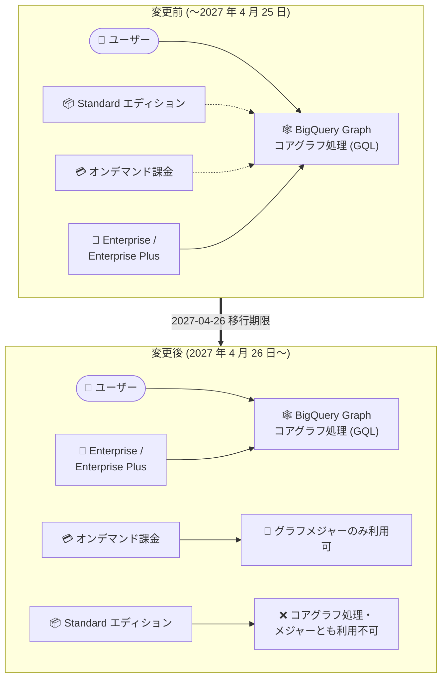

# BigQuery: BigQuery Graph のコアグラフ処理が Enterprise / Enterprise Plus エディション限定に (Standard エディションとオンデマンド課金のサポートを非推奨化)

**リリース日**: 2026-08-20

**サービス**: BigQuery

**機能**: BigQuery Graph コアグラフ処理のエディション制限

**ステータス**: 非推奨 (Deprecated)

📊 [このアップデートのインフォグラフィックを見る](https://takech9203.github.io/google-cloud-news-summary/20260820-bigquery-graph-editions-deprecation.html)

## 概要

Google Cloud は、**2027 年 4 月 26 日**をもって BigQuery Graph のコアグラフ処理 (core graph processing) を **BigQuery Enterprise エディションおよび Enterprise Plus エディション**に限定することを発表しました。これに伴い、コアグラフ処理に対する **Standard エディションのサポートとオンデマンド課金のサポートが非推奨 (Deprecated)** となります。

BigQuery Graph は、データをノードとエッジからなるグラフとしてモデル化し、Graph Query Language (GQL) を使用して SQL では表現が難しい複雑なリレーションシップ分析を大規模に実行できる機能です。不正検知、レコメンデーション、ナレッジグラフ、サプライチェーン分析などのユースケースで利用されています。今回の変更により、GQL によるグラフクエリ (コアグラフ処理) を実行するには Enterprise または Enterprise Plus エディションの予約 (Reservation) が必要になります。

なお、**グラフメジャー (Graph measures) は引き続き Enterprise / Enterprise Plus エディションおよびオンデマンド料金でのクエリ実行で利用可能**です。メジャーは Standard エディションでは利用できません。Standard エディションやオンデマンド課金で BigQuery Graph のコアグラフ処理を利用しているユーザーは、2027 年 4 月 26 日までにエディションの移行を計画する必要があります。

**アップデート前の課題**

- コアグラフ処理の利用可能なエディション・課金モデルの範囲が広く、長期的なサポートポリシーが明確でなかった
- Standard エディションやオンデマンド課金でグラフワークロードを運用しているユーザーは、将来のエディション要件を見通しにくかった

**アップデート後の改善 (変更点)**

- コアグラフ処理のサポート対象が Enterprise / Enterprise Plus エディションに一本化され、機能とエディションの対応関係が明確になった
- 移行期限 (2027 年 4 月 26 日) が明示され、約 8 か月の移行準備期間が確保された
- グラフメジャーはオンデマンド料金でも引き続き利用可能なため、軽量なグラフ集計ユースケースはオンデマンドのまま継続できる

## アーキテクチャ図



2027 年 4 月 26 日以降、コアグラフ処理は Enterprise / Enterprise Plus エディションの予約が必須となり、Standard エディションとオンデマンド課金でのコアグラフ処理サポートは終了します。グラフメジャーはオンデマンド課金でも継続利用できます。

## サービスアップデートの詳細

### 主要な変更点

1. **コアグラフ処理のエディション制限**
   - 2027 年 4 月 26 日以降、BigQuery Graph のコアグラフ処理は Enterprise / Enterprise Plus エディションに限定される
   - GQL (Graph Query Language) を使用したグラフクエリの実行には、対象エディションの予約が必要

2. **Standard エディションとオンデマンド課金の非推奨化**
   - コアグラフ処理に対する Standard エディションのサポートが非推奨となる
   - コアグラフ処理に対するオンデマンド課金のサポートが非推奨となる

3. **グラフメジャーの扱い**
   - グラフメジャーは Enterprise / Enterprise Plus エディションで引き続き利用可能
   - オンデマンド料金で実行するクエリでもグラフメジャーは引き続き利用可能
   - グラフメジャーは Standard エディションでは利用不可

## 技術仕様

### エディション別の BigQuery Graph 利用可否 (2027 年 4 月 26 日以降)

| 項目 | Standard | Enterprise | Enterprise Plus | オンデマンド |
|------|----------|-----------|-----------------|--------------|
| コアグラフ処理 (GQL クエリ) | ❌ 非推奨・利用不可 | ✅ 利用可 | ✅ 利用可 | ❌ 非推奨・利用不可 |
| グラフメジャー | ❌ 利用不可 | ✅ 利用可 | ✅ 利用可 | ✅ 利用可 |

### BigQuery Graph の関連要素

| 項目 | 詳細 |
|------|------|
| クエリ言語 | GQL (ISO/IEC 39075:2024) および SQL/PGQ (ISO/IEC 9075-16:2023) 準拠 |
| SQL との統合 | `GRAPH_TABLE` 演算子でグラフクエリ結果をテーブルとして SQL から利用可能 |
| グラフメジャー | グラフ上に定義する再利用可能な集計指標。会話型分析 (Conversational Analytics) でも活用される |
| 移行期限 | 2027 年 4 月 26 日 |

## メリット

### ビジネス面

- **サポートポリシーの明確化**: コアグラフ処理の対象エディションが明示され、長期的なキャパシティプランニングが立てやすくなる
- **移行準備期間の確保**: 発表から移行期限まで約 8 か月あり、計画的なエディション移行が可能

### 技術面

- **エディション体系との整合**: 検索インデックスやベクトルインデックスなどの高度な分析機能と同様に、グラフ処理も上位エディションに位置付けが統一される
- **メジャーの継続利用**: オンデマンド課金ユーザーもグラフメジャーによる集計は継続でき、全面的な移行を強制されない

## デメリット・制約事項

### 制限事項

- 2027 年 4 月 26 日以降、Standard エディションではコアグラフ処理およびグラフメジャーが利用できない
- 2027 年 4 月 26 日以降、オンデマンド課金ではコアグラフ処理 (GQL クエリ) が利用できない

### 考慮すべき点

- Standard エディションやオンデマンド課金で GQL クエリを実行しているワークロードは、期限までに Enterprise / Enterprise Plus エディションの予約への移行が必要
- エディションの変更には予約の削除と再作成が必要なため、予約構成の見直しを含めた移行計画を立てること
- Enterprise / Enterprise Plus はスロット時間ベースの容量課金モデルのため、オンデマンド (処理データ量ベース) からの移行ではコスト構造が変わる点に注意

## ユースケース

### ユースケース 1: オンデマンド課金でグラフクエリを利用中のチームの移行

**シナリオ**: オンデマンド課金のプロジェクトで BigQuery Graph の GQL クエリを使った不正検知分析を運用している。

**実装例**:

```sql
-- Enterprise エディションの予約を作成して移行する例
CREATE RESERVATION `admin_project.region-us.graph-reservation`
OPTIONS (
  edition = 'ENTERPRISE',
  autoscale_max_slots = 100
);

CREATE ASSIGNMENT `admin_project.region-us.graph-reservation.graph-assignment`
OPTIONS (
  assignee = 'projects/my-graph-project',
  job_type = 'QUERY'
);
```

**効果**: 2027 年 4 月 26 日以降も GQL によるコアグラフ処理を継続利用できる。オートスケーリングにより必要な分だけスロットを消費する。

### ユースケース 2: グラフメジャーのみを利用する軽量ワークロード

**シナリオ**: グラフ上に定義したメジャーを使った集計クエリのみを実行しており、GQL による複雑なパターンマッチングは使用していない。

**効果**: グラフメジャーはオンデマンド料金でも引き続き利用可能なため、エディション移行なしで現行の課金モデルを維持できる。

## 料金

BigQuery Graph のコアグラフ処理 (GQL クエリ) の実行には、Enterprise または Enterprise Plus エディションの予約が必要です。グラフクエリは BigQuery の容量ベースのコンピューティング料金 (スロット単位) で課金されます。ストレージは、グラフの基盤となるテーブルに対して標準の BigQuery ストレージ料金が 1 回のみ課金され、テーブル上に構築するグラフモデルの数による追加課金はありません。

詳細は [BigQuery の料金ページ](https://cloud.google.com/bigquery/pricing) を参照してください。

## 関連サービス・機能

- **BigQuery Editions / Reservations**: コアグラフ処理の実行に必要な Enterprise / Enterprise Plus エディションの予約を管理する仕組み
- **Spanner Graph**: BigQuery Graph と同じグラフスキーマ・クエリ言語を共有し、運用系グラフワークロードを Spanner で、分析系を BigQuery で実行する構成が可能
- **Conversational Analytics (会話型分析)**: グラフメジャーを活用して自然言語でグラフに質問できる機能
- **BigQuery ベクトル検索・全文検索**: グラフ分析とセマンティック検索・キーワード検索を組み合わせた分析が可能

## 参考リンク

- 📊 [インフォグラフィック](https://takech9203.github.io/google-cloud-news-summary/20260820-bigquery-graph-editions-deprecation.html)
- [公式リリースノート](https://docs.cloud.google.com/release-notes#August_20_2026)
- [BigQuery Graph の概要](https://docs.cloud.google.com/bigquery/docs/graph-overview)
- [BigQuery エディションの概要](https://docs.cloud.google.com/bigquery/docs/editions-intro)
- [グラフメジャー](https://docs.cloud.google.com/bigquery/docs/graph-measures)
- [料金ページ](https://cloud.google.com/bigquery/pricing)

## まとめ

BigQuery Graph のコアグラフ処理は 2027 年 4 月 26 日以降、Enterprise / Enterprise Plus エディション限定となり、Standard エディションとオンデマンド課金のサポートは非推奨となります。Standard エディションやオンデマンド課金で GQL クエリを利用している場合は、期限までに Enterprise 以上のエディションの予約への移行計画を策定してください。グラフメジャーのみを利用しているオンデマンドユーザーは移行不要ですが、自ワークロードがコアグラフ処理に依存していないかの棚卸しを推奨します。

---

**タグ**: #BigQuery #BigQueryGraph #GQL #Deprecated #Editions #Enterprise #EnterprisePlus #オンデマンド課金
