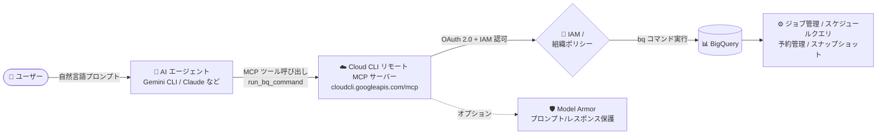

# BigQuery: run_bq_command ツールによる Cloud CLI リモート MCP サーバー経由の bq コマンド実行 (Preview)

**リリース日**: 2026-08-20

**サービス**: BigQuery

**機能**: Cloud CLI リモート MCP サーバーの `run_bq_command` ツール

**ステータス**: Preview

📊 [このアップデートのインフォグラフィックを見る](https://takech9203.github.io/google-cloud-news-summary/20260820-bigquery-run-bq-command-mcp.html)

## 概要

Cloud CLI リモート MCP (Model Context Protocol) サーバーに、BigQuery コマンドラインツール `bq` を公開する `run_bq_command` ツールが Preview として追加されました。これにより、Gemini CLI、Claude、ChatGPT やカスタムエージェントなどの AI アプリケーションが、Google が管理するマネージド MCP エンドポイント (`https://cloudcli.googleapis.com/mcp`) を通じて、ジョブのスケジューリング、ジョブ管理、スロット予約 (Reservation) 管理といった高度な BigQuery の運用・管理オペレーションを自然言語プロンプトから実行できるようになります。

BigQuery には既に GA 済みの BigQuery MCP サーバー (SQL 実行、メタデータ探索、データ分析向け) が存在しますが、`run_bq_command` はそれとは異なる用途をカバーします。具体的には、スロット予約の管理、スケジュールクエリの構成 (BigQuery Data Transfer Service 経由)、テーブルスナップショット/クローンの操作、暴走ジョブのトラブルシューティングとキャンセルなど、`bq` CLI でしか行えなかった管理系ワークフローを AI エージェントに委譲できます。主な対象ユーザーは BigQuery 管理者、DBA、データプラットフォームエンジニア、DevOps エンジニアです。

コマンドは認証済み呼び出し元の権限で実行され、IAM 権限と組織ポリシーの制約がターゲットリソースに対して厳格に適用されるため、セキュリティガバナンスを維持したままエージェントによる運用自動化を実現できます。

**アップデート前の課題**

- 従来の BigQuery MCP サーバーは SQL 実行・メタデータ探索・データ分析が中心で、スロット予約管理やジョブスケジューリング、スナップショット操作などの管理系タスクを AI エージェントから実行する手段がなかった
- `bq` CLI ベースの管理オペレーションを自動化するには、エージェント用にローカル環境へ Cloud SDK をインストール・管理するか、独自のツール実装が必要だった
- ジョブのキャンセルや予約スロットの調整などの運用対応は、管理者が手動で `bq` コマンドを実行する必要があった

**アップデート後の改善**

- AI エージェントがマネージド MCP エンドポイント経由で `bq` コマンドを実行でき、ジョブスケジューリング、ジョブ管理、予約管理などの高度な BigQuery オペレーションを自然言語で実行できるようになった
- ローカルへの SDK インストールが不要になり、Google のインフラ上で動作するリモート MCP サーバーのサンドボックス環境でコマンドが実行されるようになった
- OAuth 2.0 + IAM による認証・認可、Model Armor によるプロンプト/レスポンス保護 (オプション)、集中監査ログといったガバナンス機能を利用できるようになった

## アーキテクチャ図



ユーザーの自然言語プロンプトを AI エージェントが `run_bq_command` ツール呼び出しに変換し、マネージド MCP エンドポイントが呼び出し元の IAM 権限の範囲内で `bq` コマンドを実行して BigQuery の管理オペレーションを行います。

## サービスアップデートの詳細

### 主要機能

1. **`run_bq_command` ツールによる bq CLI の公開**
   - Cloud CLI リモート MCP サーバー (`run_gcloud_command` に加えて) が `bq` コマンドライン surface を公開
   - BigQuery SQL コマンドの実行に加え、管理・運用タスクを自然言語プロンプトから実行可能

2. **高度な管理オペレーションのサポート**
   - スケジュールクエリの構成 (BigQuery Data Transfer Service 経由)
   - 暴走ジョブの特定・診断・キャンセル (`bq ls -j` / `bq show -j` / `bq cancel`)
   - スロット予約の一覧表示・スロット割り当ての更新 (`bq ls --reservation` / `bq update --reservation`)
   - データセットのアクセス制御 (IAM ポリシー) の確認・更新
   - テーブルスナップショット / クローンの作成 (`bq cp --snapshot`)

3. **マネージドエンドポイントとガバナンス**
   - グローバルエンドポイント `https://cloudcli.googleapis.com/mcp` (HTTP トランスポート)
   - OAuth 2.0 + IAM による認証・認可 (API キーは非対応)
   - Model Armor によるプロンプト/レスポンスのセキュリティ保護 (オプション)
   - 集中監査ログによる操作の追跡

## 技術仕様

### run_bq_command と BigQuery MCP サーバーの違い

| 項目 | BigQuery MCP サーバー | run_bq_command |
|------|----------------------|----------------|
| 提供状況 | GA (一般提供) | Preview |
| 用途 | データ分析・データ変更 | 高度なジョブ・リソース管理 |
| 対象ユーザー | ビジネスアナリスト、データサイエンティスト、SQL 開発者 | BigQuery 管理者、DBA、データプラットフォーム / DevOps エンジニア |
| 主なオペレーション | 標準 SQL 実行 (SELECT / INSERT / UPDATE / DELETE)、スキーマ探索、メタデータ確認 | クエリスケジューリング (DTS)、暴走ジョブのキャンセル、スロット・予約管理、データセット IAM ポリシー、テーブルスナップショット / クローン操作 |

### サーバー仕様

| 項目 | 詳細 |
|------|------|
| エンドポイント | `https://cloudcli.googleapis.com/mcp` (グローバル) |
| API 名 | Cloud CLI Execution API |
| トランスポート | HTTP (リモート MCP サーバー) |
| 認証 | OAuth 2.0 + IAM (API キー非対応)、スコープ: `https://www.googleapis.com/auth/cloud-platform` |
| 必要な IAM ロール | MCP Tool User (`roles/mcp.toolUser`)、必要な権限: `mcp.tools.call` |
| 提供ツール | `run_gcloud_command`、`run_bq_command` |
| 非サポートの bq コマンド | `bq init`、`bq pyshell`、`bq shell` |

### ツール呼び出し例

```json
{
  "tool": "run_bq_command",
  "arguments": {
    "command": "bq ls --reservation --project_id=my-admin-project --location=us-central1",
    "project": "projects/my-admin-project"
  }
}
```

なお、リクエストの `project` パラメータは Cloud CLI Execution API とのやり取りに使用されるプロジェクトであり、実際の `bq` コマンドの `--project_id` / `--quota_project_id` フラグとは別のものです。エージェントのシステムプロンプトやスキルで正しいプロジェクトを選択するよう指示することが推奨されています。

## 設定方法

### 前提条件

1. Cloud CLI Execution API を有効化する (有効化すると Cloud CLI リモート MCP サーバーが利用可能になる)
2. 呼び出し元の ID (ユーザー、エージェント ID、またはサービスアカウント) に `roles/mcp.toolUser` を付与する
3. 実行する `bq` コマンドに必要な BigQuery 側の IAM 権限を最小権限の原則に従って付与する

### 手順

#### ステップ 1: MCP クライアントの設定

AI アプリケーションのリモート MCP サーバー接続設定に以下を入力します。

```text
Server name : Cloud CLI remote MCP server
Server URL  : https://cloudcli.googleapis.com/mcp
Transport   : HTTP
Authentication : Google Cloud 認証情報 (OAuth クライアント ID/シークレット、またはエージェント ID)
```

#### ステップ 2: ツール一覧の確認

`tools/list` メソッドで利用可能なツールを確認できます (認証不要)。

```bash
curl -X POST https://cloudcli.googleapis.com/mcp \
  -H "Content-Type: application/json" \
  -d '{"jsonrpc": "2.0", "method": "tools/list"}'
```

#### ステップ 3: (オプション) Model Armor による保護の設定

```bash
gcloud model-armor floorsettings update \
  --full-uri='projects/PROJECT_ID/locations/global/floorSetting' \
  --enable-floor-setting-enforcement=TRUE \
  --add-integrated-services=GOOGLE_MCP_SERVER \
  --google-mcp-server-enforcement-type=INSPECT_AND_BLOCK \
  --enable-google-mcp-server-cloud-logging \
  --malicious-uri-filter-settings-enforcement=ENABLED
```

プロジェクトのフロア設定で MCP ツール呼び出しとレスポンスの検査・ブロックを構成できます。

## メリット

### ビジネス面

- **運用工数の削減**: ジョブ監視・キャンセル、予約スロット調整などの日常的な管理作業を AI エージェント経由の自然言語操作に置き換えられ、運用チームの負荷を軽減できる
- **ガバナンスの維持**: 呼び出し元の IAM 権限と組織ポリシーがそのまま適用されるため、既存のアクセス制御・監査体制を崩さずにエージェント活用を進められる

### 技術面

- **マネージドエンドポイント**: ローカルへの Cloud SDK インストールや MCP サーバーの自前運用が不要で、Google 管理のサンドボックス環境でコマンドが実行される
- **bq CLI のフル活用**: DTS によるスケジュールクエリ、予約管理、スナップショット操作など、SQL だけではカバーできない管理系 API surface をエージェントから利用できる
- **セキュリティ機能の統合**: OAuth 2.0 + IAM、Model Armor、集中監査ログといった Google Cloud MCP サーバー共通のセキュリティ機能を利用できる

## デメリット・制約事項

### 制限事項

- Preview 段階の機能であり、Pre-GA Offerings Terms が適用される (サポートが限定される可能性がある)
- `bq init`、`bq pyshell`、`bq shell` は非サポート (gcloud 側も `gcloud auth`、`gcloud config` など一部コマンドは非サポート)
- API キーによる認証は利用できない (OAuth 2.0 + IAM のみ)
- Web ベースアプリケーションではリダイレクト URI の許可リスト登録が必要で、カスタムリダイレクト URI はサポートされない

### 考慮すべき点

- コマンドは認証済み呼び出し元の権限で実行されるため、エージェントに付与する権限は最小権限の原則に従って絞り込む必要がある (専用のエージェント ID の作成が推奨)
- リクエストの `project` パラメータと `bq` コマンドの `--project_id` フラグは別物であり、エージェントのシステムプロンプトで正しく使い分ける設計が必要
- データ分析中心のユースケースでは、GA 済みの BigQuery MCP サーバーの利用が引き続き推奨される

## ユースケース

### ユースケース 1: 暴走ジョブのトラブルシューティングとキャンセル

**シナリオ**: 本番プロジェクトで長時間実行中のクエリがスロットを圧迫している。運用担当者がエージェントに「my-data-project で 30 分以上実行中のジョブがあれば詳細を確認してキャンセルして」と依頼する。

**実装例**:
```text
1. エージェントが run_bq_command で "bq ls -j --all --project_id=my-data-project" を実行
2. 対象ジョブを特定し "bq show -j bqujob_12345 --project_id=my-data-project" で詳細を確認
3. "bq cancel bqujob_12345 --project_id=my-data-project" でキャンセル
```

**効果**: 障害対応の初動を自然言語操作で迅速化し、コンソールや CLI を開いて手動調査する時間を短縮できる。

### ユースケース 2: スロット予約のキャパシティ調整

**シナリオ**: 月次バッチのピークに合わせて、管理者が「us-central1 の予約一覧を表示して、prod-analytics 予約のスロットを 500 に更新して」とエージェントに依頼する。

**実装例**:
```text
1. run_bq_command: "bq ls --reservation --project_id=my-admin-project --location=us-central1"
2. run_bq_command: "bq update --project_id=my-admin-project --reservation --slots=500 prod-analytics --location=us-central1"
```

**効果**: 予約管理の定型オペレーションをエージェントに委譲し、キャパシティ調整のリードタイムを短縮できる。

### ユースケース 3: スケジュールクエリの自動構成

**シナリオ**: 「sales_ds データセットの daily_sales_summary テーブルを毎日 06:00 UTC に更新するスケジュールクエリを作成して」と依頼し、エージェントが BigQuery Data Transfer Service 経由のスケジュールクエリを構成する。

**効果**: DTS ベースのデータリフレッシュ自動化を、コンソール操作なしで自然言語からセットアップできる。

## 料金

Cloud CLI リモート MCP サーバー自体の料金は、本アップデート時点で確認したドキュメントには記載されていません。実行される `bq` コマンドが起動するクエリジョブなどには、通常の BigQuery の料金 (オンデマンドまたはキャパシティベース) が適用されます。詳細は料金ページを参照してください。

- [BigQuery の料金](https://cloud.google.com/bigquery/pricing)

## 利用可能リージョン

Cloud CLI リモート MCP サーバーはグローバルエンドポイント (`https://cloudcli.googleapis.com/mcp`) として提供されます。

## 関連サービス・機能

- **BigQuery MCP サーバー (GA)**: SQL 実行・メタデータ探索・データ分析向けの MCP サーバー。`run_bq_command` は管理・運用系ワークフローで補完的に使い分ける
- **Cloud CLI リモート MCP サーバー (`run_gcloud_command`)**: 同一 MCP サーバーが提供する gcloud コマンド実行ツール。リソースプロビジョニングや診断に利用
- **BigQuery Data Transfer Service (DTS)**: `bq` 経由のスケジュールクエリの実行基盤
- **IAM / Organization Policy Service**: コマンド実行時の認可と組織ポリシー制約の適用
- **Model Armor**: MCP ツール呼び出しのプロンプト/レスポンスに対するセキュリティフィルタリング (オプション)
- **Cloud Audit Logs**: MCP サーバー経由の操作の集中監査ログ

## 参考リンク

- 📊 [インフォグラフィック](https://takech9203.github.io/google-cloud-news-summary/20260820-bigquery-run-bq-command-mcp.html)
- [公式リリースノート](https://docs.cloud.google.com/release-notes#August_20_2026)
- [Use the Cloud CLI remote MCP server](https://cloud.google.com/sdk/use-gcloud-mcp)
- [Google Cloud SDK MCP reference](https://docs.cloud.google.com/sdk/reference/mcp)
- [bq コマンドライン ツール リファレンス](https://docs.cloud.google.com/bigquery/docs/reference/bq-cli-reference)
- [BigQuery MCP サーバーの使用](https://docs.cloud.google.com/bigquery/docs/use-bigquery-mcp)
- [Google Cloud MCP servers overview](https://docs.cloud.google.com/mcp/overview)
- [BigQuery の料金](https://cloud.google.com/bigquery/pricing)

## まとめ

`run_bq_command` の追加により、AI エージェントは SQL 実行にとどまらず、ジョブ管理・スケジュールクエリ・予約管理・スナップショット操作といった BigQuery の管理系オペレーションをマネージド MCP エンドポイント経由で実行できるようになりました。BigQuery の運用を担う管理者や DevOps エンジニアは、既存の IAM ガバナンスを維持したまま、エージェントによる運用自動化の検証を開始することを推奨します。Preview 段階のため、本番導入前に Pre-GA 条項と権限設計 (最小権限、専用エージェント ID) を確認してください。

---

**タグ**: #BigQuery #MCP #CloudCLI #bq #AIエージェント #Preview #GoogleCloud
