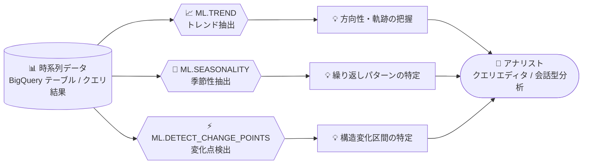

# BigQuery: 時系列分析用テーブル値関数 (ML.TREND / ML.SEASONALITY / ML.DETECT_CHANGE_POINTS)

**リリース日**: 2026-08-20

**サービス**: BigQuery

**機能**: 時系列分析用テーブル値関数 (ML.TREND / ML.SEASONALITY / ML.DETECT_CHANGE_POINTS)

**ステータス**: Preview

📊 [このアップデートのインフォグラフィックを見る](https://takech9203.github.io/google-cloud-news-summary/20260820-bigquery-time-series-analysis-functions.html)

## 概要

BigQuery に、時系列データの分析を支援する 3 つのテーブル値関数 (TVF: Table-Valued Function) が Preview として追加されました。`ML.TREND` はデータの方向性 (トレンド) の把握、`ML.SEASONALITY` は繰り返しパターン (季節性) の特定、`ML.DETECT_CHANGE_POINTS` は構造的な変化が発生した区間の検出を行います。これらの関数はクエリエディタで直接利用できるほか、会話型分析 (conversational analytics) の一部としても利用できます。

これらの関数は BigQuery ML の ARIMA_PLUS モデルで使用されているアルゴリズムをベースに構築されていますが、モデルの作成や管理は不要です。SQL クエリの中で関数を呼び出すだけで、時系列データのトレンド分解、季節性の抽出、変化点の検出が可能になります。データアナリストやビジネスユーザーが、売上データやアクセスログなどの時系列メトリクスから素早くインサイトを得るためのツールとして位置づけられます。

**アップデート前の課題**

- 時系列データのトレンドや季節性を分析するには、`CREATE MODEL` で ARIMA_PLUS などの時系列モデルを作成・管理する必要があった
- モデルの学習を伴うため、探索的なデータ分析 (アドホックな分析) には手間とオーバーヘッドが大きかった
- 変化点検出 (レベルシフトの特定) を行うには、異常検知モデルの構築や外部ツールでの分析が必要だった

**アップデート後の改善**

- モデルの作成・管理なしで、SQL 関数 1 つでトレンド・季節性・変化点の分析が可能になった
- クエリエディタから直接実行できるため、探索的な時系列分析のハードルが大幅に下がった
- 会話型分析の一部として利用できるため、自然言語ベースの分析ワークフローにも組み込める
- `id_cols` 引数により、1 つのクエリで複数の時系列を同時に分析できる

## アーキテクチャ図



時系列データ (テーブルまたはクエリ結果) を 3 つの TVF に入力するだけで、モデル作成なしにトレンド・季節性・変化点のインサイトを得られるデータパイプラインです。

## サービスアップデートの詳細

### 主要機能

1. **ML.TREND: トレンド (方向性) の抽出**
   - 短期的な変動やノイズを除いた、メトリクスの経時的な方向性 (トレンド成分) を算出する
   - `smoothing_window_size` (デフォルト: 5) による中心移動平均のスムージングに対応
   - `adjust_step_changes` を有効にすると、ステップ変化 (段差) の自動検出・調整を実行
   - `horizon` (1〜10,000) を指定すると、将来のトレンドの予測値も出力可能 (デフォルト 0 は履歴データのみ)

2. **ML.SEASONALITY: 季節性 (繰り返しパターン) の抽出**
   - 年・四半期・月・週・日など、固定期間で繰り返されるパターンを抽出する
   - `seasonalities` 引数で `YEARLY` / `QUARTERLY` / `MONTHLY` / `WEEKLY` / `DAILY` を指定可能。省略時はすべての季節性を自動検出
   - `horizon` の指定により将来の季節性成分の予測にも対応

3. **ML.DETECT_CHANGE_POINTS: 変化点 (構造変化) の検出**
   - 時系列データの統計的な性質が変化した区間 (変化点) を検出する
   - 一時的なスパイクや外れ値ではなく、緩やかに現れる変化や持続的な構造シフトの検出に最適化されている
   - 検出された変化点は開始・終了タイムスタンプで定義される時間ウィンドウとして表現される
   - 各変化点について統計メトリクス (`avg` / `min` / `max` / `stddev` / `count`) を出力

## 技術仕様

### 共通の入力仕様

| 項目 | 詳細 |
|------|------|
| 入力 | テーブル名 (`TABLE table_name`) または GoogleSQL クエリ |
| `data_col` | 分析対象データの列名。`INT64` / `NUMERIC` / `BIGNUMERIC` / `FLOAT64` に対応 |
| `timestamp_col` | タイムスタンプ列名。`TIMESTAMP` / `DATE` / `DATETIME` に対応 |
| `id_cols` | 複数時系列を識別する ID 列 (`ARRAY<STRING>`)。1 クエリで複数系列を分析可能 |
| ベースアルゴリズム | ARIMA_PLUS モデルと同じアルゴリズム |

### 各関数の構文

```sql
-- トレンド抽出
ML.TREND(
  { TABLE table_name | (query_statement) },
  data_col => 'DATA_COL',
  timestamp_col => 'TIMESTAMP_COL'
  [, id_cols => [ID_COLS]]
  [, horizon => HORIZON]                        -- 1〜10000、デフォルト 0
  [, smoothing_window_size => WINDOW_SIZE]      -- デフォルト 5
  [, adjust_step_changes => BOOL]               -- デフォルト FALSE
)

-- 季節性抽出
ML.SEASONALITY(
  { TABLE table_name | (query_statement) },
  data_col => 'DATA_COL',
  timestamp_col => 'TIMESTAMP_COL'
  [, id_cols => [ID_COLS]]
  [, seasonalities => [SEASONALITIES]]          -- YEARLY/QUARTERLY/MONTHLY/WEEKLY/DAILY
  [, horizon => HORIZON]
)

-- 変化点検出
ML.DETECT_CHANGE_POINTS(
  { TABLE table_name | (query_statement) },
  data_col => 'DATA_COL',
  timestamp_col => 'TIMESTAMP_COL'
  [, id_cols => ID_COLS]
)
```

### 出力列 (主なもの)

| 関数 | 出力列 |
|------|--------|
| ML.TREND | ID 列、タイムスタンプ列、`time_series_type` (history / forecast)、データ列、`trend` (FLOAT64)、`status` |
| ML.DETECT_CHANGE_POINTS | ID 列、`begin_timestamp`、`end_timestamp`、`metrics` (avg / min / max / stddev / count の STRUCT)、`status` |

## ユースケース

### ユースケース 1: Web サイト訪問数のトレンド把握

**シナリオ**: 日次のサイト訪問数から、ノイズを除いた中長期的な成長トレンドを確認したい。

**実装例** (公式ドキュメントの例):
```sql
WITH DailyVisits AS (
  SELECT
    PARSE_TIMESTAMP('%Y%m%d', date) AS visit_timestamp,
    SUM(totals.visits) AS total_visits
  FROM `bigquery-public-data.google_analytics_sample.ga_sessions_*`
  GROUP BY visit_timestamp
)
SELECT *
FROM ML.TREND(
  TABLE DailyVisits,
  data_col => 'total_visits',
  timestamp_col => 'visit_timestamp')
ORDER BY visit_timestamp;
```

**効果**: モデルを作らずに、履歴データに対するトレンド成分 (`trend` 列) を即座に取得できる。

### ユースケース 2: マーケティング施策後の売上レベル変化の検出

**シナリオ**: マーケティングキャンペーン実施後に、日次売上の水準が構造的に変化したかどうかを確認したい。

**実装例** (公式ドキュメントのタクシー乗車数の例を応用):
```sql
WITH daily_trips AS (
  SELECT
    EXTRACT(DATE FROM pickup_datetime) AS trip_date,
    COUNT(*) AS total_trips
  FROM `bigquery-public-data.new_york_taxi_trips.tlc_yellow_trips_20*`
  WHERE _TABLE_SUFFIX BETWEEN '19' AND '20'
  GROUP BY trip_date
)
SELECT *
FROM ML.DETECT_CHANGE_POINTS(
  TABLE daily_trips,
  data_col => 'total_trips',
  timestamp_col => 'trip_date');
```

**効果**: 構造変化が起きた区間 (開始・終了タイムスタンプ) と、その区間の統計値 (平均・最小・最大・標準偏差) が得られ、施策効果や外部要因の影響を定量的に把握できる。

### ユースケース 3: 売上の季節性パターンの特定

**シナリオ**: 週末の小さな売上スパイクや、特定の休暇シーズンの大きなスパイクなど、繰り返しパターンを可視化したい。

**効果**: `ML.SEASONALITY` で週次・年次などの季節性成分を分解でき、需要計画や在庫計画に活用できる。

## メリット

### ビジネス面

- **分析の民主化**: モデル構築の専門知識がなくても、SQL だけで時系列インサイトを取得可能。会話型分析経由ではビジネスユーザーにも門戸が開かれる
- **意思決定の迅速化**: キャンペーン効果や市場変化 (変化点) を素早く定量的に把握できる

### 技術面

- **モデル管理のオーバーヘッド排除**: `CREATE MODEL` によるモデルの作成・保守・再学習の管理が不要
- **ARIMA_PLUS 品質のアルゴリズム**: 実績ある ARIMA_PLUS モデルと同じアルゴリズムをベースにしており、信頼性の高い分解結果が期待できる
- **複数系列の一括分析**: `id_cols` により、商品別・地域別など多数の時系列を 1 クエリで処理できる

## デメリット・制約事項

### 制限事項

- Preview 段階のため、Pre-GA Offerings Terms が適用され、サポートが限定される可能性がある
- 分析対象のデータ列は `INT64` / `NUMERIC` / `BIGNUMERIC` / `FLOAT64`、タイムスタンプ列は `TIMESTAMP` / `DATE` / `DATETIME` に限定される
- `ML.TREND` / `ML.SEASONALITY` の `horizon` の有効範囲は 1〜10,000

### 考慮すべき点

- これらの関数は探索的な分析向け。継続的な高精度予測が必要な場合は、ARIMA_PLUS モデルや TimesFM を使った `AI.FORECAST` の利用を検討する
- `ML.DETECT_CHANGE_POINTS` は持続的な構造変化の検出に最適化されており、突発的なスパイクや外れ値の検出には `ML.DETECT_ANOMALIES` / `AI.DETECT_ANOMALIES` が適している
- フィードバックやサポート依頼は bqml-feedback@google.com 宛てとされている

## 料金

これらの関数固有の料金情報は現時点で確認できませんでした。BigQuery ML の関数実行はクエリとして課金されるため、詳細は BigQuery の料金ページを参照してください。

- [BigQuery 料金ページ](https://cloud.google.com/bigquery/pricing)

## 関連サービス・機能

- **BigQuery ML ARIMA_PLUS**: 今回の 3 関数のベースとなるアルゴリズムを提供する時系列予測モデル。モデルとして作成すれば `ML.FORECAST` や `ML.DETECT_ANOMALIES` が利用可能
- **AI.FORECAST / AI.DETECT_ANOMALIES (TimesFM)**: BigQuery ML 組み込みの TimesFM モデルを使った、モデル管理不要の予測・異常検知関数。今回の TVF と同様の「モデルレス」アプローチ
- **会話型分析 (Conversational Analytics)**: 今回の 3 関数は会話型分析の一部としても利用可能で、自然言語での時系列分析を支援する

## 参考リンク

- 📊 [インフォグラフィック](https://takech9203.github.io/google-cloud-news-summary/20260820-bigquery-time-series-analysis-functions.html)
- [公式リリースノート](https://docs.cloud.google.com/release-notes#August_20_2026)
- [ML.TREND 関数ドキュメント](https://docs.cloud.google.com/bigquery/docs/reference/standard-sql/bigqueryml-syntax-trend)
- [ML.SEASONALITY 関数ドキュメント](https://docs.cloud.google.com/bigquery/docs/reference/standard-sql/bigqueryml-syntax-seasonality)
- [ML.DETECT_CHANGE_POINTS 関数ドキュメント](https://docs.cloud.google.com/bigquery/docs/reference/standard-sql/bigqueryml-syntax-detect-change-points)
- [BigQuery 料金ページ](https://cloud.google.com/bigquery/pricing)

## まとめ

BigQuery に、モデル作成不要で時系列データのトレンド・季節性・変化点を分析できる 3 つのテーブル値関数が Preview として追加されました。ARIMA_PLUS と同じアルゴリズムに基づく信頼性の高い分析を SQL 1 文で実行できるため、探索的な時系列分析のハードルが大きく下がります。売上やアクセスログなどの時系列データを扱うチームは、まずクエリエディタでこれらの関数を試し、既存の ARIMA_PLUS / TimesFM ベースのワークフローとの使い分けを検討することを推奨します。

---

**タグ**: BigQuery, BigQuery ML, 時系列分析, ML.TREND, ML.SEASONALITY, ML.DETECT_CHANGE_POINTS, Preview, テーブル値関数
