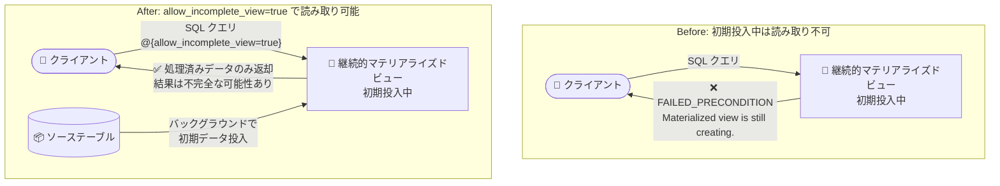

# Bigtable: allow_incomplete_view クエリヒントによる初期データ投入中の読み取りが GA

**リリース日**: 2026-08-20

**サービス**: Bigtable

**機能**: allow_incomplete_view クエリヒント (継続的マテリアライズドビューの初期データ投入中の読み取り)

**ステータス**: GA (一般提供)

📊 [このアップデートのインフォグラフィックを見る](https://takech9203.github.io/google-cloud-news-summary/20260820-bigtable-allow-incomplete-view-ga.html)

## 概要

Bigtable の SQL クエリで `allow_incomplete_view` クエリヒントが一般提供 (GA) になりました。このヒントを使用すると、継続的マテリアライズドビュー (continuous materialized view) の初期データ投入 (initial population) が完了する前でも、ビューからデータを読み取ることができます。

継続的マテリアライズドビューは、ユーザーが定義した SQL クエリに基づいてソーステーブルのデータを事前集計・変換し、バックグラウンドで増分更新し続けるフルマネージドのビューです。既存テーブルに対してビューを作成すると、既存データをビューにコピーする初期データ投入プロセスが開始されますが、この処理はテーブルサイズとクエリの複雑さに応じて数時間から数十時間かかることがあります (例: 175 ノードクラスタで 1 TB のデータの初期投入に約 3 時間、10 TB では約 30 時間)。

これまで、初期投入中のビューへの読み取りリクエストはデータの正確性を保証するために拒否されていました。今回の GA により、不完全なデータを許容できるアプリケーションであれば、ステートメントレベルのクエリヒント `allow_incomplete_view=true` をオプトインで指定することで、投入完了を待たずに処理済みのデータを読み取れるようになります。大規模テーブルにビューを作成するデータエンジニアや、開発中に動作確認を早く行いたい開発者にとって有用なアップデートです。

**アップデート前の課題**

- 初期データ投入中の継続的マテリアライズドビューに読み取りリクエストを送ると、Bigtable は `Materialized view is still creating.` エラー (ステータスコード `FAILED_PRECONDITION`) を返し、読み取りができなかった
- 大規模テーブルでは初期投入に数時間〜数十時間かかるため、その間ビューの内容を一切確認できず、ビュー定義 (SQL クエリ) の妥当性検証や開発・テストが遅延した
- 初期投入の完了を待ってからアプリケーションを切り替える運用が必要だった

**アップデート後の改善**

- `allow_incomplete_view=true` クエリヒントを SQL クエリに追加することで、初期投入中でも処理済みのデータを読み取れるようになった
- ビュー作成直後から集計結果の形式やスキーマを確認できるため、ビュー定義の検証や開発サイクルを短縮できる
- 不完全なデータを許容できるアプリケーション (ダッシュボードの暫定表示など) は、初期投入の完了を待たずにビューの利用を開始できる

## アーキテクチャ図



初期データ投入中の継続的マテリアライズドビューに対する読み取りの Before/After 比較です。クエリヒントをオプトインで指定することで、投入完了前でも処理済みのデータを取得できます。

## サービスアップデートの詳細

### 主要機能

1. **allow_incomplete_view クエリヒント (GA)**
   - ステートメントレベルのクエリヒントとして SQL クエリに `@{allow_incomplete_view=true}` を追加する
   - 初期データ投入中の継続的マテリアライズドビューから、その時点までに処理されたデータを読み取れる
   - デフォルトの動作 (投入中の読み取り拒否) は変わらず、明示的なオプトイン方式

2. **デフォルトのデータ正確性保護は維持**
   - ヒントを指定しない場合、初期投入中のビューへの読み取りは従来どおり `FAILED_PRECONDITION` エラーで拒否される
   - データの完全性が必要なアプリケーションが誤って不完全な結果を受け取ることを防ぐ

3. **継続的マテリアライズドビューの開発・検証の効率化**
   - 初期投入完了 (大規模テーブルでは数十時間かかる場合もある) を待たずに、ビューのスキーマや集計結果の形式を確認できる
   - ビュー定義の SQL クエリの妥当性を早期に検証できる

## 技術仕様

### クエリヒントの仕様

| 項目 | 詳細 |
|------|------|
| ヒント名 | `allow_incomplete_view` |
| 指定方法 | ステートメントレベルのクエリヒント (`@{allow_incomplete_view=true}`) |
| 対象 | 初期データ投入中の継続的マテリアライズドビューへの SQL クエリ |
| デフォルト動作 | ヒントなしの場合、投入中の読み取りは `FAILED_PRECONDITION` エラーで拒否 |
| 返却されるデータ | その時点までに処理されたデータのみ (結果は不完全で、投入の進行に伴い変化する) |
| ステータス | GA (一般提供) |

### クエリ構文

```sql
SELECT key_part FROM `VIEW_ID` @{allow_incomplete_view=true}
```

`VIEW_ID` は継続的マテリアライズドビューの一意の識別子に置き換えます。

### 初期データ投入の所要時間の目安

| データ量 | クラスタ構成 | 所要時間 (目安) |
|----------|--------------|------------------|
| 1 TB | 175 ノード | 約 3 時間 |
| 2 TB | 175 ノード | 約 6 時間 |
| 10 TB | 175 ノード | 約 30 時間 |

初期投入は低優先度のバックグラウンドジョブとして実行され、所要時間はテーブルサイズとクエリの複雑さに依存します。ノードを一時的に追加することで投入を高速化できます。

## 設定方法

### 前提条件

1. Bigtable インスタンスに継続的マテリアライズドビューが作成されている (または作成する)
2. GoogleSQL for Bigtable をサポートするクライアントライブラリ、または Bigtable Studio クエリエディタを使用する
3. アプリケーションが不完全なクエリ結果を許容できることを確認する

### 手順

#### ステップ 1: 継続的マテリアライズドビューを作成する

```bash
# 例: gcloud CLI で既存テーブルに継続的マテリアライズドビューを作成
gcloud bigtable materialized-views create MATERIALIZED_VIEW_ID \
  --instance=INSTANCE_ID \
  --query="SELECT SPLIT(_key, '#')[SAFE_OFFSET(0)] AS advertiser_id, count(*) AS count FROM \`SOURCE_TABLE\` GROUP BY advertiser_id"
```

既存テーブルに対してビューを作成すると、初期データ投入プロセスが自動的に開始されます。

#### ステップ 2: 初期投入中にクエリヒントを付けて読み取る

```sql
SELECT advertiser_id, count
FROM `MATERIALIZED_VIEW_ID` @{allow_incomplete_view=true}
```

初期投入中でも、その時点までに処理されたデータが返されます。ヒントを外せば、投入完了後にのみ読み取りが成功する従来の動作になります。

## メリット

### ビジネス面

- **サービス投入までのリードタイム短縮**: 大規模テーブルでの初期投入完了 (数時間〜数十時間) を待たずに、ダッシュボードや分析機能の暫定提供を開始できる
- **開発コストの削減**: ビュー定義の検証を早期に行えるため、定義の誤りによる作り直し (再投入) のリスクと待ち時間を削減できる

### 技術面

- **早期のスキーマ・結果検証**: ビュー作成直後から出力スキーマや集計結果の形式を確認でき、開発・テストサイクルが高速化する
- **オプトイン方式による安全性**: デフォルト動作は変わらないため、既存アプリケーションへの影響がなく、不完全なデータを許容できるクエリでのみ明示的に有効化できる
- **進捗の可視化**: 投入の進行に伴い返却されるデータが増えていくため、初期投入の進み具合を実データで確認できる

## デメリット・制約事項

### 制限事項

- クエリ結果は不完全な可能性があり、初期投入の進行に伴って変化する
- ビューが集計 (aggregation) を行う場合、返される集計値はデータの一部のみを反映した値になる可能性がある
- SQL クエリのステートメントレベルヒントであり、SQL 経由の読み取りで使用する機能である

### 考慮すべき点

- 正確性・完全性が必要な本番ワークロードでは、初期投入の完了を待ってからヒントなしで読み取るべき
- 不完全な集計値を下流システムやレポートにそのまま利用すると誤った意思決定につながる可能性があるため、暫定値であることを明示する運用が望ましい
- 継続的マテリアライズドビューは結果整合性 (eventually consistent) であり、投入完了後もソーステーブルへの反映に遅延が生じ得る点は従来どおり

## ユースケース

### ユースケース 1: 大規模テーブルへのビュー作成時の早期検証

**シナリオ**: 10 TB 規模の広告イベントテーブルに、広告主 ID ごとの支出集計を行う継続的マテリアライズドビューを作成する。初期投入には約 30 時間かかる見込みだが、ビュー定義の SQL が意図どおりの結果を返すかを早く確認したい。

**実装例**:
```sql
SELECT advertiser_id, sum_spend
FROM `ad_spend_by_advertiser` @{allow_incomplete_view=true}
LIMIT 100
```

**効果**: ビュー作成の数分〜数十分後には処理済みデータでスキーマと集計形式を確認でき、定義に誤りがあった場合は 30 時間待たずに作り直しの判断ができる。

### ユースケース 2: ダッシュボードの暫定稼働

**シナリオ**: リアルタイム分析ダッシュボードのバックエンドを継続的マテリアライズドビューに移行する。初期投入完了前から、暫定値である旨を表示した上でダッシュボードを稼働させたい。

**効果**: 初期投入の完了を待たずにダッシュボードの動作確認と暫定提供を開始でき、投入完了後はヒントを外すだけで完全なデータに切り替えられる。

## 料金

`allow_incomplete_view` クエリヒント自体に追加料金はありません。継続的マテリアライズドビューについても、リソース単位の個別料金はなく、ビューの作成・同期に必要な処理と保存に対して Bigtable の標準料金が適用されます。

- **ストレージ**: ビュー本体のデータと中間ストレージ (intermediate storage) の保存に課金
- **コンピュート**: ソーステーブルとビューの継続的な同期に CPU 処理が必要で、クラスタのノード追加が必要になる場合がある

詳細は [Bigtable の料金ページ](https://cloud.google.com/bigtable/pricing) を参照してください。

## 関連サービス・機能

- **GoogleSQL for Bigtable**: 本クエリヒントは GoogleSQL for Bigtable の SQL クエリで使用する。SQL をサポートするクライアントライブラリや Bigtable Studio クエリエディタから利用可能
- **Bigtable 継続的マテリアライズドビュー**: 本アップデートの対象機能。SQL 定義に基づきデータを事前集計・変換し、バックグラウンドで増分更新するフルマネージドビュー
- **Bigtable オートスケーリング**: 初期投入や継続的な同期処理のオーバーヘッドに対応するため、クラスタのオートスケーリング有効化がベストプラクティスとされている
- **Cloud Logging / Cloud Monitoring**: `materialized_view/max_delay` や `materialized_view/storage` などのメトリクスでビューの処理遅延やストレージ使用量を監視できる

## 参考リンク

- 📊 [インフォグラフィック](https://takech9203.github.io/google-cloud-news-summary/20260820-bigtable-allow-incomplete-view-ga.html)
- [公式リリースノート](https://docs.cloud.google.com/release-notes#August_20_2026)
- [ドキュメント: Read data during initial population](https://cloud.google.com/bigtable/docs/reads#read-during-initial-population)
- [ドキュメント: 継続的マテリアライズドビューの概要](https://docs.cloud.google.com/bigtable/docs/continuous-materialized-views)
- [料金ページ](https://cloud.google.com/bigtable/pricing)

## まとめ

`allow_incomplete_view` クエリヒントの GA により、継続的マテリアライズドビューの初期データ投入完了を待たずに処理済みデータを読み取れるようになり、大規模テーブルでのビュー導入時の検証・開発サイクルが大幅に短縮できます。不完全なデータを許容できるユースケースではオプトインで活用しつつ、正確性が必要な本番クエリでは従来どおり投入完了を待つ、という使い分けを検討してください。

---

**タグ**: #Bigtable #MaterializedView #GoogleSQL #GA #データ分析 #NoSQL
