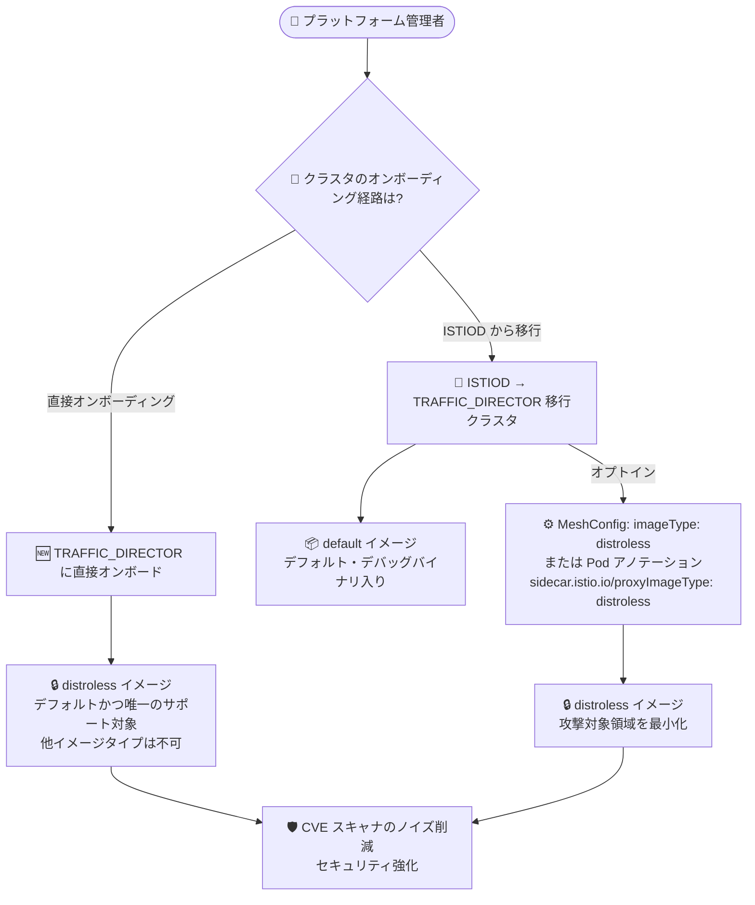

# Cloud Service Mesh: Managed Cloud Service Mesh における Distroless プロキシイメージのガイダンス更新

**リリース日**: 2026-08-20

**サービス**: Cloud Service Mesh

**機能**: Managed Cloud Service Mesh のプロキシイメージタイプ (default / distroless) の利用ガイダンス更新

**ステータス**: Feature

📊 [このアップデートのインフォグラフィックを見る](https://takech9203.github.io/google-cloud-news-summary/20260820-cloud-service-mesh-distroless-proxy-images.html)

## 概要

Managed Cloud Service Mesh におけるプロキシイメージタイプ (default および distroless) の利用に関するガイダンスが更新されました。今回の更新により、クラスタのオンボーディング経路 (直接オンボーディングか、ISTIOD からの移行か) によって、使用されるプロキシイメージのデフォルトと選択肢が明確に定義されました。

具体的には、マネージド TRAFFIC_DIRECTOR コントロールプレーン実装に**直接オンボーディングしたクラスタ**は、デフォルトで distroless プロキシイメージを使用し、それ以外のイメージタイプ (default や debug) はサポートされません。一方、**ISTIOD から TRAFFIC_DIRECTOR に移行したクラスタ**は、デバッグ用バイナリを含む default イメージがデフォルトとなりますが、MeshConfig または Pod アノテーション `sidecar.istio.io/proxyImageType: distroless` により distroless イメージへ明示的にオプトインできます。

Distroless イメージはコンテナの内容を必要最小限のパッケージに限定することで攻撃対象領域を削減し、CVE スキャナの誤検出 (ノイズ) を減らすため、Google はセキュリティ向上の観点から distroless イメージの利用を推奨しています。Managed Cloud Service Mesh を運用するプラットフォームチームやセキュリティ担当者は、自クラスタのオンボーディング経路と現在のイメージタイプを確認しておくことが推奨されます。

**アップデート前の課題**

- 従来のガイダンスでは、ISTIOD から TRAFFIC_DIRECTOR に移行したクラスタについて「移行時にイメージタイプは変更されない」という説明にとどまり、移行後のデフォルト動作が明確ではなかった
- 移行クラスタで distroless にオプトインする具体的な方法 (MeshConfig / Pod アノテーション) と、その優先順位が整理されていなかった
- 直接オンボーディングしたクラスタで default イメージがサポートされない点や、アノテーションによる他イメージタイプへのオーバーライドの扱いが明示されていなかった

**アップデート後の改善**

- 直接オンボーディングしたクラスタ (TRAFFIC_DIRECTOR 実装) は distroless イメージのみサポートされ、default イメージはサポートされないことが明記された
- 移行クラスタ (ISTIOD → TRAFFIC_DIRECTOR) のデフォルトは default イメージであり、MeshConfig または Pod アノテーション `sidecar.istio.io/proxyImageType: distroless` で distroless にオプトインできることが明確化された
- クラスタで使用中のプロキシイメージタイプを確認する手順 (「Identify the proxy image type used in the cluster」) がドキュメント化され、Pod アノテーションが MeshConfig より優先されることも明示された

## アーキテクチャ図



クラスタのオンボーディング経路によってプロキシイメージのデフォルトと選択肢が異なります。直接オンボーディングしたクラスタは distroless 固定、移行クラスタは default がデフォルトですが distroless へオプトイン可能です。

## サービスアップデートの詳細

### 主要機能

1. **直接オンボーディングクラスタ: distroless イメージのみサポート**
   - マネージド TRAFFIC_DIRECTOR コントロールプレーンに直接オンボーディングしたクラスタでは、distroless イメージタイプのみがサポートされる
   - default イメージはサポートされず、変更もできない
   - 他のイメージタイプへのオーバーライド指定は無視される

2. **移行クラスタ: default イメージがデフォルト、distroless へオプトイン可能**
   - ISTIOD から TRAFFIC_DIRECTOR コントロールプレーンに移行したクラスタでは、イメージタイプはデバッグ用バイナリを含む default イメージがデフォルト
   - セキュリティ向上のため、MeshConfig または Pod アノテーションで distroless イメージへ明示的にオプトインできる
   - 明示的なオーバーライド値として許可されるのは distroless のみで、debug などの非 distroless イメージタイプはサポートされない

3. **プロキシイメージタイプの確認手順のドキュメント化**
   - `istio-proxy` コンテナのイメージパスに `-distroless` が含まれるかどうかで、Pod が使用しているイメージタイプを判別できる
   - 設定意図の確認方法として、Pod アノテーションと MeshConfig (`defaultConfig.image.imageType`) の 2 つの確認手順が示された
   - Pod アノテーションは MeshConfig より優先される

## 技術仕様

### プロキシイメージタイプの比較

| 項目 | default イメージ | distroless イメージ |
|------|------------------|---------------------|
| 含まれるバイナリ | プロキシ + デバッグ用バイナリ | プロキシのみ |
| シェル / curl / ping の実行 | 可能 | 不可 (バイナリ非搭載) |
| セキュリティ | 攻撃対象領域が相対的に大きい | 攻撃対象領域を最小化、CVE スキャナの誤検出を削減 |
| 直接オンボーディングクラスタ | サポート対象外 | デフォルトかつ唯一のサポート対象 |
| 移行クラスタ (ISTIOD → TRAFFIC_DIRECTOR) | デフォルト | MeshConfig または Pod アノテーションでオプトイン可能 |

### 設定方法 (優先順位: Pod アノテーション > MeshConfig)

**MeshConfig (メッシュ全体に適用)**:

```yaml
apiVersion: v1
kind: ConfigMap
metadata:
  name: istio-release-channel
  namespace: istio-system
data:
  mesh: |-
    defaultConfig:
      image:
        imageType: distroless
```

**Pod アノテーション (ワークロード単位で適用)**:

```yaml
sidecar.istio.io/proxyImageType: distroless
```

イメージタイプの変更を反映するには、各 Pod の再起動と再インジェクションが必要です。

## 設定方法

### 前提条件

1. Managed Cloud Service Mesh (Istio API、TRAFFIC_DIRECTOR コントロールプレーン実装) を使用していること
2. 自クラスタのコントロールプレーン実装 (直接オンボーディングか ISTIOD からの移行か) を把握していること

### 手順

#### ステップ 1: 現在のプロキシイメージタイプを確認する

```bash
kubectl get pod POD_NAME -n NAMESPACE \
  -o jsonpath='{.spec.containers[?(@.name=="istio-proxy")].image}'
```

イメージパスのタグまたはサフィックスに `-distroless` が含まれていれば distroless イメージ、含まれていなければ default イメージを使用しています。

#### ステップ 2: 設定意図 (アノテーション) を確認する

```bash
kubectl get pod POD_NAME -n NAMESPACE \
  -o jsonpath='{.metadata.annotations["sidecar.istio.io/proxyImageType"]}'
```

Pod アノテーションが設定されている場合、MeshConfig の設定より優先されます。MeshConfig 側は `istio-system` Namespace の `istio-RELEASE_CHANNEL` ConfigMap にある `defaultConfig.image.imageType` を確認します。

#### ステップ 3: (移行クラスタの場合) distroless へオプトインする

MeshConfig の `imageType: distroless` 設定、または対象ワークロードへの `sidecar.istio.io/proxyImageType: distroless` アノテーション付与のいずれかを行い、Deployment を再起動します。

```bash
kubectl rollout restart deployment -n NAMESPACE DEPLOYMENT_NAME
```

default イメージへ戻す場合は、アノテーションまたは MeshConfig の `imageType` フィールドを削除し、Deployment を再起動します。

## メリット

### ビジネス面

- **セキュリティコンプライアンスの強化**: distroless イメージは必要最小限のパッケージのみを含むため、攻撃対象領域が削減され、セキュリティ基準への準拠が容易になる
- **脆弱性管理コストの削減**: CVE スキャナの誤検出 (false positive) が減少し、脆弱性トリアージにかかる運用負荷を軽減できる

### 技術面

- **デフォルト動作の明確化**: オンボーディング経路ごとのデフォルトイメージタイプが明文化され、意図しないイメージタイプでの運用を防げる
- **柔軟なオプトイン手段**: メッシュ全体 (MeshConfig) とワークロード単位 (Pod アノテーション) の 2 通りで distroless へ移行でき、段階的な適用が可能

## デメリット・制約事項

### 制限事項

- 直接オンボーディングしたクラスタ (TRAFFIC_DIRECTOR 実装) では distroless イメージのみサポートされ、default イメージへの変更はできない (他イメージタイプへのオーバーライドは無視される)
- 移行クラスタでも、明示的なオーバーライド値として許可されるのは distroless のみで、debug などの非 distroless イメージタイプはサポートされない
- イメージタイプの変更を反映するには、各 Pod の再起動と再インジェクションが必要

### 考慮すべき点

- distroless イメージにはプロキシ以外のバイナリが含まれないため、コンテナ内でシェルや `curl`、`ping` などのデバッグユーティリティを実行できない
- デバッグが必要な場合は、エフェメラルコンテナを実行中の Pod にアタッチして調査するか、`gcloud beta container fleet mesh debug proxy-status` / `proxy-config` を使用する (デバッグ用ベースイメージは不要)

## ユースケース

### ユースケース 1: 移行クラスタのセキュリティ強化

**シナリオ**: ISTIOD から TRAFFIC_DIRECTOR に移行したクラスタを運用しており、セキュリティ監査で sidecar プロキシコンテナ内の不要なバイナリ (シェル、curl など) が指摘された。

**実装例**:
```yaml
apiVersion: v1
kind: ConfigMap
metadata:
  name: istio-release-channel
  namespace: istio-system
data:
  mesh: |-
    defaultConfig:
      image:
        imageType: distroless
```

**効果**: メッシュ全体のプロキシが distroless イメージに切り替わり (Pod 再起動後)、攻撃対象領域の削減と CVE スキャナのノイズ低減を実現できる。

### ユースケース 2: ワークロード単位での段階的な distroless 移行

**シナリオ**: 移行クラスタでいきなりメッシュ全体を distroless 化するのはリスクがあるため、まず一部のワークロードから段階的に適用したい。

**効果**: Pod アノテーション `sidecar.istio.io/proxyImageType: distroless` を対象 Deployment のみに付与することで、影響範囲を限定しながら distroless 移行を検証できる。アノテーションは MeshConfig より優先されるため、混在環境でも制御しやすい。

## 料金

本アップデートはプロキシイメージの利用ガイダンス更新であり、料金に直接の変更はありません。Cloud Service Mesh の料金の詳細は公式料金ページを参照してください。

- [Cloud Service Mesh の料金](https://cloud.google.com/service-mesh/pricing)

## 関連サービス・機能

- **Google Kubernetes Engine (GKE)**: Cloud Service Mesh が動作する基盤。sidecar プロキシは GKE 上の Pod にインジェクトされる
- **Traffic Director (TRAFFIC_DIRECTOR コントロールプレーン実装)**: Managed Cloud Service Mesh のマネージドコントロールプレーン実装。本アップデートのイメージタイプポリシーはこの実装を対象とする
- **GKE Fleet (フリート管理)**: `gcloud beta container fleet mesh debug proxy-status` / `proxy-config` により、debug イメージなしでプロキシのデバッグが可能
- **Artifact Analysis / CVE スキャナ**: distroless イメージの採用により、コンテナイメージスキャンにおける誤検出を削減できる

## 参考リンク

- 📊 [インフォグラフィック](https://takech9203.github.io/google-cloud-news-summary/20260820-cloud-service-mesh-distroless-proxy-images.html)
- [公式リリースノート](https://docs.cloud.google.com/release-notes#August_20_2026)
- [Distroless proxy image (Enable optional features on managed control plane)](https://docs.cloud.google.com/service-mesh/docs/enable-optional-features-managed)
- [Identify the proxy image type used in the cluster (Troubleshoot proxy)](https://docs.cloud.google.com/service-mesh/docs/troubleshooting/troubleshoot-proxy)
- [Cloud Service Mesh の料金](https://cloud.google.com/service-mesh/pricing)

## まとめ

Managed Cloud Service Mesh のプロキシイメージタイプに関するガイダンスが更新され、直接オンボーディングクラスタは distroless 固定、移行クラスタは default がデフォルト (distroless へオプトイン可能) という方針が明確になりました。移行クラスタを運用している場合は、まず `kubectl` でクラスタの現在のイメージタイプを確認し、セキュリティ強化のために distroless イメージへのオプトインを検討することを推奨します。その際、distroless ではコンテナ内デバッグツールが使えないため、エフェメラルコンテナや `gcloud` のデバッグコマンドを活用する運用への切り替えも合わせて計画してください。

---

**タグ**: Cloud Service Mesh, Istio, Distroless, Traffic Director, GKE, セキュリティ, sidecar proxy
