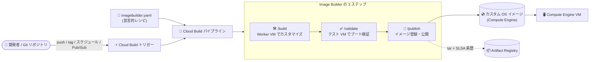

# Compute Engine: Image Builder (allowlist-only Preview)

**リリース日**: 2026-08-20

**サービス**: Compute Engine

**機能**: Image Builder - 宣言的なカスタム OS イメージ構築ツール

**ステータス**: Preview (allowlist のみ)

📊 [このアップデートのインフォグラフィックを見る](https://takech9203.github.io/google-cloud-news-summary/20260820-compute-engine-image-builder-preview.html)

## 概要

Compute Engine の新機能として、**Image Builder** が allowlist-only Preview で利用可能になりました。Image Builder は、Cloud Build を利用して Google Cloud 内でカスタム OS イメージの構築・カスタマイズ・検証を自動化する、宣言的な OS イメージカスタマイズツールです。

ユーザーは `imagebuilder.yaml` という宣言的な YAML レシピにベース OS イメージ、インフラ設定、カスタマイズ手順を記述し、Cloud Build のパイプライン (`cloudbuild.yaml`) でビルド (customize) → 検証 (validate) → 公開 (publish) の 3 ステップを順に実行します。公開前に Google 提供の検証チェック (ブート確認、Secure Boot、ネットワークドライバー、Guest Agent の健全性) が実行されるため、本番ワークロードに投入する前にイメージの品質を確認できます。

対象ユーザーは、ゴールデンイメージ (組織標準のカスタム OS イメージ) を運用するインフラチームや、セキュリティパッチ適用済みイメージを定期的に再ビルドしたいプラットフォームチームです。利用には[リクエストフォーム](https://forms.gle/4NncEhwetZDjaPx9A)からのオンボーディング申請が必要です。

**アップデート前の課題**

- カスタム OS イメージの構築・カスタマイズには、独自のスクリプトや外部ツールを組み合わせたパイプラインを自作する必要があった
- ビルドしたイメージが正しくブートするか、Secure Boot やネットワークドライバー、Guest Agent が正常に動作するかの検証を自前で実装する必要があった
- ビルド中に実行されたスクリプトの監査証跡 (何が実行されたか) を残す仕組みを独自に用意する必要があった

**アップデート後の改善**

- 宣言的な YAML レシピと Cloud Build ワークフローだけで、カスタムスクリプトや外部ツールなしにカスタム OS イメージの作成・保守が可能になった
- Cloud Build トリガーとの統合により、リポジトリイベント (Git push / タグ)、定期スケジュール (例: 週次のセキュリティパッチビルド)、Pub/Sub メッセージからビルドを自動起動できるようになった
- Google 提供の検証チェックにより、公開前に中間イメージのブート、Secure Boot 対応、必須ネットワークドライバーのロード、Guest Agent の健全性を自動検証できるようになった
- インラインカスタマイズスクリプトの SHA-256 ハッシュがビルドログに自動記録され、監査証跡を維持できるようになった

## アーキテクチャ図



宣言的レシピ (`imagebuilder.yaml`) を入力として、Cloud Build 上で customize → validate → publish の 3 ステップが実行され、検証済みのカスタム OS イメージが Compute Engine に登録される流れです。Artifact Registry への tar エクスポートと SLSA 来歴記録もオプションで行えます。

## サービスアップデートの詳細

### 主要機能

1. **宣言的な YAML レシピによるイメージ定義 (`imagebuilder.yaml`)**
   - API バージョン `imagebuilder.gcp.com/v1`、リソース種別 `OSImageCustomization` のスキーマで、ベース OS イメージ (`source`)、Worker VM のインフラ設定 (`infrastructureConfig`)、出力先 (`destinations`)、カスタマイズ手順 (`spec.steps`) を宣言的に記述
   - カスタマイズアクションとして Shell (シェルコマンド実行)、FileCopy (ファイル転送)、UpdateKernelCommandLine (カーネルコマンドライン更新)、InstallGPU (GPU ドライバーインストール) をサポート
   - Worker VM には GPU アクセラレータ (`acceleratorType` / `acceleratorCount`) やキャパシティ予約 (`reservations`) の指定も可能

2. **Cloud Build による 3 ステップのオーケストレーション**
   - `cloudbuild.yaml` で customize / validate / publish の 3 つのコンテナステップ (`/build`、`/validate`、`/publish`) を順次実行
   - コンテナイメージは Google 提供の公式リポジトリ (`REGION-docker.pkg.dev/image-builder-official/release/builder:stable` および `validator:stable`) から取得
   - Cloud Build トリガーにより、Git push / タグ、cron スケジュール、Pub/Sub メッセージからの自動ビルドに対応。Google Cloud コンソールからのパイプライン作成 (リポジトリ連携または Cloud Storage スクリプト格納) にも対応

3. **公開前の自動検証 (Validation)**
   - カスタマイズ済みイメージから一時的なテスト VM をブートし、自動検証テストスイートを実行
   - 検証項目: VM ブート、Secure Boot (該当する場合)、ブロックストレージの健全性、Guest Agent のステータス、ネットワークドライバーのバインディング

4. **サプライチェーンセキュリティと監査証跡**
   - インラインカスタマイズスクリプトの SHA-256 ハッシュをビルドログに自動記録
   - publish ステップで SLSA (Supply Chain Levels for Software Artifacts) 来歴レコードを出力
   - Artifact Registry の generic リポジトリを出力先に指定した場合、ベースイメージ情報をビルドアテステーションのメタデータに記録可能

## 技術仕様

### `imagebuilder.yaml` の主要フィールド

| 項目 | 詳細 |
|------|------|
| `apiVersion` / `kind` | `imagebuilder.gcp.com/v1` / `OSImageCustomization` |
| `infrastructureConfig.machineType` | Worker / テスト VM のマシンタイプ (例: `e2-standard-4`)。ベアメタルは非対応 |
| `infrastructureConfig.zone` | Worker / テスト VM を実行するゾーン |
| `infrastructureConfig.debug` | `true` で Worker VM を保持し SSH でのトラブルシューティングが可能 (デフォルト `false`) |
| `infrastructureConfig.instanceDurationHours` | Worker VM の実行時間制限 (最大 2.0 時間) |
| `source` | ベース OS イメージ (例: `imageFamily: projects/ubuntu-os-cloud/global/images/family/ubuntu-2204-lts`) |
| `destinations` | 出力先のディスクイメージ名、イメージファミリー、プロジェクト、ストレージロケーション |
| `spec.steps` | カスタマイズアクション (Shell / FileCopy / UpdateKernelCommandLine / InstallGPU) |

### レシピ設定例 (Ubuntu 22.04 LTS のベースラインイメージ)

```yaml
apiVersion: imagebuilder.gcp.com/v1
kind: OSImageCustomization
metadata:
  name: customized-ubuntu-baseline
  description: "Ubuntu 22.04 LTS custom OS baseline image"
infrastructureConfig:
  machineType: e2-standard-4
  zone: ZONE
  debug: false
source:
  imageFamily: projects/ubuntu-os-cloud/global/images/family/ubuntu-2204-lts
destinations:
  - diskImage:
      name: custom-ubuntu-v1
      family: custom-ubuntu-family
      project: PROJECT_ID
      storageLocations:
        - REGION
spec:
  config:
    skipSystemTests: false
  steps:
    - name: "System Package Update"
      action: Shell
      inputs:
        command: "apt-get update -y && apt-get upgrade -y"
```

### `cloudbuild.yaml` の主要 substitution 変数

| 変数 | 詳細 |
|------|------|
| `_GCS_WORKDIR` | 一時ステージング用の Cloud Storage パス (バケットは事前作成が必要) |
| `_IMAGE_BUILDER_CONFIG_PATH` | `imagebuilder.yaml` レシピのパス |
| `_SERVICE_ACCOUNT` | ビルドを実行するサービスアカウントの IAM リソース名 |
| `_IMAGE_OUTPUT_PATH` | エクスポートされる tar ファイルの出力パス |
| `_ARTIFACT_REGISTRY_RESOURCE_URI` | (オプション) tar とアテステーションを push する Artifact Registry の generic リポジトリ URI |

なお、各ステップの `id` は `imagebuilder-` プレフィックスで始める必要があり (例: `imagebuilder-customize`)、`results` ブロックに `image_builder_telemetry_metrics` を含めるとサービス信頼性監視のためのパイプライン実行メトリクスが収集されます。

## 設定方法

### 前提条件

1. [リクエストフォーム](https://forms.gle/4NncEhwetZDjaPx9A)からプロジェクトのオンボーディングとアクセス申請を行う (allowlist-only Preview)
2. 一時ステージング用の Cloud Storage バケット、必要な IAM 権限を持つサービスアカウント、(tar 出力を使う場合) Artifact Registry リポジトリを準備する
3. Terraform を使う場合は Terraform CLI 1.3 以降をインストールし、リポジトリ連携を使う場合は Cloud Build repositories (2nd gen) または Developer Connect でリポジトリを接続する

### 手順

#### ステップ 1: 設定ファイルの作成

```bash
# imagebuilder.yaml (カスタマイズレシピ) と cloudbuild.yaml (ビルドオーケストレーション) を作成
ls
# imagebuilder.yaml  cloudbuild.yaml
```

`imagebuilder.yaml` にベースイメージ・インフラ設定・カスタマイズ手順を、`cloudbuild.yaml` に 3 ステップ (customize / validate / publish) のオーケストレーションを定義します。

#### ステップ 2: パイプラインのデプロイ・実行

gcloud CLI、Terraform、または Google Cloud コンソールからパイプラインを構成・実行できます。コンソールでは、リポジトリ連携 (レシピをリポジトリで管理) または Cloud Storage へのスクリプト格納のいずれかを選択し、スケジュール実行やリポジトリイベントによるトリガーを設定できます。トリガーを設定しない場合は、パイプライン一覧から手動実行 (Run) も可能です。

## メリット

### ビジネス面

- **ゴールデンイメージ運用の標準化**: 組織標準のカスタム OS イメージのライフサイクル (構築・検証・公開) を Google Cloud 内で完結でき、外部ツールの運用コストを削減できる
- **追加料金なし**: Image Builder サービス自体は追加料金なしで利用でき、パイプライン実行中に消費するコンピュート・ストレージ・ビルドリソースの分のみ課金される

### 技術面

- **宣言的管理と CI/CD 統合**: YAML レシピを Git で管理し、push / タグ / スケジュール / Pub/Sub でビルドを自動化できる (例: 週次のセキュリティパッチ適用ビルド)
- **公開前の品質保証**: ブート・Secure Boot・ネットワークドライバー・Guest Agent の Google 提供検証チェックにより、壊れたイメージが本番に流れるリスクを低減
- **サプライチェーンの透明性**: スクリプトの SHA-256 ハッシュ記録と SLSA 来歴により、イメージの出所と実行内容を検証可能

## デメリット・制約事項

### 制限事項

- allowlist-only Preview のため、利用にはリクエストフォームからの申請と承認が必要
- Pre-GA 機能のため「現状のまま (as is)」提供であり、サポートが限定される場合がある (Pre-GA Offerings Terms が適用)
- Image Builder は Cloud Build が利用可能なリージョンでのみサポートされる
- Worker / テスト VM にベアメタルマシンタイプは指定できない
- Worker VM の実行時間制限 (`instanceDurationHours`) は最大 2.0 時間

### 考慮すべき点

- クロスリージョンの Egress 課金とレイテンシを避けるため、Worker VM のゾーン、Cloud Storage ステージングバケット、Artifact Registry リポジトリ、イメージのストレージロケーションを同一リージョンに揃えることが推奨される
- ステップ ID の `imagebuilder-` プレフィックスや `image_builder_telemetry_metrics` の指定など、`cloudbuild.yaml` に固有の規約がある

## ユースケース

### ユースケース 1: 週次セキュリティパッチ適用済みゴールデンイメージの自動ビルド

**シナリオ**: 組織標準の Ubuntu ベースイメージに毎週最新のセキュリティパッチを適用し、検証済みイメージとして社内に配布したい。

**実装例**:
```yaml
# imagebuilder.yaml の steps でパッケージ更新を定義し、
# Cloud Build トリガーの cron スケジュールで週次実行
spec:
  steps:
    - name: "System Package Update"
      action: Shell
      inputs:
        command: "apt-get update -y && apt-get upgrade -y"
```

**効果**: パッチ適用・ブート検証・公開までが自動化され、検証済みイメージのみがイメージファミリーに登録される。

### ユースケース 2: GPU ワークロード向けイメージの構築

**シナリオ**: GPU ドライバーをプリインストールした ML ワークロード向けカスタムイメージを維持したい。

**効果**: `InstallGPU` アクションと `acceleratorType` / `acceleratorCount` の指定により、GPU 付き Worker VM 上でドライバーインストールと検証を自動化できる。

## 料金

Image Builder サービス自体は追加料金なしで利用できます。パイプライン実行中に消費される基盤リソース (コンピュート、ストレージ、ビルドリソース) の分のみ課金されます。

また、カスタム OS イメージ自体には従来どおりイメージストレージ料金が発生し、プレミアム OS イメージの場合はライセンス料金が別途かかります。詳細は [Compute Engine のディスクとイメージの料金](https://cloud.google.com/compute/disks-image-pricing)を参照してください。

## 利用可能リージョン

Image Builder は [Cloud Build が利用可能なリージョン](https://docs.cloud.google.com/build/docs/locations)でのみサポートされます。

## 関連サービス・機能

- **Cloud Build**: Image Builder のパイプライン実行基盤。トリガー (Git イベント / スケジュール / Pub/Sub) によるビルド自動化を提供
- **Artifact Registry**: イメージ tar ファイルの出力先。SLSA 来歴やアテステーションの保存にも利用
- **Cloud Storage**: ビルド中のシリアルログや一時アーカイブなどのステージング領域として利用
- **Compute Engine カスタムイメージ / イメージファミリー**: ビルド結果の登録先。イメージファミリーにより常に最新の検証済みイメージを参照可能
- **Pub/Sub**: 外部ワークフローや Webhook からのビルドのプログラマティックなトリガーに利用

## 参考リンク

- 📊 [インフォグラフィック](https://takech9203.github.io/google-cloud-news-summary/20260820-compute-engine-image-builder-preview.html)
- [公式リリースノート](https://docs.cloud.google.com/release-notes#August_20_2026)
- [About Image Builder (概要ドキュメント)](https://docs.cloud.google.com/compute/docs/images/image-builder/overview)
- [パイプラインの作成 (gcloud / Terraform)](https://docs.cloud.google.com/compute/docs/images/image-builder/create-pipeline)
- [カスタマイズレシピスキーマ](https://docs.cloud.google.com/compute/docs/images/image-builder/customization-recipe-schema)
- [ビルド設定スキーマ](https://docs.cloud.google.com/compute/docs/images/image-builder/build-configuration-schema)
- [アクセスリクエストフォーム](https://forms.gle/4NncEhwetZDjaPx9A)
- [料金ページ (ディスクとイメージ)](https://cloud.google.com/compute/disks-image-pricing)

## まとめ

Image Builder は、これまで独自スクリプトや外部ツールで構築していたカスタム OS イメージのパイプラインを、宣言的 YAML と Cloud Build だけで完結させる Google Cloud ネイティブなソリューションです。公開前の自動検証と SLSA 来歴によるサプライチェーンの透明性が特徴で、ゴールデンイメージを運用するチームは allowlist Preview への申請を検討する価値があります。

---

**タグ**: Compute Engine, Image Builder, Cloud Build, カスタムイメージ, ゴールデンイメージ, SLSA, Preview
