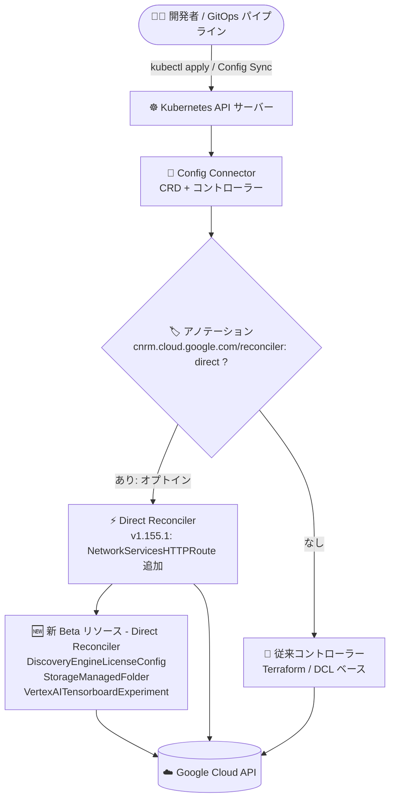

# Config Connector: バージョン 1.155.1 リリース (新 Beta リソース・新フィールド・Direct Reconciler 拡充)

**リリース日**: 2026-08-20

**サービス**: Config Connector

**機能**: バージョン 1.155.1 (新 Beta リソース、新フィールド、Reconciliation 改善、バグ修正)

**ステータス**: リリース済み (Announcement / Feature / Change / Fixed)

📊 [このアップデートのインフォグラフィックを見る](https://takech9203.github.io/google-cloud-news-summary/20260820-config-connector-v1-155-1.html)

## 概要

Config Connector バージョン 1.155.1 がリリースされた。Config Connector は、Kubernetes の CRD とコントローラーを通じて Google Cloud リソースを宣言的に管理できるオープンソースの Kubernetes アドオンであり、GitOps ワークフローでインフラを「Kubernetes マニフェストとして」管理するための中核コンポーネントである。

今回のリリースでは、Direct Reconciler ベースの新しい Beta リソースとして DiscoveryEngineLicenseConfig、StorageManagedFolder、VertexAITensorboardExperiment の 3 つが追加された。さらに、BigtableTable の自動バックアップポリシーや GKE (ContainerCluster / ContainerNodePool) の kubelet イメージ GC 設定・containerd 設定・Resource Manager タグなど多数の新フィールドが追加され、NetworkServicesHTTPRoute がオプトイン方式の直接調整 (direct reconciliation) に対応した。ComposerEnvironment や SQLInstance などのバグ修正も含む、機能追加・信頼性改善の両面で充実したリリースである。

**アップデート前の課題**

- Cloud Storage のマネージドフォルダ (オブジェクトのサブセットへの細粒度アクセス制御)、Discovery Engine のライセンス構成、Vertex AI Tensorboard の Experiment を Config Connector で宣言的に管理できなかった
- GKE の kubelet イメージガベージコレクションのしきい値、containerd 設定、ノードへの Resource Manager タグ付与などの比較的新しい GKE 設定項目を Config Connector の ContainerCluster / ContainerNodePool リソースから構成できなかった
- NetworkServicesHTTPRoute は新しい Direct Reconciler に対応しておらず、直接調整による信頼性改善の恩恵を受けられなかった
- ComposerEnvironment では、環境が RUNNING 状態でないときにも更新が試行されるなど、調整 (reconciliation) や差分検出 (diffing) のロジックに改善の余地があった
- ComputeReservation の `specificReservation.inUseCount` (使用中数) の変動が差分として検出され、不要な調整が無限に繰り返される問題があった
- CloudFunctions2Function のソース関連フィールドで、実際には変更がないのに差分 (spurious diff) が検出されることがあった

**アップデート後の改善**

- 3 つの新 Beta リソース (DiscoveryEngineLicenseConfig / StorageManagedFolder / VertexAITensorboardExperiment) により、これらの Google Cloud リソースを Kubernetes マニフェストとして GitOps 管理できるようになった
- BigtableTable の `spec.automatedBackupPolicy`、ComputeURLMap のテスト期待値フィールド、GKE のイメージ GC・containerd・転送中暗号化・Resource Manager タグなど、多数の新フィールドが利用可能になった
- `cnrm.cloud.google.com/reconciler: direct` アノテーションによるオプトインで、NetworkServicesHTTPRoute でも Direct Reconciler を利用できるようになった (API は変更なし)
- ComposerEnvironment の調整・差分検出・更新ロジックが改善され、環境が RUNNING でない場合は更新をスキップするようになった
- ComputeReservation・RedisInstance・SQLInstance・CloudFunctions2Function の不要な差分検出や整合性の問題が修正され、調整の安定性が向上した

## アーキテクチャ図



Config Connector が Kubernetes 上の宣言的リソースを Google Cloud API へ調整 (reconcile) する流れ。v1.155.1 では Direct Reconciler ベースの新 Beta リソース 3 種が追加され、NetworkServicesHTTPRoute がアノテーションによるオプトインで Direct Reconciler を利用できるようになった。

## サービスアップデートの詳細

### 主要機能

1. **新 Beta リソース (Direct Reconciler)**
   - **DiscoveryEngineLicenseConfig**: Discovery Engine のライセンス構成を管理し、アプリケーションのライセンスを管理する
   - **StorageManagedFolder**: Cloud Storage のマネージドフォルダを管理する。マネージドフォルダはバケット内のオブジェクトのサブセット (共通プレフィックスを持つオブジェクト群) に IAM ロールを付与できるリソースで、細粒度のアクセス制御ポリシーを適用できる
   - **VertexAITensorboardExperiment**: Vertex AI Tensorboard の Experiment を管理し、トレーニングの Run を整理・追跡する

2. **新フィールド**
   - **BigtableTable**: `spec.automatedBackupPolicy` (自動バックアップポリシー)
   - **CertificateManagerDNSAuthorization**: `spec.type`
   - **ComputeForwardingRule**: `spec.target.redisClusterServiceAttachment`
   - **ComputeURLMap**: `spec.tests[].expectedOutputURL`、`spec.tests[].expectedRedirectResponseCode`
   - **ContainerCluster**: kubelet のイメージ GC 関連 4 フィールド (`imageGcLowThresholdPercent` / `imageGcHighThresholdPercent` / `imageMinimumGcAge` / `imageMaximumGcAge`)、`spec.nodeConfig.containerdConfig`、`spec.inTransitEncryptionConfig`、`spec.disableL4LbFirewallReconciliation`、`spec.nodeConfig.resourceManagerTags`、`spec.nodePoolAutoConfig.resourceManagerTags`
   - **ContainerNodePool**: ContainerCluster と同じ kubelet イメージ GC 関連 4 フィールド、`spec.nodeConfig.containerdConfig`、`spec.nodeConfig.resourceManagerTags`
   - **StorageBucket**: `spec.autoclass.terminalStorageClass`、`status.observedState.storageClass`

3. **新機能**
   - **メトリクスサーバーアドレスの構成**: マネージャー組み込みメトリクスサーバーのバインドアドレスが構成可能になった
   - **ブラウンフィールド状態比較**: 既存 (brownfield) リソースの desired state と actual state を比較する汎用ヘルパー関数が追加され、調整の信頼性が向上した
   - **不規則な shortname の複数形対応**: "corpus" → "corpora" のような不規則な複数形化をサポート

4. **Reconciliation の改善 (Direct Reconciler のオプトイン拡大)**
   - より多くのリソースでオプトイン方式の直接調整をサポート。API は変更なし
   - 利用するには対象の Config Connector オブジェクトに `cnrm.cloud.google.com/reconciler: direct` アノテーションを付与する
   - 今回 **NetworkServicesHTTPRoute** が直接調整 (オプトイン) に対応

5. **バグ修正**
   - **ComposerEnvironment**: Direct Reconciler における調整・差分検出・更新ロジックを改善 (GitHub PR #12364)。基盤の Cloud Composer 環境が RUNNING 状態でない場合は更新をスキップ (GitHub PR #12365)
   - **ComputeReservation**: `specificReservation.inUseCount` の差分を無視し、無限・不要な調整を防止
   - **RedisInstance**: `MaintenanceSchedule` フィールドを出力専用 (output only) としてマークし、GCP の挙動に整合
   - **SQLInstance**: `PscAutoConnectionPolicyEnabled` のレガシー fuzzer ラウンドトリップ不一致を修正
   - **CloudFunctions2Function**: ソース関連フィールドを mutable-but-unreadable として宣言し、誤検出の差分 (spurious diff) を回避

## 技術仕様

### Direct Reconciler オプトインアノテーション

| 項目 | 詳細 |
|------|------|
| アノテーション | `cnrm.cloud.google.com/reconciler: direct` |
| 対象 | 直接調整に対応した Config Connector オブジェクト (v1.155.1 で NetworkServicesHTTPRoute が追加) |
| API への影響 | なし (API は変更なし、オプトイン方式) |
| 新 Beta リソース | DiscoveryEngineLicenseConfig / StorageManagedFolder / VertexAITensorboardExperiment は Direct Reconciler ベース |

### StorageManagedFolder が管理する Cloud Storage マネージドフォルダの要点

| 項目 | 詳細 |
|------|------|
| 用途 | バケット内の共通プレフィックスを持つオブジェクト群に IAM ポリシーを適用 |
| 前提条件 | バケットで均一なバケットレベルのアクセス (uniform bucket-level access) が有効であること |
| ネスト | 最大 15 階層までネスト可能 (名前は `/` で終わる) |
| IAM | ネストしたマネージドフォルダの IAM ポリシーは加算的に適用される |

### オプトインの設定例

```yaml
apiVersion: networkservices.cnrm.cloud.google.com/v1beta1
kind: NetworkServicesHTTPRoute
metadata:
  name: my-httproute
  annotations:
    cnrm.cloud.google.com/reconciler: direct  # Direct Reconciler へのオプトイン
spec:
  # spec は従来と同一 (API は変更なし)
```

## 設定方法

### 前提条件

1. Config Connector がインストール済みの Kubernetes クラスタ (GKE アドオンまたは手動インストール)
2. Config Connector を バージョン 1.155.1 にアップグレードする

### 手順

#### ステップ 1: 利用可能な CRD の確認

```bash
kubectl get crds --selector cnrm.cloud.google.com/managed-by-kcc=true
```

アップグレード後、新しい Beta リソース (StorageManagedFolder など) の CRD が利用可能になっているかを確認する。

#### ステップ 2: Direct Reconciler のオプトイン (対象リソースのみ)

```bash
kubectl annotate networkserviceshttproute my-httproute \
  cnrm.cloud.google.com/reconciler=direct
```

対象オブジェクトにアノテーションを付与すると Direct Reconciler が使用される。API (spec) の変更は不要。

## メリット

### ビジネス面

- **GitOps カバレッジの拡大**: Discovery Engine ライセンス構成、Cloud Storage マネージドフォルダ、Vertex AI Tensorboard Experiment まで、Kubernetes マニフェストによる単一のソースオブトゥルースで管理できる範囲が広がる
- **セキュリティ・ガバナンス強化**: StorageManagedFolder により、バケット内のオブジェクトサブセットへの細粒度な IAM 制御をコードとして管理・レビューできる

### 技術面

- **調整の信頼性向上**: ブラウンフィールド状態比較ヘルパーの導入や、ComputeReservation の `inUseCount` 差分無視、CloudFunctions2Function の spurious diff 回避など、不要な調整ループを抑止する改善が多数含まれる
- **GKE 構成の網羅性向上**: kubelet イメージ GC、containerd 設定、転送中暗号化、Resource Manager タグなど、GKE の比較的新しい設定を Config Connector から一元管理できる
- **後方互換のオプトイン設計**: Direct Reconciler への移行はアノテーションによるオプトインで、API は変更されないため段階的な導入が可能

## デメリット・制約事項

### 制限事項

- 新規追加された 3 リソースは Beta ステージ (Direct Reconciler) であり、GA ではない
- NetworkServicesHTTPRoute の直接調整はオプトインであり、アノテーションを付与しない限り従来のコントローラーが使用される
- StorageManagedFolder が管理する Cloud Storage マネージドフォルダは、均一なバケットレベルのアクセスが有効なバケットでのみ作成できる

### 考慮すべき点

- ComposerEnvironment は基盤環境が RUNNING でない場合に更新がスキップされるようになったため、環境の状態遷移中は反映タイミングに注意する
- RedisInstance の `MaintenanceSchedule` は出力専用となったため、マニフェストで指定している場合は見直しが必要
- Direct Reconciler へのオプトインは動作の切り替えを伴うため、まず非本番環境での検証を推奨する

## ユースケース

### ユースケース 1: マネージドフォルダによるデータレイクの部門別アクセス制御を GitOps 化

**シナリオ**: 単一の Cloud Storage バケットに複数チームのデータをプレフィックスで分離して格納しており、チームごとに閲覧権限を分けたい。従来はマネージドフォルダを gcloud やコンソールで個別に作成・管理していた。

**実装例**:
```yaml
apiVersion: storage.cnrm.cloud.google.com/v1beta1
kind: StorageManagedFolder
metadata:
  name: team-a-folder
spec:
  # バケット内の team-a/ プレフィックス配下にアクセス制御を適用
  # (spec の詳細は Config Connector リファレンスを参照)
```

**効果**: マネージドフォルダの構成が Kubernetes マニフェストとしてバージョン管理され、Pull Request ベースのレビューと自動適用により、アクセス制御変更の監査性と再現性が向上する。

### ユースケース 2: GKE ノードのイメージ GC と Resource Manager タグの一元管理

**シナリオ**: 多数の GKE クラスタでノードのディスク逼迫対策としてイメージ GC しきい値を統一したい。また、ノードにコスト配賦用の Resource Manager タグを付与したい。

**効果**: ContainerCluster / ContainerNodePool の新フィールド (`imageGcLowThresholdPercent` など、`resourceManagerTags`) により、これらの設定を Config Connector マニフェストで全クラスタに一貫して適用できる。

### ユースケース 3: ML 実験管理の宣言的プロビジョニング

**シナリオ**: ML プラットフォームチームが、プロジェクトごとに Vertex AI Tensorboard の Experiment を標準構成でプロビジョニングしたい。

**効果**: VertexAITensorboardExperiment リソースにより、実験のトラッキング基盤を Kubernetes マニフェストとしてテンプレート化し、ネームスペース (= プロジェクト) 単位で自動プロビジョニングできる。

## 料金

Config Connector 自体はオープンソースの Kubernetes アドオンである。Config Connector で作成・管理される Google Cloud リソース (Cloud Storage、GKE、Vertex AI など) には、各サービスの通常の料金が適用される。詳細は各サービスの料金ページを参照。

## 関連サービス・機能

- **GKE (Google Kubernetes Engine)**: Config Connector は GKE アドオンとして利用でき、今回 ContainerCluster / ContainerNodePool に多数の新フィールドが追加された
- **Cloud Storage**: StorageManagedFolder が管理するマネージドフォルダは、バケット内オブジェクトへの細粒度 IAM 制御を提供する
- **Vertex AI TensorBoard**: ML 実験の追跡・可視化・比較を行うマネージドサービス。Experiment は Run をグループ化する単位
- **Discovery Engine (Vertex AI Search / Gemini Enterprise)**: LicenseConfig はユーザーへのライセンス割り当てに使用されるサブスクリプション構成
- **Config Sync / Config Controller**: Config Connector と組み合わせて GitOps によるインフラ管理を実現する関連コンポーネント

## 参考リンク

- 📊 [インフォグラフィック](https://takech9203.github.io/google-cloud-news-summary/20260820-config-connector-v1-155-1.html)
- [公式リリースノート (2026-08-20)](https://docs.cloud.google.com/release-notes#August_20_2026)
- [Config Connector リリースノート](https://docs.cloud.google.com/config-connector/docs/release-notes)
- [Config Connector 概要](https://docs.cloud.google.com/config-connector/docs/overview)
- [Config Connector リソースリファレンス](https://docs.cloud.google.com/config-connector/docs/reference/resources)
- [Config Connector アノテーションリファレンス](https://docs.cloud.google.com/config-connector/docs/reference/annotations)
- [Cloud Storage マネージドフォルダ](https://docs.cloud.google.com/storage/docs/managed-folders)
- [Vertex AI TensorBoard の概要](https://docs.cloud.google.com/gemini-enterprise-agent-platform/machine-learning/experiments/tensorboard-introduction)
- [GitHub: k8s-config-connector](https://github.com/GoogleCloudPlatform/k8s-config-connector)

## まとめ

Config Connector 1.155.1 は、Cloud Storage マネージドフォルダや Vertex AI Tensorboard Experiment など GitOps 管理の対象範囲を広げる新 Beta リソースと、GKE の最新設定項目に対応する多数の新フィールドを追加した、実用性の高いリリースである。Config Connector を利用中のチームはアップグレードを検討し、NetworkServicesHTTPRoute を管理している場合は非本番環境で Direct Reconciler へのオプトインを検証するとよい。ComposerEnvironment や ComputeReservation で調整ループの問題に悩まされていた場合は、本バージョンで解消される可能性が高い。

---

**タグ**: Config Connector, Kubernetes, GitOps, GKE, Cloud Storage, Vertex AI, Discovery Engine, Direct Reconciler, IaC
