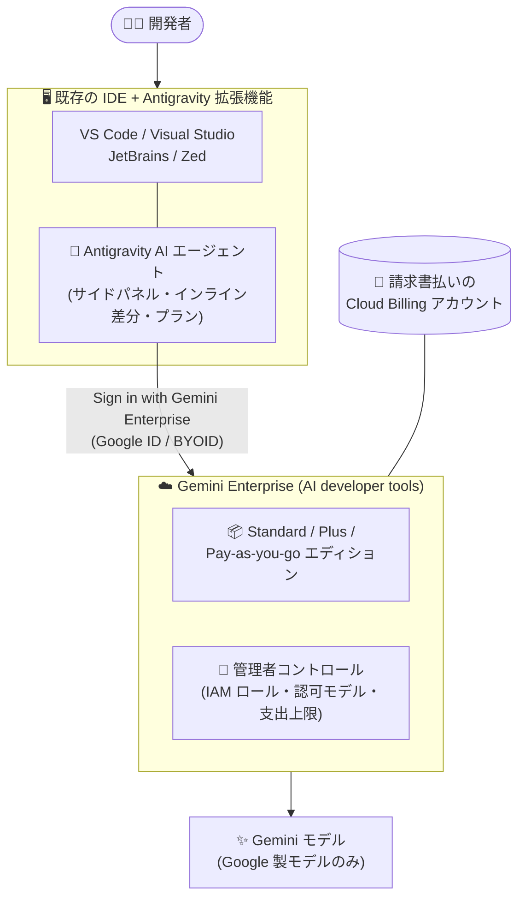

# Gemini Enterprise: Antigravity for IDEs が AI developer tools で利用可能に

**リリース日**: 2026-08-20

**サービス**: Gemini Enterprise

**機能**: Antigravity for IDEs (AI developer tools)

**ステータス**: 提供開始 (Feature)

📊 [このアップデートのインフォグラフィックを見る](https://takech9203.github.io/google-cloud-news-summary/20260820-gemini-enterprise-antigravity-for-ides.html)

## 概要

Gemini Enterprise の AI developer tools に **Antigravity for IDEs** が追加されました。Antigravity for IDEs は、Google の自律型 AI エージェントプラットフォームである Antigravity のエージェント機能を、開発者が普段使用している統合開発環境 (IDE) に拡張機能として直接組み込むものです。対象は Gemini Enterprise の **Standard、Plus、Pay-as-you-go エディション**で、**月次請求書 (invoice) が発行されている Cloud Billing アカウント**にリンクされたプロジェクトで利用できます。

これまで Gemini Enterprise の AI developer tools では、専用環境である Google Antigravity (Antigravity 2.0 / Antigravity CLI) と Android Studio が提供されていました。今回のアップデートにより、VS Code や JetBrains 系 IDE など既存のエディタを使い続けながら、サイドパネルでのエージェントとの対話、インラインでの差分レビュー、インタラクティブなプランの確認といったエージェント駆動の開発ワークフローを、Gemini Enterprise のガバナンス (IAM、モデル認可、コスト管理) のもとで利用できるようになります。

対象ユーザーは、Gemini Enterprise を導入している組織のソフトウェア開発チーム、およびエンタープライズのセキュリティ・コンプライアンス要件下で AI コーディングエージェントを展開したいプラットフォーム管理者です。

**アップデート前の課題**

- Gemini Enterprise の AI developer tools で Antigravity のエージェント機能を使うには、専用の開発環境 (Google Antigravity) または Antigravity CLI を利用する必要があり、既存の IDE 中心のワークフローとの統合が限定的だった
- チームで標準化している VS Code や JetBrains などの IDE を使う開発者は、Antigravity エージェントを利用するために環境を切り替える必要があった

**アップデート後の改善**

- 使い慣れた IDE に拡張機能を追加するだけで、Antigravity の自律型 AI エージェント (マルチステップのタスク実行、コード編集、レビュー支援) を開発ワークフロー内で直接利用できるようになった
- 「Sign in with Gemini Enterprise」による認証で、企業 ID (BYOID / Workforce Identity Federation) を用いたサインインと、Google Cloud プロジェクト・リージョンの選択が可能になった
- 管理者は Gemini Enterprise の AI developer tools 設定 (認可モデルの制御、ファイルアクセスポリシー、IAM ロール、支出上限) を IDE 利用時にも適用できる

## アーキテクチャ図

開発者は既存 IDE 内の Antigravity 拡張機能から Gemini Enterprise にサインインし、エディションに紐づくクレジットと管理者が設定したポリシー (IAM ロール、認可モデル、支出上限) のもとで AI エージェントを利用します。

## サービスアップデートの詳細

### 主要機能

1. **IDE 内での自律型 AI エージェント**
   - 専用サイドパネルでエージェントと対話し、マルチステップのソフトウェアエンジニアリングタスク (機能実装、リファクタリング、API 移行、テスト生成など) を委任できる
   - インラインの差分レビュー、インタラクティブなプラン、ウォークスルーやスクリーンショットなどのアーティファクトを確認しながら変更を検証できる
   - Tab 補完、MCP、スキル、ルール、ワークフロー、プラグイン、フックなどのカスタマイズに対応

2. **対応 IDE**
   - **Visual Studio Code**: VS Code Marketplace の拡張機能 (macOS / Linux / Windows)
   - **Visual Studio 2026**: VSIX 拡張機能 (Preview、.NET ソリューション向け)
   - **JetBrains**: IntelliJ IDEA、PyCharm、WebStorm、GoLand、CLion、Rider など (Enterprise サポートは Preview)
   - **Zed**: ネイティブのエージェント編集 (Enterprise サポートは Preview)

3. **エンタープライズ向けの認証とガバナンス**
   - 「Sign in with Gemini Enterprise」で企業 ID (BYOID / Workforce Identity Federation) によるサインインが可能
   - コード・プロンプト・エージェントのトランスクリプトは Google の基盤モデルの学習に使用されない
   - IAM ポリシー、VPC Service Controls、リージョン境界を尊重した動作

### AI developer tools のラインアップ

今回の追加により、Gemini Enterprise の AI developer tools は以下の構成になります。

| ツール | 説明 |
|--------|------|
| Google Antigravity | 自律型 AI エージェントでアプリケーションを構築する AI 開発環境 (Antigravity 2.0 / Antigravity CLI) |
| **Antigravity for IDEs (New)** | 既存の IDE に自律型 AI エージェント機能を組み込む拡張機能 |
| Android Studio | Android 開発向け公式 IDE (最新 Canary 版で Gemini Enterprise バンドルの AI 機能を提供) |

## 技術仕様

### 利用要件

| 項目 | 詳細 |
|------|------|
| 対象エディション | Gemini Enterprise Standard / Plus / Pay-as-you-go |
| 請求要件 | 月次請求書が発行される invoiced Cloud Billing アカウントへのリンクが必須 |
| 必要ロール | Gemini Enterprise Admin (`roles/discoveryengine.agentspaceAdmin`) または Gemini Enterprise User (`roles/discoveryengine.agentspaceUser`) |
| 利用可能モデル | Google 製モデルのみ (管理者が「Antigravity authorized models」設定で認可モデルを制御可能) |
| リージョン | データレジデンシーの制限はロケーションドキュメントを参照 |

## 設定方法

### 前提条件

1. Gemini Enterprise Standard / Plus / Pay-as-you-go のサブスクリプションを保有していること
2. プロジェクトが invoiced Cloud Billing アカウントにリンクされ、月次請求書が発行されていること
3. 利用者に Gemini Enterprise Admin または Gemini Enterprise User ロールが付与されていること

### 手順

#### ステップ 1: 管理者が AI developer tools を有効化・設定する

Gemini Enterprise の設定で AI developer tools を有効化し、認可モデルやファイルアクセスポリシーを構成します。初回設定時、作業フォルダ外のファイルアクセスポリシーはデフォルトで「Deny」になるため、確認を挟みたい場合は明示的に「Always ask」へ変更します。

#### ステップ 2: IDE に Antigravity 拡張機能をインストールする

各 IDE のマーケットプレイス (VS Code Marketplace、JetBrains ワンクリックインストール、Visual Studio VSIX、Zed) から Antigravity 拡張機能をインストールします。

#### ステップ 3: Gemini Enterprise でサインインする

IDE のアクティビティバーで Antigravity アイコンを選択し、「Sign in with Gemini Enterprise」から企業 ID でサインインします。その後、Google Cloud プロジェクトとリージョンを選択すると、エディションのクレジット・クォータ・ポリシーが適用されます。

## メリット

### ビジネス面

- **ツール切り替えコストの削減**: 開発者は既存の IDE を変更せずにエージェント型 AI 開発を導入でき、組織のツール標準化を維持したまま展開できる
- **統制されたコスト管理**: エディションに含まれるクレジットの範囲で利用でき、超過分は Overages 設定と月次支出上限 (spend limit) で制御できる

### 技術面

- **エンタープライズガバナンスの一貫適用**: IAM ロール、認可モデル制御、VPC Service Controls、データレジデンシー境界が IDE 内のエージェント利用にも適用される
- **データ保護**: コード・プロンプト・トランスクリプトが Google 基盤モデルの学習に使用されず、Google Cloud 利用規約の下で扱われる
- **統一された認証**: IDE 拡張機能、CLI、デスクトップアプリで認証が統一され、モデル利用資格・クォータ・プライバシーポリシーが一元的に決まる

## デメリット・制約事項

### 制限事項

- invoiced (請求書払いの) Cloud Billing アカウントが必須であり、セルフサーブ (オンライン) アカウントでは利用できない
- JetBrains と Zed の Enterprise サポートは Preview 段階
- Gemini Enterprise の Antigravity は Access Transparency、FedRAMP (Moderate/High)、IL4/IL5、ISO 27001/42001、ITAR、SOC 1/2/3 などのコンプライアンス認証・セキュリティ管理に未対応
- 利用できるのは Google 製モデルのみ

### 考慮すべき点

- 必要な API を有効化する前に Gemini Enterprise サブスクリプションを購入すると、購入やプロビジョニングが失敗する場合がある (API 有効化後、約 5 分待ってから購入する)
- Antigravity はバックグラウンドタスクに Gemini Flash Lite、画像生成に Gemini 3 Pro Image を使用するため、これらのモデル利用が課金対象になり得る
- Gemini Enterprise 側の認可モデル設定と Agent Platform の組織ポリシーが一致していないと、クォータ超過分の Pay-as-you-go リクエストが失敗する可能性がある

## ユースケース

### ユースケース 1: 既存 IDE 標準を維持したままの全社 AI エージェント展開

**シナリオ**: JetBrains IDE を標準としている開発組織が、開発環境を変えずに自律型 AI エージェントを導入したい。

**効果**: Antigravity 拡張機能を配布し、Gemini Enterprise サインインを利用することで、既存ワークフローを保ったまま、IAM とモデル認可ポリシーに準拠した形でエージェント型開発を展開できる。

### ユースケース 2: エージェントへのマルチステップタスクの委任

**シナリオ**: レガシーモジュールのリファクタリングやテストスイートの生成といった複数ステップの作業を、IDE 内でエージェントに委任したい。

**効果**: エージェントがプランを提示し、インライン差分で変更をレビューしながら進められるため、大規模な変更でも人間の確認を挟みつつ効率的に完了できる。

## 料金

Antigravity for IDEs は Gemini Enterprise Standard / Plus / Pay-as-you-go エディションの AI developer tools に含まれます。Standard / Plus エディションには Antigravity、Antigravity for IDEs、Android Studio 向けの月次クレジット (ドル建て) が含まれ、クォータ超過分は Overages を有効化した場合に Agent Platform の料金レートで課金されます。Pay-as-you-go エディションは利用量に応じた従量課金です。

意図しない課金を防ぐため、Cloud Billing の予算機能でプロジェクト単位の月次支出上限を設定でき、上限到達時には超過利用が自動停止されます。

詳細は以下を参照してください。

- [Quotas and overages](https://docs.cloud.google.com/gemini/enterprise/docs/quotas-and-overages)
- [Gemini Enterprise editions](https://docs.cloud.google.com/gemini/enterprise/docs/editions)

## 関連サービス・機能

- **Google Antigravity (Antigravity 2.0 / CLI)**: 同じ AI developer tools に含まれる専用のエージェント開発環境。IDE 拡張機能と認証・クレジットを共有する
- **Android Studio (Gemini Enterprise バンドル)**: AI developer tools の一部として提供される Android 開発向け IDE。ただしサードパーティ IdP には未対応
- **Gemini Code Assist Standard**: Standard / Plus / Pay-as-you-go エディションで利用できる従来型の AI コーディング支援
- **Cloud Billing (invoiced アカウント / 予算)**: 利用の前提条件であり、支出上限によるコスト制御にも使用
- **IAM / Workforce Identity Federation**: 利用者のロール管理と企業 ID によるサインインを提供

## 参考リンク

- 📊 [インフォグラフィック](https://takech9203.github.io/google-cloud-news-summary/20260820-gemini-enterprise-antigravity-for-ides.html)
- [公式リリースノート](https://docs.cloud.google.com/release-notes#August_20_2026)
- [AI developer tools overview](https://docs.cloud.google.com/gemini/enterprise/docs/ai-developer-tools-overview)
- [Antigravity for IDEs extensions](https://antigravity.google/docs/ide/extensions)
- [Gemini Enterprise editions](https://docs.cloud.google.com/gemini/enterprise/docs/editions)
- [Quotas and overages](https://docs.cloud.google.com/gemini/enterprise/docs/quotas-and-overages)

## まとめ

Antigravity for IDEs の追加により、Gemini Enterprise 契約組織は開発者の使い慣れた IDE をそのままに、エンタープライズガバナンス下で自律型 AI エージェントを展開できるようになりました。すでに Standard / Plus / Pay-as-you-go エディションを invoiced アカウントで利用している組織は、AI developer tools の設定 (認可モデル、ファイルアクセスポリシー、支出上限) を確認したうえで、対象 IDE への拡張機能導入を検討することを推奨します。

---

**タグ**: #GeminiEnterprise #Antigravity #IDE #AIエージェント #AIDeveloperTools #DevOps
