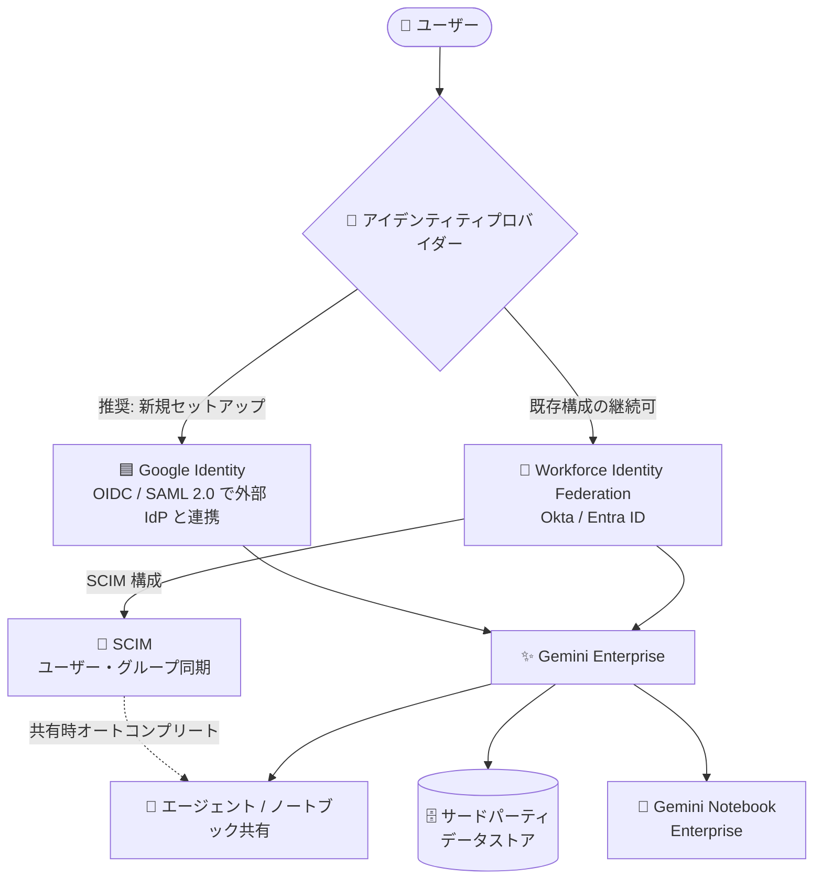

# Gemini Enterprise: アイデンティティ/共有機能の強化 (Okta SCIM オートコンプリートと Google Identity 対応)

**リリース日**: 2026-08-20

**サービス**: Gemini Enterprise / Gemini Notebook Enterprise

**機能**: Okta 利用時の共有オートコンプリート (SCIM) / サードパーティデータストアでの Google Identity サポート

**ステータス**: GA (一般提供)

📊 [このアップデートのインフォグラフィックを見る](https://takech9203.github.io/google-cloud-news-summary/20260820-gemini-enterprise-identity-sharing-enhancements.html)

## 概要

2026 年 8 月 20 日、Gemini Enterprise のアイデンティティ管理と共有体験に関する 2 つの機能が GA (一般提供) となりました。いずれも外部 IdP (Identity Provider) を利用する企業ユーザーの利便性とガバナンスを強化するアップデートです。

1 つ目は **Okta 利用時の共有オートコンプリート**です。Okta を外部 IdP として Workforce Identity Federation と組み合わせて使用している場合、SCIM (System for Cross-domain Identity Management) を構成することで、Gemini Notebook Enterprise のノートブック共有や Gemini Enterprise のエージェント共有時にオートコンプリートが有効になります。ユーザーはメールアドレスやグループ名を完全に入力する代わりに、検索して選択するだけで共有相手を指定できます。

2 つ目は**サードパーティデータストアでの Google Identity サポート**です。Microsoft Entra ID や Okta などの外部 IdP を OIDC または SAML 2.0 で利用している環境でも、サードパーティデータソースへの接続時のアクセス管理に Google Identity を使用できるようになりました。Microsoft 365 のデータ取り込み (ingestion) を除くすべてのサードパーティのフェデレーテッドコネクタと取り込みコネクタが対象です。Google は新規セットアップに Google Identity を推奨しており、既存の Workforce Identity Federation 利用者は現行構成を継続することも可能です。

**アップデート前の課題**

- Okta を IdP とする環境では、ノートブックやエージェントの共有時にメールアドレスやグループ名を完全な形で手入力する必要があった
- サードパーティ IdP (Entra ID、Okta など) を利用する場合、サードパーティデータソースのアクセス管理には Workforce Identity Federation の構成が前提となり、属性マッピングなどの追加設定が必要だった

**アップデート後の改善**

- Okta で SCIM を構成すると、共有ダイアログでユーザーやグループを検索・選択できるオートコンプリートが利用可能になった (GA)
- OIDC / SAML 2.0 対応の外部 IdP を使う環境でも、Google Identity でサードパーティデータストアのアクセス管理ができるようになった (GA)
- 新規セットアップでは Google Identity が推奨となり、アイデンティティ構成の選択肢が明確化された

## アーキテクチャ図



ユーザーは Google Identity (新規推奨) または Workforce Identity Federation (Okta / Entra ID) 経由で Gemini Enterprise にアクセスします。Okta では SCIM を構成することで共有時のオートコンプリートが有効になり、Google Identity はサードパーティデータストアのアクセス管理にも利用できます。

## サービスアップデートの詳細

### 主要機能

1. **Okta SCIM による共有オートコンプリート (GA)**
   - Okta を外部 IdP として Workforce Identity Federation で利用している場合、SCIM を構成できる
   - SCIM 構成により、Gemini Notebook Enterprise のノートブック共有と Gemini Enterprise のエージェント共有でオートコンプリートが有効化
   - ユーザーはメールアドレスやグループ名を完全入力せず、検索して選択するだけで共有先を指定可能
   - Entra ID でも SCIM は同様に提供されており、大量のグループの取得と共有時オートコンプリートに必要

2. **サードパーティデータストアでの Google Identity サポート (GA)**
   - OIDC または SAML 2.0 を使用する外部 IdP (Microsoft Entra ID、Okta など) と組み合わせて、Google Identity でサードパーティデータソースへの接続時のアクセスを管理可能
   - すべてのサードパーティのフェデレーテッドコネクタ (data federation) と取り込みコネクタ (data ingestion) が対象
   - 例外: Microsoft 365 のデータ取り込み (SharePoint、OneDrive、Outlook など) は引き続き Microsoft Entra ID と Workforce Identity Federation が必要
   - 推奨: 新規セットアップにはすべて Google Identity を推奨
   - 既存構成: Workforce Identity Federation を利用中の顧客は現行構成の継続を選択可能

## 技術仕様

### アイデンティティプロバイダーの選択肢

| 項目 | Google Identity | サードパーティ IdP (Workforce Identity Federation) |
|------|-----------------|---------------------------------------------------|
| 位置づけ | 推奨 (新規セットアップ) | 既存構成の継続が可能 |
| Google Workspace データソース | 必須 (Google Identity のみ対応) | 非対応 |
| サードパーティ data federation | 対応 (ユーザーが OAuth で直接認証) | 対応 |
| サードパーティ data ingestion | 対応 (Microsoft 365 を除く) | 対応 |
| Microsoft 365 data ingestion | 非対応 (Entra ID + Workforce Identity Federation が必要) | Entra ID で対応 |
| 外部 IdP との連携要件 | OIDC または SAML 2.0 対応が必要 | OIDC または SAML 2.0 対応が必要 |

### SCIM とオートコンプリートの対応

| IdP | SCIM 構成ガイド | オートコンプリート |
|-----|----------------|-------------------|
| Okta | [Configure SCIM in Okta](https://docs.cloud.google.com/iam/docs/configure-scim-okta) | 対応 (今回 GA) |
| Microsoft Entra ID | [Configure SCIM in Microsoft Entra ID](https://docs.cloud.google.com/iam/docs/configure-scim-ms-entra) | 対応 |

### Workforce Identity Federation の属性マッピング (Okta の例)

```text
# Okta (OIDC プロトコル) の例: メールアドレスでユーザーを一意に識別
google.subject=assertion.email.lowerAscii()
google.groups=assertion.groups

# Okta (SAML プロトコル) の例
google.subject=assertion.subject.lowerAscii()
google.groups=assertion.attributes['groups']
```

- `google.subject` は属性マッピング、ライセンス割り当て、ノートブック共有に使用される。ライセンス割り当ては大文字小文字を区別するため、小文字のメールアドレスへのマッピングが推奨
- 組織に複数の一意識別子がある場合は `attribute.as_user_identifier_1` 〜 `attribute.as_user_identifier_50` でマッピング可能

## 設定方法

### 前提条件

1. 管理者に必要な権限を付与済みであること
2. ユーザーに Gemini Enterprise User (`roles/discoveryengine.agentspaceUser`) ロールを付与すること
3. Google Identity を使用する場合: 組織で使用する一意のユーザー属性 (通常はメールアドレス) を決定しておくこと。複数のメールアドレスを持つユーザーにはメールエイリアスの追加が必要
4. サードパーティ IdP を使用する場合: Workforce Identity Federation を事前に構成しておくこと

### 手順

#### ステップ 1: アイデンティティプロバイダーの接続

1. Google Cloud コンソールで Gemini Enterprise ページに移動
2. **Settings > Authentication** をクリック
3. 更新するロケーションの **Add identity provider** をクリック
4. アイデンティティプロバイダーの種類を選択 (**3rd party identity** を選択した場合は、データソースに適用する workforce pool も選択)
5. **Save changes** をクリック

#### ステップ 2: Okta で SCIM を構成 (オートコンプリートを有効化する場合)

[Configure SCIM in Okta](https://docs.cloud.google.com/iam/docs/configure-scim-okta) の手順に従い、Okta と Google Cloud 間で SCIM によるユーザー・グループの同期を設定します。構成後、ノートブックやエージェントの共有時にユーザー・グループのオートコンプリートが利用できます。

## メリット

### ビジネス面

- **共有時のユーザー体験向上**: メールアドレスの完全入力が不要になり、誤入力による共有ミスのリスクを低減。組織内でのエージェント・ノートブックの共有と活用が促進される
- **アイデンティティ戦略の簡素化**: 外部 IdP を使い続けながら Google Identity でアクセス管理を統一でき、新規導入時の設計判断が明確になる

### 技術面

- **SCIM による標準ベースのディレクトリ同期**: Okta のユーザー・グループ情報が標準プロトコルで同期され、共有 UI での検索に活用できる
- **幅広いコネクタ対応**: Google Identity は Microsoft 365 data ingestion を除くすべてのサードパーティのフェデレーテッド/取り込みコネクタに対応

## デメリット・制約事項

### 制限事項

- Microsoft 365 データソース (SharePoint、OneDrive、Outlook など) を data ingestion で接続する場合は、引き続き Microsoft Entra ID と Workforce Identity Federation が必要
- Google Identity と外部 IdP を組み合わせる場合、IdP が OIDC または SAML 2.0 に対応している必要がある
- Gemini Enterprise でサポートされるロケーションごとに選択できるアイデンティティプロバイダーの種類は 1 つ
- ドキュメントあたりの閲覧者 (プリンシパル) は 3,000 まで
- アクセス制御ありのデータソース設定はデータストア作成時のみ指定可能で、既存データストアでは変更不可

### 考慮すべき点

- **アイデンティティプロバイダーを変更するとユーザーのチャット履歴は失われる** (履歴は元の IdP のユーザー ID に紐づいており、切り替え後は復元不可)
- Google Identity とサードパーティ IdP 間の切り替え、または Workforce Identity Federation プールの変更を行うと、data ingestion を使用する既存のデータストアは自動更新されず、**削除して再作成が必要**
- 同一 Workforce Identity Federation プール内でのプロバイダー変更 (例: Okta から Entra ID) や属性マッピングの編集はデータストア再作成不要

## ユースケース

### ユースケース 1: Okta を全社 IdP とする企業でのエージェント共有の促進

**シナリオ**: 全社の SSO を Okta で統一している企業が、Gemini Enterprise で作成したカスタムエージェントや Notebook Enterprise のノートブックをチーム間で共有したい。従来は共有相手のメールアドレスを正確に手入力する必要があり、共有のハードルになっていた。

**実装例**:
```text
1. Okta で Workforce Identity Federation を構成 (構成済みの場合はスキップ)
2. Configure SCIM in Okta の手順で SCIM プロビジョニングを設定
3. ユーザーは共有ダイアログで名前やグループ名の一部を入力して検索・選択
```

**効果**: 共有先の指定が数クリックで完了し、誤共有のリスクを低減しながらナレッジ共有を促進できる。

### ユースケース 2: Entra ID 利用企業の新規 Gemini Enterprise 導入

**シナリオ**: Microsoft Entra ID を IdP として利用中の企業が、Gemini Enterprise を新規導入し、Confluence や Jira などのサードパーティデータソースを接続したい。

**効果**: Google の推奨に従い Google Identity を選択することで、Workforce Identity Federation の属性マッピングなどの構成を行わずにサードパーティデータストアのアクセス管理が可能。Entra ID とは OIDC / SAML 2.0 で連携できる。ただし SharePoint など Microsoft 365 の data ingestion が必要な場合は Entra ID + Workforce Identity Federation を併用する。

## 関連サービス・機能

- **Workforce Identity Federation**: 外部 IdP のユーザーを Google Cloud で認証するための IAM 機能。Okta / Entra ID との連携と SCIM 構成の基盤
- **Gemini Notebook Enterprise**: ノートブック共有時のオートコンプリートが本アップデートの対象
- **Cloud IAM**: Gemini Enterprise User ロール (`roles/discoveryengine.agentspaceUser`) の付与によるアクセス制御
- **Cloud Audit Logs**: Security Token Service API のデータアクセス監査ログで Workforce Identity Federation のサインインと属性マッピングを検証可能

## 参考リンク

- 📊 [インフォグラフィック](https://takech9203.github.io/google-cloud-news-summary/20260820-gemini-enterprise-identity-sharing-enhancements.html)
- [公式リリースノート](https://docs.cloud.google.com/release-notes#August_20_2026)
- [Configure identity provider (Gemini Enterprise)](https://docs.cloud.google.com/gemini/enterprise/docs/configure-identity-provider)
- [Set up Gemini Notebook Enterprise](https://docs.cloud.google.com/gemini/enterprise/notebooklm-enterprise/docs/set-up-notebooklm#before_you_begin)
- [Autocomplete for user emails and group names](https://docs.cloud.google.com/gemini/enterprise/notebooklm-enterprise/docs/share-notebooks#autocomplete)
- [Share an agent](https://docs.cloud.google.com/gemini/enterprise/docs/agent-designer/share-agent)
- [Configure Workforce Identity Federation with Okta and sign in users](https://docs.cloud.google.com/iam/docs/workforce-sign-in-okta)
- [Configure SCIM in Okta](https://docs.cloud.google.com/iam/docs/configure-scim-okta)

## まとめ

Gemini Enterprise のアイデンティティ管理が大きく前進し、Okta 環境では SCIM による共有オートコンプリートが、サードパーティデータストアでは Google Identity によるアクセス管理が GA となりました。新規導入では Google Identity を第一候補とし、Okta を利用中の組織は SCIM を構成して共有体験を改善することを推奨します。既存の Workforce Identity Federation 構成からの移行を検討する場合は、チャット履歴の消失とデータストア再作成の影響を事前に評価してください。

---

**タグ**: Gemini Enterprise, Gemini Notebook Enterprise, Google Identity, Okta, SCIM, Workforce Identity Federation, アイデンティティ管理, GA
