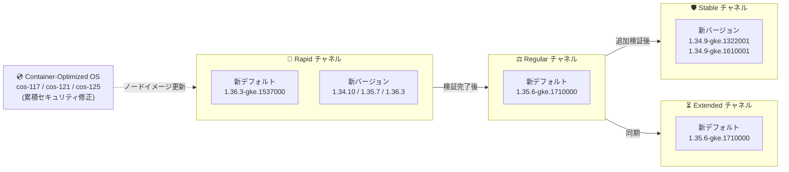

# Google Kubernetes Engine (GKE): バージョンアップデート 2026-R35

**リリース日**: 2026-08-20

**サービス**: Google Kubernetes Engine (GKE)

**機能**: クラスタバージョンの更新とセキュリティアップデート (2026-R35)

**ステータス**: Change + Security (Version Update / Security Update)

📊 [このアップデートのインフォグラフィックを見る](https://takech9203.github.io/google-cloud-news-summary/20260820-gke-version-updates-2026-r35.html)

## 概要

Google Kubernetes Engine (GKE) の全リリースチャネル (Rapid, Regular, Stable, Extended, No channel) において、クラスタバージョンが更新された。今回の 2026-R35 アップデートでは、Rapid チャネルのデフォルトバージョンが 1.36.3-gke.1537000 に、Regular / Extended / No channel のデフォルトバージョンが 1.35.6-gke.1710000 にそれぞれ更新された。Rapid チャネルには 1.34.10-gke.1236000 / 1.35.7-gke.1222000 / 1.36.3-gke.1640000 の新パッチが、Stable チャネルには 1.34.9-gke.1322001 / 1.34.9-gke.1610001 が追加されている。

セキュリティアップデート (2026-R35) として、更新された Container-Optimized OS イメージを使用する新しい GKE バージョンもリリースされた。これらのイメージは前回の GKE リリース以降に公開されたすべての Container-Optimized OS のセキュリティ修正を累積的に含んでおり、cos-117 / cos-121 / cos-125 の 3 マイルストーンのイメージが更新対象となっている。このアップデートは、GKE クラスタを運用するすべてのプラットフォーム管理者およびインフラエンジニアに影響する。

**アップデート前の課題**

- 前回 (2026-R34) までのバージョンには、直近の Container-Optimized OS セキュリティ修正が含まれていなかった
- Regular / Extended / No channel のデフォルトは旧パッチ (1.35.6-gke.1641000) のままであり、最新の修正が新規クラスタに標準適用されていなかった
- Rapid チャネルのデフォルトは 1.35 系のままで、1.36 系が新規クラスタの標準にはなっていなかった

**アップデート後の改善**

- Rapid チャネルのデフォルトが 1.36.3-gke.1537000 に更新され、新規クラスタで Kubernetes 1.36 系が標準になった
- Regular / Extended / No channel のデフォルトが 1.35.6-gke.1710000 に更新され、新規クラスタに新しいパッチが標準で適用されるようになった
- 累積的なセキュリティ修正を含む Container-Optimized OS イメージ (cos-117 / cos-121 / cos-125) が 1.31 〜 1.34 系の新バージョンに適用され、ノード OS の脆弱性リスクが低減された

## アーキテクチャ図



GKE のリリースチャネルは、Rapid で導入されたバージョンが検証を経て Regular、Stable へと段階的に展開されるパイプラインとして機能する。今回は Rapid チャネルのデフォルトが 1.36 系に引き上げられ、新しい Container-Optimized OS イメージによるセキュリティ修正が各バージョンに組み込まれた。

## サービスアップデートの詳細

### チャネル別バージョン一覧

| チャネル | デフォルトバージョン | 新規追加バージョン | 非推奨バージョン (90 日以内に削除) |
|---------|---------------------|-------------------|-----------------|
| Rapid | 1.36.3-gke.1537000 (新デフォルト) | 1.34.10-gke.1236000, 1.35.7-gke.1222000, 1.36.3-gke.1640000 | 1.33.13-gke.1414000, 1.33.13-gke.1462000 (1.34.10-gke.1079000, 1.35.7-gke.1027000, 1.36.2-gke.2064000 は提供終了) |
| Regular | 1.35.6-gke.1710000 (新デフォルト) | 1.34.9-gke.1655001, 1.34.10-gke.1079000, 1.35.7-gke.1027000 | 1.34.9-gke.1610000, 1.34.9-gke.1655000 (1.33.13-gke.1269000, 1.33.13-gke.1329000, 1.35.6-gke.1641000 は提供終了) |
| Stable | 変更なし | 1.34.9-gke.1322001, 1.34.9-gke.1610001 | 1.33.13-gke.1101000, 1.33.13-gke.1109000, 1.34.9-gke.1322000 (1.34.9-gke.1065000 は提供終了) |
| Extended | 1.35.6-gke.1710000 (新デフォルト) | 1.31.14-gke.2543000, 1.31.14-gke.2613000, 1.32.13-gke.2231000, 1.32.13-gke.2314000, 1.33.13-gke.1499000, 1.34.9-gke.1655001, 1.34.10-gke.1079000, 1.35.7-gke.1027000 | 1.31.14-gke.2437000, 1.31.14-gke.2579000, 1.32.13-gke.2137000, 1.32.13-gke.2268000, 1.34.9-gke.1610000, 1.34.9-gke.1655000 (1.35.6-gke.1641000 は提供終了) |
| No channel (非推奨) | 1.35.6-gke.1710000 (新デフォルト) | 1.34.9-gke.1322001, 1.34.9-gke.1610001, 1.34.9-gke.1655001, 1.34.10-gke.1236000, 1.35.7-gke.1222000, 1.36.3-gke.1640000 (ノード版はさらに 1.31.14-gke.2613000, 1.32.13-gke.2314000, 1.33.13-gke.1499000) | 1.33.13-gke.1101000, 1.33.13-gke.1109000, 1.33.13-gke.1414000, 1.33.13-gke.1462000, 1.34.9-gke.1322000, 1.34.9-gke.1610000, 1.34.9-gke.1655000, 1.35.6-gke.1258000, 1.36.2-gke.1498000 (1.33.13-gke.1269000, 1.33.13-gke.1329000 は提供終了) |

### 自動アップグレードターゲット

各チャネルで、対象マイナーバージョンのクラスタに新しい自動アップグレードターゲットが設定された。

**Rapid チャネル (マイナーバージョンアップグレード)**

| 現在のマイナーバージョン | アップグレード先 |
|------------------------|------------------|
| 1.33 | 1.34.10-gke.1106000 |
| 1.34 | 1.35.7-gke.1150000 |
| 1.35 | 1.36.3-gke.1537000 |

**Regular チャネル (マイナーバージョンアップグレード)**

| 現在のマイナーバージョン | アップグレード先 |
|------------------------|------------------|
| 1.33 | 1.34.9-gke.1655001 |
| 1.34 | 1.35.6-gke.1710000 |

**Stable / No channel (マイナーバージョンアップグレード)**

| 現在のマイナーバージョン | アップグレード先 |
|------------------------|------------------|
| 1.33 | 1.34.9-gke.1322001 |

**Extended チャネル (マイナーバージョンアップグレード)**

| 現在のマイナーバージョン | アップグレード先 |
|------------------------|------------------|
| 1.30 | 1.31.14-gke.2456000 |

メンテナンス除外や非推奨 API の使用などマイナーアップグレードを妨げる要因がある場合は、同一マイナーバージョン内の新パッチへ自動アップグレードされる (例: Regular チャネルの 1.34 系は 1.34.9-gke.1655001、1.35 系は 1.35.6-gke.1710000 へ。Extended チャネルは 1.31 系が 1.31.14-gke.2456000、1.32 系が 1.32.13-gke.2175000 へ)。

### セキュリティアップデート (2026-R35)

新しい GKE バージョンでは、更新された Container-Optimized OS イメージが使用される。これらのイメージは前回の GKE リリース以降のセキュリティ修正を累積的に含む。

| GKE バージョン | Container-Optimized OS バージョン |
|---------------|----------------------------------|
| 1.31.14-gke.2613000 | cos-117-18613-675-48 |
| 1.32.13-gke.2314000 | cos-121-18867-528-43 |
| 1.33.13-gke.1499000 | cos-121-18867-528-43 |
| 1.34.10-gke.1236000 | cos-125-19216-532-62 |

解決された個別の脆弱性は、各 Container-Optimized OS イメージのセキュリティリリースノートで確認できる。

### 主要な変更点

1. **Rapid チャネルのデフォルトが Kubernetes 1.36 系に更新**
   - 新規クラスタ作成時のデフォルトが 1.36.3-gke.1537000 になり、Rapid チャネルで 1.36 系が標準に
   - 新パッチ 1.34.10-gke.1236000 / 1.35.7-gke.1222000 / 1.36.3-gke.1640000 も追加

2. **Regular / Extended / No channel のデフォルトが 1.35.6-gke.1710000 に更新**
   - 前回デフォルトの 1.35.6-gke.1641000 は提供終了となり、新規クラスタには新パッチが標準適用

3. **Stable チャネルに 1.34.9 系の新パッチを追加、1.33.13 系旧パッチが非推奨化**
   - 1.34.9-gke.1322001 / 1.34.9-gke.1610001 が追加
   - 1.33.13-gke.1101000 / 1.33.13-gke.1109000 / 1.34.9-gke.1322000 は非推奨となり 90 日以内に削除

4. **Container-Optimized OS のセキュリティ修正を累積適用**
   - cos-117 (M117) / cos-121 (M121) / cos-125 (M125) の 3 マイルストーンのイメージを更新
   - 1.31 〜 1.34 系の新バージョンにそれぞれ適用

## 技術仕様

### バージョンロールアウトの注意点

- リリースノート公開時点でロールアウトは進行中であり、全ゾーンへの展開完了まで数日を要する場合がある
- 非推奨バージョンは 90 日後、またはサポート終了時のいずれか早い時点で削除される
- Rapid チャネルのバージョンは GKE SLA の対象外

## 設定方法

### 前提条件

1. Google Cloud プロジェクトで GKE API が有効であること
2. `gcloud` CLI がインストール・認証済みであること
3. クラスタに対する適切な IAM 権限 (`container.admin` ロールなど) を保持していること

### 手順

#### ステップ 1: 現在のクラスタバージョンとチャネルを確認

```bash
gcloud container clusters list \
  --format="table(name,location,currentMasterVersion,releaseChannel.channel)"
```

#### ステップ 2: 利用可能なバージョンを確認

```bash
gcloud container get-server-config \
  --flatten="channels" \
  --filter="channels.channel=REGULAR" \
  --format="yaml(channels.channel,channels.defaultVersion,channels.validVersions)" \
  --location=asia-northeast1
```

#### ステップ 3: 手動アップグレード (必要な場合)

```bash
# コントロールプレーンのアップグレード
gcloud container clusters upgrade CLUSTER_NAME \
  --master \
  --cluster-version=1.35.6-gke.1710000 \
  --location=LOCATION

# ノードプールのアップグレード
gcloud container clusters upgrade CLUSTER_NAME \
  --node-pool=NODE_POOL_NAME \
  --cluster-version=1.35.6-gke.1710000 \
  --location=LOCATION
```

## メリット

### ビジネス面

- **セキュリティリスクの低減**: 累積的なセキュリティ修正を含む Container-Optimized OS イメージへの更新により、ノード OS の脆弱性露出時間を短縮
- **運用コストの削減**: 自動アップグレードにより、手動でのバージョン管理・パッチ適用作業が不要

### 技術面

- **最新パッチの標準適用**: Regular / Extended / No channel のデフォルトが 1.35.6-gke.1710000 に更新され、新規クラスタに標準適用
- **次期バージョンの標準化**: Rapid チャネルのデフォルトが 1.36.3-gke.1537000 になり、Kubernetes 1.36 系の検証を新規クラスタで即座に開始可能
- **累積的なセキュリティ修正**: COS イメージは前回リリース以降の修正をすべて含むため、途中のパッチをスキップしても最新のセキュリティ状態に到達可能

## デメリット・制約事項

### 制限事項

- ロールアウトは段階的に行われるため、一部のゾーンでは新バージョンがまだ利用できない場合がある
- コントロールプレーンのマイナーバージョンのスキップアップグレードは不可 (1 バージョンずつ順次アップグレードが必要)
- Extended チャネルの拡張サポート期間中はセキュリティパッチのみ提供 (新機能追加なし)

### 考慮すべき点

- Stable チャネルで非推奨となった 1.33.13-gke.1101000 / 1.33.13-gke.1109000 / 1.34.9-gke.1322000 を使用中の場合、90 日以内に削除されるため移行計画を早期に策定すること
- Rapid チャネルの 1.35 系クラスタは 1.36.3-gke.1537000 への自動アップグレード対象となるため、Kubernetes 1.36 の非推奨 API への対応状況を事前に確認すること
- Extended チャネルの 1.30 系クラスタは 1.31.14-gke.2456000 への自動アップグレード対象となる
- ノードのバージョンスキューポリシー (コントロールプレーンとノードの差は最大 2 マイナーバージョン) に注意

## ユースケース

### ユースケース 1: セキュリティ修正の迅速な適用

**シナリオ**: セキュリティポリシーにより、ノード OS の脆弱性修正を速やかに適用する必要があるプロダクションクラスタを運用している。

**実装例**:
```bash
# 該当ノードプールを COS 更新済みバージョンへ手動アップグレード
gcloud container clusters upgrade my-prod-cluster \
  --node-pool=default-pool \
  --cluster-version=1.33.13-gke.1499000 \
  --location=asia-northeast1
```

**効果**: cos-121-18867-528-43 の累積セキュリティ修正が適用されたノードイメージに更新され、脆弱性の露出時間を最小化できる。

### ユースケース 2: 非推奨バージョンからの計画的移行

**シナリオ**: Stable チャネルで 1.34.9-gke.1322000 を使用しており、90 日以内の削除に備えて移行が必要。

**実装例**:
```bash
# Stable チャネルの後継パッチへアップグレード
gcloud container clusters upgrade my-cluster \
  --master \
  --cluster-version=1.34.9-gke.1322001 \
  --location=us-central1
```

**効果**: 削除期限前に計画的にアップグレードすることで、強制アップグレードによる予期しない業務影響を回避できる。

## 料金

GKE のバージョンアップデート自体には追加料金は発生しない。

| 項目 | 料金 |
|------|------|
| GKE クラスタ管理費 (Standard) | $0.10 / クラスタ / 時間 |
| GKE クラスタ管理費 (Autopilot) | 管理費無料 (Pod リソース課金) |
| Extended サポート追加料金 | 拡張サポート期間に入ったクラスタに追加費用が発生 |
| ノードのコンピューティング費用 | 通常の Compute Engine 料金 |

詳細は [GKE 料金ページ](https://cloud.google.com/kubernetes-engine/pricing) を参照。

## 利用可能リージョン

GKE バージョンアップデートは全リージョンで利用可能。ただし、新バージョンのロールアウトはゾーンごとに段階的に行われ、完了まで数日を要する場合がある。

```bash
gcloud container get-server-config --location=LOCATION
```

## 関連サービス・機能

- **Container-Optimized OS**: GKE ノードの OS イメージ。今回のセキュリティアップデートの中核であり、GKE バージョンと連動して更新される
- **Cloud Monitoring / Cloud Logging**: クラスタのアップグレード状態やイベントの監視・記録
- **GKE Security Posture**: クラスタのセキュリティ状態の継続的評価とバージョン推奨
- **GKE Rollout Sequencing**: 複数クラスタ間でのバージョンロールアウトの順序制御

## 参考リンク

- 📊 [このアップデートのインフォグラフィック](https://takech9203.github.io/google-cloud-news-summary/20260820-gke-version-updates-2026-r35.html)
- [公式リリースノート](https://docs.cloud.google.com/release-notes#August_20_2026)
- [GKE リリースノート](https://docs.cloud.google.com/kubernetes-engine/docs/release-notes)
- [GKE バージョニングとサポート](https://docs.cloud.google.com/kubernetes-engine/versioning)
- [リリースチャネルの概要](https://docs.cloud.google.com/kubernetes-engine/docs/concepts/release-channels)
- [クラスタアップグレードのベストプラクティス](https://docs.cloud.google.com/kubernetes-engine/docs/best-practices/upgrading-clusters)
- [Container-Optimized OS リリースノート (M125)](https://docs.cloud.google.com/container-optimized-os/docs/release-notes/m125)
- [料金ページ](https://cloud.google.com/kubernetes-engine/pricing)

## まとめ

GKE 2026-R35 アップデートにより、Rapid チャネルのデフォルトバージョンが 1.36.3-gke.1537000 に、Regular / Extended / No channel のデフォルトが 1.35.6-gke.1710000 に更新され、Stable チャネルには 1.34.9 系の新パッチが追加された。あわせて累積的なセキュリティ修正を含む Container-Optimized OS イメージ (cos-117 / cos-121 / cos-125) が 1.31 〜 1.34 系の新バージョンに適用されている。クラスタ管理者は、非推奨となった 1.33.13 系旧パッチ (Rapid / Stable) や 1.34.9 系旧パッチからの移行計画を早期に策定し、メンテナンスウィンドウの設定を確認したうえで、セキュリティ修正済みバージョンへの計画的なアップグレードを推奨する。

---

**タグ**: #GKE #Kubernetes #VersionUpdate #SecurityUpdate #ReleaseChannel #ContainerOptimizedOS #2026-R35
