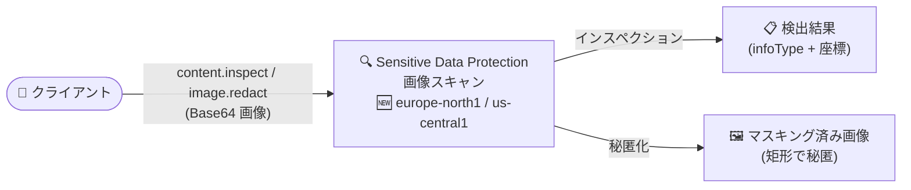

# Sensitive Data Protection: 画像スキャンのリージョン拡大 (europe-north1、us-central1)

**リリース日**: 2026-08-20

**サービス**: Sensitive Data Protection

**機能**: 画像スキャン (インスペクション / 秘匿化) の利用可能リージョン拡大

**ステータス**: 一般提供 (リージョン拡大)

📊 [このアップデートのインフォグラフィックを見る](https://takech9203.github.io/google-cloud-news-summary/20260820-sensitive-data-protection-image-scanning-regions.html)

## 概要

Sensitive Data Protection の画像スキャン機能が、新たに **europe-north1 (フィンランド)** と **us-central1 (アイオワ)** の 2 リージョンで利用可能になりました。画像スキャンは、Base64 エンコードされた画像内の機密データ (infoType) を検出する「インスペクション」と、検出箇所を不透明な矩形でマスキングする「秘匿化 (Redaction)」の 2 つの操作を提供します。

これまで画像スキャンはグローバル、マルチリージョン (asia / europe / us) と一部の単一リージョンに限定されていました。今回の拡大により、北欧および米国中部にデータレジデンシー要件を持つ組織でも、データを他リージョンに移動させることなく画像内の機密データ検出・秘匿化を実行できます。なお、両リージョンはリージョナルエンドポイントにも対応しており、転送中データを特定ロケーション内に留める要件にも対応できます。

**アップデート前の課題**

- europe-north1、us-central1 では画像スキャンが利用できず、これらのリージョンで画像や画像を含むドキュメントを検査しようとすると、バイナリファイルとして処理されていた
- 回避策として、サンプリング設定で対象ファイルをスキップするか、ディスカバリでフォールバックロケーションを設定する必要があった
- 北欧・米国中部のデータレジデンシー要件がある場合、画像スキャンをリージョン内で完結させることができなかった

**アップデート後の改善**

- europe-north1 と us-central1 で画像のインスペクションと秘匿化がネイティブに実行可能になった
- 画像を含むデータをリージョン外に出さずに処理でき、データレジデンシー要件への対応が容易になった
- 画像スキャン対応ロケーションは global、asia、asia-southeast1、europe、europe-north1、us、us-central1、us-east4、us-west1 の 9 つに拡大した

## アーキテクチャ図

クライアントが送信した画像を、新たに対応した europe-north1 / us-central1 を含むリージョン内で検査し、機密データの位置情報またはマスキング済み画像を返します。

## サービスアップデートの詳細

### 主要機能

1. **画像インスペクション**
   - Base64 エンコードされた画像を `content.inspect` リクエストで送信し、指定した infoType に一致する機密データを検出
   - 検出した infoType と、機密データ箇所を示すバウンディングボックス (ピクセル座標と寸法) を返却

2. **画像秘匿化 (Redaction)**
   - 検出した機密データを不透明な矩形でマスキングし、元と同じ画像フォーマットの Base64 エンコード画像を返却
   - 秘匿化に使う矩形の色はリクエストで設定可能

3. **リージョナルエンドポイント対応**
   - europe-north1、us-central1 はいずれもリージョナルエンドポイントをサポート
   - 転送中データを特定ロケーション内に留める必要がある場合に利用可能

## 技術仕様

### 画像スキャン対応ロケーション (今回の拡大後)

| ロケーション | 種別 | 備考 |
|------|------|------|
| global | グローバル | |
| asia | マルチリージョン | |
| asia-southeast1 | 単一リージョン (シンガポール) | |
| europe | マルチリージョン | |
| **europe-north1** | 単一リージョン (フィンランド) | 🆕 今回追加 |
| us | マルチリージョン | |
| **us-central1** | 単一リージョン (アイオワ) | 🆕 今回追加 |
| us-east4 | 単一リージョン (北バージニア) | |
| us-west1 | 単一リージョン (オレゴン) | |

### 非対応リージョンでの動作

- 画像スキャンに対応していないリージョンで画像 (または画像を含むドキュメント) を検査すると、バイナリファイルとしてスキャンされる
- インスペクション操作では、サンプリングを有効にして対象ファイルをスキップするよう構成可能
- ディスカバリ操作では、画像・ドキュメント処理用のフォールバックロケーションを設定可能

## メリット

### ビジネス面

- **データレジデンシー対応の強化**: 北欧 (フィンランド) と米国中部 (アイオワ) にデータを保持する組織が、画像内の機密データ処理をリージョン内で完結できる
- **コンプライアンス負荷の軽減**: 画像スキャンのためだけにデータを他ロケーションへ移動・複製する運用が不要になる

### 技術面

- **回避策の削減**: 非対応リージョン向けのサンプリング設定やフォールバックロケーション設定が、これらのリージョンでは不要になる
- **リージョナルエンドポイント対応**: 転送中データのロケーション制約がある環境でも利用可能

## デメリット・制約事項

### 制限事項

- 画像スキャンは引き続き上記 9 ロケーション限定であり、東京 (asia-northeast1) など他の多くのリージョンでは未対応
- 非対応リージョンでは画像はバイナリファイルとして扱われるため、画像内の機密データは検出されない

### 考慮すべき点

- ディスカバリでインスペクションテンプレートを使う場合、テンプレートはデータと同じリージョン (または global) に保存されている必要がある

## 料金

今回のアップデートによる料金体系の変更はありません。Sensitive Data Protection の料金は公式の料金ページを参照してください。

- 料金ページ: https://cloud.google.com/sensitive-data-protection/pricing

## 利用可能リージョン

今回追加されたリージョン:

- europe-north1 (フィンランド)
- us-central1 (アイオワ)

対応ロケーションの全一覧は [Locations that support image scanning](https://docs.cloud.google.com/sensitive-data-protection/docs/locations#locations_that_support_image_scanning) を参照してください。

## 関連サービス・機能

- **Cloud Storage / BigQuery**: ストレージインスペクション機能により、これらのサービスに保存されたデータ (画像を含むファイル) の検査が可能
- **センシティブデータディスカバリ (データプロファイル)**: 画像・ドキュメントの処理にフォールバックロケーションを設定でき、非対応リージョンのデータも扱える
- **Assured Workloads**: データレジデンシー要件への対応と組み合わせて利用されることが多い

## 参考リンク

- 📊 [インフォグラフィック](https://takech9203.github.io/google-cloud-news-summary/20260820-sensitive-data-protection-image-scanning-regions.html)
- [公式リリースノート](https://docs.cloud.google.com/release-notes#August_20_2026)
- [Sensitive Data Protection のロケーション](https://docs.cloud.google.com/sensitive-data-protection/docs/locations)
- [画像のインスペクションと秘匿化の概念](https://docs.cloud.google.com/sensitive-data-protection/docs/concepts-image-redaction)
- [料金ページ](https://cloud.google.com/sensitive-data-protection/pricing)

## まとめ

Sensitive Data Protection の画像スキャンが europe-north1 と us-central1 に拡大し、北欧・米国中部でのデータレジデンシー要件下でも画像内の機密データ検出・秘匿化がリージョン内で完結できるようになりました。該当リージョンでフォールバックロケーションやサンプリングによる回避策を使っていた場合は、設定の見直しを推奨します。

---

**タグ**: Sensitive Data Protection, DLP, 画像スキャン, リージョン拡大, データレジデンシー, europe-north1, us-central1
