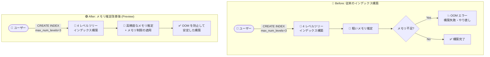

# AlloyDB for PostgreSQL: ScaNN 4 レベルツリーインデックス構築時のメモリ使用量推定の改善と OOM 防止

**リリース日**: 2026-08-21

**サービス**: AlloyDB for PostgreSQL

**機能**: ScaNN 4 レベルツリーインデックス構築時のメモリ使用量推定改善・OOM エラー防止

**ステータス**: Preview

📊 [このアップデートのインフォグラフィックを見る](https://takech9203.github.io/google-cloud-news-summary/20260821-alloydb-scann-index-memory-estimation.html)

## 概要

AlloyDB for PostgreSQL で、ScaNN の 4 レベルツリーインデックス (four-level tree index) を構築する際のメモリ使用量推定がより正確になり、Out-of-Memory (OOM) エラーを防止する改善が Preview として提供されました。メモリ制限の適用 (enforcing memory limits) と、メモリが制約された状況下でのメモリ推定の改善により、インデックス構築の安定性が向上します。

ScaNN インデックスは Google 製のツリーベース量子化インデックスで、近似最近傍探索 (ANN) に使用されます。HNSW と比較してインデックス構築時間が短く、メモリフットプリントが小さく、ワークロードによってはより高い QPS を実現します。4 レベルツリーインデックス (`max_num_levels = 3`) は Preview 機能であり、大規模なベクトルデータセット向けの構成です (ScaNN インデックス自体は最大 100 億ベクトル規模までスケールします)。

大規模データセットに対する多階層インデックスの構築はメモリ集約的な処理であり、並列ワーカーも自動的に起動されるため、メモリの見積もりが不正確だと構築途中で OOM エラーが発生するリスクがありました。今回の改善は、ベクトル検索を大規模に運用するデータベース管理者や、AlloyDB AI で RAG・セマンティック検索基盤を構築するエンジニアにとって、インデックス構築の信頼性を高めるアップデートです。

**アップデート前の課題**

- 4 レベルツリーインデックスのような大規模なインデックス構築では、メモリ使用量の推定精度が十分でなく、メモリが制約された環境で構築中に OOM エラーが発生する可能性があった
- OOM を避けるために、ユーザー側で `maintenance_work_mem` や `shared_buffers` の調整といった慎重なメモリ管理が求められていた
- インデックス構築が途中で失敗すると、時間のかかる構築処理をやり直す必要があった

**アップデート後の改善**

- インデックス構築前・構築中のメモリ使用量推定がより正確になり、必要メモリの見積もり精度が向上した
- メモリ制限が適用 (enforce) されるようになり、4 レベルツリーインデックス構築時の OOM エラーが防止される
- メモリが制約された状況下でもインデックス構築の安定性が向上し、大規模データセットに対するインデックス構築を安心して実行できるようになった

## アーキテクチャ図



従来はメモリ制約下での推定が不正確なために構築中に OOM エラーが発生し得ましたが、今回の改善により、高精度なメモリ推定とメモリ制限の適用によって 4 レベルツリーインデックスの構築が安定して完了するようになります。

## サービスアップデートの詳細

### 主要機能

1. **メモリ使用量推定の高精度化**
   - ScaNN 4 レベルツリーインデックス構築時のメモリ使用量をより正確に推定
   - 特にメモリが制約された条件下 (constrained conditions) での推定精度が改善

2. **メモリ制限の適用による OOM 防止**
   - インデックス構築時にメモリ制限を適用 (enforce) し、OOM エラーの発生を防止
   - インデックス構築処理の安定性が向上し、構築失敗によるやり直しリスクを低減

3. **4 レベルツリーインデックス (Preview) の実用性向上**
   - `max_num_levels = 3` で作成する 4 レベルの K-means クラスタリングツリーによる大規模データセット向けインデックスが、より安定して構築可能に

## 技術仕様

### ScaNN インデックスのツリーレベル

| `max_num_levels` の値 | インデックス構成 | 提供ステータス |
|------|------|------|
| 1 | 2 レベルインデックス | GA |
| 2 | 3 レベルインデックス | GA |
| 3 | 4 レベルインデックス | **Preview** (今回の改善対象) |

### ツリーレベル選択の目安 (公式ドキュメントより)

| ベクトル行数 | 推奨インデックス |
|------|------|
| 1,000 万行未満 | 2 レベルインデックス |
| 1,000 万〜1 億行 | 構築時間優先なら 3 レベル、検索リコール優先なら 2 レベル |
| 1 億行超 | 3 レベルインデックス |

ScaNN インデックスは最大 100 億ベクトル規模までスケールし、4 レベルツリー (Preview) はさらに大規模なデータセット向けの構成として提供されています。

### メモリ関連の考慮事項

- インデックス生成時の問題を避けるため、`maintenance_work_mem` と `shared_buffers` はマシンの合計メモリより小さい値に設定する必要があります
- 3 レベル・4 レベルの ScaNN インデックス作成時や、データが 1 億行を超える場合、AlloyDB は並列ワーカーを自動的に起動することがあります。並列処理は `max_parallel_maintenance_workers`、`max_parallel_workers`、`min_parallel_table_scan_size` で調整できます

## 設定方法

### 前提条件

1. `vector` および `alloydb_scann` 拡張機能がインストールされていること

   ```sql
   CREATE EXTENSION IF NOT EXISTS alloydb_scann CASCADE;
   ```

2. 埋め込みベクトルがテーブルに格納されていること
3. 4 レベルツリーインデックスは Preview 機能のため、事前に有効化が必要

### 手順

#### ステップ 1: Preview 機能の有効化

以下のいずれかの方法で 4 レベルツリーインデックスを有効化します。

```sql
-- 方法 1: セッションレベルで設定
SET scann.max_allowed_num_levels = 3;
```

```bash
# 方法 2: インスタンスレベルでデータベースフラグを設定
gcloud alloydb instances update INSTANCE_ID \
  --cluster=CLUSTER_ID \
  --region=REGION \
  --database-flags=scann.enable_preview_features=on
```

#### ステップ 2: 4 レベルツリーインデックスの作成

```sql
CREATE INDEX my_scann_index ON my_table
  USING scann (embedding_column cosine)
  WITH (mode='MANUAL',
        num_leaves=NUM_LEAVES_VALUE,
        quantizer='SQ8',
        max_num_levels = 3);
```

- `num_leaves`: パーティション数 (1〜3,000 万の範囲で設定)
- `quantizer`: `SQ8` (デフォルト、性能とリコールのバランス)、`FLAT` (リコール 99% 以上が必要な場合)

#### ステップ 3: 構築の進捗確認

```sql
SELECT * FROM pg_stat_progress_create_index;
```

## メリット

### ビジネス面

- **運用の信頼性向上**: 大規模ベクトルデータセットのインデックス構築が OOM で失敗するリスクが低減し、RAG・セマンティック検索基盤の構築・運用が安定する
- **やり直しコストの削減**: 時間のかかるインデックス構築処理が途中で失敗しにくくなり、再実行にかかる時間とコンピュートコストを削減できる

### 技術面

- **メモリ制約環境での安定性**: メモリに余裕がないインスタンスでも、正確なメモリ推定とメモリ制限の適用により構築が安定する
- **大規模データセットへの対応強化**: 4 レベルツリーインデックスの実用性が高まり、超大規模なベクトルワークロードに対応しやすくなる

## デメリット・制約事項

### 制限事項

- 4 レベルツリーインデックスは Preview 機能であり、Pre-GA Offerings Terms が適用される (サポートが限定される可能性がある)
- Preview 機能の有効化 (`scann.enable_preview_features` フラグまたは `scann.max_allowed_num_levels = 3`) が必要

### 考慮すべき点

- 空のテーブルや `num_leaves` より行数が少ないテーブルには通常インデックスを構築できない (遅延インデックス作成などの回避策あり)
- `maintenance_work_mem` と `shared_buffers` の設定値がマシンの合計メモリを超えないよう、引き続き基本的なメモリ設定の確認は必要

## ユースケース

### ユースケース 1: 大規模 RAG 基盤でのベクトルインデックス構築

**シナリオ**: 数億件規模のドキュメント埋め込みを AlloyDB に格納し、RAG (検索拡張生成) 用のベクトル検索基盤を構築する。インデックス構築に長時間かかるため、途中の OOM 失敗は避けたい。

**実装例**:
```sql
SET scann.max_allowed_num_levels = 3;
CREATE INDEX docs_embedding_idx ON documents
  USING scann (embedding cosine)
  WITH (mode='MANUAL', num_leaves=1000000, max_num_levels = 3);
```

**効果**: メモリ推定の改善とメモリ制限の適用により、長時間のインデックス構築が OOM で中断されるリスクが低減し、構築の再実行コストを回避できる。

### ユースケース 2: メモリに余裕のないインスタンスでのインデックス再構築

**シナリオ**: 本番ワークロードが動作しており空きメモリが限られたインスタンス上で、ScaNN インデックスを再構築する必要がある。

**効果**: メモリが制約された条件下での推定精度が改善されているため、既存ワークロードと共存しながらインデックス構築を安定して完了できる。

## 料金

この機能自体に追加料金はありません (Preview 機能の有効化はデータベースフラグの設定のみ)。AlloyDB の料金は vCPU・メモリ、ストレージ、ネットワークの使用量に基づく従量課金です。詳細は料金ページを参照してください。

- [AlloyDB for PostgreSQL の料金](https://cloud.google.com/alloydb/pricing)

## 関連サービス・機能

- **AlloyDB AI**: 埋め込み生成 (`embedding()` 関数)、ベクトル検索、ScaNN インデックスを含む AI 機能群。今回の改善はこのベクトル検索基盤の一部
- **pgvector (vector 拡張)**: ベクトル型と HNSW インデックスを提供。ScaNN は HNSW と比較して構築時間・メモリ・QPS で優位なケースが多い
- **AlloyDB カラムナエンジン**: ScaNN インデックスによるベクトル検索やフィルタ付き KNN 検索を高速化
- **Vertex AI**: 埋め込みモデル (text-embedding など) の提供元として AlloyDB AI と連携

## 参考リンク

- 📊 [インフォグラフィック](https://takech9203.github.io/google-cloud-news-summary/20260821-alloydb-scann-index-memory-estimation.html)
- [公式リリースノート](https://docs.cloud.google.com/release-notes#August_21_2026)
- [ScaNN インデックスの作成 (公式ドキュメント)](https://docs.cloud.google.com/alloydb/docs/ai/create-scann-index)
- [ScaNN インデックスのチューニングパラメータリファレンス](https://docs.cloud.google.com/alloydb/docs/reference/ai/scann-index-reference)
- [ScaNN インデックスによるベクトルクエリ性能の概要](https://docs.cloud.google.com/alloydb/docs/ai/scann-vector-query-perf-overview)
- [ScaNN インデックスエラーのトラブルシューティング](https://docs.cloud.google.com/alloydb/docs/troubleshoot/troubleshoot-scann-indexes)
- [料金ページ](https://cloud.google.com/alloydb/pricing)

## まとめ

AlloyDB の ScaNN 4 レベルツリーインデックス構築におけるメモリ推定の高精度化とメモリ制限の適用により、大規模ベクトルデータセットのインデックス構築が OOM エラーで失敗するリスクが大幅に低減されました。数億件超のベクトルを扱う RAG・セマンティック検索基盤を AlloyDB で運用しているチームは、Preview 機能を有効化して 4 レベルツリーインデックスの構築を検証することを推奨します。

---

**タグ**: `AlloyDB` `PostgreSQL` `ScaNN` `ベクトル検索` `AI` `インデックス` `OOM` `Preview`
