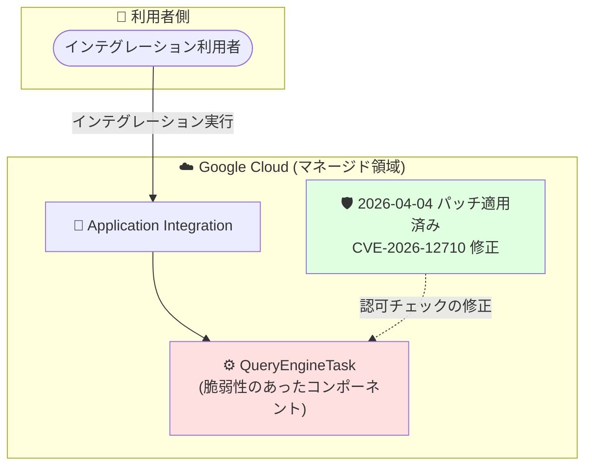

# Application Integration: QueryEngineTask における認可欠如の脆弱性 (CVE-2026-12710) への対応

**リリース日**: 2026-08-21

**サービス**: Application Integration

**機能**: セキュリティ情報 (CVE-2026-12710 の修正)

**ステータス**: Security bulletin (修正済み)

📊 [このアップデートのインフォグラフィックを見る](https://takech9203.github.io/google-cloud-news-summary/20260821-application-integration-cve-2026-12710.html)

## 概要

Google Cloud は 2026 年 8 月 21 日付の Release Notes で、Application Integration の QueryEngineTask に存在した認可欠如 (Missing authorization) の脆弱性 **CVE-2026-12710** に関するセキュリティ情報を公開しました。この脆弱性は **2026 年 4 月 4 日に Google 側で修正済み** であり、**利用者側での対応 (パッチ適用や設定変更など) は一切不要** です。

Application Integration は、Google Cloud サービスやサードパーティ アプリケーションを接続するためのフルマネージド iPaaS (Integration Platform as a Service) であり、インテグレーション内の処理は「タスク」と呼ばれる作業単位で構成されます。今回の脆弱性は、そのタスク実行基盤の一部である QueryEngineTask における認可チェックの欠如に起因するものでした。

Application Integration では 2026 年 6 月に専用のセキュリティ情報 (Security bulletins) ページが新設されており、今回のような脆弱性情報の透明性の高い開示が継続的に行われています。マネージドサービスとして Google 側が修正を完了させたうえで開示する形となっており、利用者は情報の把握のみで対応が完結します。

**アップデート前の課題**

- Application Integration の QueryEngineTask に、認可チェックが欠如している脆弱性 (CVE-2026-12710) が存在していた

**アップデート後の改善**

- 2026 年 4 月 4 日に Google 側で脆弱性が修正 (パッチ適用) された
- フルマネージドサービスのため、利用者側でのパッチ適用・設定変更・移行作業は不要
- Release Notes を通じて脆弱性情報が透明性をもって開示された

## アーキテクチャ図

脆弱性が存在した QueryEngineTask は Google が管理するマネージド領域内のコンポーネントであり、修正は Google 側で完了しています。利用者側の対応は不要です。

## サービスアップデートの詳細

### 脆弱性の内容

1. **CVE-2026-12710: QueryEngineTask における認可欠如**
   - Application Integration の QueryEngineTask に、認可 (authorization) チェックが欠如している脆弱性が存在していた
   - 脆弱性の詳細な悪用条件や影響範囲、深刻度 (Severity) は、本 Release Notes の記載時点では公開されていない

2. **修正状況**
   - 2026 年 4 月 4 日に Google 側でパッチ適用済み
   - 修正はサービス基盤側で完了しており、既にすべての利用者に適用されている

3. **必要なアクション**
   - **利用者側での対応は不要** (No customer action is needed)
   - パッチ適用、設定変更、インテグレーションの再公開などの作業は一切必要ない

## 技術仕様

### 脆弱性情報サマリー

| 項目 | 詳細 |
|------|------|
| CVE ID | CVE-2026-12710 |
| 脆弱性の種類 | 認可の欠如 (Missing authorization) |
| 影響コンポーネント | Application Integration の QueryEngineTask |
| 修正日 | 2026 年 4 月 4 日 |
| 公表日 | 2026 年 8 月 21 日 (Release Notes) |
| 利用者側の対応 | 不要 |

## 考慮すべき点

- 脆弱性スキャナーやセキュリティ監査で CVE-2026-12710 が話題になった場合、本 Release Notes を根拠として「修正済み・対応不要」と説明できる
- Application Integration の [Security bulletins ページ](https://docs.cloud.google.com/application-integration/docs/security-bulletins)を購読しておくと、今後の脆弱性情報を迅速に把握できる
- 修正日 (2026 年 4 月 4 日) と公表日 (2026 年 8 月 21 日) に間隔があるのは、修正完了後に開示するという Google の一般的なセキュリティ開示プラクティスに沿ったもの

## 関連サービス・機能

- **Integration Connectors**: Application Integration からデータベースや SaaS など外部システムに接続するためのコネクタ基盤。タスクとしてインテグレーション内で利用される
- **Application Integration Security bulletins**: 2026 年 6 月に新設された Application Integration 専用のセキュリティ情報ページ。過去には JavaScript タスク (Rhino エンジン) に関する CVE-2025-0982 (GCP-2026-044) などが公開されている
- **Cloud Logging / 実行ログ**: インテグレーションの実行履歴の監査・確認に利用できる

## 参考リンク

- 📊 [インフォグラフィック](https://takech9203.github.io/google-cloud-news-summary/20260821-application-integration-cve-2026-12710.html)
- [公式リリースノート](https://docs.cloud.google.com/release-notes#August_21_2026)
- [Application Integration リリースノート](https://docs.cloud.google.com/application-integration/docs/release-notes)
- [Application Integration セキュリティ情報 (Security bulletins)](https://docs.cloud.google.com/application-integration/docs/security-bulletins)
- [Application Integration のタスクの概要](https://docs.cloud.google.com/application-integration/docs/tasks)

## まとめ

Application Integration の QueryEngineTask に存在した認可欠如の脆弱性 (CVE-2026-12710) は、2026 年 4 月 4 日に Google 側で修正が完了しており、**利用者側での対応は不要** です。Application Integration を利用している組織は、本情報を社内のセキュリティ管理台帳に記録するとともに、今後は Application Integration の Security bulletins ページを定期的に確認することを推奨します。

---

**タグ**: #ApplicationIntegration #セキュリティ #CVE-2026-12710 #SecurityBulletin #iPaaS
