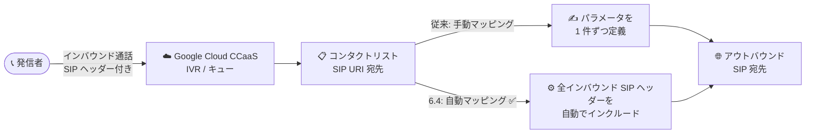

# Google Cloud Contact Center as a Service (CCaaS): バージョン 6.4 リリース

**リリース日**: 2026-08-21

**サービス**: Google Cloud Contact Center as a Service (CCaaS) / CCAI Platform

**機能**: CCaaS 6.4 リリース (SIP パラメータ自動マッピング、Microsoft 365 クライアント資格情報対応、予測ダイヤル接続時間の改善、多数のバグ修正)

**ステータス**: リリース済み (Released)

📊 [このアップデートのインフォグラフィックを見る](https://takech9203.github.io/google-cloud-news-summary/20260821-ccaas-6-4-release.html)

## 概要

Google Cloud CCaaS (Contact Center as a Service、旧 CCAI Platform) のバージョン 6.4 がリリースされました。今回のリリースには、コンタクトリストにおけるアウトバウンド SIP ヘッダーの自動マッピング、Microsoft 365 のクライアント資格情報 (Client Credentials) グラントタイプによるメール OAuth プロファイル対応、予測ダイヤリング (Predictive Dialing) の接続時間改善という 3 つの新機能に加え、エージェントデスクトップ、ダッシュボード、レポーティングに関する多数のバグ修正が含まれています。

各インスタンスへの適用タイミングは、選択しているデプロイスケジュール (Rapid / Regular / Critical) に依存します。Rapid は最も早く更新され、Regular は Rapid の少なくとも 2 日後、Critical はピーク営業時間外に Rapid の全インスタンス更新後およそ 1 週間以内に更新されます。本番環境には Critical スケジュールが推奨されています。

**アップデート前の課題**

- コンタクトリストの SIP URI 宛先にインバウンド SIP ヘッダーを引き渡すには、パラメータを 1 つずつ手動でマッピングする必要があった
- Microsoft 365 のメール OAuth は Authorization Code グラント (個々のユーザーによるサインイン) が前提であり、共有メールボックスやアプリケーション管理のメールボックスの認証運用が煩雑だった
- 予測ダイヤリングの接続時間が長く、CRTC (カナダ) や FTC (米国) の規制要件への準拠に課題があった
- エージェントデスクトップのフリーズ、ダッシュボードの不正確な表示、レポートの欠落など、運用に影響する複数の既知の問題が存在していた

**アップデート後の改善**

- 「Automatically Include and Pass all Inbound SIP Headers」チェックボックスにより、すべてのインバウンド SIP ヘッダーを手動マッピングなしでアウトバウンド SIP 宛先へ自動転送できるようになった
- Microsoft 365 でクライアント資格情報グラントタイプのメール OAuth プロファイルを作成できるようになり、共有メールボックスがアプリ登録経由で認証可能になった (OAuth IMAP セットアップの耐障害性が向上)
- 予測ダイヤリングの接続時間が 2 秒未満に短縮され、CRTC および FTC の規制に準拠できるようになった
- チャット、通話、ダッシュボード、レポーティングにまたがる 16 件のバグが修正された

## アーキテクチャ図

コンタクトリストの SIP URI 宛先へのアウトバウンド通話/転送時に、従来は手動でマッピングしていたインバウンド SIP ヘッダーを、CCaaS 6.4 では自動でまとめて引き渡せるようになった様子を示しています。

## サービスアップデートの詳細

### 主要機能

1. **コンタクトリストの SIP パラメータ自動マッピング**
   - コンタクトリストのアウトバウンド通話宛先で、インバウンド SIP ヘッダーの自動マッピングに対応
   - **Settings > Call > Contact Lists > Contact list management > CREATE OR EDIT CONTACT LIST > Add Destination** の Add Destination ダイアログで、**Pass Data Parameters** トグルをオンにすると、新しい「**Automatically Include and Pass all Inbound SIP Headers**」チェックボックスが表示される
   - チェックボックスを選択すると、Data parameters テーブルにインバウンド SIP ヘッダーのパススルーを表す行が追加され、すべてのインバウンド SIP ヘッダーが手動マッピングなしでアウトバウンド SIP URI に転送される
   - 従来どおり Fixed (固定値) / Dynamic (SIP ヘッダーまたはセッションメタデータ由来) の個別パラメータ定義も併用可能

2. **メール OAuth プロファイルと Microsoft 365 クライアント資格情報**
   - Microsoft 365 向けに、クライアント資格情報 (Client Credentials) グラントタイプを使用するメール OAuth プロファイルを作成可能になった
   - 共有メールボックスは、個々のユーザーサインインではなく Microsoft Entra のアプリ登録 (App Registration) を通じて認証される
   - サポート用受信トレイやアプリケーション管理のメールボックスに対して、OAuth IMAP セットアップの耐障害性が向上
   - この機能のドキュメントは近日公開予定

3. **予測ダイヤリングの接続時間改善**
   - 予測ダイヤリング (Predictive Dialing) の接続時間が 2 秒未満に短縮された
   - CRTC (カナダ・ラジオテレビ通信委員会) および FTC (米国連邦取引委員会) の規制に準拠するための改善

### バグ修正 (16 件)

| 領域 | 修正内容 |
|------|----------|
| チャット | チャットショートカットの表示遅延を修正 |
| エージェントデスクトップ | Session Data Feed ペインに古いデータが表示される問題を修正 |
| Salesforce 連携 | Salesforce 埋め込みウィジェットで会話履歴の読み込みが遅い問題を修正 |
| レポーティング | Individual Call History レポートで通話時間ゼロのアウトバウンド通話が欠落する問題を修正 |
| 通話 | ウォーム転送中のボイスメールに関する問題を修正 |
| ダッシュボード | コールド転送時に Queued Calls ダッシュボードの発信元キュー/転送エージェントが正しく表示されない問題を修正 |
| エージェントデスクトップ | エージェントデスクトップの読み込み遅延を修正 |
| ルーティング | 仮想エージェントから人間のエージェントへの転送が Keep Waiting (キャパシティ超過) 設定をバイパスする問題を修正 |
| データエクスポート | MENU_PATH_ITEMS 生データエクスポートのファイル名に関する問題を修正 |
| キュー | 親キューが誤って営業時間外としてマークされる問題を修正 |
| ダッシュボード | 終端ステータスのエスカレーション済みチャットが Queued Chats ダッシュボードに表示される問題を修正 |
| エージェントデスクトップ | 通話終了後に「Call on hold」表示のままエージェントデスクトップがフリーズする問題を修正 |
| チャット | 通話のラップアップ (後処理) 中にエージェントがチャットステータスを変更できない問題を修正 |
| コールアダプター | 存在しない待機呼 (phantom waiting calls) が表示される問題を修正 |
| コールアダプター | アウトバウンド通話が失敗した際にコールアダプターが In-call 状態のままになる問題を修正 |

## 技術仕様

### デプロイスケジュールと更新タイミング

| スケジュール | 更新タイミング | 推奨環境 |
|------|------|------|
| Rapid | 最も早く更新を受信 | 開発・テストなどの非本番環境 |
| Regular | Rapid で更新が利用可能になってから少なくとも 2 日後 | — |
| Critical | ピーク営業時間外に更新。Rapid 全インスタンス更新後おおむね 1 週間以内 | 本番環境 |

- セキュリティパッチは Regular / Critical でも遅延なく即時適用される
- リリースはおよそ 3 週間ごとに実施される
- インスタンスのスケジュールは Google Cloud コンソールの CCAI Platform インスタンスページ (Schedule 列) で確認・変更できる

### SIP ヘッダー自動マッピングの設定項目

| 項目 | 詳細 |
|------|------|
| 設定場所 | Settings > Call > Contact Lists > Contact list management > (対象リスト) > Add Destination |
| 前提 | 宛先タイプに SIP URI Address を選択 (`sip:username@domain.com` 形式など) |
| 有効化 | Pass Data Parameters トグルをオン → 「Automatically Include and Pass all Inbound SIP Headers」を選択 |
| 動作 | すべてのインバウンド SIP ヘッダーを手動マッピングなしでアウトバウンド SIP URI に転送 |
| 補足 | SIP REFER は BYOC (Bring-Your-Own-Carrier) 利用時のみ選択可能 |

## 設定方法

### SIP ヘッダー自動マッピングを有効化する手順

1. CCAI Platform ポータルで **Settings > Call** をクリックする
2. **Contact Lists** ペインで **Contact list management** をクリックする
3. 編集するコンタクトリスト (グローバルまたはカスタム) を選択する
4. **Add Destination** をクリックし、宛先名を入力して **SIP URI Address** を選択する
5. **SIP Destination URI** に SIP URI (例: `sip:username@domain.com`) を入力する
6. **Pass Data Parameters** トグルをオンにする
7. 新しく表示される「**Automatically Include and Pass all Inbound SIP Headers**」チェックボックスを選択する
8. 必要に応じて Data Records の記録先 (セッションメタデータファイル / CRM レコード) を選択して保存する

## メリット

### ビジネス面

- **規制準拠**: 予測ダイヤリングの接続時間が 2 秒未満となり、CRTC / FTC の規制要件を満たしたアウトバウンドキャンペーンを運用できる
- **運用負荷の軽減**: 共有メールボックスの認証がアプリ登録ベースになり、個人アカウントのサインインやトークン失効に起因する運用対応が減る
- **安定性の向上**: エージェントデスクトップのフリーズや誤ったダッシュボード表示など、日々のオペレーションに影響する 16 件の問題が解消される

### 技術面

- **設定の簡素化**: インバウンド SIP ヘッダーの引き渡しに個別マッピング定義が不要になり、外部 SIP 宛先へのコンテキスト連携を迅速に構成できる
- **認証の堅牢化**: クライアント資格情報グラントによりユーザー非依存の OAuth IMAP 接続が可能になり、サポート受信トレイの接続が安定する

## デメリット・制約事項

### 考慮すべき点

- 更新の適用タイミングはデプロイスケジュールに依存するため、本番 (Critical) インスタンスへの反映は Rapid より最大 1 週間以上遅れる場合がある
- Microsoft 365 クライアント資格情報対応のドキュメントは近日公開予定であり、詳細な設定手順は現時点で未公開
- SIP ヘッダーの自動パススルーを有効にすると、すべてのインバウンドヘッダーが外部 SIP 宛先へ転送されるため、外部に渡してよい情報かどうかの確認が必要

## ユースケース

### ユースケース 1: 外部 SIP システムへのコンテキスト付き転送

**シナリオ**: コンタクトセンターで受け付けた通話を、社内の別 VoIP システムや外部パートナーの SIP 宛先へ転送する際、発信者情報やキャリア由来のヘッダー情報をそのまま引き継ぎたい。

**効果**: 「Automatically Include and Pass all Inbound SIP Headers」を有効にするだけで、全インバウンド SIP ヘッダーが自動転送され、転送先システムでの発信者コンテキスト再取得が不要になる。

### ユースケース 2: 共有サポートメールボックスの OAuth 接続

**シナリオ**: `support@example.com` のような Microsoft 365 共有メールボックスを CCaaS のメールチャネルに接続したいが、特定ユーザーの資格情報に依存したくない。

**効果**: クライアント資格情報グラントタイプの OAuth プロファイルにより、Microsoft Entra のアプリ登録で認証が完結し、担当者の退職やパスワード変更の影響を受けない安定したメールチャネル運用が可能になる。

### ユースケース 3: 規制準拠のアウトバウンドキャンペーン

**シナリオ**: 北米向けのアウトバウンドコールキャンペーンで予測ダイヤリングを使用しており、接続遅延に関する CRTC / FTC の規制要件を満たす必要がある。

**効果**: 接続時間が 2 秒未満に短縮されたことで、規制に準拠しつつ予測ダイヤリングによる効率的な発信を継続できる。

## 料金

このリリースによる料金体系の変更は発表されていません。CCaaS の料金の詳細は料金ページを参照してください。

- [CCAI Platform 料金ページ](https://cloud.google.com/contact-center/ccai-platform/pricing)

## 関連サービス・機能

- **デプロイスケジュール**: Rapid / Regular / Critical の 3 種類から更新タイミングを制御。本リリースの適用時期を左右する
- **データパラメータ (Pass Data Parameters)**: インバウンド SIP ヘッダーを仮想エージェント、仮想タスクアシスタント、アウトバウンド SIP ヘッダー、CRM レコード、セッションメタデータへ引き渡す既存の仕組み。今回の自動マッピングはこの機能の拡張
- **CRM 連携 (Salesforce / Zendesk / Kustomer / Custom CRM)**: メールチャネルはこれらの CRM で利用可能。Salesforce 埋め込みウィジェットの会話履歴表示も今回修正された
- **BYOC (Bring-Your-Own-Carrier)**: SIP URI 宛先で SIP REFER を利用する場合に必要

## 参考リンク

- 📊 [インフォグラフィック](https://takech9203.github.io/google-cloud-news-summary/20260821-ccaas-6-4-release.html)
- [公式リリースノート](https://docs.cloud.google.com/release-notes#August_21_2026)
- [デプロイスケジュール](https://cloud.google.com/contact-center/ccai-platform/docs/deployment-schedules)
- [コンタクトリスト (SIP URI 宛先の追加)](https://docs.cloud.google.com/contact-center/ccai-platform/docs/contact-list#add-sip-uri-address-destination)
- [データパラメータの引き渡し](https://docs.cloud.google.com/contact-center/ccai-platform/docs/va-pass-data-parameters)
- [Microsoft OAuth によるメールチャネル設定](https://docs.cloud.google.com/contact-center/ccai-platform/docs/ms-oauth)
- [料金ページ](https://cloud.google.com/contact-center/ccai-platform/pricing)

## まとめ

CCaaS 6.4 は、SIP ヘッダー自動マッピングによる外部連携設定の簡素化、Microsoft 365 共有メールボックス向けのクライアント資格情報 OAuth、規制準拠のための予測ダイヤリング高速化と、実運用に直結する改善がそろったリリースです。本番インスタンスの管理者はデプロイスケジュールに基づく適用時期を確認し、既知のバグ修正 (エージェントデスクトップのフリーズやダッシュボード表示の問題など) が自環境の課題に該当するかレビューすることをお勧めします。

---

**タグ**: #GoogleCloud #CCaaS #CCAIPlatform #ContactCenter #SIP #OAuth #Microsoft365 #PredictiveDialing #リリースノート
