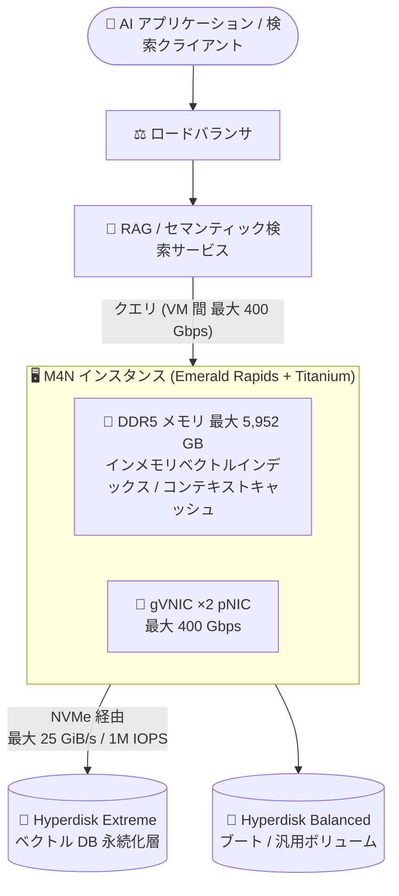

# Compute Engine: ネットワーク・メモリ最適化 M4N マシンシリーズが GA

**リリース日**: 2026-08-21

**サービス**: Compute Engine

**機能**: M4N マシンシリーズ (ネットワーク・メモリ最適化)

**ステータス**: GA (一般提供)

📊 [このアップデートのインフォグラフィックを見る](https://takech9203.github.io/google-cloud-news-summary/20260821-compute-engine-m4n-machine-series-ga.html)

## 概要

Compute Engine のネットワーク・メモリ最適化マシンシリーズ「M4N」が一般提供 (GA) になりました。M4N は第 5 世代 Intel Xeon Scalable プロセッサ (Emerald Rapids) と Titanium オフロードプロセッサを搭載し、ネットワークおよびブロックストレージ I/O 集約型ワークロード向けに設計されています。最大構成では VM 間ネットワーク帯域 400 Gbps、Hyperdisk Extreme によるブロックストレージ帯域 25 GiB/s・100 万 IOPS という、Compute Engine で最高クラスの I/O 性能を提供します。

M4N は 16〜224 vCPU、最大 5,952 GB の DDR5 メモリという事前定義マシンシェイプで提供され、高性能ベクトルデータベース、RAG (Retrieval-Augmented Generation) のデータレイヤー、大規模なインメモリコンテキストキャッシュ、リアルタイムセマンティック検索といった AI 時代のデータ基盤ワークロードを主なターゲットとしています。SAP HANA などの大規模インメモリデータベースや OLAP、コア単位ライセンスの Oracle Database ワークロードにも適しており、Google Cloud のメモリ最適化インスタンスの中で最良の TCO (トランザクションあたりコスト) を実現するとされています。

**アップデート前の課題**

- 既存のメモリ最適化 M4 シリーズはネットワーク帯域が最大 100 Gbps にとどまり、ネットワーク I/O が集中する大規模インメモリワークロードではボトルネックになり得た
- M4 の Hyperdisk Extreme 性能は最大構成でも 500,000 IOPS / 10,000 MiB/s であり、それ以上のブロックストレージ性能を要するデータベースワークロードには選択肢が限られていた
- 400 Gbps クラスのネットワーク帯域を持つ C4N シリーズは汎用 (ネットワーク最適化) 構成であり、vCPU あたり最大 26.5 GB クラスの大容量メモリ比を必要とするワークロードには対応できなかった

**アップデート後の改善**

- VM 間ネットワーク帯域が最大 400 Gbps となり、標準 M4 インスタンスと比較して vCPU あたり 4 倍のネットワーク帯域を利用可能になった
- 最大マシンタイプでは 2 基の Titanium Smart NIC により M4 の 2 倍のディスク I/O 性能を実現し、Hyperdisk Extreme で最大 25 GiB/s・1,000,000 IOPS に到達可能になった
- ベクトルデータベースや RAG データレイヤーなど、大容量メモリと極めて高い I/O を同時に要求するワークロードを単一のマシンシリーズでカバーできるようになった

## アーキテクチャ図



M4N インスタンスが大容量 DDR5 メモリでベクトルインデックスやコンテキストキャッシュを保持し、Hyperdisk Extreme への高速 I/O (最大 25 GiB/s・1M IOPS) と 400 Gbps ネットワークで RAG・ベクトル検索ワークロードを支える構成です。

## サービスアップデートの詳細

### 主要機能

1. **Compute Engine 最高クラスのネットワーク性能 (最大 400 Gbps)**
   - VM 間 (VM-to-VM) の標準ネットワーク帯域として最大 400 Gbps を提供
   - 標準 M4 インスタンスと比較して vCPU あたり 4 倍のネットワーク帯域
   - Tier_1 ネットワーキングの追加設定は不要 (per VM Tier_1 は使用しない)
   - gVNIC ネットワークインターフェースが必須 (VirtIO-net / SCSI は非サポート)

2. **Hyperdisk Extreme による最高クラスのブロックストレージ性能**
   - 最大マシンタイプ (224 vCPU) で最大 25 GiB/s のスループットと 1,000,000 IOPS
   - 2 基の Titanium Smart NIC 搭載により、M4 インスタンスの 2 倍のディスク I/O 性能を実現
   - Hyperdisk Extreme 単一ボリュームの上限 (350,000 IOPS / 5,000 MiB/s) を超える性能は、複数ボリュームの接続で達成
   - Hyperdisk Balanced / Balanced High Availability / Extreme / Throughput / ML をサポート (ストレージは NVMe のみ)

3. **大容量メモリの事前定義マシンシェイプ**
   - 16〜224 vCPU、最大 5,952 GB の DDR5 メモリ
   - hypermem (約 15.5 GB/vCPU)、megamem (約 13.3 GB/vCPU)、ultramem (約 26.6 GB/vCPU) の 3 ファミリー・計 10 シェイプ
   - リソースベース確約利用割引 (CUD) の対象で、3 年コミットにより 60% を超える割引

4. **運用性・メンテナンス**
   - ホストメンテナンスはライブマイグレーションで実施、7 日前の事前通知に対応
   - オンデマンドメンテナンスとメンテナンスシミュレーションをサポート

## 技術仕様

### M4N マシンタイプ一覧

| マシンタイプ | vCPU | メモリ (GB) |
|------|------|------|
| m4n-hypermem-16 | 16 | 248 |
| m4n-hypermem-32 | 32 | 496 |
| m4n-hypermem-64 | 64 | 992 |
| m4n-megamem-28 | 28 | 372 |
| m4n-megamem-56 | 56 | 744 |
| m4n-megamem-112 | 112 | 1,488 |
| m4n-megamem-224 | 224 | 2,976 |
| m4n-ultramem-56 | 56 | 1,488 |
| m4n-ultramem-112 | 112 | 2,976 |
| m4n-ultramem-224 | 224 | 5,952 |

### Hyperdisk Extreme 接続時の性能上限 (マシンタイプ別)

| マシンタイプ | 最大 IOPS | 最大スループット (MiB/s) |
|------|------|------|
| m4n-\*-16 | 160,000 | 3,000 |
| m4n-\*-28 | 280,000 | 5,000 |
| m4n-\*-32 | 320,000 | 6,000 |
| m4n-\*-56 | 400,000 | 10,000 |
| m4n-\*-64 | 420,000 | 11,500 |
| m4n-\*-112 | 500,000 | 12,500 |
| m4n-\*-224 | 1,000,000 | 25,000 |

Hyperdisk Extreme ボリュームを 1 つ以上接続すると、より高い定常状態 (steady state) 性能上限が適用されます。ディスクの総容量はインスタンスあたり最大 512 TiB、Hyperdisk Extreme はインスタンスあたり最大 8 ボリュームです。

### 主要スペック

| 項目 | 詳細 |
|------|------|
| プロセッサ | 第 5 世代 Intel Xeon Scalable (Emerald Rapids) + Titanium オフロードプロセッサ |
| メモリ | DDR5、最大 5,952 GB |
| ネットワーク | gVNIC 必須、VM 間最大 400 Gbps、最大 10 NIC (vCPU 数に応じてスケール) |
| ストレージ | NVMe のみ。Hyperdisk Balanced / Balanced HA / Extreme / Throughput / ML |
| マシンシェイプ | 事前定義のみ (カスタムマシンタイプ不可) |
| GPU | 非対応 |
| 割引 | リソースベース CUD 対象 (3 年コミットで 60% 超の割引) |

## 設定方法

### 前提条件

1. 使用する OS イメージが M4N と高帯域ネットワーク (最新の gVNIC ドライバ) をサポートしていることを確認する
2. 224 vCPU マシンタイプでフルネットワークスループット (400 Gbps) を得るには、インスタンス作成時に Jumbo フレーム (MTU 8896) を使用する vNIC を 2 つ以上構成する

### 手順

#### ステップ 1: M4N インスタンスの作成

```bash
gcloud compute instances create my-m4n-instance \
    --zone=asia-southeast1-b \
    --machine-type=m4n-megamem-56 \
    --image-family=debian-12 \
    --image-project=debian-cloud
```

M4N は事前定義マシンタイプのみ利用可能です。利用可能なゾーンは `gcloud compute machine-types list --filter="name~m4n"` で確認できます。

#### ステップ 2: Hyperdisk Extreme ボリュームの作成と接続

```bash
gcloud compute disks create my-extreme-disk \
    --zone=asia-southeast1-b \
    --type=hyperdisk-extreme \
    --size=2TiB \
    --provisioned-iops=350000

gcloud compute instances attach-disk my-m4n-instance \
    --disk=my-extreme-disk \
    --zone=asia-southeast1-b
```

単一ボリュームの上限は 350,000 IOPS / 5,000 MiB/s です。m4n-\*-224 で 1M IOPS / 25 GiB/s を達成するには、複数の Hyperdisk Extreme ボリュームを接続します。

## メリット

### ビジネス面

- **AI データ基盤の統合**: ベクトルデータベース、RAG データレイヤー、コンテキストキャッシュなど AI アプリケーションのデータ層を、高メモリと高 I/O を兼ね備えた単一マシンシリーズに集約できる
- **TCO の削減**: コア単位ライセンスのデータベース (Oracle Database など) において、他のメモリ最適化インスタンスと比較して低いトランザクションあたりコストを実現
- **大幅な割引オプション**: リソースベース CUD (3 年) で 60% を超える割引が適用可能

### 技術面

- **Compute Engine 最高の I/O 性能**: ネットワーク 400 Gbps、Hyperdisk 25 GiB/s・1M IOPS という最高クラスの数値を単一 VM で達成
- **Titanium によるオフロード**: 最大構成では 2 基の Titanium Smart NIC がネットワーク・ストレージ処理をオフロードし、CPU をアプリケーションに専念させられる
- **予測可能な運用**: ライブマイグレーションによるメンテナンス、7 日前の事前通知、オンデマンドメンテナンスに対応

## デメリット・制約事項

### 制限事項

- 事前定義マシンタイプのみで、カスタムマシンタイプは利用できない
- GPU は接続できない
- 利用可能なリージョン・ゾーンが限定されている
- ストレージは NVMe (Hyperdisk) のみで、Persistent Disk や Titanium SSD (ローカル SSD) は利用できない
- gVNIC が必須で、VirtIO-net / SCSI インターフェースは非サポート
- Hyperdisk Extreme はインスタンスあたり最大 8 ボリューム

### 考慮すべき点

- 224 vCPU マシンタイプで 400 Gbps を実現するには、Jumbo フレーム (8896B) を使う vNIC を 2 つ以上構成し、ゲスト OS / アプリケーション側で負荷を複数 vNIC に分散する設計が必要
- 1M IOPS / 25 GiB/s を得るには複数の Hyperdisk Extreme ボリュームの合計プロビジョニング性能が上限値以上になるよう設計する必要がある
- 古い gVNIC ドライバの OS イメージでは帯域低下やレイテンシ増加が起こり得るため、最新ドライバの利用が推奨される

## ユースケース

### ユースケース 1: 高性能ベクトルデータベース / RAG データレイヤー

**シナリオ**: 数十億件規模の埋め込みベクトルを扱うセマンティック検索基盤で、インデックスをメモリに保持しつつ、更新・再構築時に大量のディスク I/O とノード間通信が発生する。

**実装例**:
```bash
# 大容量メモリ + 高ネットワーク帯域のノードでベクトル DB クラスタを構成
gcloud compute instances create vector-db-node-1 \
    --zone=asia-southeast1-b \
    --machine-type=m4n-ultramem-112 \
    --network-interface=nic-type=GVNIC
```

**効果**: 最大 5,952 GB のメモリでインデックスをオンメモリ化し、400 Gbps のノード間帯域でレプリケーションやシャード再配置を高速化。Hyperdisk Extreme によりスナップショットからの復旧やインデックス再構築の時間を短縮できる。

### ユースケース 2: SAP HANA / OLAP などの大規模インメモリデータベース

**シナリオ**: 大規模な SAP HANA や OLAP 系のインメモリ分析基盤で、バックアップ・リストアやデータロードのストレージ I/O がボトルネックになっている。

**効果**: Hyperdisk Extreme の最大 25 GiB/s スループットによりデータロードやバックアップ時間を短縮。M4 比 2 倍のディスク I/O 性能により、同一メモリ容量でもより高いストレージ性能を確保できる。

## 料金

M4N は事前定義マシンタイプ単位の課金で、リソースベース確約利用割引 (CUD) の対象です (3 年コミットで 60% を超える割引)。具体的な単価はリージョンごとに異なるため、以下の公式料金ページを参照してください。

- [Compute Engine 料金 (メモリ最適化)](https://cloud.google.com/products/compute/pricing/memory-optimized)
- [Compute Engine 料金 (ネットワーク最適化)](https://cloud.google.com/products/compute/pricing/network-optimized)
- [Hyperdisk の料金 (ディスク料金)](https://cloud.google.com/compute/disks-image-pricing)

## 利用可能リージョン

M4N は一部のリージョン・ゾーンでのみ利用可能です。公式ドキュメントで確認できた提供ゾーンの例:

- asia-south1-b / asia-south1-c (ムンバイ)
- asia-south2-b (デリー)
- asia-southeast1-a / asia-southeast1-b (シンガポール)
- europe-west2-c (ロンドン)

最新の提供状況は [リージョンとゾーン](https://docs.cloud.google.com/compute/docs/regions-zones#available) を参照するか、`gcloud compute machine-types list --filter="name~m4n"` で確認してください。

## 関連サービス・機能

- **Hyperdisk Extreme**: M4N の最大ブロックストレージ性能 (25 GiB/s / 1M IOPS) を引き出すために必須の高性能ブロックストレージ。単一ボリュームは最大 350,000 IOPS
- **M4 マシンシリーズ**: 同世代のメモリ最適化シリーズ。ネットワーク・ディスク I/O 要件が標準的な場合の選択肢 (最大 100 Gbps / 500,000 IOPS)
- **C4N マシンシリーズ**: 同じく最大 400 Gbps・1M IOPS を提供するネットワーク最適化シリーズ。メモリ比が標準的なワークロード向け
- **Titanium**: ネットワーク・ストレージ処理をオフロードする Google 独自のインフラ。最大構成の M4N は Titanium Smart NIC を 2 基搭載
- **確約利用割引 (CUD)**: M4N はリソースベース CUD の対象で、3 年コミットにより 60% 超の割引

## 参考リンク

- 📊 [インフォグラフィック](https://takech9203.github.io/google-cloud-news-summary/20260821-compute-engine-m4n-machine-series-ga.html)
- [公式リリースノート](https://docs.cloud.google.com/release-notes#August_21_2026)
- [M4N マシンシリーズ (ネットワーク最適化マシン)](https://docs.cloud.google.com/compute/docs/network-optimized-machines#m4n_series)
- [メモリ最適化マシンファミリー](https://docs.cloud.google.com/compute/docs/memory-optimized-machines)
- [Hyperdisk Extreme](https://docs.cloud.google.com/compute/docs/disks/hd-types/hyperdisk-extreme)
- [料金ページ (Compute Engine)](https://cloud.google.com/products/compute/pricing)

## まとめ

M4N の GA により、大容量メモリと Compute Engine 最高クラスの I/O 性能 (400 Gbps ネットワーク、25 GiB/s・1M IOPS の Hyperdisk Extreme) を単一の VM で利用できるようになりました。ベクトルデータベースや RAG データレイヤーなど AI 系データ基盤、および SAP HANA や Oracle などの大規模データベースを運用しているチームは、M4/M3 や C4N との性能・コスト比較を行い、I/O ボトルネックを抱えるワークロードの移行先として評価することを推奨します。

---

**タグ**: #ComputeEngine #M4N #GA #メモリ最適化 #ネットワーク最適化 #HyperdiskExtreme #EmeraldRapids #Titanium #ベクトルデータベース #RAG
