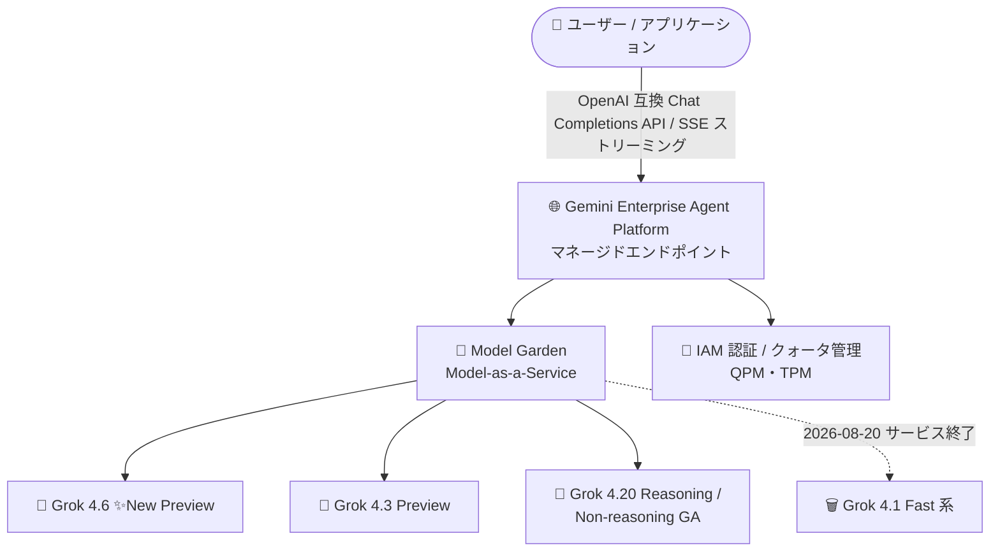

# Gemini Enterprise Agent Platform: xAI Grok 4.6 が Model Garden で Preview 提供開始

**リリース日**: 2026-08-21

**サービス**: Gemini Enterprise Agent Platform (Model Garden)

**機能**: xAI Grok 4.6 モデルの提供 (Preview)

**ステータス**: Preview

📊 [このアップデートのインフォグラフィックを見る](https://takech9203.github.io/google-cloud-news-summary/20260821-gemini-enterprise-agent-platform-grok-4-6.html)

## 概要

2026 年 8 月 21 日、xAI の最新モデル **Grok 4.6** が Gemini Enterprise Agent Platform の Model Garden で Preview として利用可能になりました。Model Garden 上の xAI Grok モデルは Model-as-a-Service (MaaS) 型のマネージド API として提供されており、ユーザーは GPU インフラを自前でプロビジョニングすることなく、Google Cloud のエンドポイント経由で Grok モデルを呼び出せます。

これまで Model Garden で提供されていた xAI モデルは、Grok 4.3 (Preview)、Grok 4.20 Reasoning / Non-reasoning (GA)、Grok 4.1 Fast Reasoning / Non-reasoning (非推奨、2026 年 8 月 20 日にサービス終了) というラインナップでした。今回の Grok 4.6 の追加により、Google Cloud 上で選択できる xAI モデルの選択肢がさらに拡大します。Gemini、Claude、Llama、Mistral などと同一プラットフォーム上でマルチモデル戦略を実現したい企業ユーザーにとって重要なアップデートです。

なお、xAI モデルは Google 製品ではなく、Service Specific Terms の AI/ML Services セクションにおける「Separate Offerings」の条件、およびモデルカードに記載の個別条件が適用される点に注意が必要です。

**アップデート前の課題**

- Model Garden で利用できる xAI モデルは Grok 4.3 / Grok 4.20 系までであり、xAI の新しいモデル世代を Google Cloud 上で利用できなかった
- Grok 4.1 Fast モデルファミリーは非推奨となり 2026 年 8 月 20 日にサービス終了したため、移行先モデルの選択肢が求められていた
- xAI の最新モデルを利用するには xAI 独自の API を直接利用する必要があり、Google Cloud の認証・課金・ガバナンスの枠組みの外で管理する必要があった

**アップデート後の改善**

- Grok 4.6 を Model Garden のマネージド API (MaaS) として Preview で利用できるようになった
- Google Cloud の IAM 認証・課金体系のまま、インフラ管理不要で xAI の新モデルを試せるようになった
- Grok 4.1 Fast のサービス終了に伴う移行先として、より新しい世代のモデルを含む選択肢が広がった

## アーキテクチャ図



ユーザーは Google Cloud のマネージドエンドポイントを経由して Model Garden の xAI Grok モデルを呼び出します。今回 Grok 4.6 が Preview として追加され、前日 (8 月 20 日) にサービス終了した Grok 4.1 Fast 系からの移行先候補が拡充されました。

## サービスアップデートの詳細

### 主要機能

1. **Grok 4.6 の Preview 提供**
   - Model Garden のモデルカードから Grok 4.6 にアクセス可能
   - Preview のため、Pre-GA Offerings Terms が適用され、サポートが限定される場合がある

2. **マネージド API (MaaS) としての提供**
   - Grok モデルはセルフデプロイ不要のマネージド API として利用可能
   - サーバー送信イベント (SSE) によるレスポンスのストリーミングに対応し、エンドユーザーの体感レイテンシを低減できる

3. **Model Garden の xAI モデルラインナップ拡充**
   - 既存の Grok 4.3 (Preview)、Grok 4.20 Reasoning / Non-reasoning (GA) に Grok 4.6 が加わる
   - Grok 4.1 Fast 系 (Reasoning / Non-reasoning) は非推奨となり、2026 年 8 月 20 日にサービス終了済み

## 技術仕様

### Model Garden における xAI Grok モデルの提供状況 (2026 年 8 月時点)

| モデル | ステータス | 特徴 (公式ドキュメント記載) |
|------|------|------|
| Grok 4.6 | Preview (今回追加) | 詳細仕様はモデルカードを参照 |
| Grok 4.3 | Preview | xAI のフラッグシップモデル。コンテキスト長 200,000 |
| Grok 4.20 (Reasoning) | GA | 低ハルシネーション率。ドキュメント理解・長期エージェントツール呼び出しに強み。コンテキスト長 2,000,000 |
| Grok 4.20 (Non-reasoning) | GA | 低レイテンシ用途 (カスタマーサポート、分類など) に強み。コンテキスト長 2,000,000 |
| Grok 4.1 Fast (Reasoning / Non-reasoning) | 非推奨 (2026-08-20 サービス終了) | 新しい xAI モデルまたは他モデルへの移行が必要 |

### クォータ

Grok モデルにはグローバルクォータが適用されます。

| 項目 | 詳細 |
|------|------|
| QPM | `global_generate_content_requests_per_minute_per_project_per_base_model` で定義 |
| 入力 TPM | `global_generate_content_input_tokens_per_minute_per_base_model` で定義 |
| 出力 TPM | `global_generate_content_output_tokens_per_minute_per_base_model` で定義 |
| 確認方法 | Google Cloud コンソールの「割り当てとシステム上限」ページ |

Grok 4.6 のクォータ値・コンテキスト長・対応機能 (Function calling、Structured output、Reasoning など) の詳細は、Model Garden のモデルカードおよび公式ドキュメントで確認してください。

## 設定方法

### 前提条件

1. Google Cloud プロジェクトで Vertex AI API (Gemini Enterprise Agent Platform) が有効化されていること
2. Model Garden の Grok 4.6 モデルカードでモデルへのアクセスを有効化していること
3. 組織のポリシー (`vertexai.allowedModels` 制約) で xAI モデルの利用が許可されていること

### 手順

#### ステップ 1: Model Garden でモデルカードにアクセス

Google Cloud コンソールの Model Garden で「Grok 4.6」を検索し、モデルカードを開いて利用を有効化します。xAI モデルには「Separate Offerings」条件とモデルカード記載の個別条件が適用されます。

#### ステップ 2: マネージドエンドポイントへリクエストを送信

xAI の Grok モデルは OpenAI 互換の Chat Completions エンドポイント経由で呼び出せます (モデル名は Grok 4.6 のモデルカードに記載の ID を使用)。

```bash
curl -X POST \
  -H "Authorization: Bearer $(gcloud auth print-access-token)" \
  -H "Content-Type: application/json" \
  "https://us-central1-aiplatform.googleapis.com/v1/projects/PROJECT_ID/locations/us-central1/endpoints/openapi/chat/completions" \
  -d '{
    "model": "xai/MODEL_NAME",
    "messages": [
      {"role": "user", "content": "こんにちは"}
    ],
    "stream": true
  }'
```

ストリーミング (`"stream": true`) を指定すると SSE でレスポンスが逐次返却され、体感レイテンシを低減できます。

## メリット

### ビジネス面

- **マルチモデル戦略の強化**: Gemini、Claude、Llama、Mistral などと同一プラットフォーム上で xAI の新モデルを比較・選択でき、ベンダーロックインのリスクを低減できる
- **統一されたガバナンス**: Google Cloud の IAM、課金、組織ポリシー (`vertexai.allowedModels`) の枠組みで xAI モデルの利用を統制できる

### 技術面

- **インフラ管理不要**: MaaS 型のマネージド API のため、GPU のプロビジョニングやモデルのデプロイ作業が不要
- **ストリーミング対応**: SSE によるレスポンスストリーミングで対話型アプリケーションの体感レイテンシを改善できる
- **OpenAI 互換 API**: 既存の OpenAI SDK ベースの実装からエンドポイントとモデル名の変更のみで移行しやすい

## デメリット・制約事項

### 制限事項

- Preview 段階のため Pre-GA Offerings Terms が適用され、「現状有姿 (as is)」での提供となりサポートが限定される場合がある
- Grok モデルにはグローバルクォータ (QPM / TPM) が適用され、アカウントによって上限が異なる、またはアクセスが制限される場合がある
- 既存の Grok モデル (4.3 / 4.20 系) ではバッチ予測が未サポートであるなど、機能に制約がある。Grok 4.6 の対応機能はモデルカードで要確認

### 考慮すべき点

- xAI モデルは Google 製品ではなく、「Separate Offerings」の条件およびモデルカード記載の個別条件が適用される
- 組織配下のプロジェクトでは、パートナーモデルの `web_search` / `structured_outputs` 機能がデフォルトで拒否されており、`vertexai.allowedPartnerModelFeatures` 制約で明示的な許可が必要
- Grok 4.1 Fast 系は 2026 年 8 月 20 日にサービス終了済みのため、利用していた場合は速やかな移行が必要

## ユースケース

### ユースケース 1: Grok 4.1 Fast サービス終了に伴う移行検証

**シナリオ**: Grok 4.1 Fast (Reasoning / Non-reasoning) を利用していたアプリケーションが 2026 年 8 月 20 日のサービス終了を迎え、移行先モデルを選定する必要がある。

**効果**: 同じ Model Garden のマネージドエンドポイント上で Grok 4.6 / 4.3 / 4.20 系を Preview 段階から評価でき、API 呼び出しの変更を最小限に抑えつつ移行先を選定できる。

### ユースケース 2: マルチモデル環境での最新モデル評価

**シナリオ**: Gemini や Claude を本番利用しつつ、xAI の最新モデルの性能をユースケース別に比較評価したい。

**効果**: 単一の Google Cloud プロジェクト・認証基盤・課金体系のまま、Gen AI evaluation service などと組み合わせて Grok 4.6 を含む複数モデルの比較検証が行える。

## 料金

Grok 4.6 の個別料金は本レポート作成時点の公式ドキュメントでは確認できませんでした。xAI モデルを含むパートナーモデルの料金は、以下の公式料金ページで確認してください。

- [Gemini Enterprise Agent Platform の生成 AI 料金](https://cloud.google.com/gemini-enterprise-agent-platform/generative-ai/pricing)

## 利用可能リージョン

既存の Model Garden 提供 Grok モデル (Grok 4.3、Grok 4.20 系) は global エンドポイントで提供されています。Grok 4.6 の提供リージョンは Model Garden のモデルカードおよび[公式ドキュメント](https://docs.cloud.google.com/gemini-enterprise-agent-platform/models/partner-models/grok)で確認してください。

## 関連サービス・機能

- **Model Garden**: Google、パートナー (xAI、Anthropic、Mistral AI など)、オープンモデルを検索・利用できるモデルカタログ。Grok 4.6 はここから有効化する
- **組織ポリシー (vertexai.allowedModels / vertexai.allowedPartnerModelFeatures)**: 利用可能なモデルやパートナーモデル機能 (Web 検索、構造化出力) を組織単位で許可・拒否できる
- **Gen AI evaluation service**: Model Garden で有効化したパートナーモデルの評価に対応しており、モデル選定に活用できる
- **Provisioned Throughput**: 一部パートナーモデルで固定料金によるスループット容量の予約が可能 (対象モデルはドキュメントで要確認)

## 参考リンク

- 📊 [インフォグラフィック](https://takech9203.github.io/google-cloud-news-summary/20260821-gemini-enterprise-agent-platform-grok-4-6.html)
- [公式リリースノート](https://docs.cloud.google.com/release-notes#August_21_2026)
- [xAI Grok モデル ドキュメント](https://docs.cloud.google.com/gemini-enterprise-agent-platform/models/partner-models/grok)
- [パートナーモデルの利用](https://docs.cloud.google.com/gemini-enterprise-agent-platform/models/partner-models/use-partner-models)
- [料金ページ](https://cloud.google.com/gemini-enterprise-agent-platform/generative-ai/pricing)

## まとめ

xAI の Grok 4.6 が Model Garden の Preview に追加され、Google Cloud 上で利用できる xAI モデルの選択肢が最新世代へ広がりました。特に 2026 年 8 月 20 日にサービス終了した Grok 4.1 Fast 系を利用していた場合は、Grok 4.6 を含む新しいモデルへの移行検証を進めることを推奨します。詳細な仕様・料金・対応機能は Model Garden のモデルカードで最新情報を確認してください。

---

**タグ**: #GeminiEnterpriseAgentPlatform #ModelGarden #xAI #Grok #生成AI #Preview #MaaS
