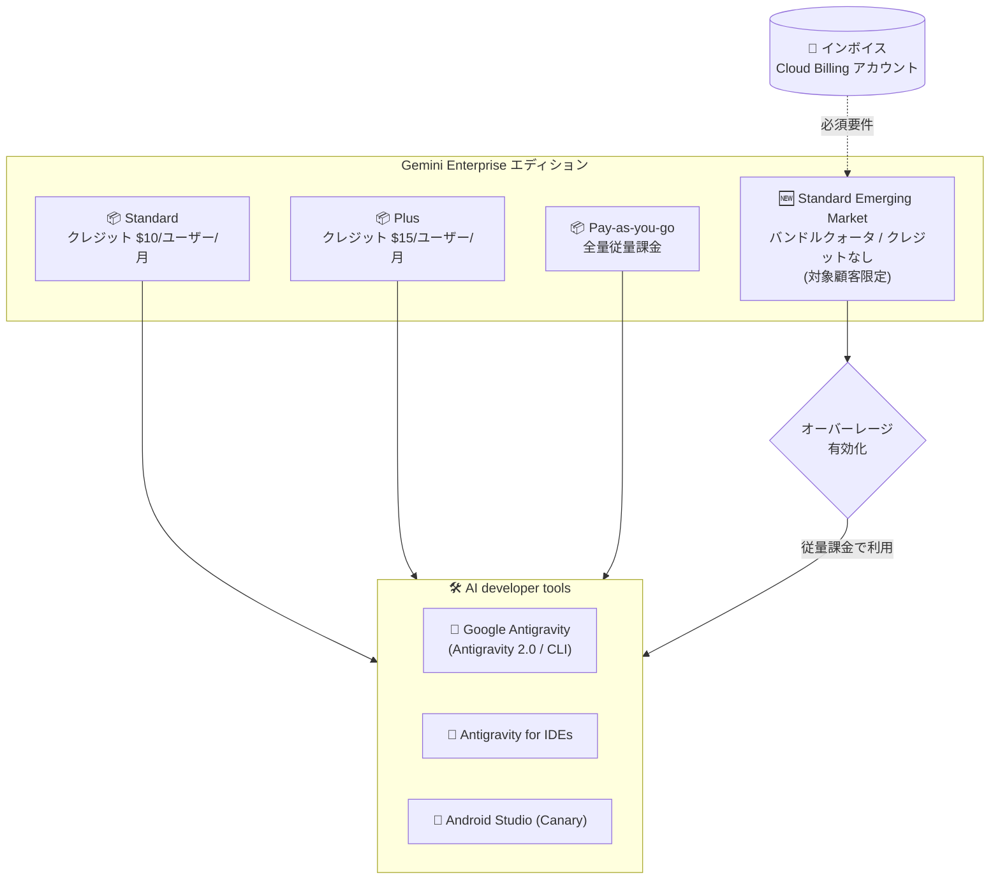

# Gemini Enterprise: AI developer tools が Standard Emerging Market エディションで利用可能に

**リリース日**: 2026-08-21

**サービス**: Gemini Enterprise

**機能**: AI developer tools on Standard Emerging Market edition

**ステータス**: Feature

📊 [このアップデートのインフォグラフィックを見る](https://takech9203.github.io/google-cloud-news-summary/20260821-gemini-enterprise-ai-dev-tools-emerging-market.html)

## 概要

Gemini Enterprise の AI developer tools 機能が、Gemini Enterprise **Standard Emerging Market エディション**で利用可能になりました。AI developer tools は、自律型 AI エージェントを通じてソフトウェア開発・デリバリーを加速する開発者向けツール群で、Google Antigravity (Antigravity 2.0 / Antigravity CLI)、Antigravity for IDEs、Android Studio (最新 Canary 版) が含まれます。

利用するには、プロジェクトが**毎月請求書を受領しているインボイス (invoiced) Cloud Billing アカウント**にリンクされている必要があります。また、Standard / Plus エディションと異なり、Standard Emerging Market エディションには**バンドルされた基本クォータや Antigravity クレジットは含まれません**。利用分は従量課金 (オーバーレージ) として課金されます。

なお、Gemini Enterprise Standard Emerging Market エディション自体が**対象顧客限定**の提供です。要件の確認と利用資格の判定については、Google アカウントチームへの問い合わせが必要です。

**アップデート前の課題**

- AI developer tools は Gemini Enterprise Standard、Plus、Pay-as-you-go エディションのサブスクリプションでのみ利用可能で、Emerging Market 向けエディションのユーザーは利用できなかった
- 新興国市場向けの低価格エディションを利用する組織は、Antigravity や Android Studio の AI エージェント機能を Gemini Enterprise のライセンス体系の中で利用する手段がなかった

**アップデート後の改善**

- Standard Emerging Market エディションのサブスクリプションでも、Antigravity、Antigravity for IDEs、Android Studio の AI developer tools にアクセスできるようになった
- Standard / Plus / Pay-as-you-go に加えて Emerging Market 向けエディションが対応し、AI developer tools を利用できるエディションの選択肢が拡大した
- オーバーレージ (従量課金) を有効化することで、バンドルクレジットなしでも利用量に応じた支払いで AI developer tools を利用できる

## アーキテクチャ図

Standard Emerging Market エディションが新たに AI developer tools に対応しました。他エディションと異なりバンドルクレジットを含まないため、インボイス請求アカウントとオーバーレージ (従量課金) を通じて利用します。

## サービスアップデートの詳細

### 主要機能

1. **Standard Emerging Market エディションでの AI developer tools 提供**
   - AI developer tools の対応エディションが Standard、Plus、Pay-as-you-go に加えて Standard Emerging Market に拡大
   - 提供されるツールは他エディションと同じく Google Antigravity (Antigravity 2.0 / Antigravity CLI)、Antigravity for IDEs、Android Studio (最新 Canary 版)

2. **バンドルクォータ / Antigravity クレジットなしの提供形態**
   - Standard エディションの $10/ユーザー/月、Plus エディションの $15/ユーザー/月のようなバンドルクレジットは含まれない
   - 利用分はオーバーレージとして Agent Platform の料金レートで課金される

3. **インボイス請求アカウントの必須要件**
   - プロジェクトは、毎月請求書を受領しているインボイス Cloud Billing アカウントにリンクされている必要がある
   - オーバーレージの有効化には、加えて有効な非無料トライアルのサブスクリプションが 1 つ以上必要

## 技術仕様

### AI developer tools に含まれるツール

| ツール | 説明 |
|------|------|
| Google Antigravity | 自律型 AI エージェントでアプリケーション開発を支援する AI 開発環境。Antigravity 2.0 と Antigravity CLI をサポート |
| Antigravity for IDEs | 自律型 AI エージェント機能を既存 IDE のワークフローに組み込む拡張機能 |
| Android Studio | プロフェッショナル Android 開発向け IDE。最新の Canary 版が Gemini Enterprise バンドルの対象 |

### Standard Emerging Market エディションのクォータ (プロジェクト・ロケーション単位でプール)

| 項目 | クォータ |
|------|------|
| ストレージ + データインデックス | 10 GiB |
| Assistant | 40 クエリ/日 |
| ノーコードエージェント作成 | 1 エージェント/日 |
| Deep Research | 1 回/日 |
| AI developer tools | **デフォルトクォータなし** (バンドルクォータを含まない) |

### 必要な IAM ロール

| ロール | 用途 |
|------|------|
| Gemini Enterprise Admin (`roles/discoveryengine.agentspaceAdmin`) | AI developer tools の設定変更とメトリクス閲覧 |
| Gemini Enterprise User (`roles/discoveryengine.agentspaceUser`) | AI developer tools へのアクセスと利用 |

注意: Admin ロールだけでは AI developer tools にアクセスできません。Admin ロールを持つユーザーにも、アクセスが必要な場合は User ロールを明示的に付与する必要があります。

### クォータのリセットサイクル

- AI developer tools のクォータは、最初のプロンプト/リクエスト送信時点を起点とした **7 日間のローリングサイクル**でリセットされる (他機能は毎日太平洋時間の午前 0 時にリセット)

## 設定方法

### 前提条件

1. Gemini Enterprise Standard Emerging Market エディションのサブスクリプション (対象顧客限定。Google アカウントチームに利用資格を確認)
2. 毎月請求書を受領しているインボイス Cloud Billing アカウントへのプロジェクトのリンク
3. 利用ユーザーへの Gemini Enterprise User ロール (`roles/discoveryengine.agentspaceUser`) の付与
4. クォータ超過分の利用を許可する場合は、管理者によるオーバーレージ設定の有効化

## メリット

### ビジネス面

- **エディション選択肢の拡大**: 新興国市場向けの低価格エディションでも AI developer tools を利用でき、AI 支援開発の導入障壁が下がる
- **利用量ベースのコスト管理**: バンドルクレジットの固定費なしで、実際の利用分のみ従量課金される。Cloud Billing の予算機能 (サービススコープ: Vertex AI / `aiplatform.googleapis.com`) で月次の支出上限を設定でき、予期しない課金を防止できる

### 技術面

- **自律エージェントによる開発加速**: コードレビューの自動化、テスト失敗・ビルド破損の根本原因分析、機能実装・リファクタリング・API 移行などのマルチステップタスクをエージェントに委任できる
- **IDE / CLI との統合**: Antigravity 2.0、Antigravity CLI、Antigravity for IDEs、Android Studio を通じて、日常の IDE 開発・ターミナル作業・自動化パイプラインに AI エージェントを組み込める

## デメリット・制約事項

### 制限事項

- Standard Emerging Market エディションは対象顧客限定 (利用資格は Google アカウントチームによる判定が必要)
- バンドルされた基本クォータおよび Antigravity クレジットが含まれない (すべての利用が従量課金)
- インボイス Cloud Billing アカウント (毎月請求書を受領するアカウント) が必須。セルフサーブアカウントでは利用不可
- Android Studio はサードパーティ ID プロバイダに未対応 (該当ロケーションのユーザーは Android Studio の AI developer tools 機能にアクセス不可)
- Gemini Enterprise の Antigravity は FedRAMP、ISO 27001/42001、SOC 1/2/3、ITAR、Access Transparency などのコンプライアンス認証・セキュリティ管理に未対応

### 考慮すべき点

- クレジットが含まれないため、利用量が多い場合は Standard ($10/ユーザー/月のクレジット付き) や Plus ($15/ユーザー/月のクレジット付き) エディションとのコスト比較を行うこと
- オーバーレージを有効化する場合は、Cloud Billing で月次支出上限を設定して予期しない課金を防ぐこと (上限到達後の停止反映には数分かかる場合がある)
- 初回設定時、作業フォルダ外へのファイルアクセスポリシーのデフォルトは「Deny」。エージェントにアクセス前の確認を求める場合は「Always ask」への明示的な変更が必要

## ユースケース

### ユースケース 1: 新興国市場の開発チームへの AI エージェント導入

**シナリオ**: 新興国市場に拠点を置く開発組織が、Standard Emerging Market エディションで Gemini Enterprise を導入している。開発者に Antigravity によるコーディングエージェントを提供したいが、全員分の固定クレジットは不要。

**効果**: 従量課金で実際に利用した分だけ支払う形で AI developer tools を導入でき、Cloud Billing の支出上限でコストを制御しながら段階的に展開できる。

### ユースケース 2: Android アプリ開発の AI 支援

**シナリオ**: Android アプリ開発チームが、Android Studio (Canary 版) の Gemini Enterprise バンドル機能を使ってビルド・デバッグ・スケーリングを効率化したい。

**効果**: Standard Emerging Market エディションのライセンスと Gemini Enterprise User ロールの付与だけで、既存の Android Studio ワークフローに AI 機能を組み込める。

## 料金

Standard Emerging Market エディションの AI developer tools にはバンドルクォータ / クレジットが含まれず、利用分はオーバーレージとして [Agent Platform の料金](https://cloud.google.com/gemini-enterprise-agent-platform/generative-ai/pricing#cost-of-building-and-deploying-ai-models-in-agent-platform)レートで課金されます。

参考: 他エディションの AI developer tools バンドルクレジット

| エディション | AI developer tools クレジット |
|--------|-----------------|
| Standard | $10/ユーザー/月 (7 日間ローリングの共有プールとして適用) |
| Plus | $15/ユーザー/月 (7 日間ローリングの共有プールとして適用) |
| Standard Emerging Market | なし (全量オーバーレージ課金) |

なお、ストレージ + データインデックスのオーバーレージは $5/GiB/月 (保存期間で日割り) です。詳細は [Quotas and overages](https://docs.cloud.google.com/gemini/enterprise/docs/quotas-and-overages) を参照してください。

## 利用可能リージョン

リージョンごとの提供状況と機能制限については、[Data residency for Gemini Enterprise](https://docs.cloud.google.com/gemini/enterprise/docs/locations) を参照してください。

## 関連サービス・機能

- **Google Antigravity**: AI developer tools の中核となる自律型 AI エージェント開発環境。Antigravity 2.0 / CLI / IDE 拡張として提供
- **Cloud Billing**: インボイスアカウント要件の確認、オーバーレージの支出上限 (Vertex AI サービススコープの予算) の設定に使用
- **Gemini Enterprise Agent Platform**: オーバーレージ課金のレートは Agent Platform の料金に準拠。モデル許可ポリシーは両プラットフォーム間で整合させる必要がある
- **IAM (アクセス制御)**: `roles/discoveryengine.agentspaceUser` / `agentspaceAdmin` による利用・管理権限の制御。カスタムロールでのアクセス制限も可能

## 参考リンク

- 📊 [インフォグラフィック](https://takech9203.github.io/google-cloud-news-summary/20260821-gemini-enterprise-ai-dev-tools-emerging-market.html)
- [公式リリースノート](https://docs.cloud.google.com/release-notes#August_21_2026)
- [AI developer tools overview](https://docs.cloud.google.com/gemini/enterprise/docs/ai-developer-tools-overview)
- [Quotas and overages - Emerging Market editions](https://docs.cloud.google.com/gemini/enterprise/docs/quotas-and-overages#quotas-emerging-market)
- [Compare editions of Gemini Enterprise](https://docs.cloud.google.com/gemini/enterprise/docs/editions)
- [Configure overages](https://docs.cloud.google.com/gemini/enterprise/docs/configure-overages)
- [Cloud Billing account types](https://docs.cloud.google.com/billing/docs/concepts#billing_account_types)

## まとめ

AI developer tools (Antigravity、Antigravity for IDEs、Android Studio) の対応エディションが Standard Emerging Market に拡大し、新興国市場向けエディションの利用組織でも自律型 AI エージェントによる開発支援を導入できるようになりました。ただし、バンドルクレジットを含まない全量従量課金の形態であり、インボイス請求アカウントと利用資格の確認が必須です。導入を検討する場合は、Google アカウントチームに利用資格を確認のうえ、Cloud Billing の支出上限設定とあわせてオーバーレージを構成することを推奨します。

---

**タグ**: Gemini Enterprise, AI developer tools, Antigravity, Android Studio, Emerging Market, Feature
