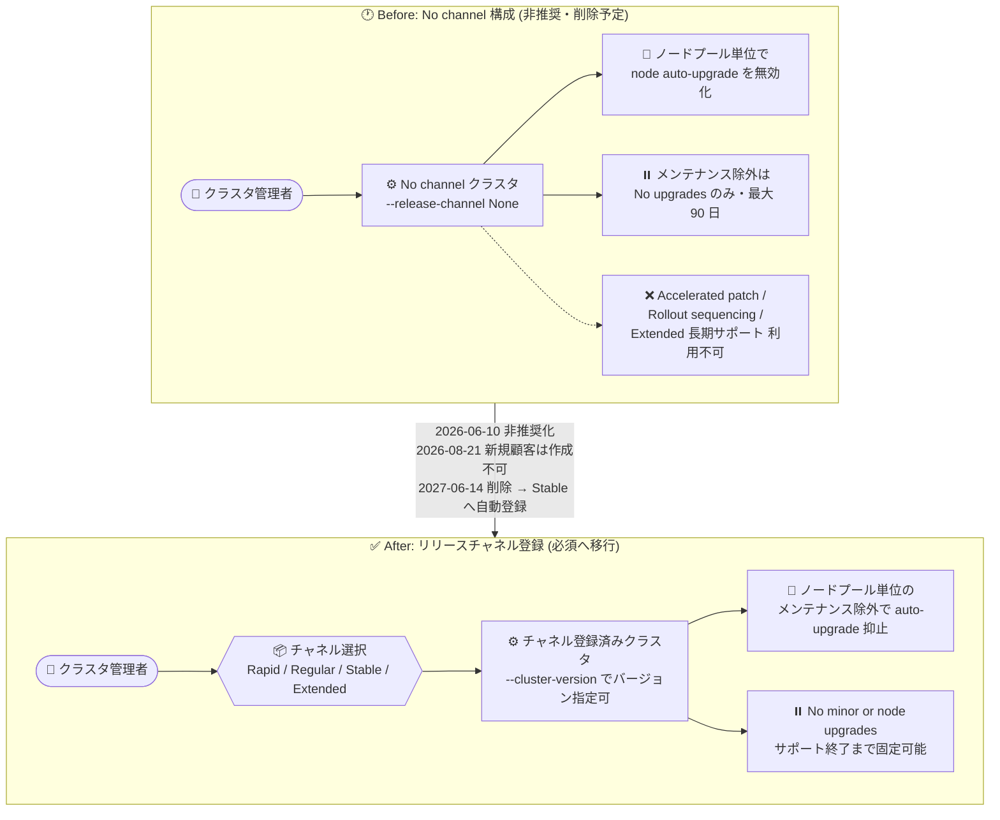

# Google Kubernetes Engine: リリースチャネル未登録クラスタの新規作成が既存顧客のみに制限

**リリース日**: 2026-08-21

**サービス**: Google Kubernetes Engine (GKE)

**機能**: リリースチャネル未登録 (No channel) 構成の廃止に伴う新規顧客への制限適用

**ステータス**: 変更 (Deprecation の段階的適用)

📊 [このアップデートのインフォグラフィックを見る](https://takech9203.github.io/google-cloud-news-summary/20260821-gke-release-channel-enrollment-required.html)

## 概要

2026 年 6 月 10 日のリリースノートで発表されたとおり、GKE クラスタをリリースチャネルに登録しない構成オプション (No channel、旧称 Static) は非推奨となっており、**2027 年 6 月 14 日に削除**される予定です。今回のアップデートでは、この非推奨化の一環として、**リリースチャネルに登録しない新規クラスタの作成が既存顧客のみに制限**されました。新規顧客は No channel 構成でクラスタを作成・更新できなくなり、リリースチャネル (Rapid / Regular / Stable / Extended) を使用する必要があります。

重要なポイントは、リリースチャネルを使用しても No channel と同等の運用が実現できることです。ノードの自動アップグレードを止めたい場合は、ノードプール単位のメンテナンス除外や、クラスタレベルの「No minor or node upgrades」スコープのメンテナンス除外で同じ挙動を再現できます。また、削除期限 (2027 年 6 月 14 日) を過ぎてもチャネル未登録のまま残っているクラスタは、GKE によって自動的に **Stable チャネルに登録**されます。

このアップデートの対象は Standard クラスタを No channel で運用している (または運用を検討している) ユーザーです。Autopilot クラスタは常にリリースチャネルに登録されるため影響ありません。

**アップデート前の課題**

- No channel 構成はリリースチャネルと比べて利用できる機能が制限されていた (Accelerated patch auto-upgrades、Rollout sequencing、Extended チャネルによる長期サポート、Autopilot が利用不可)
- No channel でもコントロールプレーンは自動アップグレードされ、アップグレードのタイミングは実質的に Regular / Stable チャネルに整合していたため、「バージョンを固定できる」という期待と実態が乖離していた
- No channel クラスタで利用できるメンテナンス除外は「No upgrades」スコープ (最大 90 日) に制限されていた

**アップデート後の改善**

- 新規顧客はリリースチャネルへの登録が必須となり、チャネル前提の一貫したアップグレード管理 (メンテナンスウィンドウ・除外、Rollout sequencing など) を利用する構成に統一される
- 2026 年 6 月 2 日のアップデートで、リリースチャネル内でも**ノードプール単位のメンテナンス除外**が利用可能になっており、No channel でノード自動アップグレードを無効化していたのと同じ挙動をチャネル登録済みクラスタで再現できる
- チャネル登録済みクラスタでは「No minor or node upgrades」スコープのメンテナンス除外により、マイナーバージョンのサポート終了までノードアップグレードを抑止できる (No channel の 90 日制限より長い)

## アーキテクチャ図



No channel 構成で実現していた「ノード自動アップグレードの抑止」は、リリースチャネル登録後もノードプール単位のメンテナンス除外や「No minor or node upgrades」スコープの除外で同等に実現できます。

## サービスアップデートの詳細

### 廃止スケジュール

| 日付 | 内容 |
|------|------|
| 2026 年 6 月 10 日 | No channel 構成オプションの非推奨化を発表 |
| 2026 年 8 月 21 日 (今回) | **No channel での新規クラスタ作成を既存顧客のみに制限**。新規顧客は No channel 構成でのクラスタ作成・更新が不可に |
| 2027 年 6 月 14 日 | No channel 構成オプションを削除。残存するチャネル未登録クラスタは **Stable チャネルに自動登録** |

### 主要ポイント

1. **新規顧客への制限**
   - 新規顧客は No channel 構成でクラスタを作成・更新できない
   - 既存顧客は 2027 年 6 月 14 日まで No channel クラスタの作成・チャネルからの登録解除が可能だが、非推奨のため推奨されない

2. **リリースチャネルで同等機能を実現可能**
   - 全ノードプールの自動アップグレードをサポート終了まで止めたい場合: 「No minor or node upgrades」スコープのクラスタメンテナンス除外
   - 一部のノードプールだけ止めたい場合: ノードプール単位のメンテナンス除外
   - パッチ適用タイミングの制御: メンテナンスウィンドウとメンテナンス除外

3. **チャネル内でのバージョン指定 (ピン留め)**
   - クラスタ作成時に `--cluster-version` フラグで、チャネル内で利用可能な特定バージョンを指定可能
   - `gcloud container get-server-config` でチャネルごとの利用可能バージョン (`validVersions`) とデフォルトバージョンを確認可能

### リリースチャネルの比較

| チャネル | マイナーバージョン提供時期 | 自動アップグレード対象化 | 用途 |
|---------|--------------------------|------------------------|------|
| Rapid | OSS GA から 1〜2 週間後 | Rapid 提供から 1〜2 か月後 | 最新の Kubernetes リリースをいち早く利用 (SLA 対象外) |
| Regular (デフォルト) | Rapid 提供から約 2 か月後 | Regular 提供から約 3 か月後 | 機能の新しさと安定性のバランス。ほとんどのユーザーに推奨 |
| Stable | Regular 提供から 3〜4 か月後 | Stable 提供から約 2 か月後 | 新機能より安定性を優先 |
| Extended | Regular と同時期 | Regular と同時期 | 長期サポート。マイナーバージョンを最長 24 か月維持 (Standard のみ) |
| No channel (非推奨) | Regular と同時期 | Stable と同時期 | 2027 年 6 月 14 日に削除予定 |

## 技術仕様

### チャネル登録・未登録クラスタの機能比較

| 機能 | チャネル登録済み | チャネル未登録 (No channel) |
|------|-----------------|---------------------------|
| コントロールプレーンの自動アップグレード | あり | あり (未登録でも自動アップグレードされる) |
| アップグレードタイミング | 各チャネルに準拠 | マイナーバージョンの自動アップグレード開始は Stable と同時期、利用可能バージョンは Regular と同等 |
| Accelerated patch auto-upgrades | 利用可能 | 利用不可 |
| メンテナンス除外のスコープ | 「No upgrades」(最大 90 日)、「No minor upgrades」「No minor or node upgrades」(サポート終了まで)、ノードプール単位の除外 | 「No upgrades」(最大 90 日) のみ |
| Rollout sequencing | 利用可能 | 利用不可 |
| 長期サポート (Extended チャネル) | 利用可能 | 利用不可 |
| Autopilot | 利用可能 (常にチャネル登録) | 利用不可 |

## 設定方法

### 前提条件

1. 対象は GKE Standard クラスタ (Autopilot は常にチャネル登録済み)
2. 移行先チャネルにクラスタのコントロールプレーンのマイナーバージョンが存在すること (Stable チャネルは最も成熟したチャネルで、No channel クラスタで利用可能な全マイナーバージョンが揃っている)

### 手順

#### ステップ 1: チャネル未登録クラスタの特定

```bash
# クラスタのリリースチャネルを確認 (出力が空なら未登録)
gcloud container clusters describe CLUSTER_NAME \
  --location=COMPUTE_LOCATION \
  --format="value(releaseChannel.channel)"
```

Recommender サービスのサブタイプ `CLUSTER_RELEASE_CHANNEL_UNSPECIFIED` を使うと、チャネル未登録のクラスタに対する登録推奨 (Insight / Recommendation) を確認できます。

#### ステップ 2: アップグレードタイミングを制御するメンテナンス除外の設定 (必要な場合)

チャネル登録後は別のバージョンへの自動アップグレードが発生する可能性があるため、タイミングを制御したい場合はメンテナンスウィンドウ・除外を先に設定します。

- 全ノードプールの抑止: 「No minor or node upgrades」スコープのメンテナンス除外 (サポート終了まで有効)
- 一部ノードプールの抑止: ノードプール単位のメンテナンス除外

#### ステップ 3: 既存クラスタをリリースチャネルに登録

```bash
# 例: Stable チャネルに登録
gcloud container clusters update CLUSTER_NAME \
  --release-channel stable
```

チャネル変更にダウンタイムは不要です。登録直後に即座にアップグレードされるのではなく、GKE の自動アップグレードプロセスにより段階的にアップグレードされます。

#### ステップ 4: (参考) チャネル内で特定バージョンを指定してクラスタを作成

```bash
# チャネル内の利用可能バージョンを確認
gcloud container get-server-config \
  --flatten="channels" \
  --filter="channels.channel=STABLE" \
  --format="yaml(channels.channel,channels.validVersions)" \
  --location=COMPUTE_LOCATION

# 特定バージョンを指定してクラスタを作成
gcloud container clusters create CLUSTER_NAME \
  --location=COMPUTE_LOCATION \
  --release-channel=stable \
  --cluster-version=VERSION
```

`--cluster-version` を指定してチャネルを指定しない場合、GKE はそのバージョンが利用可能な最も成熟したチャネルにクラスタを登録します。

## メリット

### ビジネス面

- **計画的な移行が可能**: 削除 (2027 年 6 月 14 日) までの猶予期間内に、自組織のペースでチャネル移行を計画できる
- **長期サポートの選択肢**: Extended チャネルによりマイナーバージョンを最長 24 か月維持でき、アップグレードサイクルを事業計画に合わせやすい

### 技術面

- **同等機能の維持**: ノードプール単位のメンテナンス除外や「No minor or node upgrades」スコープの除外により、No channel で行っていたノード自動アップグレードの抑止を再現できる
- **より強力なアップグレード制御**: チャネル登録済みクラスタでは、No channel では使えなかった「サポート終了まで」の除外スコープ、Accelerated patch auto-upgrades、Rollout sequencing が利用可能

## デメリット・制約事項

### 制限事項

- 新規顧客は No channel 構成でのクラスタ作成・更新が一切できない
- 既存顧客も 2027 年 6 月 14 日以降は No channel を利用できず、残存クラスタは Stable チャネルに自動登録される
- チャネル登録済みクラスタではノード自動アップグレード設定自体は無効化できない (メンテナンス除外で制御する)
- Extended チャネルには利用できない機能がある (Autopilot、Alpha クラスタ、Windows Server ノードプール、Config Connector など)

### 考慮すべき点

- チャネル登録後、GKE が別の自動アップグレードを適用する可能性があるため、移行前にメンテナンスウィンドウ・除外の設定を推奨
- ノード自動アップグレードをレガシーな設定 (node auto-upgrade 無効化) で止めている場合は、ノードプールメンテナンス除外への移行が推奨される
- サポート終了 (end of support) 時の自動アップグレードは、チャネル登録の有無やメンテナンス除外に関係なく実行される

## ユースケース

### ユースケース 1: No channel クラスタの Stable チャネルへの移行

**シナリオ**: 検証済みバージョンを長く使うために No channel で運用してきたクラスタを、削除期限前に移行したい。

**実装例**:
```bash
# 1. 現在のチャネルを確認 (空なら未登録)
gcloud container clusters describe my-cluster \
  --location=us-central1 --format="value(releaseChannel.channel)"

# 2. Stable チャネルに登録
gcloud container clusters update my-cluster --release-channel stable
```

**効果**: ダウンタイムなしでチャネルに移行でき、削除期限後の Stable への強制自動登録を待たずに、メンテナンス除外などで自らアップグレードタイミングを管理できる。

### ユースケース 2: 一部ノードプールのみ手動アップグレードしたいクラスタ

**シナリオ**: GPU ワークロードなど、特定のノードプールだけ自動アップグレードを止めて手動で検証しながら上げたい。従来は No channel + node auto-upgrade 無効化で実現していた。

**効果**: リリースチャネルに登録した上で、対象ノードプールにノードプールメンテナンス除外を設定すれば、マイナーバージョンのサポート終了まで自動アップグレードを抑止でき、No channel と同じ運用を継続できる。

## 料金

この変更自体による追加料金はありません。ただし、Extended チャネルに登録したクラスタのマイナーバージョンが延長サポート期間に入ると、従量課金の延長サポート料金が発生します。詳細は [GKE の料金ページ](https://cloud.google.com/kubernetes-engine/pricing) を参照してください。

## 関連サービス・機能

- **メンテナンスウィンドウとメンテナンス除外**: チャネル登録後のアップグレードタイミング制御の中核。ノードプール単位の除外や「No minor or node upgrades」スコープで No channel 相当の運用を実現
- **Recommender**: `CLUSTER_RELEASE_CHANNEL_UNSPECIFIED` サブタイプで、チャネル未登録クラスタへの登録推奨を提示
- **GKE Extended チャネル**: マイナーバージョンを最長 24 か月維持する長期サポートの選択肢
- **Rollout sequencing**: チャネル登録済みクラスタで利用できる、環境間 (検証→本番など) の段階的アップグレード制御

## 参考リンク

- 📊 [インフォグラフィック](https://takech9203.github.io/google-cloud-news-summary/20260821-gke-release-channel-enrollment-required.html)
- [公式リリースノート (2026 年 8 月 21 日)](https://docs.cloud.google.com/release-notes#August_21_2026)
- [Clusters not enrolled in a release channel (廃止の詳細)](https://docs.cloud.google.com/kubernetes-engine/docs/concepts/release-channels#no_channel)
- [About release channels](https://docs.cloud.google.com/kubernetes-engine/docs/concepts/release-channels)
- [Enroll a cluster in a release channel](https://docs.cloud.google.com/kubernetes-engine/docs/how-to/release-channels)
- [Maintenance windows and exclusions](https://docs.cloud.google.com/kubernetes-engine/docs/concepts/maintenance-windows-and-exclusions)
- [GKE の料金](https://cloud.google.com/kubernetes-engine/pricing)

## まとめ

GKE のリリースチャネル未登録 (No channel) 構成は 2026 年 6 月 10 日に非推奨となり、今回のアップデートで新規顧客による利用が停止されました。2027 年 6 月 14 日の削除後は残存クラスタが Stable チャネルへ自動登録されるため、No channel クラスタを運用している場合は、ノードプールメンテナンス除外などで同等の運用を設計した上で、期限前に自らチャネルへ登録することを推奨します。

---

**タグ**: #GKE #Kubernetes #ReleaseChannel #Deprecation #アップグレード管理 #メンテナンス除外
